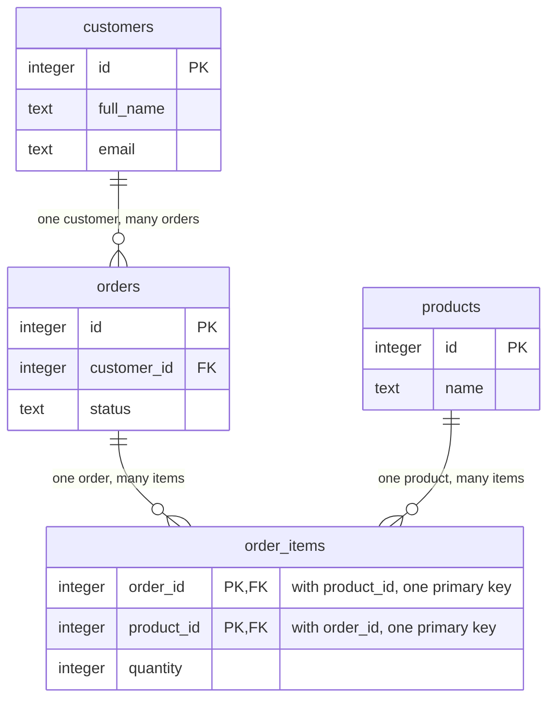

## Bạn cần biết trước

- Không cần bài nào trước — bắt đầu từ đây.

## Tình huống

Cửa hàng muốn một trang liệt kê từng đơn hàng kèm tên khách và các sản phẩm đã mua. Dữ liệu của Đơn Hàng nằm trong một database, nơi lưu dữ liệu dưới dạng bảng, do một chương trình tên PostgreSQL vận hành. Bạn mở `db/seed.sql`, file đổ dữ liệu vào database đó, và chờ thấy một danh sách đơn chứa sẵn tên khách và sản phẩm. Đơn đầu tiên ghi `( 1, 1, '2026-03-02 09:15:00+07', 'paid')`: một con số, thêm một con số, một thời điểm và một trạng thái, nhưng không có tên, cũng không có sản phẩm. Sản phẩm mỗi đơn đã mua nằm tít bên dưới, trong `order_items`, dưới dạng các dòng bốn con số. Vậy vài con số trong một dòng ghi lại "ai đặt cái gì" bằng cách nào?

## Khái niệm cốt lõi

- bảng — một tập hợp có tên gồm các dòng cùng một loại, trong đó dòng nào cũng có cùng các cột. `orders` giữ mỗi đơn một dòng, và `customer_id` là một cột của nó.
- **khóa chính** (primary key) — cột, hoặc nhóm cột, mà giá trị của nó chỉ đúng một dòng trong bảng. Trong `orders` đó là `id`.
- **khóa ngoại** (foreign key) — cột mà giá trị phải bằng khóa của một dòng trong bảng nó trỏ tới, trừ khi dòng để trống cột đó. Trong Đơn Hàng, khóa được trỏ tới luôn là khóa chính, và `orders.customer_id` là một khóa ngoại, trỏ tới một dòng của `customers`.
- bảng nối — bảng mà mỗi dòng ghép một dòng của bảng này với một dòng của bảng kia. `order_items` ghép đơn hàng với sản phẩm.
- chuẩn hóa — sắp xếp các bảng sao cho mỗi sự thật chỉ được lưu ở đúng một chỗ.

## Cơ chế hoạt động



Sơ đồ vẽ bốn trong sáu bảng của Đơn Hàng và một số cột của chúng. `PK` đánh dấu cột khóa chính, `FK` đánh dấu cột khóa ngoại. Nhãn trên mỗi đường nối, được lặp lại bằng ký hiệu ở hai đầu, cho biết mỗi bên có bao nhiêu dòng.

Trong tình huống trên, khóa chính của `orders` là `id`. PostgreSQL từ chối một dòng có `id` không mang giá trị (`NULL`) hoặc trùng `id` của một dòng đã có trong bảng, nên số `1` đầu tiên trong dòng seed chỉ đúng một đơn. Bạn giữ giá trị đó không đổi, vì các dòng khác lưu nó để trỏ tới dòng này.

Hãy theo đường nối đầu tiên, từ `customers` sang `orders`. Một khách đặt nhiều đơn và mỗi đơn có một khách, dạng này gọi là một-nhiều. Liên kết được lưu ở phía "nhiều": đơn nào cũng mang `customer_id`, một khóa ngoại chứa `id` của một khách, tức con số thứ hai trong dòng seed. PostgreSQL từ chối một đơn có `customer_id` không khớp khách nào. Với khóa ngoại viết như của Đơn Hàng, nó cũng từ chối đổi `id` của một khách khi còn đơn đang giữ `id` đó: đơn ấy sẽ không còn khớp khách nào.

Sản phẩm thì không vừa dạng đó. Một đơn chứa nhiều sản phẩm, và một sản phẩm có mặt trong nhiều đơn: nhiều-nhiều. Một khóa ngoại trong `orders` chỉ trỏ được tới một sản phẩm, và một khóa ngoại trong `products` chỉ trỏ được tới một đơn. Vì thế cần một bảng nối đứng giữa. Mỗi dòng của `order_items` nói "sản phẩm này, trong đơn này", với một khóa ngoại sang mỗi bên. Hai đường nối đi vào `order_items` vì vậy là hai liên kết một-nhiều.

Tên khách không nằm trong `orders`. Nó chỉ nằm một lần, trong `customers`, và mọi đơn tới được nó qua `customer_id`. Đó là chuẩn hóa. Một sự thật chỉ lưu ở một chỗ thì không thể tự mâu thuẫn với chính nó.

## Trong hệ thống Đơn Hàng

Database của Đơn Hàng được tạo từ hai file: PostgreSQL chạy các lệnh trong `db/schema.sql` để tạo mọi bảng, rồi các lệnh trong `db/seed.sql` để đổ dữ liệu vào. Những dòng đầu của `db/schema.sql` tạo ba bảng.

```sql file=db/schema.sql tag=stage-0 lines=4-24
CREATE TABLE products (
    id        integer GENERATED BY DEFAULT AS IDENTITY PRIMARY KEY,
    name      text NOT NULL,
    price_vnd integer NOT NULL CHECK (price_vnd > 0)
);

-- lesson: foundation.l1.tables-keys-relations
CREATE TABLE customers (
    id        integer GENERATED BY DEFAULT AS IDENTITY PRIMARY KEY,
    full_name text NOT NULL,
    email     text NOT NULL UNIQUE,
    city      text NOT NULL
);

CREATE TABLE orders (
    id          integer GENERATED BY DEFAULT AS IDENTITY PRIMARY KEY,
    customer_id integer NOT NULL REFERENCES customers (id),
    placed_at   timestamptz NOT NULL,
    status      text NOT NULL
                CHECK (status IN ('new', 'paid', 'shipped', 'cancelled'))
);
```

Mỗi định nghĩa cột trong ngoặc ghi tên cột, loại giá trị nó chứa (như `integer` cho số nguyên, `text`, hay `timestamptz` cho một thời điểm), rồi các quy tắc mà dòng nào cũng phải qua. Quy tắc của `status` kéo sang dòng kế tiếp. Dòng bắt đầu bằng `--` là chú thích cho người đọc, PostgreSQL bỏ qua nó.

`PRIMARY KEY` trên `id` khai báo khóa chính, còn `GENERATED BY DEFAULT AS IDENTITY` cho PostgreSQL tự điền số kế tiếp khi một dòng mới đến mà không có giá trị này. Vậy khóa là một bộ đếm, không phải một sự thật về khách hàng. Giờ nhìn `email`: `UNIQUE` khiến PostgreSQL từ chối khách thứ hai có cùng địa chỉ, nhưng nó không phải khóa, vì khách có thể đổi địa chỉ còn khóa thì nên giữ nguyên. `REFERENCES customers (id)` là thứ biến `customer_id` thành khóa ngoại, và `NOT NULL` nghĩa là không có đơn nào tồn tại mà thiếu khách.

Bảng nối xuất hiện vài dòng sau đó:

```sql file=db/schema.sql tag=stage-0 lines=26-32
CREATE TABLE order_items (
    order_id       integer NOT NULL REFERENCES orders (id),
    product_id     integer NOT NULL REFERENCES products (id),
    quantity       integer NOT NULL CHECK (quantity > 0),
    unit_price_vnd integer NOT NULL CHECK (unit_price_vnd > 0),
    PRIMARY KEY (order_id, product_id)
);
```

Bảng này có hai khóa ngoại, mỗi bên một cái. Dòng cuối không phải một cột: nó đặt cặp `(order_id, product_id)` làm khóa chính, nên một sản phẩm xuất hiện nhiều nhất một lần trong một đơn. Hai món cùng một sản phẩm là một dòng với `quantity` bằng 2, như dòng seed `( 1, 2, 2,  450000)`: đơn 1, sản phẩm 2, hai món, mỗi món 450.000 đồng. `unit_price_vnd` trông như bản sao của `products.price_vnd`, nhưng tên của nó cho thấy một nhiệm vụ khác: đơn giá mà đơn này đã bị tính. Khi giá sản phẩm có thể đổi về sau, đơn cũ phải giữ đúng số tiền của nó, nên sự thật đó thuộc về dòng mặt hàng của đơn.

## Người mới hay nghĩ rằng…

- **"Nên lưu tên khách ngay trong đơn để hiển thị cho nhanh."** → Thực ra tên chỉ thuộc về `customers`, tới được qua `customer_id`, vì bản sao nằm trong từng đơn thì phải sửa ở từng đơn. Khi khách sửa lại tên, bạn cập nhật một dòng. Còn nếu có bản sao, bạn phải tìm hết chúng, và bản nào sót sẽ giữ tên cũ. Bạn sẽ nhận ra khi một báo cáo liệt kê cùng một khách hai lần với hai cách viết tên. Cố ý sao chép một sự thật để chạy nhanh hơn là một kỹ thuật có thật, thường chỉ dùng cho một chỗ chậm bạn đã đo được, và khi đó bạn phải tự lo giữ mọi bản sao khớp nhau.
- **"Khóa chính nên là thứ có ý nghĩa, như số điện thoại."** → Thực ra một giá trị có ý nghĩa có thể đổi hoặc bị dùng chung, còn khóa thì không được như vậy: người ta đổi số điện thoại, và cả nhà có thể dùng chung một số. Các bảng khác lưu khóa để trỏ tới dòng. Khóa ngoại `REFERENCES customers (id)` trong `db/schema.sql` từ chối mọi đơn có `customer_id` không khớp khách nào, nên nó cũng từ chối đổi khóa của một khách khi đơn của họ vẫn giữ khóa cũ. Đơn Hàng tránh chuyện này: nó đánh số khách bằng một bộ đếm đơn giản và giữ `email` là `UNIQUE` nhưng không làm khóa. Bạn sẽ nhận ra, ở một bảng lấy số điện thoại làm khóa, khi một khách đổi số và lệnh cập nhật thất bại.

## Thử ngay (3 phút)

1. Mở `db/schema.sql` trong repo ví dụ và tìm hai bảng bài này chưa cho xem: `payments` và `notifications`.
2. Với mỗi bảng, tìm dòng chứa `REFERENCES`. Nói xem nó trỏ tới bảng nào, bên nào là phía "nhiều", và nó có phải bảng nối không.

Kết quả mong đợi: cả hai đều có `REFERENCES orders (id)` trên cột `order_id`, nên mỗi bảng là một-nhiều tính từ `orders`: một đơn có thể có nhiều thanh toán và nhiều thông báo, còn mỗi thanh toán hay thông báo thuộc đúng một đơn. Không bảng nào là bảng nối, vì mỗi bảng chỉ có khóa ngoại sang một bảng, nên dòng của nó không ghép cặp dòng của hai bảng.

## Liên hệ

- [[foundation.l1.sql-select]] — bài này là bài cần học trước của nó: bài tiếp theo đọc các dòng từ những bảng này ra, và muốn thế thì phải hiểu một dòng nghĩa là gì.
- [[foundation.l1.sql-join]] — nửa còn lại của chuẩn hóa: ghép các dòng từ những bảng tách rời lại với nhau qua chính các khóa ngoại này, và đó là cách trang trong tình huống lấy được tên khách.
- [[foundation.l1.sql-write]] — khóa ngoại nhìn từ phía bên kia: vì sao PostgreSQL chặn bạn xóa một khách vẫn còn đơn.
- [[backend.l1.efcore-mapping]] — cũng những bảng và khóa này, nhìn từ code C# của track backend.

## Tóm tắt 5 dòng

1. Khóa cho phép mỗi sự thật chỉ sống ở đúng một bảng, còn mọi dòng cần đến nó thì trỏ tới nó.
2. Khóa chính định danh một dòng. PostgreSQL giữ nó duy nhất và không bao giờ trống, còn bạn giữ nó không đổi.
3. Trong Đơn Hàng, khóa ngoại chứa khóa chính của một dòng khác. Liên kết một-nhiều đặt nó ở phía "nhiều", như `orders.customer_id`.
4. Nhiều-nhiều cần một bảng nối: mỗi dòng của `order_items` ghép một đơn với một sản phẩm.
5. Tên khách chỉ nằm trong `customers`, nên không thể tự mâu thuẫn. Các đơn tới được nó qua `customer_id`.
