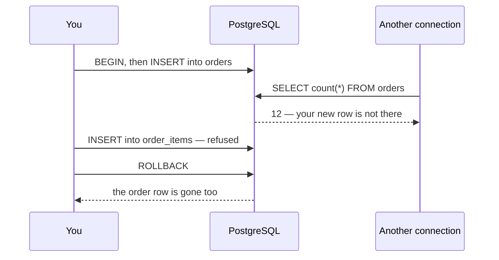

## Before you start

- [[foundation.l1.sql-write]] — you write `INSERT`, `UPDATE` and `DELETE`, you check a command tag against the row count you expected, and you have run a file that wraps three writes between `BEGIN` and `ROLLBACK` (both defined below) so the lab ends as it started. This lesson says what that pair promises.

## The situation

The lab database — a PostgreSQL server you start with `scripts/up.sh` — holds twelve orders. Vũ Gia Khánh, the one customer who has never ordered, is finally placing one: `Tai nghe` at 890,000 đồng. That takes two writes — a row in `orders`, then a row in `order_items` for the item bought. You run the first `INSERT` and it succeeds; you run the second and the database refuses it, because you typed a quantity of `0` and the table only accepts quantities above zero. The first row is already there, so the shop now has an order containing nothing and finds out about it weeks later. How do you make two writes behave as one?

## Core concepts

- **transaction** — a group of statements the database treats as one unit of work: either the changes of all of them survive, or the changes of none of them do.
- `BEGIN` — the statement that opens a transaction block; every statement after it belongs to the same unit until the block ends.
- `COMMIT` — the statement that ends the block by keeping it: the unit's changes become permanent and other connections — other people or programs connected to the same database — start seeing them.
- `ROLLBACK` — the statement that ends the block by discarding it: every change the block made is undone, however many rows it had already written.

## How it works


```mermaid
sequenceDiagram
  participant Y as You
  participant D as PostgreSQL
  participant O as Another connection
  Y->>D: BEGIN, then INSERT into orders
  O->>D: SELECT count(*) FROM orders
  D-->>O: 12 — your new row is not there
  Y->>D: INSERT into order_items — refused
  Y->>D: ROLLBACK
  D-->>Y: the order row is gone too
```

The two `INSERT`s in the situation were separate statements, and PostgreSQL ran each one as its own unit: it opened one, applied the statement, ended it, writing to disk as `COMMIT` does. That is why the row in `orders` stayed behind when the second write was refused.

`BEGIN` changes that. From `BEGIN` until the block ends, every statement you send belongs to one unit. Your own connection sees the changes as they happen — a count inside the block answers 13 orders — but nothing has left the unit. The other connection in the diagram counts at that moment and is told 12. It is not reading old data: the thirteenth order exists only for you.

Two statements end the block on purpose. `COMMIT` keeps every change the unit made, and only then do other connections see them; the database first writes enough to disk that a machine losing power a second later still has the order. `ROLLBACK` discards the unit, whatever it had already written: in the diagram only the second `INSERT` was refused, but the `ROLLBACK` takes the `orders` row with it too.

You do not always pick which one runs. When a statement inside the block fails, PostgreSQL refuses every later command until the block is ended, and the block can no longer be kept. A statement that ends the block, such as `COMMIT` or `ROLLBACK`, is still accepted; either one ends the block, and a `COMMIT` sent now discards the changes just as `ROLLBACK` would. When your connection drops with the block still open, the server rolls it back.

While the block is open, the rows it changed are held: another transaction that wants to change the same rows waits for yours to end. So close an open block quickly.

## In the Đơn Hàng system

`db/queries/transaction-place-order.sql` places Khánh's order — this time with a quantity the table accepts — then takes it back, so the lab ends as it started. Customer 5 is Khánh and product 3 is the `Tai nghe` at 890,000 đồng. `scripts/sql/run-query.sh` sends the whole file over one connection, so all three counts come from the same connection as the two `INSERT`s.

```sql file=db/queries/transaction-place-order.sql tag=stage-0 lines=4-20
SELECT count(*) AS orders_before FROM orders;

-- lesson: foundation.l1.transaction-intro
BEGIN;

INSERT INTO orders (id, customer_id, placed_at, status)
VALUES (13, 5, '2026-04-01 09:00:00+07', 'new');

INSERT INTO order_items (order_id, product_id, quantity, unit_price_vnd)
VALUES (13, 3, 1, 890000);

SELECT count(*) AS orders_inside_transaction FROM orders;

ROLLBACK;

-- Nothing survived the rollback, including the order the first INSERT created.
SELECT count(*) AS orders_after_rollback FROM orders;
```

Each `SELECT count(*)` answers with how many rows `orders` holds at that moment. The first answers 12, the lab's own orders. The second count sits inside the block, after both `INSERT`s, and answers 13 — your connection sees what your own unit has written. The last one runs after `ROLLBACK` and answers 12 again.

The two writes belong together for a reason the tables state. `order_items.order_id` references `orders.id`, so the second row cannot exist without the first; and `quantity` is declared to be above zero, which is the refusal in the situation. A file that ended in `COMMIT` instead would leave both rows: its next run would print 13 for `orders_before` and then stop. The `INSERT` of order 13 is refused because `id` is the primary key and 13 is taken, and `run-query.sh` stops at the first error.

## Beginners often think…

- **"Each statement is independent, so a failure halfway leaves the database in a sensible state."** → Actually each statement is all-or-nothing on its own, and that is all PostgreSQL promises you outside a block: the refused statement leaves nothing, and the statements that already succeeded stay. Keeping two tables in step is a rule of your shop, not of one statement. You notice this when the situation above reaches the shop: `orders` holds a row that `order_items` has nothing for, no error is left anywhere, and the order turns up weeks later in a report as an order worth nothing.
- **"Wrapping my writes in a transaction makes the code run faster."** → Actually a transaction exists to decide what survives; speed is a side effect at best. Grouping many small writes does cut how often the database writes to disk, so a long run of `INSERT`s can finish sooner. The gain comes from paying the cost of starting and ending a transaction once for many writes instead of once per write, not from `BEGIN` itself: a block around a single write still pays that cost once, so it saves nothing. But every row the block has changed stays held until it ends, so a block kept open to be "efficient" makes every other write to those rows wait. You notice this when a job that opens a block, writes one row and waits for a person to answer a question turns a one-second write into a queue behind it.

## Try it (3 minutes)

1. Start the lab with `scripts/up.sh`, then run `scripts/sql/run-query.sh transaction-place-order`. Read the three counts in the order they print.
2. Open `db/queries/transaction-place-order.sql` and change the quantity `1` to `0` in the `order_items` `INSERT`, so that write breaks the rule the table declares. Run the same command again, then put the `1` back and run it a third time.

Expected result: the first run prints `orders_before` 12, `orders_inside_transaction` 13, `orders_after_rollback` 12. The second run prints 12, the command tag for the `INSERT` into `orders`, then an `ERROR` line about the quantity, and stops: `scripts/sql/run-query.sh` ends the file at the first error, so neither of the later counts runs. The third run prints the same 12, 13, 12 as the first, which only works because order 13 from the second run did not survive. The second run stopped at the refusal, and `run-query.sh` closes its connection when it stops, so the connection closed with the block still open, and the server rolls such a block back.

## Connections

- [[foundation.l1.sql-write]] — the lesson this one completes: there you made one row change at a time, here you decide which changes stand together.
- [[foundation.l1.tables-keys-relations]] — the foreign key declared there is why an order and its items have to be written as one unit.
- [[backend.l2.transactions-in-practice]] — the same idea in application code, where the block is opened by code instead of by a line in a file.
- [[design.l3.outbox-pattern]] — the answer to what you do when the two things that must happen together are a database write and a message to another system, which no single transaction covers.

## Five-line summary

1. A transaction is a group of statements whose changes all survive or all disappear, which is how two writes become one unit of work.
2. `BEGIN` opens the block, `COMMIT` keeps it and makes it visible to others, `ROLLBACK` discards it.
3. Outside a block every statement is its own transaction, so a failure halfway through a sequence of writes leaves the earlier ones standing.
4. A refused statement inside a block, or a connection lost before the block ends, leaves none of the block's changes written.
5. An open block holds the rows it changed against every other write, so keep transactions short and never wait for a person inside one.
