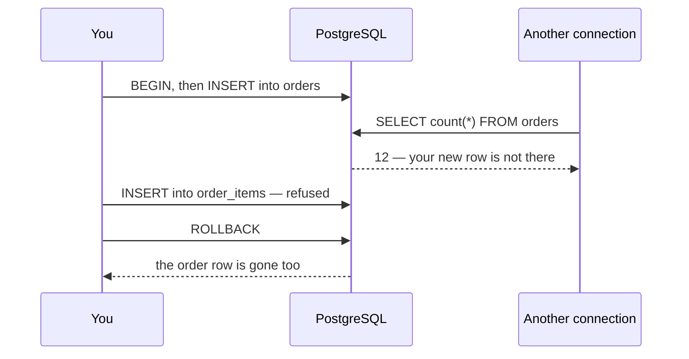

## Bạn cần biết trước

- [[foundation.l1.sql-write]] — bạn viết được `INSERT`, `UPDATE` và `DELETE`, biết so command tag với số dòng mình chờ đợi, và đã chạy một file bọc ba câu lệnh ghi giữa `BEGIN` và `ROLLBACK` (cả hai được định nghĩa bên dưới) để lab kết thúc đúng như lúc bắt đầu. Bài này nói rõ cặp lệnh đó cam kết điều gì.

## Tình huống

Cơ sở dữ liệu của lab — một server PostgreSQL mà bạn khởi động bằng `scripts/up.sh` — đang có mười hai đơn hàng. Vũ Gia Khánh, khách hàng duy nhất chưa từng đặt đơn nào, cuối cùng cũng đặt một đơn: `Tai nghe` giá 890.000 đồng. Đơn đó cần hai câu lệnh ghi — một dòng trong `orders`, rồi một dòng trong `order_items` cho món đã mua. Bạn chạy câu `INSERT` đầu tiên và nó thành công. Bạn chạy câu thứ hai và cơ sở dữ liệu từ chối, vì bạn gõ số lượng là `0` trong khi bảng chỉ nhận số lượng lớn hơn không. Dòng đầu tiên đã nằm đó, nên cửa hàng giờ có một đơn hàng không chứa gì, và vài tuần sau mới phát hiện ra. Làm sao để hai câu lệnh ghi hoạt động như một?

## Khái niệm cốt lõi

- **giao dịch** (transaction) — một nhóm câu lệnh mà cơ sở dữ liệu coi là một đơn vị công việc: hoặc thay đổi của tất cả đều được giữ lại, hoặc thay đổi của không câu nào được giữ.
- `BEGIN` — câu lệnh mở một khối giao dịch. Mọi câu lệnh sau nó thuộc cùng một đơn vị cho tới khi khối kết thúc.
- `COMMIT` — câu lệnh kết thúc khối bằng cách giữ nó lại: thay đổi của đơn vị trở thành vĩnh viễn, và các kết nối khác — những người hay chương trình khác đang kết nối vào cùng cơ sở dữ liệu — bắt đầu thấy chúng.
- `ROLLBACK` — câu lệnh kết thúc khối bằng cách bỏ nó đi: mọi thay đổi khối đã làm đều bị hoàn tác, dù nó đã ghi bao nhiêu dòng.

## Cơ chế hoạt động



Hai câu `INSERT` trong tình huống trên là hai câu lệnh riêng, và PostgreSQL chạy mỗi câu thành một đơn vị riêng: mở một đơn vị, áp câu lệnh, kết thúc đơn vị, ghi xuống đĩa như `COMMIT` vẫn làm. Đó là lý do dòng trong `orders` còn ở lại khi câu lệnh ghi thứ hai bị từ chối.

`BEGIN` thay đổi điều đó. Từ `BEGIN` cho tới khi khối kết thúc, mọi câu lệnh bạn gửi đều thuộc về một đơn vị. Kết nối của chính bạn thấy các thay đổi ngay khi chúng xảy ra — một câu đếm trong khối trả lời 13 đơn — nhưng chưa có gì ra khỏi đơn vị. Kết nối kia trong sơ đồ đếm đúng lúc đó và nhận về 12. Nó không đọc dữ liệu cũ: đơn thứ mười ba chỉ tồn tại với riêng bạn.

Có hai câu lệnh kết thúc khối có chủ đích. `COMMIT` giữ mọi thay đổi mà đơn vị đã làm, và chỉ khi đó các kết nối khác mới thấy chúng. Trước đó, cơ sở dữ liệu ghi đủ xuống đĩa để một máy mất điện ngay giây sau vẫn còn đơn hàng. `ROLLBACK` bỏ đơn vị đi, bất kể nó đã ghi những gì: trong sơ đồ chỉ câu `INSERT` thứ hai bị từ chối, nhưng `ROLLBACK` vẫn lấy đi cả dòng trong `orders`.

Không phải lúc nào bạn cũng được chọn câu nào chạy. Khi một câu lệnh trong khối thất bại, PostgreSQL từ chối mọi lệnh sau đó cho tới khi khối kết thúc, và khối không còn giữ lại được nữa. Câu lệnh kết thúc khối, như `COMMIT` hay `ROLLBACK`, vẫn được nhận. Câu nào cũng kết thúc khối, và một `COMMIT` gửi lúc này sẽ bỏ các thay đổi đi y như `ROLLBACK`. Khi kết nối của bạn rớt trong lúc khối còn mở, server sẽ rollback nó.

Trong lúc khối còn mở, các dòng nó đã đổi bị giữ lại: một giao dịch khác muốn đổi cùng những dòng đó phải chờ giao dịch của bạn kết thúc. Vì vậy hãy đóng khối đang mở cho nhanh.

## Trong hệ thống Đơn Hàng

`db/queries/transaction-place-order.sql` đặt đơn của Khánh — lần này với số lượng mà bảng chấp nhận — rồi lấy lại, để lab kết thúc đúng như lúc bắt đầu. Khách hàng 5 là Khánh, sản phẩm 3 là `Tai nghe` giá 890.000 đồng. `scripts/sql/run-query.sh` gửi cả file qua một kết nối, nên cả ba lần đếm đều đến từ cùng kết nối với hai câu `INSERT`.

```sql file=db/queries/transaction-place-order.sql tag=stage-0 lines=4-20
SELECT count(*) AS orders_before FROM orders;

-- lesson: foundation.l1.transaction-intro
BEGIN;

INSERT INTO orders (id, customer_id, placed_at, status)
VALUES (13, 5, '2026-04-01 09:00:00+07', 'new');

INSERT INTO order_items (order_id, product_id, quantity, unit_price_vnd)
VALUES (13, 3, 1, 890000);

SELECT count(*) AS orders_inside_transaction FROM orders;

ROLLBACK;

-- Nothing survived the rollback, including the order the first INSERT created.
SELECT count(*) AS orders_after_rollback FROM orders;
```

Mỗi câu `SELECT count(*)` trả lời `orders` đang có bao nhiêu dòng ở thời điểm đó. Câu đầu trả lời 12, số đơn sẵn có của lab. Câu thứ hai nằm trong khối, sau cả hai câu `INSERT`, và trả lời 13 — kết nối của bạn thấy những gì đơn vị của chính bạn đã ghi. Câu cuối chạy sau `ROLLBACK` và lại trả lời 12.

Hai câu lệnh ghi phải đi cùng nhau vì một lý do mà chính các bảng đã nêu. `order_items.order_id` tham chiếu tới `orders.id`, nên dòng thứ hai không thể tồn tại nếu thiếu dòng thứ nhất. Còn `quantity` được khai báo là phải lớn hơn không, và đó chính là lần từ chối trong tình huống. Nếu file kết thúc bằng `COMMIT` thì cả hai dòng sẽ ở lại: lần chạy sau sẽ in 13 cho `orders_before` rồi dừng. Câu `INSERT` đơn 13 bị từ chối vì `id` là khóa chính và số 13 đã có dòng khác giữ, còn `run-query.sh` dừng ở lỗi đầu tiên.

## Người mới hay nghĩ rằng…

- **"Mỗi câu lệnh là độc lập, nên thất bại giữa chừng vẫn để cơ sở dữ liệu ở trạng thái hợp lý."** → Thực ra mỗi câu lệnh chỉ hoặc tất cả hoặc không gì cả với riêng nó, và ngoài khối thì PostgreSQL chỉ hứa với bạn có vậy: câu bị từ chối không để lại gì, còn những câu đã thành công thì vẫn ở đó. Giữ hai bảng khớp với nhau là quy tắc của cửa hàng, không phải của một câu lệnh. Bạn sẽ nhận ra khi tình huống ở trên xảy ra thật với cửa hàng: `orders` có một dòng mà `order_items` không có gì cho nó, không có lỗi nào còn lưu lại ở đâu, và vài tuần sau đơn đó hiện ra trong báo cáo như một đơn trị giá bằng không.
- **"Bọc các câu lệnh ghi trong giao dịch sẽ làm code chạy nhanh hơn."** → Thực ra giao dịch có mặt để quyết định cái gì được giữ lại, còn tốc độ cùng lắm chỉ là tác dụng phụ. Gom nhiều câu ghi nhỏ lại đúng là giảm số lần cơ sở dữ liệu ghi xuống đĩa, nên một loạt dài câu `INSERT` có thể xong sớm hơn. Lợi ích đó đến từ chỗ trả chi phí mở và kết thúc giao dịch một lần cho nhiều câu ghi thay vì mỗi câu một lần, không đến từ bản thân `BEGIN`: một khối bọc quanh đúng một câu ghi vẫn trả chi phí đó một lần, nên không tiết kiệm được gì. Nhưng mọi dòng khối đã đổi đều bị giữ cho tới khi khối kết thúc, nên một khối cứ để mở cho "hiệu quả" sẽ bắt mọi câu ghi khác vào các dòng đó phải chờ. Bạn sẽ nhận ra khi một job mở khối, ghi một dòng rồi chờ một người trả lời câu hỏi, biến một lần ghi mất một giây thành cả hàng đợi phía sau nó.

## Thử ngay (3 phút)

1. Khởi động lab bằng `scripts/up.sh`, rồi chạy `scripts/sql/run-query.sh transaction-place-order`. Đọc ba con số đếm theo thứ tự chúng được in ra.
2. Mở `db/queries/transaction-place-order.sql` và đổi số lượng `1` thành `0` trong câu `INSERT` vào `order_items`, để câu ghi đó phạm quy tắc mà bảng đã khai báo. Chạy lại đúng lệnh cũ, rồi trả số `1` về chỗ cũ và chạy lần thứ ba.

Kết quả mong đợi: lần chạy đầu in `orders_before` 12, `orders_inside_transaction` 13, `orders_after_rollback` 12. Lần chạy thứ hai in 12, command tag của câu `INSERT` vào `orders`, rồi một dòng `ERROR` về số lượng, và dừng: `scripts/sql/run-query.sh` kết thúc file ở lỗi đầu tiên, nên không câu đếm nào phía sau được chạy. Lần chạy thứ ba in lại 12, 13, 12 như lần đầu, và điều đó chỉ đúng vì đơn 13 của lần chạy thứ hai đã không được giữ lại. Lần chạy thứ hai dừng ở chỗ bị từ chối, và `run-query.sh` đóng kết nối khi dừng, nên kết nối đóng lại trong lúc khối vẫn mở, và server rollback một khối như thế.

## Liên hệ

- [[foundation.l1.sql-write]] — bài mà bài này hoàn thiện: ở đó bạn đổi từng dòng một, ở đây bạn quyết định những thay đổi nào đứng cùng nhau.
- [[foundation.l1.tables-keys-relations]] — khóa ngoại khai báo ở đó là lý do một đơn hàng và các món của nó phải được ghi thành một đơn vị.
- [[backend.l2.transactions-in-practice]] — cùng ý tưởng đó trong code ứng dụng, nơi khối được mở bằng code thay vì bằng một dòng trong file.
- [[backend.l3.outbox-pattern]] — câu trả lời cho trường hợp hai việc phải xảy ra cùng nhau là một lần ghi vào cơ sở dữ liệu và một thông điệp gửi sang hệ thống khác, điều mà không giao dịch đơn lẻ nào bao được.

## Tóm tắt 5 dòng

1. Giao dịch là một nhóm câu lệnh mà thay đổi của chúng hoặc được giữ lại hết, hoặc biến mất hết, và đó là cách hai câu ghi trở thành một đơn vị công việc.
2. `BEGIN` mở khối, `COMMIT` giữ khối lại và cho người khác thấy, `ROLLBACK` bỏ khối đi.
3. Ngoài khối, mỗi câu lệnh là một giao dịch riêng, nên thất bại giữa một chuỗi câu ghi vẫn để lại những câu đã chạy trước đó.
4. Một câu lệnh bị từ chối trong khối, hoặc một kết nối mất trước khi khối kết thúc, khiến không thay đổi nào của khối được ghi lại.
5. Khối đang mở giữ các dòng nó đã đổi trước mọi câu ghi khác, nên hãy giữ giao dịch ngắn và đừng bao giờ chờ một người trong lúc giao dịch còn mở.
