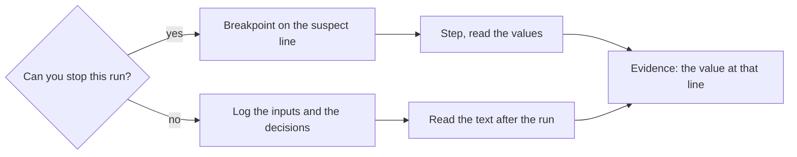

## Before you start

- [[foundation.l2.reading-stack-traces]] — a trace hands you a type, a message and a line, and usually not the value that was wrong on that line. This lesson is the two ways to see the value itself.

## The situation

You are back on the wrong total in Đơn Hàng at its first version (`stage-0`). Reading the loop, you guessed it leaves out the last item — which would explain the 1.250.000 the run reports where 2.150.000 was expected. But the run prints one number at the end and nothing from inside. You never saw `totalVnd` before the first line was added, and you never saw the body skipped; you worked all of it out from the text. Tonight the same sample runs on the machine that checks every script in the repository, where nobody is sitting, and all it leaves behind is text. How do you watch a value instead of inferring it?

## Core concepts

- debugger — a program that starts your program, or hooks onto one already running, and can hold it still, so you read the values that exist at a line instead of deducing them from the code.
- breakpoint — a mark you set beside a line number in the editor you start the program from, not a change to the file; the run stops just before that line runs and hands you every variable that line could use.
- stepping — advancing a stopped run one line at a time, so every change to a value is something you watched happen.
- conditional breakpoint — a breakpoint with a sentence attached, so the run stops only on the passes where that sentence is true, such as the last pass of a loop.
- log line — a line of text the program writes as it runs, so a run nobody watched can still be read afterwards.
- print debugging — adding log lines by hand to answer one question, reading them once, and deleting them.

## How it works



In the situation above the first question decides the tool. You can start the sample yourself, so you can stop it: that branch is the debugger. You cannot stop an unattended overnight run, a failure that happened last night, or a machine you cannot hook onto: that branch is logging. Both branches end in the same place: a value you saw, not one you argued for.

Take the left branch. A breakpoint on the adding line stops the run just before it, with `i`, `totalVnd` and `lines` readable. Stepping then moves one line at a time, so you watch whether `totalVnd` changes. What you had only read in the loop's header is now a run you watch stop once and then leave the loop.

A plain breakpoint inside a loop stops on every pass: bearable for two items, useless for two hundred. A conditional breakpoint carries the sentence you are testing — your hypothesis, the one guess about the cause you are checking now — so it stops where that guess could be shown false: when `i` is the last index. Skipping a breakpoint forty times means the guess has not been cut down yet: it covers more of the run than one stop settles.

The right branch writes instead of stopping. A log line earns its place by recording an input the code received or a decision it took; a line saying only that the program reached a point carries no value to compare against what was reported, and a run that throws already has a stack trace naming the path. The question is not a matter of taste: the run either stops for you or it does not. A run you can stop still allows a quick print, but it does not need one.

## In the Đơn Hàng system

The example repository carries both halves. The bug lives in `samples/DonHang.Samples/Samples/Debug/WrongTotal.cs`: its loop is where a breakpoint goes, and `Run` under it holds the order the sample totals.

```csharp file=samples/DonHang.Samples/Samples/Debug/WrongTotal.cs tag=stage-0 lines=7-22
    public static int TotalVnd(IReadOnlyList<(int Quantity, int UnitPriceVnd)> lines)
    {
        var totalVnd = 0;
        for (var i = 0; i < lines.Count - 1; i++)
        {
            totalVnd += lines[i].Quantity * lines[i].UnitPriceVnd;
        }

        return totalVnd;
    }

    public static void Run()
    {
        var orderOne = new (int Quantity, int UnitPriceVnd)[] { (1, 1_250_000), (2, 450_000) };

        Console.WriteLine($"expected 2150000, got {TotalVnd(orderOne)}");
```

Put the breakpoint on the line that adds, not on the `for` line. You set that mark by clicking the margin beside the line number, in the editor you opened the repository with, and starting the sample from that editor in debug mode is what makes the run stop there. You want the values as the body runs, and if the body never runs the breakpoint never stops the program, which is itself the answer. For the sample order — two lines, one unit at 1.250.000 and two units at 450.000 — the stop happens once, with `i` at 0 and `totalVnd` going from 0 to 1.250.000; step on from there and you reach the `return` without the body running again, the second item never touched. The file was not edited to learn this.

The other half is the same function with its values written down as it goes, kept as a separate sample:

```csharp file=samples/DonHang.Samples/Samples/Debug/LoggingDemo.cs tag=stage-0 lines=8-21
    public static int TotalVnd(IReadOnlyList<(int Quantity, int UnitPriceVnd)> lines)
    {
        Console.WriteLine($"[total] called with {lines.Count} lines");

        var totalVnd = 0;
        for (var i = 0; i < lines.Count - 1; i++)
        {
            totalVnd += lines[i].Quantity * lines[i].UnitPriceVnd;
            Console.WriteLine($"[total] after line {i}: {totalVnd}");
        }

        Console.WriteLine($"[total] returning {totalVnd}");
        return totalVnd;
    }
```

Three kinds of line, and all three carry a value: the input the function received (`lines.Count`), the running total after each pass, and what came back. Start it with `dotnet run --project samples/DonHang.Samples -- logging-demo` and the console shows `[total] called with 2 lines`, then a single `[total] after line 0: 1250000`, then `[total] returning 1250000`. One loop line for a two-item order is the same evidence the breakpoint gave, and it survives a machine you were not sitting at.

Notice what is absent. No line announces that the function was entered, and none reports that the sample started; the prefix `[total]` is there so these lines stay findable when other code is writing to the same console. Notice the cost too. These prints belong to one investigation, not to the function: left in `WrongTotal.cs`, they would print a line when the order arrives, one for each item added and one when it returns — on every order the system ever totals — and a file of them would not tell you which order any line belonged to.

## Beginners often think…

- **"Real developers do not use the debugger; they read the code."** → Actually reading is what produces the guess and the debugger is what decides it — the same work, in order. The values at a line are evidence; what you concluded from reading is only the thing you set out to check. You notice this when two people read this loop, disagree about whether the last item is added, and settle it by stopping the run once and reading `totalVnd` at that line.
- **"More logging is always better."** → Actually every line you add is a line someone reads later, so lines recording nothing — that a method was entered, that a branch was taken, with no value attached — push the ones that matter out of sight. You notice this when a failure is somewhere inside thousands of logged lines and not one of them holds an input you could compare against what was reported.

## Try it (3 minutes)

1. From the top folder of the example repository, run `dotnet run --project samples/DonHang.Samples -- logging-demo` and copy the printed lines into your notes. The part after `--` picks which sample to run, here the logging one.
2. Predict how many `[total] after line` lines an order of three items would print, by reading the loop's condition with `lines.Count` equal to 3. Write the prediction down, then check it against the answer below.

Expected result: the run prints `[total] called with 2 lines`, `[total] after line 0: 1250000` and `[total] returning 1250000` — one loop line for a two-item order.

<details><summary>Suggested answer</summary>

Two. With `lines.Count` equal to 3 the condition `i < lines.Count - 1` lets `i` take 0 and 1 and then stops, so the third item is never added and `[total] after line 2` never prints. A breakpoint on the adding line would stop twice for the same run: the same count, arrived at by watching rather than by reading.

</details>

## Connections

- [[foundation.l2.debugging-method]] — these are the tools for its third and fourth steps, and where the hypothesis you cut down here was introduced: a breakpoint or a log line is how a check actually gets run.
- [[foundation.l2.reading-stack-traces]] — the prerequisite, for the case where the run ends in an error: the trace names the line, and a breakpoint on that line names the value.
- [[foundation.l2.git-bisect]] — the other way to get evidence without reading, halving history instead of halving one run.
- [[backend.l1.structured-logging]] — the same idea at the size of a system, where log lines are written to be searched by a machine rather than read by you.

## Five-line summary

1. Watch the value at the line instead of deducing it: a debugger when you can stop the run, log lines when you cannot.
2. A breakpoint stops the run just before a line so you can read the variables there; stepping then moves one line at a time.
3. A conditional breakpoint stops only on the pass your hypothesis is about, so cut the guess down to one pass before reaching for it.
4. Log the inputs a function received and the decisions it took, never the bare fact that the code reached a point.
5. Prints added to answer one question come out once it is answered; the ones left behind are what make log files unreadable.
