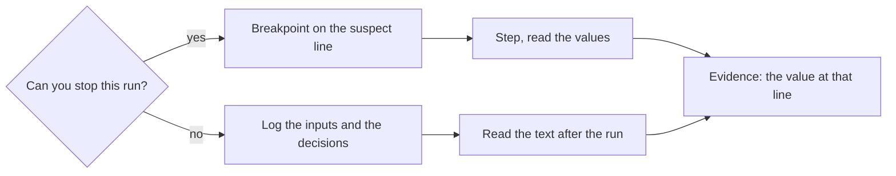

## Before you start

- [[foundation.l2.reading-stack-traces]] — a trace hands you a type, a message and a line, and usually not the value that was wrong on that line. This lesson is the two ways to see the value itself.

## The situation

A Đơn Hàng sample, a small program you run by name, at its first version (`stage-0`) totals an order as 1.250.000 where 2.150.000 was expected. Reading the loop, you guess it leaves out the last item. But the run prints one number at the end and nothing from inside. You never saw `totalVnd` change inside the loop, and you never saw the loop skip the second item; you worked it out by reading. The same function also runs on a machine that runs the repository's code after every change, with nobody watching, and all such a run leaves behind is text. How do you watch a value instead of inferring it?

## Core concepts

- debugger — a program that starts your program, or hooks onto one already running, and can hold it still, so you read the values that exist at a line instead of deducing them from the code.
- breakpoint — a mark you set beside a line number in the editor you start the program from, not a change to the file; the run stops just before that line runs and hands you the values of the variables the running method holds.
- stepping — advancing a stopped run one line at a time, so every change to a value is something you watched happen.
- conditional breakpoint — a breakpoint with a condition attached, written as a C# expression, so the run stops only on the passes where it is true, such as the last pass of a loop.
- log line — a line of text the program writes as it runs, so a run nobody watched can still be read afterwards.
- print debugging — adding log lines by hand to answer one question, reading them once, and deleting them.

## How it works


```mermaid
flowchart LR
  Q{Can you stop this run?} -->|yes| B[Breakpoint on the suspect line]
  B --> S[Step, read the values]
  Q -->|no| L[Log the inputs and the decisions]
  L --> T[Read the text after the run]
  S --> E[Evidence: the value at that line]
  T --> E
```

The first question decides the tool. A sample you start yourself can be stopped: that path is the debugger. You cannot stop an unattended run, a failure that happened last night, or a machine you cannot hook onto: that path is logging. Both end in a value you saw, not one you argued for.

On the left path, the next section's loop has the condition `i < lines.Count - 1`. A breakpoint on the adding line stops the run just before it, with `i`, `totalVnd` and `lines` readable. Stepping then moves one line at a time while you watch `totalVnd`.

A plain breakpoint inside a loop stops on every pass, and continuing only moves on to the next stop: fine for two items, useless for two hundred. A conditional breakpoint carries a C# expression, here `i == lines.Count - 1`. It states your hypothesis, the one guess you are checking, so the run stops only where it could be shown false. Here it never stops, though a plain breakpoint there stops once: the last pass never happens, and that silence is the evidence. In general, continuing past a stop forty times means you do not yet know which of forty passes is wrong; narrow to one pass, and one stop settles it.

The right path writes instead of stopping; you read those lines after the run ends, and they are its evidence. A log line earns its place by recording an input the code received or a decision it took. A decision is which way the code went, with the value that sent it there — here, whether the loop ran another pass, given `i` and `lines.Count`. A line saying only where the code went carries no value to compare, and where a run throws, its trace already shows that path.

## In the Đơn Hàng system

The example repository carries both halves. The bug lives in `samples/DonHang.Samples/Samples/Debug/WrongTotal.cs`: its loop is where a breakpoint goes, and `Run` under it holds the order the sample totals. Each entry of `lines` is one item of that order, a quantity and a unit price.

```csharp file=samples/DonHang.Samples/Samples/Debug/WrongTotal.cs tag=stage-0 lines=7-22
    public static int TotalVnd(IReadOnlyList<(int Quantity, int UnitPriceVnd)> lines)
    {
        var totalVnd = 0;
        for (var i = 0; i < lines.Count - 1; i++)
        {
            totalVnd += lines[i].Quantity * lines[i].UnitPriceVnd;
        }

        return totalVnd;
    }

    public static void Run()
    {
        var orderOne = new (int Quantity, int UnitPriceVnd)[] { (1, 1_250_000), (2, 450_000) };

        Console.WriteLine($"expected 2150000, got {TotalVnd(orderOne)}");
```

Put the breakpoint on the line that adds, not on the `for` line; you set it by clicking the margin beside the line number in the editor you opened the repository with. Then start the sample from that editor in debug mode, its command that runs the program under the debugger. The editor takes the program's arguments from its run settings for the project: type `wrong-total` there, the name that `dotnet run --project samples/DonHang.Samples -- wrong-total` passes after `--`; without it the program only lists the samples and never reaches the loop. You want the values as the body runs, and a body that never runs never stops the program, which is itself the answer. For the sample order the stop happens once, with `i` at 0 and `totalVnd` going from 0 to 1.250.000; step on and you reach the `return` without the body running again. The file was not edited to learn this.

The other half is the same function with its values written down as it goes, kept as a separate sample whose `Run` totals the same two-item order:

```csharp file=samples/DonHang.Samples/Samples/Debug/LoggingDemo.cs tag=stage-0 lines=8-21
    public static int TotalVnd(IReadOnlyList<(int Quantity, int UnitPriceVnd)> lines)
    {
        Console.WriteLine($"[total] called with {lines.Count} lines");

        var totalVnd = 0;
        for (var i = 0; i < lines.Count - 1; i++)
        {
            totalVnd += lines[i].Quantity * lines[i].UnitPriceVnd;
            Console.WriteLine($"[total] after line {i}: {totalVnd}");
        }

        Console.WriteLine($"[total] returning {totalVnd}");
        return totalVnd;
    }
```

Three kinds of line, and all three carry a value: the input the function received (`lines.Count`), the running total after each pass, and what came back. Start it with `dotnet run --project samples/DonHang.Samples -- logging-demo` and the console shows `[total] called with 2 lines`, then a single `[total] after line 0: 1250000`, the total after the first item, then `[total] returning 1250000`. One loop line for a two-item order is the same evidence the breakpoint gave, and it survives a machine you were not sitting at.

Notice what is absent. No line announces only that the function was entered, and none reports that the sample started; the prefix `[total]` keeps these lines findable when other code writes to the same console. Notice the cost too. These prints belong to one investigation, not to the function, which is why they sit in their own sample rather than in `WrongTotal.cs`. Left in a function the system kept calling, they would print a line when the order arrives, one per item added and one on return, for every order; once that output is saved to a file, nothing in it says which order a line belonged to.

## Beginners often think…

- **"Real developers do not use the debugger; they read the code."** → Actually reading is what produces the guess and the debugger is what decides it — the same work, in order. The values at a line are evidence; what you concluded from reading is only the thing you set out to check. You notice this when two people read this loop, disagree about whether the last item is added, and settle it by stopping the run once and reading `totalVnd` at that line.
- **"More logging is always better."** → Actually every line you add is a line someone reads later, so lines recording nothing — that a method was entered, that the code went one way, with no value saying why — push the ones that matter out of sight. You notice this when a failure is somewhere inside thousands of logged lines and not one of them holds an input you could compare against what was reported.

## Try it (3 minutes)

1. From the top folder of the example repository, run `dotnet run --project samples/DonHang.Samples -- logging-demo` and copy the printed lines into your notes. The part after `--` picks which sample to run, here the logging one.
2. Predict how many `[total] after line` lines an order of three items would print, by reading the loop's condition with `lines.Count` equal to 3. Write the prediction down, then check it against the answer below.

Expected result: the run prints `[total] called with 2 lines`, `[total] after line 0: 1250000` and `[total] returning 1250000` — one loop line for a two-item order.

<details><summary>Suggested answer</summary>

Two. With `lines.Count` equal to 3 the condition `i < lines.Count - 1` lets `i` take 0 and 1 and then stops, so the third item is never added and `[total] after line 2` never prints. A breakpoint on the adding line would stop twice for the same run: the same count, arrived at by watching rather than by reading.

</details>

## Connections

- [[foundation.l2.debugging-method]] — these are the tools for its hypothesise and check steps, and where the hypothesis you cut down here was introduced: a breakpoint or a log line is how a check actually gets run.
- [[foundation.l2.reading-stack-traces]] — the prerequisite, for the case where the run ends in an error: the trace names the line, and a breakpoint on that line names the value.
- [[foundation.l2.git-bisect]] — the other way to get evidence without reading, halving history instead of halving one run.
- [[backend.l1.structured-logging]] — the same idea at the size of a system, where log lines are written to be searched by a machine rather than read by you.

## Five-line summary

1. Watch the value at the line instead of deducing it: a debugger when you can stop the run, log lines when you cannot.
2. A breakpoint stops the run just before a line so you can read the variables there; stepping then moves one line at a time.
3. A conditional breakpoint stops only on the pass your hypothesis is about, so cut the guess down to one pass before reaching for it.
4. Log the inputs a function received and the decisions it took; a line saying only that a point was reached returns nothing.
5. Prints added to answer one question come out once it is answered; the ones left behind are what make log files unreadable.
