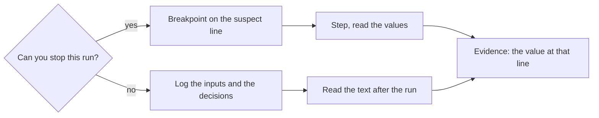

## Bạn cần biết trước

- [[foundation.l2.reading-stack-traces]] — một stack trace đưa cho bạn kiểu lỗi, thông báo và số dòng, nhưng thường không cho biết giá trị nào đã sai ở dòng đó. Bài này là hai cách để nhìn thấy chính giá trị ấy.

## Tình huống

Một sample của Đơn Hàng, tức một chương trình nhỏ bạn chạy theo tên, ở phiên bản đầu tiên (`stage-0`) tính tổng một đơn hàng ra 1.250.000 trong khi con số mong đợi là 2.150.000. Đọc vòng lặp, bạn đoán nó bỏ sót món cuối. Nhưng lần chạy chỉ in một con số ở cuối và không in gì từ bên trong. Bạn chưa hề thấy `totalVnd` thay đổi trong vòng lặp, cũng chưa thấy vòng lặp bỏ qua món thứ hai. Bạn chỉ suy ra điều đó bằng cách đọc. Cùng hàm này còn chạy trên một máy tự chạy code của repository sau mỗi lần thay đổi, không ai ngồi xem, và thứ duy nhất một lần chạy như thế để lại là văn bản. Làm sao để bạn nhìn thấy một giá trị thay vì suy ra nó?

## Khái niệm cốt lõi

- debugger — chương trình khởi động chương trình của bạn, hoặc gắn vào một chương trình đang chạy, và có thể giữ nó đứng yên, để bạn đọc các giá trị đang có ở một dòng thay vì suy ra chúng từ code.
- breakpoint — một dấu bạn đặt cạnh số dòng trong trình soạn thảo dùng để khởi động chương trình, không phải một thay đổi trong file. Lần chạy dừng ngay trước khi dòng đó chạy và cho bạn xem giá trị các biến mà method đang chạy nắm giữ.
- chạy từng bước (stepping) — cho một lần chạy đang dừng đi tiếp từng dòng một, để mọi thay đổi của một giá trị đều là thứ bạn tận mắt thấy.
- breakpoint có điều kiện — một breakpoint gắn kèm điều kiện, viết bằng một biểu thức C#, để lần chạy chỉ dừng ở những vòng lặp mà điều kiện đúng, chẳng hạn vòng cuối cùng.
- dòng log — một dòng văn bản chương trình ghi ra trong lúc chạy, để một lần chạy không ai theo dõi vẫn đọc lại được về sau.
- print debugging — tự tay thêm các dòng log để trả lời đúng một câu hỏi, đọc chúng một lần, rồi xóa đi.

## Cơ chế hoạt động



Câu hỏi đầu tiên quyết định công cụ. Một sample bạn tự khởi động thì dừng được: đó là nhánh debugger. Một lần chạy không ai trông, một lỗi xảy ra từ đêm qua, hay một máy bạn không gắn vào được thì không dừng được: đó là nhánh log. Cả hai đều kết thúc bằng một giá trị bạn đã thấy, không phải một giá trị bạn lập luận ra.

Ở nhánh bên trái, vòng lặp trong phần sau có điều kiện `i < lines.Count - 1`. Một breakpoint trên dòng cộng dồn dừng lần chạy ngay trước dòng đó, lúc `i`, `totalVnd` và `lines` đều đọc được. Chạy từng bước sau đó đi tiếp từng dòng một trong khi bạn theo dõi `totalVnd`.

Một breakpoint thường đặt trong vòng lặp sẽ dừng ở mọi vòng, và bấm tiếp tục chỉ đưa bạn tới lần dừng kế tiếp: ổn với hai món, vô dụng với hai trăm món. Breakpoint có điều kiện mang theo một biểu thức C#, ở đây là `i == lines.Count - 1`. Biểu thức đó phát biểu giả thuyết của bạn, tức điều đoán duy nhất bạn đang kiểm tra, nên lần chạy chỉ dừng ở chỗ giả thuyết có thể bị chứng minh sai. Ở đây nó không bao giờ dừng, dù một breakpoint thường ở cùng chỗ dừng một lần: vòng cuối không bao giờ xảy ra, và chính sự im lặng đó là bằng chứng. Nói chung, nếu phải bấm tiếp tục qua bốn mươi lần dừng, nghĩa là bạn chưa biết vòng nào trong bốn mươi vòng bị sai. Hãy thu hẹp xuống một vòng, và chỉ một lần dừng là đủ để kết luận.

Nhánh bên phải ghi ra thay vì dừng lại. Bạn đọc các dòng đó sau khi lần chạy kết thúc, và chúng là bằng chứng của lần chạy. Một dòng log đáng giữ khi nó ghi lại một đầu vào code đã nhận hoặc một quyết định code đã đưa ra. Quyết định là hướng code đã đi, kèm giá trị khiến nó đi hướng đó — ở đây là vòng lặp có chạy thêm một vòng hay không, với `i` và `lines.Count` lúc đó. Một dòng chỉ nói code đã đi tới đâu thì không mang giá trị nào để so sánh, và nếu lần chạy ném lỗi, stack trace của nó đã cho thấy đường đi đó rồi.

## Trong hệ thống Đơn Hàng

Repository ví dụ có sẵn cả hai nửa. Lỗi nằm trong `samples/DonHang.Samples/Samples/Debug/WrongTotal.cs`: vòng lặp của nó là chỗ đặt breakpoint, còn `Run` bên dưới giữ đơn hàng mà sample tính tổng. Mỗi phần tử của `lines` là một món của đơn hàng đó, gồm số lượng và đơn giá.

```csharp file=samples/DonHang.Samples/Samples/Debug/WrongTotal.cs tag=stage-0 lines=7-22
    public static int TotalVnd(IReadOnlyList<(int Quantity, int UnitPriceVnd)> lines)
    {
        var totalVnd = 0;
        for (var i = 0; i < lines.Count - 1; i++)
        {
            totalVnd += lines[i].Quantity * lines[i].UnitPriceVnd;
        }

        return totalVnd;
    }

    public static void Run()
    {
        var orderOne = new (int Quantity, int UnitPriceVnd)[] { (1, 1_250_000), (2, 450_000) };

        Console.WriteLine($"expected 2150000, got {TotalVnd(orderOne)}");
```

Đặt breakpoint trên dòng cộng dồn, không phải trên dòng `for`. Bạn đặt nó bằng cách bấm vào lề cạnh số dòng trong trình soạn thảo đã dùng để mở repository. Sau đó khởi động sample từ trình soạn thảo đó ở chế độ debug, tức lệnh chạy chương trình dưới debugger. Trình soạn thảo lấy tham số cho chương trình từ phần cấu hình chạy của project: gõ `wrong-total` vào đó, chính là cái tên mà `dotnet run --project samples/DonHang.Samples -- wrong-total` truyền sau `--`. Thiếu nó, chương trình chỉ liệt kê các sample và không bao giờ tới vòng lặp. Bạn muốn xem các giá trị khi thân vòng lặp chạy, và một thân vòng lặp không bao giờ chạy thì không bao giờ làm chương trình dừng, bản thân điều đó đã là câu trả lời. Với đơn hàng mẫu, lần dừng xảy ra một lần, `i` bằng 0 và `totalVnd` đi từ 0 lên 1.250.000. Chạy từng bước tiếp, bạn tới `return` mà thân vòng lặp không chạy thêm lần nào. File không hề bị sửa để biết được điều này.

Nửa còn lại là cùng hàm đó nhưng ghi các giá trị ra trong lúc chạy, đặt thành một sample riêng mà `Run` tính tổng cùng đơn hàng hai món:

```csharp file=samples/DonHang.Samples/Samples/Debug/LoggingDemo.cs tag=stage-0 lines=8-21
    public static int TotalVnd(IReadOnlyList<(int Quantity, int UnitPriceVnd)> lines)
    {
        Console.WriteLine($"[total] called with {lines.Count} lines");

        var totalVnd = 0;
        for (var i = 0; i < lines.Count - 1; i++)
        {
            totalVnd += lines[i].Quantity * lines[i].UnitPriceVnd;
            Console.WriteLine($"[total] after line {i}: {totalVnd}");
        }

        Console.WriteLine($"[total] returning {totalVnd}");
        return totalVnd;
    }
```

Có ba loại dòng, và cả ba đều mang một giá trị: đầu vào hàm nhận được (`lines.Count`), tổng đang cộng dồn sau mỗi vòng, và giá trị trả về. Chạy nó bằng `dotnet run --project samples/DonHang.Samples -- logging-demo`, console hiện `[total] called with 2 lines`, rồi đúng một dòng `[total] after line 0: 1250000`, tức tổng sau món đầu tiên, rồi `[total] returning 1250000`. Một dòng vòng lặp cho đơn hàng hai món là cùng bằng chứng mà breakpoint đã cho, và nó vẫn còn đó trên một máy bạn không ngồi trước mặt.

Hãy để ý những gì không có. Không dòng nào chỉ báo rằng hàm đã được gọi vào, cũng không dòng nào báo sample đã bắt đầu. Tiền tố `[total]` giúp tìm lại các dòng này khi code khác cũng ghi ra cùng console. Hãy để ý cả cái giá phải trả. Các lệnh in này thuộc về một lần điều tra, không thuộc về hàm, nên chúng nằm trong sample riêng chứ không nằm trong `WrongTotal.cs`. Nếu để lại trong một hàm mà hệ thống gọi liên tục, chúng sẽ in một dòng khi đơn hàng tới, một dòng cho mỗi món được cộng và một dòng lúc trả về, cho mọi đơn hàng. Khi output đó được lưu vào file, không có gì trong đó cho biết một dòng thuộc về đơn hàng nào.

## Người mới hay nghĩ rằng…

- **"Dev giỏi không dùng debugger, họ đọc code."** → Thực ra đọc là bước tạo ra điều đoán, còn debugger là bước quyết định nó — cùng một công việc, theo đúng thứ tự. Giá trị ở một dòng là bằng chứng, còn điều bạn kết luận khi đọc chỉ là thứ bạn cần kiểm tra. Bạn sẽ nhận ra khi hai người đọc vòng lặp này, bất đồng về chuyện món cuối có được cộng hay không, và phân xử bằng cách dừng lần chạy một lần rồi đọc `totalVnd` ở dòng đó.
- **"Log càng nhiều càng tốt."** → Thực ra mỗi dòng bạn thêm là một dòng ai đó sẽ phải đọc về sau, nên những dòng không ghi lại gì — rằng một method đã được gọi, rằng code đã đi một hướng, mà không có giá trị nào nói vì sao — đẩy những dòng quan trọng ra khỏi tầm mắt. Bạn sẽ nhận ra khi một lỗi nằm đâu đó giữa hàng nghìn dòng log mà không dòng nào chứa một đầu vào để so với điều được báo.

## Thử ngay (3 phút)

1. Từ thư mục gốc của repository ví dụ, chạy `dotnet run --project samples/DonHang.Samples -- logging-demo` rồi chép các dòng in ra vào ghi chép. Phần sau `--` chọn sample cần chạy, ở đây là sample log.
2. Đoán xem một đơn hàng ba món sẽ in bao nhiêu dòng `[total] after line`, bằng cách đọc điều kiện của vòng lặp với `lines.Count` bằng 3. Ghi dự đoán lại, rồi so với gợi ý đáp án bên dưới.

Kết quả mong đợi: lần chạy in `[total] called with 2 lines`, `[total] after line 0: 1250000` và `[total] returning 1250000` — một dòng vòng lặp cho đơn hàng hai món.

<details><summary>Gợi ý đáp án</summary>

Hai dòng. Với `lines.Count` bằng 3, điều kiện `i < lines.Count - 1` cho `i` nhận 0 rồi 1 rồi dừng, nên món thứ ba không bao giờ được cộng và `[total] after line 2` không bao giờ được in. Một breakpoint trên dòng cộng dồn sẽ dừng hai lần trong cùng lần chạy đó: cùng con số, nhưng có được nhờ quan sát chứ không nhờ đọc.

</details>

## Liên hệ

- [[foundation.l2.debugging-method]] — đây là công cụ cho bước nêu giả thuyết và bước kiểm tra của bài đó, cũng là nơi giả thuyết bạn thu hẹp ở đây được giới thiệu: breakpoint hay dòng log là cách một lần kiểm tra thật sự được chạy.
- [[foundation.l2.reading-stack-traces]] — kiến thức cần có trước, cho trường hợp lần chạy kết thúc bằng một lỗi: stack trace chỉ ra dòng, còn breakpoint trên dòng đó chỉ ra giá trị.
- [[foundation.l2.git-bisect]] — thêm một con đường khác để có bằng chứng mà không cần đọc, cắt đôi lịch sử thay vì cắt đôi một lần chạy.
- [[backend.l1.structured-logging]] — cùng ý tưởng ở quy mô cả hệ thống, nơi các dòng log được viết để máy tìm kiếm chứ không phải để bạn đọc.

## Tóm tắt 5 dòng

1. Nhìn giá trị tại dòng thay vì suy ra nó: dùng debugger khi dừng được lần chạy, dùng dòng log khi không dừng được.
2. Breakpoint dừng lần chạy ngay trước một dòng để bạn đọc các biến ở đó, rồi chạy từng bước đi tiếp từng dòng một.
3. Breakpoint có điều kiện chỉ dừng ở vòng mà giả thuyết nói tới, nên hãy thu hẹp điều đoán xuống một vòng trước khi dùng nó.
4. Ghi log các đầu vào hàm nhận được và các quyết định nó đưa ra, còn một dòng chỉ báo đã tới một điểm thì chẳng cho lại gì.
5. Các lệnh in thêm vào để trả lời một câu hỏi phải được gỡ ra khi đã có câu trả lời, những lệnh bị bỏ quên chính là thứ làm file log không đọc nổi.
