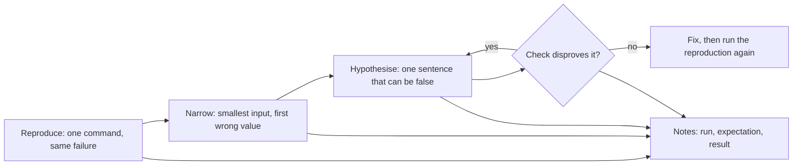

## Before you start

- [[foundation.l1.reading-code]] — you followed one path through an unfamiliar repository instead of reading it whole. This lesson narrows the same way, except the path is chosen by evidence rather than by the entry point.

## The situation

A message about Đơn Hàng reaches you: order 1 shows 900.000 đồng instead of 2.150.000 đồng. Order 1's rows in the repository's starting data (`db/seed.sql`) do add up to 2.150.000. You open the file and read the function that adds up an order, and the arithmetic looks right. You read it twice more and it still looks right, so you start changing the line you distrust most. Ten minutes later the number is different and you cannot say why. Where do you start when reading has stopped telling you anything?

## Core concepts

- reproduction — a command you can run whenever you like that produces the same failure every time, so that a later run can tell you whether anything actually changed.
- narrowing — shrinking the distance between the start of the run and the first value that is wrong, by halving the input or the path through the code.
- hypothesis — one sentence naming a cause, written so that a single check could show it to be false.
- check — the smallest thing you can run to decide a hypothesis, with its result predicted before you run it.
- notes — the running record of what you ran, what you expected and what you got, in the order you did it.

## How it works



In the situation above you have someone else's sentence and no reproduction: nothing you can run to see 900.000 for yourself. A reproduction is a command, a fixed input and an expected result. Without one you cannot tell a fix from a coincidence: a failure that comes and goes may simply not have happened on the run after your change.

Once the failure appears on demand, narrow it: keep the command, halve the input, and see whether the failure survives. Each halving is information. If it survives, the half you kept is enough to trigger it, so keep halving there. If it disappears, what you removed matters, so put half of it back and run again. You stop when you hold the smallest input that still fails and know the earliest point where the value you see differs from the value you expected.

Then state one hypothesis — a single sentence that could be false, such as "the loop never processes the last line". "Something is wrong with the total" cannot be false, so it is not a hypothesis. Design the check before running it: say what you will see if the sentence is true and what you will see if it is not. A check whose result you cannot predict decides nothing.

If the check disproves the hypothesis, write the result down and state the next one; a disproved sentence still removes one possible cause, so there is less left to look at, even though the input you run stays the same size. If the hypothesis survives, change the code, then run the reproduction again, unchanged. The notes grow the whole way through, and they are what a later question or written report is made of.

## In the Đơn Hàng system

The console project in the example repository, at its first version (`stage-0`), carries this bug as a sample, and the sample carries its own reproduction. You start it from the top folder of the repository with `dotnet run --project samples/DonHang.Samples -- wrong-total`; `--project` names the project to run — here the folder that holds it — and the word after `--` picks the sample.

```csharp file=samples/DonHang.Samples/Samples/Debug/WrongTotal.cs tag=stage-0 lines=18-24
    public static void Run()
    {
        var orderOne = new (int Quantity, int UnitPriceVnd)[] { (1, 1_250_000), (2, 450_000) };

        Console.WriteLine($"expected 2150000, got {TotalVnd(orderOne)}");
        Console.WriteLine($"one line only: expected 1250000, got {TotalVnd(orderOne[..1])}");
    }
```

Both printed lines are reproductions: a fixed input, and the expected number written beside the number actually produced — the second is the first one narrowed. The first is order 1 as the starting data has it, one item at 1.250.000 and two at 450.000. It prints `expected 2150000, got 1250000` — not the 900.000 the message claimed. You cannot reproduce the reported number from this code, so the number you produce yourself is the one to explain. The second printed line is the narrowing, already done for you: the same call with `orderOne[..1]`, the first item of the order alone, which prints `expected 1250000, got 0`.

Of the two printed lines the 0 is the easier to explain, because for this input — a single line of 1 × 1.250.000 — the only way the sum stays 0 is a loop body that never ran, while 1.250.000 is a plausible number that still needs explaining. It gives the hypothesis something to bite on: the loop never runs its body when the order has one line.

```csharp file=samples/DonHang.Samples/Samples/Debug/WrongTotal.cs tag=stage-0 lines=7-16
    public static int TotalVnd(IReadOnlyList<(int Quantity, int UnitPriceVnd)> lines)
    {
        var totalVnd = 0;
        for (var i = 0; i < lines.Count - 1; i++)
        {
            totalVnd += lines[i].Quantity * lines[i].UnitPriceVnd;
        }

        return totalVnd;
    }
```

The check is to read the condition with `lines.Count` equal to 1: `i < 0` is false the first time it is evaluated, the body never runs, and `totalVnd` is returned as the 0 it started as. The hypothesis survives, and it predicts the other line as well — with two items the condition stops after `i` is 0, the second item is left out, and 1.250.000 comes back. One sentence now accounts for both observations, and that is the point at which changing the code stops being guessing.

## Beginners often think…

- **"Debugging is reading the code until you see the bug."** → Actually reading tells you what the code says, and a bug in code you are re-reading often lives in the gap between what it says and what you assumed it said; re-reading uses the same assumption that hid the gap. You notice this when a third careful pass over a ten-line function leaves you with nothing you did not have after the first.
- **"If I change something and it works, the bug is fixed."** → Actually "it works" after an unpredicted change means only that this one run passed; with no reproduction that failed reliably beforehand, you cannot tell a fix from a run that would have passed anyway. You notice this when the same report comes back a week later, against code you are sure you repaired.

## Try it (3 minutes)

1. From the top folder of the example repository, run `dotnet run --project samples/DonHang.Samples -- wrong-total` and write the first printed line down as a note — `ran: wrong-total`, `expected: 2150000`, `got: 1250000` — then do the same for the second.
2. Predict what `TotalVnd` returns for an order of three items — 1 × 1.250.000, 2 × 450.000 and 1 × 320.000 — by reading the loop's condition with `lines.Count` equal to 3. Write the prediction down before you open the suggested answer below.

Expected result: the run prints `expected 2150000, got 1250000` and `one line only: expected 1250000, got 0`.

<details><summary>Suggested answer</summary>

2.150.000, while the correct total is 2.470.000. With three items `lines.Count - 1` is 2, so `i` takes 0 and 1 and stops; the first two items are added and the third, 320.000, is left out. The same sentence still holds: the loop stops one item early.

</details>

## Connections

- [[foundation.l1.reading-code]] — the prerequisite, used more narrowly: there you follow a path to understand a repository, here you follow it to one wrong value.
- [[foundation.l2.reading-stack-traces]] — the next lesson takes the case where the run ends in an error instead of a wrong number, and the message names the place to narrow first.
- [[foundation.l2.debugger-and-logging]] — the tools for watching a check happen; they pay off only once you have a reproduction to point them at.
- [[foundation.l2.git-bisect]] — the same halving applied to history rather than to input: it finds the change that broke the code, not the line.
- [[foundation.l2.asking-good-questions]] — where the notes go when your hypotheses run out.

## Five-line summary

1. Debugging is a loop — reproduce, narrow, hypothesise, check — not an act of reading until the bug becomes visible.
2. A failure you cannot produce on demand cannot be fixed with confidence, because no later run can tell you whether you fixed it.
3. Narrow by halving until you hold the smallest input that still fails and the earliest value that is wrong.
4. A hypothesis is one sentence a single check could prove false, and you predict the check's result before you run it.
5. Write down every run, expectation and result, in the order you did them.
