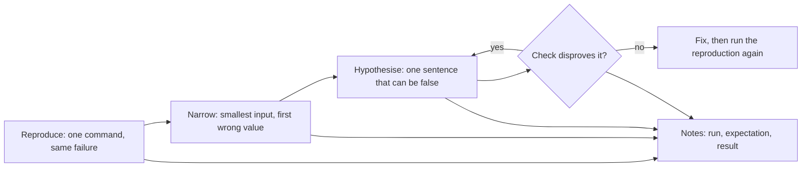

## Bạn cần biết trước

- [[foundation.l1.reading-code]] — bạn đã đi theo một luồng qua một repository lạ thay vì đọc hết cả repository. Bài này cũng thu hẹp như vậy, chỉ khác ở chỗ luồng được chọn theo bằng chứng chứ không theo điểm vào.

## Tình huống

Bạn nhận được một tin nhắn về Đơn Hàng: đơn hàng 1 hiện 900.000 đồng thay vì 2.150.000 đồng. Các dòng của đơn hàng 1 trong dữ liệu ban đầu của repository (`db/seed.sql`) cộng lại đúng 2.150.000. Bạn mở file, đọc hàm cộng tổng một đơn hàng, và phép tính trông vẫn đúng. Bạn đọc thêm hai lần nữa, nó vẫn trông đúng, nên bạn bắt đầu sửa dòng mình nghi nhất. Mười phút sau con số đã khác đi mà bạn không nói được vì sao. Khi đọc code không còn cho bạn biết thêm điều gì, bạn bắt đầu từ đâu?

## Khái niệm cốt lõi

- tái hiện — một lệnh bạn chạy lúc nào cũng được và lần nào cũng cho ra cùng một lỗi, để lần chạy sau cho bạn biết có thứ gì thật sự thay đổi hay không.
- thu hẹp — cắt đôi đầu vào chừng nào lỗi vẫn còn, tới khi bạn giữ trong tay đầu vào nhỏ nhất vẫn còn lỗi và giá trị sớm nhất khác với giá trị bạn mong đợi.
- giả thuyết — một câu nêu tên một nguyên nhân, viết sao cho chỉ một lần kiểm tra là có thể chứng minh nó sai.
- kiểm tra — thứ nhỏ nhất bạn chạy được, hoặc lần tay được với một đầu vào cố định, để quyết định một giả thuyết, kèm kết quả bạn đoán trước khi làm.
- ghi chép — bản ghi liên tục những gì bạn đã chạy, đã mong đợi và đã nhận được, theo đúng thứ tự bạn làm.

## Cơ chế hoạt động



Trong tình huống trên, bạn chỉ có câu nói của người khác, và không có gì để tự chạy mà thấy con số 900.000. Một bản tái hiện gồm một lệnh, một đầu vào cố định và một kết quả mong đợi. Thiếu nó, bạn không phân biệt được một bản sửa với một sự trùng hợp: lỗi lúc có lúc không thì có thể đơn giản là không xảy ra ở lần chạy ngay sau khi bạn sửa.

Khi lỗi đã hiện ra theo ý bạn, hãy thu hẹp nó: giữ nguyên lệnh, cắt đôi đầu vào, rồi xem lỗi còn hay không. Nếu lỗi còn, nửa bạn giữ lại đã đủ để gây lỗi, nên tiếp tục cắt đôi ở đó. Nếu lỗi biến mất, phần bạn bỏ đi có liên quan, nên đưa lại một nửa của phần đó rồi chạy lại. Bạn dừng ở đầu vào nhỏ nhất vẫn còn lỗi và giá trị sớm nhất khác với giá trị bạn mong đợi. Ở đây bạn chỉ thấy các giá trị được in ra, nên đó là con số in ra đầu tiên khác với con số mong đợi in cạnh nó, như sample ở phần sau làm. Theo dõi giá trị bên trong một lần chạy là chuyện của bài sau.

Sau đó hãy nêu một giả thuyết, tức một câu duy nhất có thể sai, chẳng hạn "vòng lặp không bao giờ xử lý dòng cuối cùng". Câu "có gì đó sai với tổng" không thể sai, nên nó không phải giả thuyết. Hãy thiết kế lần kiểm tra trước khi chạy: nói rõ bạn sẽ thấy gì nếu câu đó đúng và nếu nó sai. Một lần kiểm tra mà bạn không đoán trước được kết quả thì chẳng quyết định được gì về câu đang kiểm tra.

Nếu lần kiểm tra bác bỏ giả thuyết, hãy ghi kết quả lại rồi nêu giả thuyết tiếp theo. Một câu đã bị bác bỏ vẫn loại được một nguyên nhân có thể có, dù đầu vào bạn chạy vẫn giữ nguyên kích thước. Nếu giả thuyết đứng vững, hãy sửa code, rồi chạy lại bản tái hiện, giữ nguyên không đổi. Phần ghi chép lớn dần trong suốt quá trình. Đó là chất liệu cho một câu hỏi hay một bản báo cáo viết sau này.

## Trong hệ thống Đơn Hàng

Project console trong repository ví dụ, ở phiên bản đầu tiên (`stage-0`), mang sẵn lỗi này dưới dạng một sample, và sample có sẵn bản tái hiện của nó. Bạn chạy nó từ thư mục gốc của repository bằng `dotnet run --project samples/DonHang.Samples -- wrong-total`. `--project` chỉ ra project cần chạy, ở đây là thư mục chứa project, còn chữ sau `--` chọn sample. Sample gọi `TotalVnd`, hàm cộng tổng một đơn hàng (có ở bên dưới).

```csharp file=samples/DonHang.Samples/Samples/Debug/WrongTotal.cs tag=stage-0 lines=18-24
    public static void Run()
    {
        var orderOne = new (int Quantity, int UnitPriceVnd)[] { (1, 1_250_000), (2, 450_000) };

        Console.WriteLine($"expected 2150000, got {TotalVnd(orderOne)}");
        Console.WriteLine($"one line only: expected 1250000, got {TotalVnd(orderOne[..1])}");
    }
```

Cả hai dòng in ra đều đến từ bản tái hiện: một lệnh, hai đầu vào cố định, mỗi đầu vào có con số mong đợi in cạnh con số thực nhận. Đầu vào thứ hai chính là đầu vào thứ nhất đã được thu hẹp. Đầu vào thứ nhất là đơn hàng 1 đúng như trong dữ liệu ban đầu, một món giá 1.250.000 và hai món giá 450.000. Nó in `expected 2150000, got 1250000`, và con số 1250000 không khớp với con số 900.000 được báo, nên lần chạy này không tái hiện được báo cáo. 900.000 là con số mà riêng dòng 2 × 450.000 của đơn hàng cho ra, chẳng hạn khi các dòng của người báo lỗi đến theo thứ tự ngược lại. Hãy ghi khoảng chênh này vào phần ghi chép và xin dữ liệu của người báo lỗi. Lần chạy vẫn tái hiện được một lỗi, vì tổng của đơn hàng 1 sai ở mọi lần chạy, nên phần còn lại của mục này làm việc với lỗi đó.

Dòng in thứ hai là bước thu hẹp, đã làm sẵn cho bạn: cùng lời gọi đó với `orderOne[..1]`, tức riêng món đầu tiên của đơn hàng, và nó in `expected 1250000, got 0`.

Trong hai dòng in ra, số 0 dễ giải thích hơn. Với một dòng duy nhất 1 × 1.250.000, cách giải thích đơn giản nhất cho một tổng cứ đứng yên ở 0 là thân vòng lặp chưa từng chạy, còn 1.250.000 là một con số nghe hợp lý nhưng vẫn cần giải thích. Số 0 cho giả thuyết một chỗ để bám vào: vòng lặp không bao giờ chạy thân của nó khi đơn hàng chỉ có một dòng.

```csharp file=samples/DonHang.Samples/Samples/Debug/WrongTotal.cs tag=stage-0 lines=7-16
    public static int TotalVnd(IReadOnlyList<(int Quantity, int UnitPriceVnd)> lines)
    {
        var totalVnd = 0;
        for (var i = 0; i < lines.Count - 1; i++)
        {
            totalVnd += lines[i].Quantity * lines[i].UnitPriceVnd;
        }

        return totalVnd;
    }
```

Lần kiểm tra là lần tay điều kiện với `lines.Count` bằng 1, đoán trước kết quả: nếu giả thuyết đúng, hàm trả về 0. Nếu giả thuyết sai, thân vòng lặp chạy một lần và hàm trả về 1250000. Với `lines.Count` bằng 1, `lines.Count - 1` là 0, nên điều kiện là `i < 0`, sai ngay lần đầu được xét. Thân vòng lặp không bao giờ chạy, và `totalVnd` được trả về đúng bằng 0 như lúc khởi tạo. Giả thuyết đứng vững, và nó đoán đúng cả dòng còn lại: với hai món, điều kiện dừng sau khi `i` bằng 0, món thứ hai bị bỏ sót, và hàm trả về 1.250.000. Nếu các dòng của người báo lỗi theo thứ tự ngược lại, món bị bỏ sót là 1 × 1.250.000, và chỉ còn 2 × 450.000 = 900.000 được trả về. Đó là lý do đáng xin dữ liệu của họ. Giờ một câu duy nhất giải thích được cả hai quan sát, và đó là lúc sửa code không còn là đoán mò. Sửa điều kiện để vòng lặp đi qua mọi dòng, tức bỏ `- 1` để vòng lặp chạy chừng nào `i` còn nhỏ hơn `lines.Count`, thì cả hai dòng in ra sẽ có `got` bằng `expected`, và chạy lại bản tái hiện sẽ xác nhận điều đó.

## Người mới hay nghĩ rằng…

- **"Debug là đọc code cho tới khi thấy lỗi."** → Thực ra đọc cho bạn biết code nói gì, còn lỗi trong đoạn code bạn đang đọc lại thường nằm ở khoảng cách giữa điều code nói và điều bạn tưởng nó nói. Đọc lại vẫn dùng đúng giả định đã che khoảng cách đó. Bạn sẽ nhận ra khi đọc kỹ lần thứ ba một hàm mười dòng mà không có thêm gì so với lần đầu.
- **"Mình sửa một chỗ mà chạy được là lỗi đã hết."** → Thực ra "chạy được" sau một thay đổi không đoán trước chỉ có nghĩa là lần chạy này đã qua. Không có bản tái hiện nào lỗi đều đặn từ trước, bạn không phân biệt được một bản sửa với một lần chạy vốn đã qua dù có sửa hay không. Bạn sẽ nhận ra khi một tuần sau đúng báo cáo đó quay lại, trên đoạn code bạn chắc chắn đã sửa rồi.

## Thử ngay (3 phút)

1. Từ thư mục gốc của repository ví dụ ở `stage-0`, chạy `dotnet run --project samples/DonHang.Samples -- wrong-total` rồi ghi dòng in đầu tiên lại thành ghi chép, `ran: wrong-total`, `expected: 2150000`, `got: 1250000`, sau đó làm tương tự với dòng thứ hai.
2. Đoán xem `TotalVnd` trả về bao nhiêu cho một đơn hàng ba món, 1 × 1.250.000, 2 × 450.000 và 1 × 320.000, bằng cách đọc điều kiện của vòng lặp với `lines.Count` bằng 3. Ghi dự đoán lại trước khi mở gợi ý đáp án bên dưới.

Kết quả mong đợi: lần chạy in `expected 2150000, got 1250000` và `one line only: expected 1250000, got 0`.

<details><summary>Gợi ý đáp án</summary>

2.150.000, trong khi tổng đúng là 2.470.000. Với ba món, `lines.Count - 1` là 2, nên `i` nhận 0 rồi 1 rồi dừng. Hai món đầu được cộng, còn món thứ ba, 320.000, bị bỏ sót. Câu giả thuyết cũ vẫn đúng: vòng lặp dừng sớm một món.

</details>

## Liên hệ

- [[foundation.l1.reading-code]] — kiến thức cần có trước, giờ dùng hẹp hơn: ở đó bạn đi theo một luồng để hiểu một repository, ở đây bạn đi theo nó tới một giá trị sai.
- [[foundation.l2.reading-stack-traces]] — bài tiếp theo xét trường hợp lần chạy kết thúc bằng một lỗi thay vì một con số sai, và thông báo lỗi chỉ ra chỗ cần thu hẹp trước.
- [[foundation.l2.debugger-and-logging]] — các công cụ để theo dõi một lần kiểm tra diễn ra. Chúng chỉ có ích khi bạn đã có bản tái hiện để chĩa chúng vào.
- [[foundation.l2.git-bisect]] — cùng cách cắt đôi nhưng áp lên lịch sử thay vì lên đầu vào: nó tìm ra thay đổi đã làm hỏng code, không phải dòng code.
- [[foundation.l2.asking-good-questions]] — nơi phần ghi chép được dùng tới khi bạn đã hết giả thuyết.

## Tóm tắt 5 dòng

1. Debug là một vòng lặp tái hiện, thu hẹp, nêu giả thuyết, kiểm tra, không phải đọc cho tới khi lỗi tự lộ ra.
2. Một lỗi bạn không làm nó xuất hiện được theo ý mình thì không thể sửa mà chắc chắn, vì không lần chạy nào sau đó cho bạn biết đã sửa được hay chưa.
3. Thu hẹp bằng cách cắt đôi tới khi bạn giữ đầu vào nhỏ nhất vẫn còn lỗi và giá trị sớm nhất bị sai.
4. Giả thuyết là một câu mà chỉ một lần kiểm tra có thể chứng minh sai, và bạn đoán trước kết quả kiểm tra trước khi chạy.
5. Ghi lại mọi lần chạy, điều mong đợi và kết quả, theo đúng thứ tự bạn làm.
