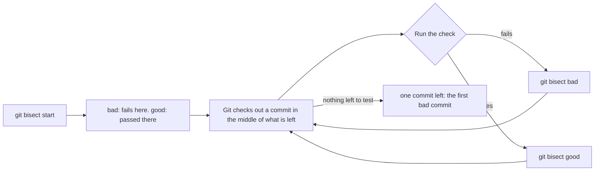

> Skip this if: you already find a breaking change by halving history with a command that answers pass or fail, and you know why that command has to answer the same way twice.

## Before you start

- [[foundation.l2.debugging-method]] — narrowing by halving, and the reproduction the halving needs. This lesson keeps the method and changes what is halved: the history instead of the input.
- [[foundation.l2.git-history-and-recovery]] — reading a commit and undoing one. Here Git does the searching and hands you a single commit; what you do with it is that lesson's work.

## The situation

You are on a playground repository (one project's commits and files, kept together) with six commits on `main`, a script `./total.sh` that adds up a price list, and a check `./test.sh` that compares it against a plain sum. Today it fails: `expected 1700000, got 1000000`. You check out (put your files back at) the commit four back and the same check prints `ok`. So one of the four commits in between turned the first answer into the second, and two of them touch `total.sh`. Here that is four diffs (the lines each commit changed); on a month of a busy repository it is four hundred. Which commit broke it, and how do you find it without reading them all?

## Core concepts

- check — one command you can run at any commit that answers pass or fail, the same way every time; here `./test.sh`, which prints `ok` and exits 0 when the total is right and exits 1 when it is not (the exit code is the number a command leaves behind when it ends, 0 for success).
- bad commit — a commit where the check fails; the newest one you know of is one end of the search.
- good commit — a commit where the check passes; the other end. Only what lies between the two ends is ever searched, so a good end that in fact already fails puts the breaking commit outside the range; prefer one older than you suspect, since a distant end only costs a step or two.
- bisect — asking Git to check out a commit near the middle of the two ends, over and over, so that the stretch you have not decided about halves after each answer.
- first bad commit — the oldest commit where the check fails; every commit before it passes, and it is what the search ends with.

## How it works



In the situation above the two ends are already in your hands: the commit where `./test.sh` fails, and the commit four back where it prints `ok`. `git bisect start` opens a session, `git bisect bad` marks the commit you are standing on as failing, and `git bisect good <commit>` names one that passed.

Once both ends are known, Git checks out a commit near the middle and waits. You run the check there and answer with `git bisect bad` or `git bisect good`, and the answer throws away one half of what is left: bad means the first bad commit is that one or an earlier one, good means it is a later one. The search only works if the check passes up to one commit and fails from then on — an assumption you supply, not one Git can check. This repeats on the half that survived until one commit is left, which Git names as the first bad commit and prints with its message and the files it changed. `git bisect reset` closes the session and puts you back where you started.

The number of steps is the number of halvings — about log₂ of the commits between the ends. Four commits are settled in two runs, a thousand in about ten. Each step costs one run of the check, so a check that takes minutes makes the search take minutes — and, more importantly, the check has to answer the same way twice at the same commit. A check that can answer differently there can flip one answer; the search then throws away the half that holds the real cause and ends on some other commit. Nothing in Git catches this, so the answer is only as trustworthy as the check — reproduce first, bisect second.

## In the Đơn Hàng system

The example here is not the order system itself but that playground, small enough to watch a whole search. `scripts/git/bisect-demo.sh` establishes the two ends and hands them over:

```bash file=scripts/git/bisect-demo.sh tag=stage-0 lines=10-23
echo "the check fails at the newest commit:"
./test.sh || echo "  (exit code 1)"

echo
echo "and passes four commits earlier:"
git switch --quiet --detach HEAD~4
./test.sh
git switch --quiet -

echo
echo "so ask Git to find the first bad one:"
git bisect start >/dev/null
git bisect bad >/dev/null
git bisect good HEAD~4 >/dev/null
```

```text output=true
the check fails at the newest commit:
expected 1700000, got 1000000
  (exit code 1)

and passes four commits earlier:
ok

so ask Git to find the first bad one:
...
b3472f64d738ebe52e4441e8d15ca273d88d439a is the first bad commit
...
    Round the total down to millions

 total.sh | 2 +-
 1 file changed, 1 insertion(+), 1 deletion(-)
...
```

Each `...` marks lines cut from this listing, not something the script prints. `--quiet` and `>/dev/null` only keep the listing short, and `a || b` runs `b` only if `a` failed; none of the three belongs to bisect, which by hand is just `git bisect start`, `git bisect bad`, `git bisect good HEAD~4`.

The first half is the evidence, produced before any searching: `HEAD` is the commit you are standing on, so `HEAD~4` is the commit four steps back from it; `git switch --detach` stands on that commit without a branch, and `git switch -` returns to the branch left a moment ago. Git 2.46's own manual labels `git switch` experimental, and `git checkout` makes the same two moves.

The listing stops two commands before the end of the script. Those two commands drive the session to its end and close it, and they print everything below `so ask Git to find the first bad one:`. By hand you do that yourself: run `./test.sh` at each commit Git stops on, answer `git bisect bad` or `git bisect good`, repeat, and finish with `git bisect reset`. The `...` before the result hides exactly that loop running twice: the check failed at the commit Git had already stopped on, and printed `ok` at the next one.

The last lines are the payoff. Git names `b3472f6` and prints it: the message `Round the total down to millions`, then ` total.sh | 2 +-` and `1 file changed, 1 insertion(+), 1 deletion(-)` — one file, and in it one line removed plus one line added, here the same line rewritten, since the commit changes only the line that prints the total. That is the explanation, not a hint towards one — the commit made `total.sh` round its answer down to whole millions, which is why 1700000 comes out as 1000000 while the plain sum does not. The precision is a gift from the commit, not from bisect. Had the same work gone in as one commit called `tidy up totals`, the search would have finished no slower and pointed at a commit that changed everything.

## Beginners often think…

- **"I need to know roughly where the bug is before bisect helps."** → Actually the search asks for two commits and a command, not a suspicion: one commit where the check fails, one where it passes, and a check that answers the same way twice. The less you know, the more it saves, because the work is the same log₂ either way. You notice this when the commit Git hands back sits in a file you had no reason to open.
- **"Bisect is only for huge projects."** → Actually the cost follows the number of commits between your two ends, not the size of the repository or the team; the playground's range is four commits and Git settles it in two runs of the check. You notice this when a week of your own work, a few dozen commits, is decided in five or six runs while you are still scrolling the list of messages.

## Try it (3 minutes)

1. From the top folder of the example repository, run `scripts/up.sh` (it prepares the example system), then run `scripts/git/bisect-demo.sh`. `bisect-demo.sh` rebuilds the playground first, so the ids come out the same on your machine.
2. Read the first two answers — the failing one and the passing one — then find the line ending `is the first bad commit` and compare the message printed under it with the one-line change in the summary beneath that.
3. Find the two lines the check printed during the search, where the listing above showed only `...` (one reading `expected 1700000, got 1000000`, one reading `ok`), and say for each which of `git bisect good` or `git bisect bad` you would have typed there.

Expected result: the check prints `expected 1700000, got 1000000` at the newest commit and `ok` four commits earlier. The commit named is `b3472f6…`, `Round the total down to millions`, with `total.sh` the only file touched and one line replaced. During the search the check runs twice: it fails once, where your answer is `git bisect bad`, and prints `ok` once, where it is `git bisect good`.

## Connections

- [[foundation.l2.debugging-method]] — the same halving one step out: there you halve the input to find the wrong value, here you halve the history to find the change that made it wrong.
- [[foundation.l2.git-history-and-recovery]] — what happens after the search: you read the commit it named, and undo it there in the way that suits a history other people already have.
- [[foundation.l2.good-commits]] — the reason an answer is useful or useless; a commit holding one change explains itself, a commit holding a week of work explains nothing.

## Five-line summary

1. When a check passes at one commit and fails at another, `git bisect` finds the first bad commit by halving the range between them.
2. You give it two ends and a check; it checks out midpoints and you answer good or bad until one commit is left.
3. The cost is about log₂ of the commits between the ends, so a thousand commits are decided in about ten runs of the check.
4. A check that answers differently at the same commit can send the search into the wrong half, so reproduce first and bisect second.
5. Small commits make the answer a change you can read; one commit holding everything makes the answer useless.
