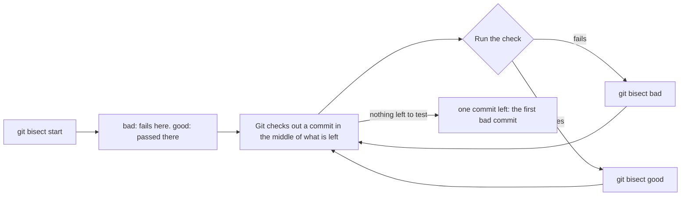

> Bỏ qua được nếu: bạn đã biết tìm thay đổi gây lỗi bằng cách chia đôi lịch sử với một lệnh trả lời đạt hay không đạt, và biết vì sao lệnh đó phải trả lời giống nhau ở hai lần chạy.

## Bạn cần biết trước

- [[foundation.l2.debugging-method]] — khoanh vùng bằng chia đôi, và cách tái hiện lỗi mà phép chia đôi cần. Bài này giữ nguyên phương pháp, chỉ đổi thứ được chia đôi: lịch sử thay vì dữ liệu đầu vào.
- [[foundation.l2.git-history-and-recovery]] — đọc một commit và hoàn tác nó. Ở đây Git làm phần tìm kiếm và trao cho bạn đúng một commit. Làm gì với commit đó là việc của bài kia.

## Tình huống

Bạn đang ở một repository thử nghiệm (các commit và file của một project, giữ chung một chỗ) có sáu commit trên `main`, một script `./total.sh` cộng một bảng giá, và một phép kiểm tra `./test.sh` so kết quả đó với một phép cộng thường. Hôm nay nó fail: `expected 1700000, got 1000000`. Bạn checkout (đưa các file về trạng thái của) commit lùi bốn bước và cùng phép kiểm tra ấy in `ok`. Vậy một trong bốn commit ở giữa đã biến kết quả thứ nhất thành kết quả thứ hai, và hai trong số đó có sửa `total.sh`. Ở đây là bốn diff (các dòng mỗi commit đã đổi). Với một tháng làm việc của một repository bận rộn, con số đó là bốn trăm. Commit nào làm hỏng, và làm sao tìm ra mà không phải đọc hết?

## Khái niệm cốt lõi

- phép kiểm tra — một lệnh bạn chạy được ở bất kỳ commit nào, trả lời đạt hay không đạt, lần nào cũng như nhau. Ở đây là `./test.sh`, in `ok` và thoát với 0 khi tổng đúng, thoát với 1 khi sai (exit code là con số một lệnh để lại khi kết thúc, 0 nghĩa là thành công).
- commit xấu — commit mà phép kiểm tra fail. Commit mới nhất bạn biết thuộc loại này là một đầu của cuộc tìm kiếm.
- commit tốt — commit mà phép kiểm tra đạt, và là đầu còn lại. Chỉ phần nằm giữa hai đầu mới được tìm, nên nếu đầu "tốt" thật ra đã fail thì commit gây lỗi nằm ngoài khoảng tìm. Hãy chọn một commit cũ hơn mức bạn nghi ngờ: mỗi lần khoảng tìm dài gấp đôi chỉ thêm đúng một bước, nên một đầu lùi xa gấp vài lần chỉ tốn thêm một hai bước, còn một đầu thật ra đã fail thì đẩy commit gây lỗi ra ngoài cuộc tìm kiếm.
- bisect — nhờ Git checkout một commit gần giữa hai đầu, lặp đi lặp lại, để đoạn bạn chưa phân định được co lại một nửa sau mỗi câu trả lời.
- commit xấu đầu tiên — commit cũ nhất mà phép kiểm tra fail. Mọi commit trước nó đều đạt, và cuộc tìm kiếm kết thúc bằng chính nó.

## Cơ chế hoạt động



Trong tình huống trên, bạn đã có sẵn hai đầu: commit mà `./test.sh` fail, và commit lùi bốn bước nơi nó in `ok`. `git bisect start` mở một phiên, `git bisect bad` đánh dấu commit bạn đang đứng là fail, còn `git bisect good <commit>` chỉ ra một commit đã đạt.

Khi đã biết cả hai đầu, Git checkout một commit gần giữa và chờ. Bạn chạy phép kiểm tra ở đó rồi trả lời bằng `git bisect bad` hoặc `git bisect good`, và câu trả lời loại bỏ một nửa phần còn lại: bad nghĩa là commit xấu đầu tiên là commit này hoặc một commit sớm hơn, good nghĩa là nó nằm ở phía sau. Cuộc tìm kiếm chỉ đúng nếu phép kiểm tra đạt cho tới một commit nào đó và fail kể từ đó trở đi — đây là giả định bạn đưa vào, Git không kiểm tra được. Quá trình lặp lại trên nửa còn sống sót cho tới khi chỉ còn một commit. Git gọi tên nó là commit xấu đầu tiên và in ra kèm thông điệp cùng các file nó đã sửa. `git bisect reset` đóng phiên và đưa bạn về chỗ ban đầu.

Số bước bằng số lần chia đôi — khoảng log₂ của số commit giữa hai đầu. Bốn commit xong trong hai lần chạy, một nghìn commit trong khoảng mười lần. Mỗi bước tốn một lần chạy phép kiểm tra, nên phép kiểm tra mất vài phút thì cuộc tìm kiếm cũng mất vài phút. Quan trọng hơn, phép kiểm tra phải trả lời giống nhau ở hai lần chạy trên cùng một commit. Nếu nó có thể trả lời khác đi, một câu trả lời có thể bị lật. Khi đó cuộc tìm kiếm vứt bỏ đúng nửa chứa nguyên nhân thật và dừng ở một commit khác. Git không phát hiện được chuyện này, nên câu trả lời chỉ đáng tin bằng phép kiểm tra — tái hiện trước, bisect sau.

## Trong hệ thống Đơn Hàng

Ví dụ ở đây không phải chính hệ thống đặt hàng mà là repository thử nghiệm kia, đủ nhỏ để bạn theo dõi trọn một cuộc tìm kiếm. `scripts/git/bisect-demo.sh` xác lập hai đầu rồi giao chúng cho Git:

```bash file=scripts/git/bisect-demo.sh tag=stage-0 lines=10-23
echo "the check fails at the newest commit:"
./test.sh || echo "  (exit code 1)"

echo
echo "and passes four commits earlier:"
git switch --quiet --detach HEAD~4
./test.sh
git switch --quiet -

echo
echo "so ask Git to find the first bad one:"
git bisect start >/dev/null
git bisect bad >/dev/null
git bisect good HEAD~4 >/dev/null
```

```text output=true
the check fails at the newest commit:
expected 1700000, got 1000000
  (exit code 1)

and passes four commits earlier:
ok

so ask Git to find the first bad one:
...
b3472f64d738ebe52e4441e8d15ca273d88d439a is the first bad commit
...
    Round the total down to millions

 total.sh | 2 +-
 1 file changed, 1 insertion(+), 1 deletion(-)
...
```

Mỗi `...` đánh dấu các dòng bị cắt khỏi đoạn trích này, không phải thứ script in ra. `--quiet` và `>/dev/null` chỉ để đoạn trích ngắn lại, còn `a || b` chỉ chạy `b` khi `a` fail. Cả ba thứ đó không thuộc về bisect. Làm bằng tay, bisect chỉ là `git bisect start`, `git bisect bad`, `git bisect good HEAD~4`.

Nửa đầu là bằng chứng, có trước khi tìm kiếm bất cứ gì: `HEAD` là commit bạn đang đứng, nên `HEAD~4` là commit lùi bốn bước từ đó. `git switch --detach` đứng lên commit ấy mà không cần branch, và `git switch -` quay về branch vừa rời đi. `git checkout` làm được đúng hai thao tác này (`git checkout --detach HEAD~4`, `git checkout -`).

Đoạn trích dừng lại hai lệnh trước cuối script. Hai lệnh đó đưa phiên đi tới cuối rồi đóng lại, và chúng in ra mọi thứ bên dưới `so ask Git to find the first bad one:`. Làm bằng tay thì bạn tự làm phần này: chạy `./test.sh` ở mỗi commit Git dừng lại, trả lời `git bisect bad` hoặc `git bisect good`, lặp lại, và kết thúc bằng `git bisect reset`. Dấu `...` trước kết quả giấu đúng vòng lặp đó chạy hai lần: phép kiểm tra fail ở commit Git đã dừng sẵn, và in `ok` ở commit tiếp theo Git dừng lại, một commit cũ hơn.

Những dòng cuối là phần thưởng. Git gọi tên `b3472f6` và in nó ra: thông điệp `Round the total down to millions`, rồi ` total.sh | 2 +-` và `1 file changed, 1 insertion(+), 1 deletion(-)` — một file, trong đó bỏ một dòng và thêm một dòng, ở đây là cùng một dòng được viết lại, vì commit chỉ đổi dòng in ra tổng. Đó chính là lời giải thích, không phải gợi ý dẫn tới lời giải thích — commit đã khiến `total.sh` làm tròn xuống tới hàng triệu, nên 1700000 thành 1000000 còn phép cộng thường thì không. Độ chính xác này là món quà của commit, không phải của bisect. Nếu cùng khối lượng công việc đó được đưa vào thành một commit tên `tidy up totals`, cuộc tìm kiếm vẫn xong nhanh như vậy nhưng sẽ chỉ vào một commit thay đổi mọi thứ.

## Người mới hay nghĩ rằng…

- **"Phải biết đại khái lỗi nằm đâu thì bisect mới giúp được."** → Thực ra cuộc tìm kiếm cần hai commit và một lệnh, không cần một phỏng đoán: một commit mà phép kiểm tra fail, một commit mà nó đạt, và một phép kiểm tra trả lời giống nhau ở hai lần chạy. Bạn càng biết ít, nó càng tiết kiệm cho bạn, vì khối lượng công việc vẫn là log₂ như nhau. Bạn sẽ nhận ra khi commit Git trả về nằm trong một file mà bạn chẳng có lý do gì để mở.
- **"Bisect chỉ dành cho project khổng lồ."** → Thực ra chi phí phụ thuộc vào số commit giữa hai đầu, không phụ thuộc kích thước repository hay đội ngũ. Khoảng tìm của repository thử nghiệm là bốn commit và Git xong trong hai lần chạy phép kiểm tra. Bạn sẽ nhận ra khi một tuần làm việc của chính bạn, vài chục commit, được phân định trong năm sáu lần chạy, trong lúc bạn vẫn còn đang cuộn danh sách thông điệp commit.

## Thử ngay (3 phút)

1. Từ thư mục gốc của repo ví dụ, chạy `scripts/up.sh` (script này chuẩn bị hệ thống ví dụ), rồi chạy `scripts/git/bisect-demo.sh`. `bisect-demo.sh` dựng lại repository thử nghiệm trước, nên các id trên máy bạn ra giống hệt.
2. Đọc hai câu trả lời đầu — câu fail và câu đạt — rồi tìm dòng kết thúc bằng `is the first bad commit` và so thông điệp in bên dưới với thay đổi một dòng trong phần tóm tắt ngay sau đó.
3. Tìm hai dòng mà phép kiểm tra in ra trong lúc tìm kiếm, chỗ đoạn trích ở trên chỉ ghi `...` (một dòng là `expected 1700000, got 1000000`, một dòng là `ok`), và nói với mỗi dòng bạn sẽ gõ `git bisect good` hay `git bisect bad` ở đó.

Kết quả mong đợi: phép kiểm tra in `expected 1700000, got 1000000` ở commit mới nhất và `ok` ở commit lùi bốn bước. Commit được gọi tên là `b3472f6…`, `Round the total down to millions`, với `total.sh` là file duy nhất bị sửa và một dòng bị thay. Trong lúc tìm kiếm, phép kiểm tra chạy hai lần: fail một lần, chỗ đó bạn trả lời `git bisect bad`, và in `ok` một lần, chỗ đó bạn trả lời `git bisect good`.

## Liên hệ

- [[foundation.l2.debugging-method]] — cũng phép chia đôi ấy, lùi ra một bước: ở đó bạn chia đôi dữ liệu đầu vào để tìm giá trị sai, ở đây bạn chia đôi lịch sử để tìm thay đổi đã làm nó sai.
- [[foundation.l2.git-history-and-recovery]] — những gì diễn ra sau cuộc tìm kiếm: bạn đọc commit được gọi tên, và hoàn tác nó theo cách hợp với một lịch sử mà người khác đã có.
- [[foundation.l2.good-commits]] — lý do một câu trả lời hữu ích hay vô dụng: commit chứa một thay đổi tự giải thích được, commit chứa cả tuần làm việc thì chẳng giải thích gì.

## Tóm tắt 5 dòng

1. Khi một phép kiểm tra đạt ở một commit và fail ở commit khác, `git bisect` tìm commit xấu đầu tiên bằng cách chia đôi khoảng giữa chúng.
2. Bạn đưa cho nó hai đầu và một phép kiểm tra. Nó checkout các điểm giữa, còn bạn trả lời good hoặc bad cho tới khi chỉ còn một commit.
3. Chi phí khoảng log₂ của số commit giữa hai đầu, nên một nghìn commit được phân định trong khoảng mười lần chạy phép kiểm tra.
4. Phép kiểm tra trả lời khác nhau trên cùng một commit có thể đẩy cuộc tìm kiếm vào nhầm nửa, nên hãy tái hiện trước, bisect sau.
5. Commit nhỏ khiến câu trả lời là một thay đổi bạn đọc hiểu được. Một commit chứa tất cả khiến câu trả lời vô dụng.
