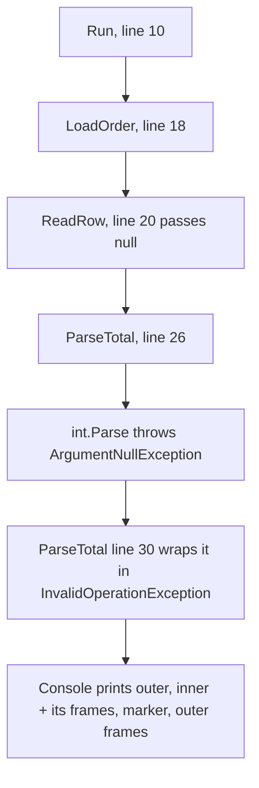

## Before you start

- [[foundation.l2.debugging-method]] — you narrow by halving until the earliest wrong value is in front of you. When a run ends in an error, the program has already done part of that narrowing and printed the result.

## The situation

"Order 999 does not open — it just errors." You run the sample that reproduces it; the console answers with nine lines. The first names a type and a sentence; the second, behind an arrow, names another of each. Six begin with `at`; one more line between them is neither message nor `at` line but a marker. Five name a method, a file and a line number; the first names only a method you did not write. None of the nine shows a value belonging to the order, not the total nor anything you could check, and you copy the top line into a search box out of habit. Which of these lines tells you where to look?

## Core concepts

- exception — the object a method throws when it cannot do what it was called to do; it carries a type, a message, and the calls that were open at the time.
- **stack trace** — the list of calls that were still unfinished when the exception was thrown, printed one per line, innermost call first.
- frame — one line of a stack trace: the method that was running, its parameters' types and names, and, for code built together with your own project as it is here, the file and the line it was on.
- inner exception — the earlier exception a later one wraps, so the original cause travels together with the higher-level description of what was being attempted.
- your first frame — the topmost frame naming a file of your own project, where the trace stops describing library code (what came with .NET, which you did not write) and starts describing yours.

All five come back in the printed trace below.

## How it works



In the sample under In the Đơn Hàng system, the calls ran downward: `Run` called `LoadOrder`, which called `ReadRow`, which called `ParseTotal`, which called `int.Parse`. In the diagram the first four arrows are calls; the last two are what happened next — `int.Parse` throws an `ArgumentNullException`, `ParseTotal` wraps it in an `InvalidOperationException`, and the console prints both. Each number in a box is the line that method was on when it made the call below it.

A stack trace is a photograph of that stack at the moment of the throw, innermost call first. The top line is therefore the deepest call — the point of detection, usually inside a library. The bottom line is the outermost call the trace still records: here the method that caught the exception, not necessarily where the program started. The trace an exception carries covers only the calls between the throw and the method that catches it, so a call that was already running when that method was entered is never printed, unfinished or not. The first line naming a file of your own project is usually where the failure was caused, the last point at which your code chose what to pass.

The trace answers where; the type and the message answer what, so read both in full before searching anything. The type is the most precise name .NET has for this failure; the message was written by whoever wrote the check that fired.

`ParseTotal` does one more thing: it catches the low-level failure and throws a new one naming the intent — `order 999 has no total` — with the original attached as the inner exception. Without the inner exception you would have the intent and no cause; without the outer one, no idea which order was affected.

## In the Đơn Hàng system

The sample that reproduces this lives in the example repository at its first version (`stage-0`), in `samples/DonHang.Samples/Samples/Debug/ThrowsDeep.cs`. It has four methods: `Run` starts the call and catches the failure so the console can print it, `ParseTotal` does the parsing, and the two between them exist only to make the stack deeper. `Run` is above the block below, which starts at line 18; the call it makes, `LoadOrder(999);`, is on line 10 — the line `Run` was waiting on when the exception was thrown.

```csharp file=samples/DonHang.Samples/Samples/Debug/ThrowsDeep.cs tag=stage-0 lines=18-32
    private static void LoadOrder(int orderId) => ReadRow(orderId);

    private static void ReadRow(int orderId) => ParseTotal(orderId, null);

    private static void ParseTotal(int orderId, string? rawTotal)
    {
        try
        {
            _ = int.Parse(rawTotal!);
        }
        catch (ArgumentNullException cause)
        {
            throw new InvalidOperationException($"order {orderId} has no total", cause);
        }
    }
```

`ReadRow` is where `null` enters, on line 20, as the second argument to `ParseTotal`. Line 26 is the call that fails: `int.Parse` is handed that `null` and throws. The `!` after `rawTotal` only stops the compiler warning about it; at run time the value is still `null`. Line 30 is the wrap — `ParseTotal` catches the failure and throws a description of what it was attempting, keeping `cause` attached to it.

A script runs the sample, and the repository keeps its output:

```bash file=scripts/debug/run-throws-deep.sh tag=stage-0 lines=1-6
#!/usr/bin/env bash
# Run the sample that throws from three calls deep and print the stack trace.
set -euo pipefail
cd "$(dirname "$0")/../.."

dotnet run --project samples/DonHang.Samples --verbosity quiet -- throws-deep
```

```text output=true
System.InvalidOperationException: order 999 has no total
 ---> System.ArgumentNullException: Value cannot be null. (Parameter 's')
   at System.Int32.Parse(String s)
   at DonHang.Samples.Debug.ThrowsDeep.ParseTotal(Int32 orderId, String rawTotal) in ...ThrowsDeep.cs:line 26
   --- End of inner exception stack trace ---
   at DonHang.Samples.Debug.ThrowsDeep.ParseTotal(Int32 orderId, String rawTotal) in ...ThrowsDeep.cs:line 30
   at DonHang.Samples.Debug.ThrowsDeep.ReadRow(Int32 orderId) in ...ThrowsDeep.cs:line 20
   at DonHang.Samples.Debug.ThrowsDeep.LoadOrder(Int32 orderId) in ...ThrowsDeep.cs:line 18
   at DonHang.Samples.Debug.ThrowsDeep.Run() in ...ThrowsDeep.cs:line 10
```

Read it in the order it is printed. Frames print .NET's own name for each type: `Int32` where the code says `int`, `String` where it says `string?`, so `System.Int32.Parse` is the `int.Parse` of line 26. Line 1 is the outer failure — type, then message — and the message names the order. Line 2, behind the arrow, is the inner one in the same shape, where `(Parameter 's')` is the parameter name of `int.Parse` itself, not of anything you wrote. Lines 3 and 4 are the inner exception's own frames, closed by the `--- End of inner exception stack trace ---` marker; the four below that marker belong to the outer exception, from `ParseTotal` at the deepest end down to `Run`, the method that caught the exception and printed it.

The `...` in each path stands for the rest of that file's location on the machine that built it, removed when the repository saves an output so that two machines produce the same text. Run the script yourself to see the full path.

Now apply the rule. The topmost frame is `System.Int32.Parse(String s)`: library code behaving as it is specified to behave when handed `null`, and the only frame here with no file and no line. The topmost frame naming a file of the project is `ParseTotal` at line 26, and that is the line to open.

Two things the frame alone will not settle. Line 26 holds one call with one argument, so the value is obvious; with three values on it the frame would still name only the line. And the outer trace's own first frame is line 30 — the throw, which is correct reporting code — so a trace read without its inner half sends you to the wrong line.

## Beginners often think…

- **"The top line of the stack trace is where the bug is."** → Actually the top frame is where the failure was detected, which is usually inside code you cannot change; here it is `System.Int32.Parse`, which did exactly what it is supposed to do when handed `null`. You notice this when a search on that frame returns pages about a method thousands of programs use correctly, none of them resembling your problem.
- **"The error message is generic noise; the real information is somewhere else."** → Actually the type and the message are the narrowest description of the failure anyone will hand you: `Value cannot be null. (Parameter 's')` names which argument was empty, and `order 999 has no total` names the order it happened to. You notice this when someone answers your question in one line, by reading the message you pasted and did not read.

## Try it (3 minutes)

1. From the top folder of the example repository, run `scripts/debug/run-throws-deep.sh` (you need bash and the `dotnet` command; the first run is slow while the project is built) and copy the printed block into your notes.
2. Reading from the top down, find the first line beginning with `at` that names a file of the project, and write its line number down. Open `samples/DonHang.Samples/Samples/Debug/ThrowsDeep.cs` at that line, then say which value on it was `null` and which line put it there.

Expected result: the top frame is `at System.Int32.Parse(String s)`, and the first frame naming a file of the project is `ParseTotal`, at line 26.

<details><summary>Suggested answer</summary>

Line 26 is `_ = int.Parse(rawTotal!);`, so the empty value is `rawTotal`. The trace never said so: `(Parameter 's')` is the parameter name inside `int.Parse`, not the name of your variable, and the frame named the line rather than the value. `rawTotal` arrived from `ParseTotal`'s caller, whose frame is the `ReadRow` line further down — line 20 — which passes `null` as the second argument.

</details>

## Connections

- [[foundation.l2.debugging-method]] — the prerequisite with one step already done: a trace is the narrowing the program performed as it failed, so you start from the earliest wrong point.
- [[foundation.l1.memory-stack-heap]] — a stack trace is a printed picture of the stack described there; one unfinished call, one line.
- [[foundation.l2.debugger-and-logging]] — the next lesson, for what the trace leaves out: it names a line, not a value, so you go and watch the value.
- [[foundation.l2.asking-good-questions]] — the trace, pasted whole rather than summarised, is most of what a good question already contains.

## Five-line summary

1. A stack trace lists the calls that were unfinished when the error was thrown, innermost first; your own first frame is where to look.
2. The exception type and message are the most precise description of the failure you will get; read both before searching.
3. The top frame is where the failure was detected, usually inside library code that is doing exactly its job.
4. An inner exception carries the original cause under a wrapper saying what the program was trying to do.
5. A frame names a statement, not which value on it was wrong; you still open that line and read it.
