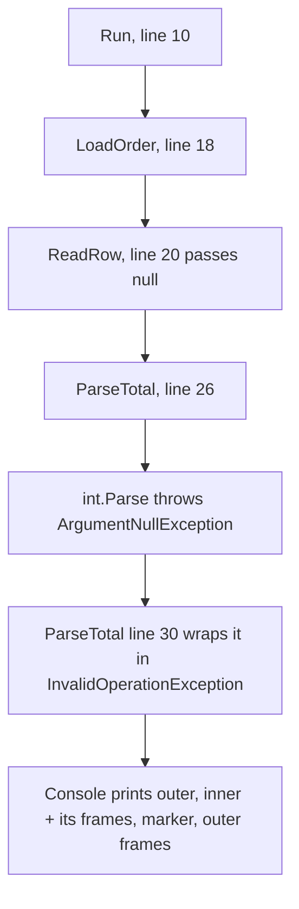

## Bạn cần biết trước

- [[foundation.l2.debugging-method]] — bạn khoanh vùng bằng chia đôi cho tới khi giá trị sai sớm nhất hiện ra trước mắt. Khi một lần chạy kết thúc bằng lỗi, chương trình đã tự làm một phần phép khoanh vùng đó và in kết quả ra.

## Tình huống

"Đơn 999 không mở được, cứ báo lỗi." Bạn chạy sample tái hiện lỗi đó, và console trả lời bằng chín dòng (in đầy đủ ở dưới). Dòng đầu nêu tên một kiểu và một câu. Dòng thứ hai, sau một mũi tên, cũng nêu một kiểu và một câu khác. Sáu dòng bắt đầu bằng `at`. Xen giữa chúng còn một dòng nữa, không phải thông báo cũng không phải dòng `at`, mà là một dòng đánh dấu. Năm dòng nêu tên một method, một file và một số dòng. Dòng đầu tiên trong sáu dòng đó chỉ nêu tên một method mà bạn không viết. Theo thói quen, bạn chép dòng đầu tiên bắt đầu bằng `at` vào ô tìm kiếm. Trong những dòng này, dòng nào cho bạn biết cần nhìn vào đâu?

## Khái niệm cốt lõi

- exception — đối tượng mà một method ném ra khi nó không làm được việc nó được gọi để làm. Exception mang theo một kiểu, một thông báo, và các lời gọi đang mở lúc đó.
- **stack trace** (danh sách lời gọi hàm đang dở khi lỗi xảy ra, đọc từ trên xuống là từ nơi lỗi ra ngoài) — danh sách các lời gọi còn dở giữa method đã ném exception và method đã bắt nó, in mỗi lời gọi một dòng, lời gọi sâu nhất ở trên cùng.
- frame — một dòng của stack trace: method đang chạy, kiểu và tên các tham số của nó, và, với file thuộc project của bạn ở đây, file và dòng mà nó đang đứng.
- inner exception — exception trước đó được một exception sau bọc lại, để nguyên nhân gốc đi cùng với mô tả ở mức cao hơn về điều chương trình đang cố làm.
- frame đầu tiên của bạn — frame trên cùng nêu tên một file trong project của bạn, nơi stack trace thôi mô tả code thư viện (thứ đi kèm .NET, bạn không viết) và bắt đầu mô tả code của bạn.

Cả năm thứ này đều xuất hiện lại trong stack trace được in ở dưới.

## Cơ chế hoạt động



Các lời gọi chạy từ trên xuống: `Run` gọi `LoadOrder`, `LoadOrder` gọi `ReadRow`, `ReadRow` gọi `ParseTotal`, và `ParseTotal` gọi `int.Parse`. Hai mũi tên cuối là chuyện xảy ra tiếp theo: `int.Parse` ném `ArgumentNullException`, `ParseTotal` bọc nó trong một `InvalidOperationException`, và console in cả hai, với một dòng đánh dấu ngăn giữa các frame bên trong và các frame bên ngoài. Mỗi con số trong một ô là dòng mà method đó đang đứng khi nó gọi xuống ô bên dưới. Dòng 30 là chỗ `ParseTotal` ném exception, không phải một lời gọi.

Stack trace là ảnh chụp stack đó ngay lúc ném, lời gọi sâu nhất ở trên cùng. Dòng trên cùng là lời gọi sâu nhất, tức điểm phát hiện ra lỗi, thường nằm trong một thư viện. Stack trace chỉ gồm các lời gọi giữa chỗ ném và method bắt exception, nên dòng dưới cùng là nơi bắt, ở đây là `Run`, còn thứ đã gọi `Run` thì không được in. Cũng vì lý do đó, inner exception, vốn bị bắt ngay trong `ParseTotal`, chỉ có hai frame là `int.Parse` và `ParseTotal`. Dòng đầu tiên nêu tên một file trong project của bạn là chỗ bắt đầu đọc: đó là dòng cuối cùng của bạn được chạy trước khi chương trình đi vào code thư viện. Giá trị sai có thể đã được chọn ở chỗ sâu hơn phía dưới, như dòng 20 cho thấy ở đây.

Stack trace trả lời ở đâu. Kiểu và thông báo trả lời cái gì, nên hãy đọc trọn cả hai trước khi tìm kiếm. Kiểu thường là cái tên chính xác nhất mà .NET có cho lỗi này. Thông báo do chính người viết phép kiểm tra vừa bật lên viết ra.

`ParseTotal` còn bắt lỗi ở tầng thấp và ném một exception mới nói rõ ý định, `order 999 has no total`, kèm lỗi gốc làm inner exception. Không có inner exception, bạn biết ý định mà không biết nguyên nhân. Không có exception bên ngoài, bạn chẳng biết đơn nào bị ảnh hưởng.

## Trong hệ thống Đơn Hàng

Sample tái hiện lỗi này nằm trong repo ví dụ ở phiên bản đầu tiên (`stage-0`), tại `samples/DonHang.Samples/Samples/Debug/ThrowsDeep.cs`. File có bốn method: `Run` thực hiện lời gọi đầu tiên của chuỗi và bắt lỗi để console in ra, `ParseTotal` làm phần parse, còn hai method ở giữa chỉ để stack sâu hơn. `Run` nằm phía trên đoạn code dưới đây, đoạn này bắt đầu từ dòng 18. `Run` đặt lời gọi ở dòng 10, `LoadOrder(999);`, trong một `try`, và `catch` của nó in exception ra console.

```csharp file=samples/DonHang.Samples/Samples/Debug/ThrowsDeep.cs tag=stage-0 lines=18-32
    private static void LoadOrder(int orderId) => ReadRow(orderId);

    private static void ReadRow(int orderId) => ParseTotal(orderId, null);

    private static void ParseTotal(int orderId, string? rawTotal)
    {
        try
        {
            _ = int.Parse(rawTotal!);
        }
        catch (ArgumentNullException cause)
        {
            throw new InvalidOperationException($"order {orderId} has no total", cause);
        }
    }
```

`ReadRow` là chỗ `null` đi vào, ở dòng 20, làm tham số thứ hai truyền cho `ParseTotal`. Dòng 26 là lời gọi bị lỗi: `int.Parse` nhận `null` đó và ném exception. Dấu `!` sau `rawTotal` chỉ tắt cảnh báo của compiler về chuyện này, lúc chạy giá trị vẫn là `null`. Dòng 30 là chỗ bọc: `ParseTotal` bắt lỗi rồi ném ra một mô tả về điều nó đang cố làm, giữ `cause` đi kèm.

Một script chạy sample này, và repo lưu lại output của nó:

```bash file=scripts/debug/run-throws-deep.sh tag=stage-0 lines=1-6
#!/usr/bin/env bash
# Run the sample that throws from three calls deep and print the stack trace.
set -euo pipefail
cd "$(dirname "$0")/../.."

dotnet run --project samples/DonHang.Samples --verbosity quiet -- throws-deep
```

```text output=true
System.InvalidOperationException: order 999 has no total
 ---> System.ArgumentNullException: Value cannot be null. (Parameter 's')
   at System.Int32.Parse(String s)
   at DonHang.Samples.Debug.ThrowsDeep.ParseTotal(Int32 orderId, String rawTotal) in ...ThrowsDeep.cs:line 26
   --- End of inner exception stack trace ---
   at DonHang.Samples.Debug.ThrowsDeep.ParseTotal(Int32 orderId, String rawTotal) in ...ThrowsDeep.cs:line 30
   at DonHang.Samples.Debug.ThrowsDeep.ReadRow(Int32 orderId) in ...ThrowsDeep.cs:line 20
   at DonHang.Samples.Debug.ThrowsDeep.LoadOrder(Int32 orderId) in ...ThrowsDeep.cs:line 18
   at DonHang.Samples.Debug.ThrowsDeep.Run() in ...ThrowsDeep.cs:line 10
```

Đọc theo đúng thứ tự in ra. Frame in tên riêng của .NET cho từng kiểu: `Int32` ở chỗ code viết `int`, `String` ở chỗ code viết `string?`, nên `System.Int32.Parse` chính là `int.Parse` của dòng 26. Dòng 1 là lỗi bên ngoài, kiểu rồi tới thông báo, và thông báo nêu tên đơn hàng. Dòng 2, sau mũi tên, là lỗi bên trong với cùng hình dạng, trong đó `(Parameter 's')` là tên tham số của chính `int.Parse`, không phải của thứ gì bạn viết. Dòng 3 và 4 là frame riêng của inner exception, khép lại bằng dòng đánh dấu `--- End of inner exception stack trace ---`. Bốn dòng dưới dòng đánh dấu thuộc về exception bên ngoài, từ `ParseTotal` ở đầu sâu nhất xuống tới `Run`, method đã bắt exception và in nó ra.

Dấu `...` trong mỗi đường dẫn giấu phần còn lại của vị trí file trên máy đã build nó, để output được lưu giống nhau giữa các máy. Console của bạn in đường dẫn đầy đủ ở chỗ đó, còn bản lưu thì rút gọn.

Giờ áp dụng quy tắc. Frame trên cùng là `System.Int32.Parse(String s)`: code thư viện đang làm đúng như đặc tả khi nhận `null`, và là frame duy nhất ở đây không có file và số dòng. Frame trên cùng nêu tên một file của project là `ParseTotal` ở dòng 26, và đó là dòng cần mở.

Có hai điều frame một mình không trả lời được. Dòng 26 chứa một lời gọi với một tham số, nên giá trị nào là rõ ràng. Nếu dòng đó có ba giá trị, frame vẫn chỉ nêu tên dòng. Và frame đầu tiên của stack trace bên ngoài là dòng 30, tức chỗ ném, vốn là code báo lỗi viết đúng. Vì vậy đọc stack trace mà bỏ nửa bên trong sẽ đưa bạn tới nhầm dòng.

## Người mới hay nghĩ rằng…

- **"Dòng trên cùng của stack trace là chỗ có bug."** → Thực ra frame trên cùng là chỗ lỗi được phát hiện, thường nằm trong code bạn không sửa được. Ở đây đó là `System.Int32.Parse`, method đã làm đúng việc của nó khi nhận `null`. Bạn sẽ nhận ra khi tìm kiếm theo frame đó và nhận về toàn trang nói về một method mà hàng nghìn chương trình dùng đúng, chẳng trang nào giống vấn đề của bạn.
- **"Thông báo lỗi chỉ là chữ chung chung vô nghĩa, thông tin thật nằm ở chỗ khác."** → Thực ra kiểu và thông báo thường là mô tả sát nhất về lỗi mà bạn sẽ nhận được: `Value cannot be null. (Parameter 's')` nêu tham số nào bị rỗng, còn `order 999 has no total` nêu đơn hàng nào gặp lỗi. Bạn sẽ nhận ra khi ai đó trả lời câu hỏi của bạn trong một dòng, chỉ bằng cách đọc thông báo mà bạn đã dán vào nhưng chưa đọc.

## Thử ngay (3 phút)

1. Từ thư mục gốc của repo ví dụ, chạy `scripts/debug/run-throws-deep.sh` (bạn cần bash và lệnh `dotnet`, lần chạy đầu chậm vì project đang được build) rồi chép khối được in ra vào ghi chú.
2. Đọc từ trên xuống, tìm dòng đầu tiên bắt đầu bằng `at` có nêu tên một file của project, và ghi lại số dòng của nó. Mở `samples/DonHang.Samples/Samples/Debug/ThrowsDeep.cs` ở dòng đó, rồi nói giá trị nào trên dòng đó là `null` và dòng nào đã đưa nó vào.

Kết quả mong đợi: frame trên cùng là `at System.Int32.Parse(String s)`, và frame đầu tiên nêu tên một file của project là `ParseTotal`, ở dòng 26.

<details><summary>Gợi ý đáp án</summary>

Dòng 26 là `_ = int.Parse(rawTotal!);`, nên giá trị rỗng là `rawTotal`. Stack trace không hề nói điều này: `(Parameter 's')` là tên tham số bên trong `int.Parse`, không phải tên biến của bạn, và frame chỉ nêu tên dòng chứ không nêu giá trị. `rawTotal` đến từ nơi gọi `ParseTotal`, có frame là dòng `ReadRow` ở phía dưới, dòng 20, nơi truyền `null` làm tham số thứ hai.

</details>

## Liên hệ

- [[foundation.l2.debugging-method]] — bài tiên quyết, ở đây đã có sẵn một bước: stack trace là phép khoanh vùng mà chương trình tự làm lúc gặp lỗi, nên bạn bắt đầu từ điểm sai sớm nhất.
- [[foundation.l1.memory-stack-heap]] — stack trace là bức ảnh in ra của stack mô tả ở bài đó: một lời gọi còn dở, một dòng.
- [[foundation.l2.debugger-and-logging]] — bài tiếp theo, cho phần stack trace bỏ sót: nó nêu tên một dòng chứ không nêu giá trị, nên bạn phải đi xem giá trị đó.
- [[foundation.l2.asking-good-questions]] — stack trace được dán nguyên vẹn thay vì tóm tắt đã chiếm phần lớn nội dung của một câu hỏi tốt.

## Tóm tắt 5 dòng

1. Stack trace liệt kê các lời gọi còn dở giữa chỗ ném và chỗ bắt, sâu nhất ở trên. Frame đầu tiên của bạn là chỗ cần nhìn.
2. Kiểu exception và thông báo là mô tả chính xác nhất về lỗi mà bạn có được, hãy đọc cả hai trước khi tìm kiếm.
3. Frame trên cùng là chỗ lỗi được phát hiện, thường nằm trong code thư viện đang làm đúng việc của nó.
4. Inner exception mang nguyên nhân gốc bên dưới một lớp bọc nói rõ chương trình đang cố làm gì.
5. Frame nêu tên một dòng, không nêu giá trị nào trên dòng đó sai. Bạn vẫn phải mở dòng đó ra đọc.
