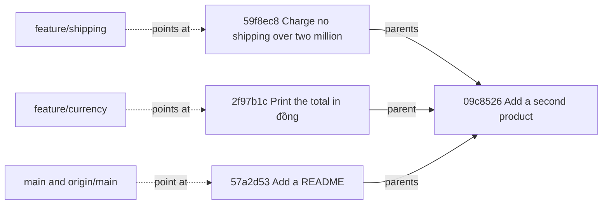

## Before you start

- [[foundation.l2.git-mental-model]] — a commit is a snapshot that names its parent, and history is read by following those pointers backwards. This lesson puts movable names on that graph.

## The situation

In the example system you run `scripts/git/branches.sh`. It builds the throwaway repository these Git lessons work in — the playground — and lists three names in it: `main`, `feature/shipping`, `feature/currency`, each beside a different commit id. It then switches to `feature/shipping` and lists the folder: `shipping.sh` is there and `README.md` is gone, and switching back swaps them again. Nothing was downloaded and no second folder was made; it is the same folder on disk the whole time. The last two lines print the newest commit of `main` and of `origin/main`, and both say `57a2d53`. What is a branch made of, and what is `origin/main`?

## Core concepts

- **branch** — a name that points at one commit; the name moves to the new commit each time you commit while standing on it, and creating one stores nothing but the name and an id.
- HEAD — the record of which branch you are standing on (Git can also point it straight at a commit; a later lesson meets that case); `git switch` moves it and makes the working directory match the commit the new name points at. Git 2.46's own manual labels `git switch` experimental, so you will also meet `git checkout <branch>`, which makes the same move.
- remote — another repository that yours knows under a short name; the playground's stand-in for a server is called `origin`.
- remote-tracking name — a name such as `origin/main` that your repository keeps for where the server's `main` stood the last time the two spoke; you do not commit on it.
- upstream — the remote-tracking name a branch is paired with, so Git can say how far ahead or behind you are without asking the server again.

## How it works



In the situation above, the three names the script lists first are branches, and the dotted arrows are all a branch is: a name and the id of one commit. The solid arrows are parent links; the two labelled `parents` skip the commits in between, which the output block below prints in full. Follow them back from any of the three names and you reach `09c8526`: the first commit of each of the three lines names it as its parent, so the history splits there into three lines of work. Two of those lines can belong to two people — each stands on a different name, and neither one's commits move the other's.

Standing on a branch means HEAD holds its name. Commit, and Git writes the new commit with the current one as its parent, then moves that one name forward; no other name changes. `git switch feature/shipping` moves HEAD and replaces the files in the working directory with the snapshot `59f8ec8` holds, so `README.md` disappears and `shipping.sh` appears; the folder is rewritten in place, not duplicated.

`origin` is the repository the playground builds to play the server. `origin/main` is a name of the same kind as `main`, with one difference: your repository sets it from what the server reported when the two last spoke. `git fetch` is that conversation — it copies down commits and moves the `origin/*` names; on its own it brings nothing into the branch you stand on and leaves your files alone.

`git push` sends your branch's commits and asks the server to move its own `main` to match. `git pull` is `git fetch` followed by bringing the fetched commits into your branch; the next lesson names the two ways of doing that second step. Both names read `57a2d53` because nothing has moved since the copy was made.

## In the Đơn Hàng system

The last thirteen lines of the playground script finish the third line of work and then build the server:

```bash file=git-playground/build-history.sh tag=stage-0 lines=101-113
git switch --quiet feature/currency
sed -i 's|^echo "\$total"$|echo "$total đồng"|' total.sh
save '2026-02-09T09:00:00+07:00' 'Print the total in đồng'

git switch --quiet main

# A second repository to play the part of the server.
git clone --quiet --bare "$repo" "$origin"
git remote add origin "$origin"
git fetch --quiet origin
git branch --set-upstream-to=origin/main main >/dev/null

echo "built $repo with $(git rev-list --count main) commits on main"
```

`git switch --quiet feature/currency` moves HEAD, the `sed` line edits one line of `total.sh` — its syntax does not matter here — and so the commit written by `save`, a helper defined earlier in the same script that commits with a fixed date, lands on `feature/currency` and `main` does not move. `git clone --bare` then makes a second repository out of the first, with no working directory — nowhere for the files of a commit to sit on disk — which is how a repository meant only to be pushed to and fetched from is usually kept. `git remote add origin` records its path under the name `origin`, `git fetch origin` creates this repository's `origin/*` names from what that repository holds, and `git branch --set-upstream-to` pairs `main` with `origin/main`. Not shown in the block above: two `git branch` lines created `feature/shipping` and `feature/currency` on the commit `main` stood at then, `09c8526`, and the next three commits went to `main` alone.

The second script asks the repository what it now holds:

```bash file=scripts/git/branches.sh tag=stage-0 lines=10-30
echo "the branches and where each one points:"
git branch -vv

echo
echo "the same commits, drawn as the graph they are:"
git log --oneline --graph --decorate --all

echo
echo "switching branches moves HEAD; it copies nothing:"
git switch --quiet feature/shipping
git rev-parse --abbrev-ref HEAD
ls -1

git switch --quiet main
git rev-parse --abbrev-ref HEAD
ls -1

echo
echo "origin/main is this repository's copy of the server's main:"
git log --oneline -1 main
git log --oneline -1 origin/main
```

```text output=true
the branches and where each one points:
  feature/currency 2f97b1c Print the total in đồng
  feature/shipping 59f8ec8 Charge no shipping over two million
* main             57a2d53 [origin/main] Add a README
...
* 2f97b1c (origin/feature/currency, feature/currency) Print the total in đồng
| * 59f8ec8 (origin/feature/shipping, feature/shipping) Charge no shipping over two million
| * 1108382 Add shipping.sh
|/  
| * 57a2d53 (HEAD -> main, origin/main, origin/HEAD) Add a README
| * c812dbd Explain the rounding
| * b3472f6 Round the total down to millions
|/  
* 09c8526 Add a second product
...
switching branches moves HEAD; it copies nothing:
feature/shipping
prices.txt
shipping.sh
test.sh
total.sh
main
README.md
prices.txt
test.sh
total.sh
...
57a2d53 Add a README
57a2d53 Add a README
```

Each `...` marks lines cut from this listing, not something the script prints. `git branch -vv` prints one line per branch: a `*` on the one HEAD holds, the name, the commit it points at, and in square brackets its upstream — only `main` has one, because only `main` was paired. The graph below it marks every commit with a `*` of its own, where that symbol says nothing about where you stand, and draws after each id every name that points at it in round brackets: the names you make and the `origin/*` names side by side, with the `|` columns and the `|/` lines drawing where the history splits. `origin/feature/currency` is there because a full copy of a repository copies its branches too, and `origin/HEAD` is the name that records which branch that second repository starts on.

The two `ls -1` listings are the point of the lesson. Same folder, four files each, and between them nothing ran but `git switch` and the `git rev-parse` that prints the branch name — no command that copies a folder. `shipping.sh` exists on one branch and `README.md` on the other, because each name points at a commit whose snapshot holds different files. The last two lines print `57a2d53` twice, which is what you expect just after a fetch and before anyone has pushed anything new.

## Beginners often think…

- **"Creating a branch duplicates the project files."** → Actually `git branch <name>` stores one name and one commit id, so it costs the same on a project of ten files and one of ten thousand. You notice this when the command returns instantly on a repository that takes minutes to copy, and when your editor keeps the same folder open across a switch.
- **"`origin/main` is always the current state of the server."** → Actually it is the state your repository last heard about, and it changes only when you run a command that talks to the server, such as `git fetch`, `git pull`, `git push` or `git clone`. You notice this when a colleague says the fix is on `main` and `git log origin/main` does not show it until you fetch.
- **"`git pull` just downloads the newest code."** → Actually it runs `git fetch` and then, depending on how that second step is set up, brings the fetched commits into your own branch; that second step changes your own history and can stop part-way. You notice this when `git pull` stops with a message and `git status` no longer prints the short clean line the previous lesson showed you.

## Try it (3 minutes)

1. From the top folder of the example system, run `scripts/up.sh` (it prepares the example system; running it twice changes nothing), then run `scripts/git/branches.sh`.
2. In the first listing, find which name carries the `*` and which name carries something in square brackets after its commit id.
3. Compare the two folder listings printed under `switching branches moves HEAD; it copies nothing:`, and say what ran between them.

Expected result: the `*` is on `main`, and `main` is also the only name followed by `[origin/main]`. The first listing holds `prices.txt`, `shipping.sh`, `test.sh`, `total.sh`; the second holds `README.md`, `prices.txt`, `test.sh`, `total.sh`. Between them only `git switch --quiet main` and the `git rev-parse` that prints the new name ran: HEAD moved to another name, and Git rewrote the working directory to match the commit that name points at.

## Connections

- [[foundation.l2.git-mental-model]] — prerequisite: the graph of commits that this lesson hangs movable names on, and the lesson that told you to ignore the `##` line of `git status --short --branch`.
- [[foundation.l2.git-merge-vs-rebase]] — the next step: the two ways of bringing one branch's commits into another, which is the second half of `git pull`.
- [[foundation.l2.git-history-and-recovery]] — where these names earn their keep: a name you moved by mistake can be put back, because the commits it pointed at are still there.

## Five-line summary

1. A branch is a movable name pointing at one commit; creating one copies no files, and HEAD says which name you are standing on.
2. Committing writes a new commit and moves only the name you stand on; switching rewrites the working directory and copies nothing.
3. A remote is another repository; `origin/main` is your repository's record of where the server's `main` stood when the two last spoke.
4. `git fetch` updates that record and leaves your work alone; `git push` sends your commits and asks the server to move its branch.
5. `git pull` is `git fetch` plus bringing the fetched commits into your branch — two steps, and the second is where care is needed.
