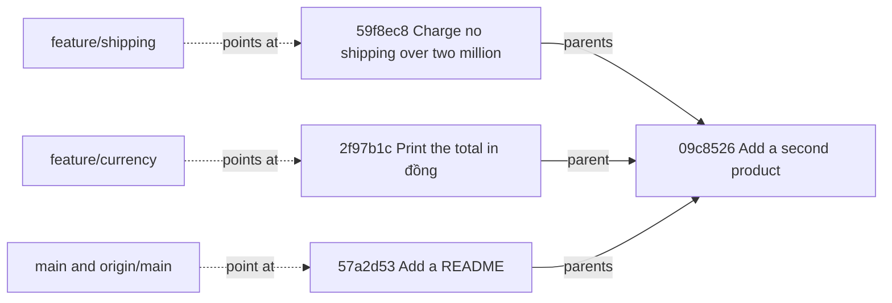

## Bạn cần biết trước

- [[foundation.l2.git-mental-model]] — commit là một ảnh chụp có ghi tên cha, và lịch sử được đọc bằng cách lần ngược theo những con trỏ đó. Bài này gắn thêm những cái tên di chuyển được lên đồ thị ấy.

## Tình huống

Trong hệ thống ví dụ, bạn chạy `scripts/git/branches.sh`. Trước tiên script chạy `git-playground/build-history.sh` để dựng repository dùng xong bỏ mà các bài Git làm việc trong đó — playground — rồi liệt kê ba cái tên trong repository ấy: `main`, `feature/shipping`, `feature/currency`, mỗi tên đứng cạnh một id commit khác nhau. Sau đó script chuyển sang `feature/shipping` và liệt kê thư mục: có `shipping.sh`, còn `README.md` thì biến mất. Chuyển lại thì hai file đổi chỗ lần nữa. Lần chuyển đó không tải gì về, không chép thư mục nào. Suốt từ đầu tới cuối vẫn là đúng một thư mục trên đĩa. Hai dòng cuối in commit mới nhất của `main` và của `origin/main`, và cả hai đều là `57a2d53`. Vậy một branch được làm từ gì, và `origin/main` là gì?

## Khái niệm cốt lõi

- **branch** (con trỏ có tên trỏ tới một commit, tạo branch không sao chép file) — một cái tên trỏ tới đúng một commit. Mỗi lần bạn commit khi đang đứng trên nó, cái tên dời sang commit mới. Tạo một branch là ghi một cái tên và một id commit (cộng một nhật ký, mỗi dòng ghi một chỗ cái tên từng trỏ tới — một bài sau sẽ dùng tới), không chép file nào.
- HEAD — bản ghi cho biết bạn đang đứng trên branch nào (Git cũng có thể cho nó trỏ thẳng vào một commit, một bài sau sẽ gặp trường hợp đó). `git switch` dời HEAD và làm working directory khớp với commit mà cái tên mới trỏ tới. Bạn cũng sẽ gặp `git checkout <branch>`, lệnh này dời HEAD y như vậy.
- remote — một repository khác mà repository của bạn biết dưới một cái tên ngắn. Trong playground, thứ đóng vai server có tên là `origin`.
- remote-tracking name — một cái tên như `origin/main` mà repository của bạn giữ để ghi `main` trên server đứng ở đâu vào lần cuối hai bên nói chuyện với nhau. Bạn không commit lên nó.
- upstream — remote-tracking name được ghép cặp với một branch, để Git cho biết bạn đang đi trước hay tụt sau bao nhiêu mà không phải hỏi lại server.

## Cơ chế hoạt động



Trong tình huống trên, ba cái tên script liệt kê đầu tiên là các branch. Mũi tên nét đứt là toàn bộ những gì một branch có: một cái tên và một id commit. Mũi tên nét liền là liên kết tới cha. Hai mũi tên có nhãn `parents` bỏ qua các commit ở giữa, những commit mà khối kết quả bên dưới in ra. Lần ngược theo chúng từ bất kỳ cái tên nào trong ba, bạn đều tới `09c8526`: commit đầu tiên của cả ba dòng đều ghi tên nó làm cha, nên lịch sử tách ra ở đó thành ba dòng công việc. Hai trong số đó có thể thuộc về hai người — mỗi người đứng trên một cái tên, và commit của người này không làm dời tên của người kia.

Đứng trên một branch nghĩa là HEAD giữ tên của branch đó. Khi bạn commit, Git ghi commit mới với commit hiện tại làm cha, rồi dời đúng cái tên đó lên trước. Không tên nào khác thay đổi. `git switch feature/shipping` dời HEAD và thay các file trong working directory bằng ảnh chụp mà `59f8ec8` giữ, nên `README.md` biến mất và `shipping.sh` xuất hiện. Thư mục được ghi lại ngay tại chỗ, không bị nhân đôi.

`origin` là bản sao repository của bạn, do playground tạo ra để đóng vai server. `origin/main` là cái tên cùng loại với `main`, chỉ khác một điều: repository của bạn đặt nó theo những gì server báo về vào lần cuối hai bên nói chuyện. `git fetch` chính là cuộc nói chuyện đó — lệnh này chép commit về và dời các tên `origin/*`. Tự nó không đưa gì vào branch bạn đang đứng, và không đụng tới file của bạn.

`git push` gửi các commit của branch lên và nhờ server dời `main` của nó cho khớp. `git pull` là `git fetch`, tiếp theo là đưa các commit vừa fetch vào branch của bạn. Bài sau sẽ gọi tên hai cách làm bước thứ hai đó. Cả hai cái tên đều là `57a2d53` vì từ lúc tạo bản sao tới giờ chưa có gì dời đi.

## Trong hệ thống Đơn Hàng

Mười ba dòng cuối của script playground làm xong dòng công việc thứ ba rồi dựng server:

```bash file=git-playground/build-history.sh tag=stage-0 lines=101-113
git switch --quiet feature/currency
sed -i 's|^echo "\$total"$|echo "$total đồng"|' total.sh
save '2026-02-09T09:00:00+07:00' 'Print the total in đồng'

git switch --quiet main

# A second repository to play the part of the server.
git clone --quiet --bare "$repo" "$origin"
git remote add origin "$origin"
git fetch --quiet origin
git branch --set-upstream-to=origin/main main >/dev/null

echo "built $repo with $(git rev-list --count main) commits on main"
```

`git switch --quiet feature/currency` dời HEAD, dòng `sed` sửa một dòng của `total.sh`, nên commit mà `save` ghi ra rơi vào `feature/currency`, còn `main` đứng yên. `save` là hàm phụ được định nghĩa ở đoạn trước trong cùng script, dùng để commit với ngày cố định.

Tiếp theo, `git clone --bare` tạo repository thứ hai từ repository thứ nhất, không có working directory — không có chỗ nào để file của một commit nằm trên đĩa. Một repository chỉ dùng để push lên và fetch về thường được giữ theo kiểu này. `git remote add origin` ghi đường dẫn của nó dưới tên `origin`, `git fetch origin` tạo các tên `origin/*` của repository này từ những gì repository kia đang giữ, và `git branch --set-upstream-to` ghép `main` với `origin/main`. `$repo` và `$origin` giữ đường dẫn của hai thư mục.

Phần không có trong khối trên: hai dòng `git branch` đã tạo `feature/shipping` và `feature/currency` trên commit mà `main` đang đứng lúc đó, `09c8526`, và ba commit sau đó chỉ đi vào `main`.

Script thứ hai hỏi repository xem giờ nó đang giữ gì:

```bash file=scripts/git/branches.sh tag=stage-0 lines=10-30
echo "the branches and where each one points:"
git branch -vv

echo
echo "the same commits, drawn as the graph they are:"
git log --oneline --graph --decorate --all

echo
echo "switching branches moves HEAD; it copies nothing:"
git switch --quiet feature/shipping
git rev-parse --abbrev-ref HEAD
ls -1

git switch --quiet main
git rev-parse --abbrev-ref HEAD
ls -1

echo
echo "origin/main is this repository's copy of the server's main:"
git log --oneline -1 main
git log --oneline -1 origin/main
```

```text output=true
the branches and where each one points:
  feature/currency 2f97b1c Print the total in đồng
  feature/shipping 59f8ec8 Charge no shipping over two million
* main             57a2d53 [origin/main] Add a README
...
* 2f97b1c (origin/feature/currency, feature/currency) Print the total in đồng
| * 59f8ec8 (origin/feature/shipping, feature/shipping) Charge no shipping over two million
| * 1108382 Add shipping.sh
|/  
| * 57a2d53 (HEAD -> main, origin/main, origin/HEAD) Add a README
| * c812dbd Explain the rounding
| * b3472f6 Round the total down to millions
|/  
* 09c8526 Add a second product
...
switching branches moves HEAD; it copies nothing:
feature/shipping
prices.txt
shipping.sh
test.sh
total.sh
main
README.md
prices.txt
test.sh
total.sh
...
57a2d53 Add a README
57a2d53 Add a README
```

Mỗi dấu `...` đánh dấu những dòng bị cắt khỏi danh sách này, script không in ra nó. `git branch -vv` in mỗi branch bạn tạo một dòng (các tên `origin/*` cần thêm `-r`): dấu `*` ở branch mà HEAD đang giữ, cái tên, commit nó trỏ tới, và upstream của nó trong ngoặc vuông — chỉ `main` có, vì chỉ `main` được ghép cặp.

Đồ thị bên dưới đánh dấu mỗi commit bằng một `*` riêng, và ở đây ký hiệu đó không nói gì về chỗ bạn đang đứng. Sau mỗi id, đồ thị vẽ trong ngoặc tròn mọi cái tên trỏ tới commit đó: tên bạn tạo và tên `origin/*` nằm cạnh nhau, còn các cột `|` và các dòng `|/` vẽ chỗ lịch sử tách ra. `HEAD -> main` nghĩa là HEAD giữ tên `main`.

`origin/feature/currency` có mặt vì bản sao đầy đủ của một repository chép cả các branch của nó. `origin/HEAD` gọi tên branch mà một bản sao mới của repository thứ hai sẽ được đặt lên đầu tiên. `git fetch` ghi lại tên này.

Hai danh sách `ls -1` là điểm chính của bài. Cùng một thư mục, mỗi lần bốn file, và ở giữa chỉ có `git switch` cùng `git rev-parse` in tên branch chạy — không lệnh nào chép thư mục. `shipping.sh` có trên branch này, `README.md` có trên branch kia, vì mỗi cái tên trỏ tới một commit mà ảnh chụp giữ các file khác nhau. Hai dòng cuối in `57a2d53` hai lần, đúng như bạn chờ đợi ngay sau một lần fetch, khi chưa ai push gì mới.

## Người mới hay nghĩ rằng…

- **"Tạo branch là nhân đôi các file của project."** → Thực ra `git branch <name>` ghi một cái tên và một id commit, không chép file nào, nên tốn như nhau với project mười file hay project mười nghìn file. Bạn sẽ nhận ra khi lệnh trả về ngay lập tức trên một repository mà chép ra thì mất vài phút.
- **"`origin/main` luôn là trạng thái hiện tại của server."** → Thực ra nó là trạng thái mà repository của bạn nghe được lần gần nhất, và nó chỉ đổi khi bạn chạy một lệnh nói chuyện với server, như `git fetch`, `git pull`, `git push` hay `git clone` — không bao giờ tự đổi ngầm. Bạn sẽ nhận ra khi đồng nghiệp bảo bản sửa đã lên `main` mà `git log origin/main` không thấy, cho tới khi bạn fetch.
- **"`git pull` chỉ tải code mới nhất về."** → Thực ra lệnh này chạy `git fetch` rồi, tùy bước thứ hai được thiết lập ra sao, đưa các commit vừa fetch vào branch của bạn. Bước thứ hai đó thay đổi lịch sử của chính bạn và có thể dừng giữa chừng. Dừng giữa chừng nghĩa là Git ngừng lại và bảo bạn làm nốt bước đó. Bạn sẽ nhận ra khi `git pull` dừng kèm một thông báo và `git status` báo một bước chưa xong thay vì một branch sạch.

## Thử ngay (3 phút)

1. Từ thư mục gốc của hệ thống ví dụ, chạy `scripts/up.sh` (script này chuẩn bị hệ thống ví dụ), rồi chạy `scripts/git/branches.sh`.
2. Trong danh sách đầu tiên, tìm tên nào mang dấu `*` và tên nào có thứ gì đó trong ngoặc vuông sau id commit.
3. So hai danh sách thư mục in dưới `switching branches moves HEAD; it copies nothing:`, và nói giữa hai lần đó đã chạy những gì.

Kết quả mong đợi: dấu `*` ở `main`, và `main` cũng là tên duy nhất có `[origin/main]` theo sau. Danh sách đầu có `prices.txt`, `shipping.sh`, `test.sh`, `total.sh`. Danh sách sau có `README.md`, `prices.txt`, `test.sh`, `total.sh`. Ở giữa chỉ có `git switch --quiet main` và `git rev-parse` chạy: HEAD dời đi, và Git ghi lại working directory cho khớp.

## Liên hệ

- [[foundation.l2.git-mental-model]] — bài cần học trước: đồ thị commit mà bài này treo những cái tên di chuyển được lên, và cũng là bài đã dặn bạn bỏ qua dòng `##` của `git status --short --branch` — dòng đó gọi tên branch và upstream của nó, giờ bạn đã đọc được.
- [[foundation.l2.git-merge-vs-rebase]] — bước tiếp theo: hai cách đưa commit của một branch vào branch khác, chính là nửa sau của `git pull`.
- [[foundation.l2.git-history-and-recovery]] — nơi những cái tên này phát huy tác dụng: một cái tên lỡ dời nhầm vẫn đặt lại được, vì các commit nó từng trỏ tới vẫn còn đó.

## Tóm tắt 5 dòng

1. Branch là một cái tên di chuyển được, trỏ tới một commit. Tạo branch không chép file nào, và HEAD cho biết bạn đang đứng trên tên nào.
2. Commit ghi một commit mới và chỉ dời cái tên bạn đang đứng. Chuyển branch ghi lại working directory và không chép gì.
3. Remote là một repository khác. `origin/main` là bản ghi trong repository của bạn về chỗ `main` trên server đứng vào lần cuối hai bên nói chuyện.
4. `git fetch` cập nhật bản ghi đó và không đụng tới công việc của bạn. `git push` gửi commit của bạn lên và nhờ server dời branch của nó.
5. `git pull` là `git fetch` cộng với đưa các commit vừa fetch vào branch của bạn — hai bước, và bước thứ hai là chỗ cần cẩn thận.
