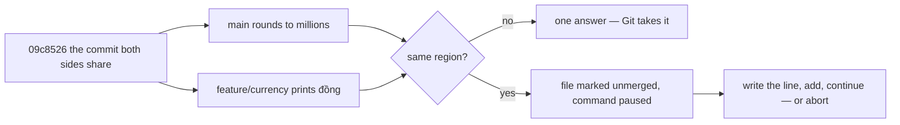

## Before you start

- [[foundation.l2.git-merge-vs-rebase]] — both commands start from the newest commit the two sides share: merge combines the two sides' changes in one step, rebase replays your commits onto the other side one at a time. That lesson said Git combines them; this one is about the case where it cannot, and both commands stop the same way.

## The situation

You are back on the small practice repository the Git lessons build, whose `total.sh` adds up the prices in `prices.txt`. Since the two lines of work parted, `main` changed the last line of `total.sh` to round the total down to millions, and `feature/currency` changed it to print the amount in đồng. You run `scripts/git/conflict-demo.sh`, which merges `feature/currency` into a throwaway copy of `main`. Git prints `CONFLICT (content): Merge conflict in total.sh`, stops, and writes nothing to history. `git status --short` answers `UU total.sh`, and the file on disk now holds three versions of that line — three, because the script asks Git to write the shared version too — fenced by rows of repeated punctuation. What is Git asking you to do?

## Core concepts

- **conflict** — both sides changed the same region of a file since the commit they share, so Git has no rule that picks a winner and hands the file back to you unfinished.
- conflict markers — the rows of `<`, `=`, `>` (and `|` when the shared version is shown) Git writes into the file, fencing off each side's text for that region.
- ours and theirs — the two fenced sides. During a merge, ours is the branch you stand on and theirs is the branch you named.
- the shared version — the region's text in the commit both sides started from, written into a third section only when the command is run with `merge.conflictStyle=diff3`, as the demo script in section 5 does.
- unmerged — the state Git records for such a file; `git status --short` prints `UU` beside it, and no commit is written until you clear it.

## How it works



Git compares three texts for each region, not two: your side, the other side, and the region as it stood in the commit both share. A region is a run of neighbouring lines; in `total.sh` it is the last line. Where only one side changed a region, there is one answer and Git takes it. Where both changed the same region, there are two answers, so Git stops.

Stopping is a state to finish, not damage to repair. The command reports failure and prints `Automatic merge failed`, its way of saying it did not finish; all it did was write both versions between markers and mark the file unmerged, leaving your history untouched.

From there you have two ways out. Abort tries to put the working directory, the staging area and `HEAD` back as they were before the command: `git merge --abort` for a merge, `git rebase --abort` for a rebase. Abort exists only while the command is stopped: once you write the commit, there is nothing left to abort. Git may fail to restore uncommitted changes, so commit anything unfinished before you start. Or you resolve: delete the markers and write the line you want. The correct text is often neither side — here, the rounded amount printed in đồng, which neither branch wrote.

You tell Git the file is done with `git add total.sh`. Adding is what clears the unmerged state; from then on the file's content is your answer, and nothing afterwards compares it with either side. `git commit` finishes a merge; `git rebase --continue` finishes a rebase.

A rebase stops the same way with one difference. It replays commits one at a time, so it can stop once per replayed commit, and the sides are named from the replay's point of view: ours is the work already in place, theirs the commit being replayed.

## In the Đơn Hàng system

The script merges the two branches on a throwaway name, prints what Git left behind, then undoes all of it:

```bash file=scripts/git/conflict-demo.sh tag=stage-0 lines=10-25
git switch --quiet -c conflict-demo main
git -c merge.conflictStyle=diff3 merge --no-edit feature/currency || true

echo
echo "what Git says about the working tree now:"
git status --short

echo
echo "what it wrote into the file:"
cat total.sh

echo
echo "abort puts everything back the way it was:"
git merge --abort
git status --short --branch
cat total.sh
```

```text output=true
Auto-merging total.sh
CONFLICT (content): Merge conflict in total.sh
Automatic merge failed; fix conflicts and then commit the result.

what Git says about the working tree now:
UU total.sh

what it wrote into the file:
#!/bin/sh
# Round to millions so the invoice looks tidy.
# Print the total price of everything in the price list.
set -eu
total=0
while read -r name price; do
    total=$((total + price))
done < prices.txt
<<<<<<< HEAD
echo $(( (total / 1000000) * 1000000 ))
||||||| 09c8526
echo "$total"
=======
echo "$total đồng"
>>>>>>> feature/currency

abort puts everything back the way it was:
...
#!/bin/sh
# Round to millions so the invoice looks tidy.
# Print the total price of everything in the price list.
set -eu
total=0
while read -r name price; do
    total=$((total + price))
done < prices.txt
echo $(( (total / 1000000) * 1000000 ))
```

`git -c merge.conflictStyle=diff3` sets that setting for this one command; without it Git writes only the two sides, and the `|||||||` section would not be there. The command reports failure when it stops at a conflict, so the script appends `|| true` to keep that stop from ending it; the script runs under `set -euo pipefail`. `switch --quiet -c` creates the throwaway branch from `main`, `--no-edit` keeps the merge from opening an editor, and neither changes the conflict; the script's own message calls the working directory the working tree.

Read the fenced region top to bottom: `<<<<<<< HEAD` opens your side, ours; `||||||| 09c8526` opens the text in the commit both branches share; `=======` divides it from the other side, theirs; and `>>>>>>> feature/currency` closes it, each label naming where its text came from.

The shared version is `echo "$total"`, the line as it was before either branch touched it, and that is what makes the demand plain: one side rounded it, the other added a unit, and the invoice needs both. Notice how little of the file is in dispute — eight lines merged silently, one did not, and that ratio is what a short-lived branch buys you: these two parted a few commits ago and collide on one line, while a branch left alone for weeks usually touches more regions, so it has more places to collide.

The `...` marks one line cut from this listing, not something the script prints: after `git merge --abort`, `git status --short --branch` prints the single line `## conflict-demo`, the branch line that `--branch` adds, and no file line at all. The last block is `total.sh` printed again, back to the rounded version with no markers left in it.

## Beginners often think…

- **"A conflict means someone made a mistake."** → Actually it means two correct pieces of work touched the same lines, which is what two people improving one file look like. Git stops precisely because both changes look deliberate; it has no opinion about which is right. You notice this when the resolution keeps both sides, as here, where dropping either one throws away work that was finished and already working.
- **"Choosing 'accept theirs' for the whole file is a resolution."** → Actually it replaces every region of the file with one side's text, including the regions Git already merged correctly. Only the fenced region is in dispute; everywhere else the file on disk already holds the right answer. You notice this when a change a colleague merged last week is simply missing afterwards, and the commit that removed it is your merge commit — no commit that undoes it, no discussion, nothing to search for.

## Try it (3 minutes)

1. From the top folder of the example system, run `scripts/up.sh` (it prepares the example system; running it twice changes nothing), then run `scripts/git/conflict-demo.sh`. The script rebuilds the playground from scratch with fixed authors and dates, so the ids below come out the same on your machine.
2. In the printed file, count the sections between the markers, read the id on the `|||||||` line, and compare that section's line with the two around it.
3. Read what the script prints after the abort, and look for a line naming `total.sh`.

Expected result: three sections. Your side reads `echo $(( (total / 1000000) * 1000000 ))`, the shared version reads `echo "$total"`, and the other side reads `echo "$total đồng"` — the shared one is the line both branches started from, and each side changed it in a different direction. The id beside `|||||||` is `09c8526`. After the abort there is no `UU total.sh` line and no file line at all, only `## conflict-demo`, and the file printed last carries no markers.

## Connections

- [[foundation.l2.git-merge-vs-rebase]] — prerequisite: the two commands that stop here, and the reason a rebase can stop repeatedly where a merge stops once.
- [[foundation.l2.git-history-and-recovery]] — where to go when abort is no longer enough, because you resolved badly and already committed.
- [[foundation.l2.good-commits]] — the habit that keeps conflicts small: a branch that lands in a day changes few regions, while one left alone for weeks changes many and has more places to collide.

## Five-line summary

1. A conflict is Git stopping because both sides changed the same region since the commit they share, and nothing in the rules picks a winner.
2. Git marks the file unmerged, writes both sides between markers and commits nothing; with `merge.conflictStyle=diff3` it also writes the shared version.
3. Resolving means writing the correct final text, which is often neither side alone, not choosing one side for the whole file.
4. Then `git add` the file and `git commit` for a merge or `git rebase --continue` for a rebase; `--abort` on either puts you back.
5. Conflict size tends to follow how long a branch ran alone, so a branch that lands in a day keeps conflicts small.
