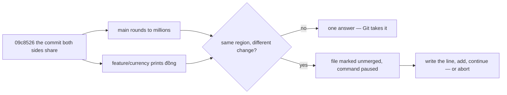

## Bạn cần biết trước

- [[foundation.l2.git-merge-vs-rebase]] — cả hai lệnh đều bắt đầu từ commit mới nhất mà hai bên cùng có: merge gộp thay đổi của hai bên trong một bước, rebase phát lại lần lượt từng commit của bạn lên bên kia. Bài đó nói Git gộp được chúng. Bài này nói về trường hợp Git không gộp được, và cả hai lệnh đều dừng theo cùng một kiểu.

## Tình huống

Trong repository thử nghiệm Git ở các bài trước, `total.sh` cộng giá trong `prices.txt`. Kể từ khi hai dòng công việc tách ra, `main` đã sửa dòng cuối của `total.sh` để làm tròn tổng xuống hàng triệu, còn `feature/currency` sửa chính dòng đó để in số tiền kèm đơn vị đồng. Hóa đơn cần cả hai thay đổi. Bạn chạy `scripts/git/conflict-demo.sh`, script này merge `feature/currency` vào một branch dùng xong bỏ tạo từ `main`. Git in ra `CONFLICT (content): Merge conflict in total.sh`, dừng lại, và không ghi gì vào lịch sử. `git status --short` trả lời `UU total.sh`, và file trên đĩa giờ chứa ba phiên bản của dòng đó — ba, vì script yêu cầu Git ghi cả phiên bản chung — ngăn cách bởi những hàng ký tự lặp lại. Git đang muốn bạn làm gì?

## Khái niệm cốt lõi

- **conflict** (hai phía sửa cùng vùng của một file, Git dừng và để bạn chọn) — cả hai bên đã sửa cùng một vùng của file (một dải dòng liền nhau) theo hai cách khác nhau kể từ commit chung, nên Git không có quy tắc nào để chọn bên thắng và trả file lại cho bạn khi còn dang dở.
- conflict marker — các hàng `<`, `=`, `>` (và `|` khi có phiên bản chung) mà Git ghi vào file để ngăn phần chữ của mỗi bên trong vùng đó.
- ours và theirs — hai phần được ngăn ra. Khi merge, ours là branch bạn đang đứng, theirs là branch bạn gọi tên.
- phiên bản chung — nội dung của vùng đó trong commit mà cả hai bên xuất phát, được ghi thành phần thứ ba khi `merge.conflictStyle` đặt là `diff3` (script demo ở mục 5 đặt nó cho đúng một lệnh). Kiểu mặc định không ghi phần này.
- unmerged — trạng thái Git ghi nhận cho file như vậy. Khi cả hai bên cùng sửa file, như ở đây, `git status --short` in `UU` bên cạnh file, và Git không viết commit nào cho tới khi bạn giải quyết xong.

## Cơ chế hoạt động



Với mỗi vùng, Git so ba văn bản: bên bạn, bên kia, và vùng đó như nó từng có trong commit chung. Nếu chỉ một bên sửa vùng đó, hoặc cả hai sửa giống hệt nhau, thì chỉ có một đáp án và Git lấy nó. Nếu cả hai sửa khác nhau thì có hai đáp án, nên Git dừng.

Dừng là một trạng thái cần làm cho xong, không phải hư hỏng cần sửa. Lệnh báo thất bại (`Automatic merge failed`) vì nó chưa chạy xong. Nó đã ghi những gì gộp được, ghi cả hai phiên bản của vùng tranh chấp giữa các marker và đánh dấu file là unmerged, còn lịch sử thì không bị đụng tới.

Từ đây bạn có hai lối ra. Abort cố đưa thư mục làm việc, staging area và `HEAD` về như cũ: `git merge --abort` cho merge, `git rebase --abort` cho rebase. Abort chỉ tồn tại khi lệnh còn đang dừng: một khi bạn đã commit thì không còn gì để abort. Với merge, Git có thể không khôi phục được các thay đổi chưa commit, nên hãy commit những gì còn dang dở trước khi bắt đầu. Hoặc bạn giải quyết: xóa các marker và viết dòng bạn muốn. Văn bản đúng thường không phải của bên nào: ở đây, đó là số tiền đã làm tròn và in kèm đơn vị đồng.

Bạn báo cho Git rằng file đã xong bằng `git add total.sh`. Chính lệnh add xóa trạng thái unmerged. Từ đó nội dung file là đáp án của bạn, và không có gì so nó với bên nào nữa. Git cũng không tìm marker còn sót. Với Git, chúng chỉ là chữ bình thường, được commit như mọi dòng khác. `git commit` kết thúc một lần merge, `git rebase --continue` kết thúc một lần rebase.

Rebase cũng dừng theo cùng kiểu, nhưng vì nó phát lại từng commit một, nó có thể dừng một lần cho mỗi commit được phát lại, và hai bên đổi chỗ: ours là branch bạn đang rebase lên, theirs là commit của chính bạn đang được phát lại.

## Trong hệ thống Đơn Hàng

Script merge hai branch trên một tên dùng xong bỏ, in ra những gì Git để lại, rồi hoàn tác toàn bộ. Trong kết quả, `...` thay cho một dòng bị cắt khỏi đoạn trích:

```bash file=scripts/git/conflict-demo.sh tag=stage-0 lines=10-25
git switch --quiet -c conflict-demo main
git -c merge.conflictStyle=diff3 merge --no-edit feature/currency || true

echo
echo "what Git says about the working tree now:"
git status --short

echo
echo "what it wrote into the file:"
cat total.sh

echo
echo "abort puts everything back the way it was:"
git merge --abort
git status --short --branch
cat total.sh
```

```text output=true
Auto-merging total.sh
CONFLICT (content): Merge conflict in total.sh
Automatic merge failed; fix conflicts and then commit the result.

what Git says about the working tree now:
UU total.sh

what it wrote into the file:
#!/bin/sh
# Round to millions so the invoice looks tidy.
# Print the total price of everything in the price list.
set -eu
total=0
while read -r name price; do
    total=$((total + price))
done < prices.txt
<<<<<<< HEAD
echo $(( (total / 1000000) * 1000000 ))
||||||| 09c8526
echo "$total"
=======
echo "$total đồng"
>>>>>>> feature/currency

abort puts everything back the way it was:
...
#!/bin/sh
# Round to millions so the invoice looks tidy.
# Print the total price of everything in the price list.
set -eu
total=0
while read -r name price; do
    total=$((total + price))
done < prices.txt
echo $(( (total / 1000000) * 1000000 ))
```

`git -c merge.conflictStyle=diff3` đặt giá trị đó cho riêng lệnh này. Không có nó, Git chỉ ghi hai bên và phần `|||||||` sẽ không xuất hiện.

Phần còn lại là chi tiết vận hành của script, không làm conflict khác đi. Lệnh báo thất bại khi dừng ở một conflict, nên script thêm `|| true` để lần dừng đó không kết thúc script. Script được đặt (bằng `set -euo pipefail`, ở một dòng phía trên đoạn trích) để dừng ngay ở lệnh đầu tiên báo thất bại. `switch --quiet -c` tạo branch dùng xong bỏ từ `main`, `--no-edit` giữ cho merge không mở trình soạn thảo, và thông điệp riêng của script gọi thư mục làm việc là working tree.

Hãy đọc vùng được ngăn từ trên xuống: `<<<<<<< HEAD` mở phần của bạn, ours. `||||||| 09c8526` mở phần chữ trong commit mà cả hai branch cùng có. `=======` ngăn nó với bên kia, theirs. `>>>>>>> feature/currency` đóng vùng lại. Mỗi nhãn cho biết phần chữ của nó đến từ đâu.

Phiên bản chung là `echo "$total"`, dòng đó như trước khi branch nào đụng vào, và chính nó làm yêu cầu trở nên rõ ràng: một bên làm tròn, bên kia thêm đơn vị, còn hóa đơn cần cả hai. Hãy để ý phần tranh chấp nhỏ tới mức nào: dòng chú thích `# Round to millions...` là vùng chỉ `main` sửa, nên Git lấy luôn mà không hỏi, và các dòng khác không ai sửa. Tranh chấp nhỏ là chuyện thường gặp ở những branch vừa tách ra chưa lâu: hai branch này tách nhau vài commit trước và va nhau ở một dòng, còn một branch để riêng hàng tuần thường đụng nhiều vùng hơn, nên có nhiều chỗ va nhau hơn.

Dòng bị cắt: sau `git merge --abort`, `git status --short --branch` in đúng một dòng `## conflict-demo`, dòng branch mà `--branch` thêm vào, và không có dòng file nào. Khối cuối là `total.sh` được in lại, đã trở về bản làm tròn và không còn marker nào.

## Người mới hay nghĩ rằng…

- **"Conflict nghĩa là có ai đó làm sai."** → Thực ra nó nghĩa là hai thay đổi có chủ đích cùng đụng vào những dòng giống nhau, đúng như khi hai người cùng cải thiện một file. Git dừng vì nó có hai văn bản khác nhau cho một vùng và không có quy tắc nào để ưu tiên bên nào. Git không có ý kiến bên nào đúng. Bạn sẽ nhận ra khi cách giải quyết giữ cả hai bên, như ở đây, nơi bỏ bất kỳ bên nào cũng là vứt đi phần việc đã xong và đang chạy tốt.
- **"Chọn 'accept theirs' cho cả file là giải quyết xong."** → Thực ra lấy nguyên file của branch kia thay cho file của bạn, ví dụ bằng `git checkout --theirs total.sh`, sẽ thay mọi vùng của file bằng chữ của một bên, kể cả những vùng Git đã gộp đúng. Chỉ vùng được ngăn là có tranh chấp. Ở mọi chỗ khác, file trên đĩa đã có đáp án đúng. Bạn sẽ nhận ra khi một thay đổi đồng nghiệp merge tuần trước bỗng biến mất, và commit xóa nó là merge commit của bạn — không có commit nào hoàn tác nó, không có trao đổi nào, không có gì để tìm.

## Thử ngay (3 phút)

1. Từ thư mục gốc của hệ thống ví dụ, chạy `scripts/up.sh` (script này chuẩn bị hệ thống ví dụ, chạy lại cũng an toàn), rồi chạy `scripts/git/conflict-demo.sh`. Script dựng lại repository thử nghiệm từ đầu với tác giả và ngày cố định, nên các id dưới đây ra giống hệt trên máy bạn.
2. Trong file được in ra, đếm số phần nằm giữa các marker, đọc id trên dòng `|||||||`, và so dòng của phần đó với hai dòng hai bên.
3. Đọc những gì script in ra sau khi abort, và tìm dòng có tên `total.sh`.

Kết quả mong đợi: ba phần. Bên bạn là `echo $(( (total / 1000000) * 1000000 ))`, phiên bản chung là `echo "$total"`, và bên kia là `echo "$total đồng"` — phiên bản chung là dòng cả hai branch xuất phát, và mỗi bên sửa nó theo một hướng khác. Id cạnh `|||||||` là `09c8526`. Sau khi abort không còn dòng `UU total.sh` và không có dòng file nào, chỉ có `## conflict-demo`, và file in ra sau cùng không còn marker nào.

## Liên hệ

- [[foundation.l2.git-merge-vs-rebase]] — bài cần học trước: hai lệnh dừng lại ở đây, và lý do rebase có thể dừng nhiều lần trong khi merge chỉ dừng một lần.
- [[foundation.l2.git-history-and-recovery]] — nơi cần tới khi abort không còn đủ, vì bạn đã giải quyết sai và đã commit.
- [[foundation.l2.good-commits]] — thói quen giữ conflict nhỏ: một branch được merge lại vào `main` trong vòng một ngày thường sửa ít vùng, còn branch để riêng hàng tuần thường sửa nhiều hơn và có nhiều chỗ va nhau hơn.

## Tóm tắt 5 dòng

1. Conflict là khi Git dừng vì cả hai bên đã sửa cùng một vùng theo hai cách khác nhau kể từ commit chung, và không có quy tắc nào chọn bên thắng.
2. Git đánh dấu file là unmerged, ghi cả hai bên giữa các marker và không commit gì. Với `merge.conflictStyle=diff3`, Git ghi thêm phiên bản chung.
3. Giải quyết nghĩa là viết văn bản cuối cùng cho đúng, thường không phải của riêng bên nào, chứ không phải chọn một bên cho cả file.
4. Sau đó `git add` file, rồi `git commit` (merge) hoặc `git rebase --continue` (rebase). `--abort` cố đưa bạn về như cũ, nên hãy commit phần việc dang dở trước.
5. Độ lớn của conflict thường theo thời gian một branch chạy riêng, nên branch được merge lại vào `main` trong vòng một ngày thường giữ conflict nhỏ.
