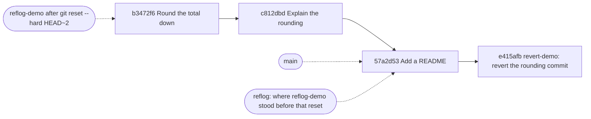

## Before you start

- [[foundation.l2.git-merge-vs-rebase]] — a rebase writes new commits with new ids and moves a branch name onto them, while the originals stay. This lesson is what that fact is for: reading a history, undoing one commit, and putting a name back where it was.

## The situation

These Git lessons practise on a throwaway repository, never on the order code. Each script rebuilds it before it runs: six commits on `main`, and a script `total.sh` that adds up a price list. You run it and the total comes back rounded down to the nearest million — money the invoice never mentions. One line does the rounding, and the comment above it says only that invoices look tidier that way. The change is old, every copy of the repository already has it, and nobody remembers making it. When did that line arrive, why, and how do you take it out of a history other people already hold?

## Core concepts

- `git log -- <path>` — the history narrowed to the commits that changed one path; the `--` separates paths from branch names, which otherwise can be read either way.
- blame — for each line of a file, the commit that last changed that line, printed beside the line with its author and date.
- reset — moving the current branch name to another commit; `--soft` moves the name alone, `--mixed` also unmarks the changes you had staged — the ones marked to go into the next commit — while leaving the files themselves untouched, and `--hard` overwrites your files with that commit's.
- revert — writing a new commit whose change is the reverse of a named commit, which leaves every commit already in the history alone.
- reflog — `HEAD` names the commit you are standing on; the reflog is a log, kept only in your own repository, of every commit `HEAD` and each branch has pointed at, one entry per move.
- amend and squash — the two ways of replacing commits you already wrote: amend swaps the commit you just made for one carrying the corrected message or content, squash swaps several commits for one carrying their combined change. Both produce new ids. Neither is run in this lesson's scripts; you meet them here so you recognise the words.

## How it works



Solid arrows run from a commit to the one after it; dotted arrows are names, and one line of the reflog, pointing at a commit they are not the parent of. The revert and the reset are two separate attempts at undoing one commit, each on its own branch.

Reading comes first. `git log --oneline -- total.sh` prints only the commits that changed that file, newest first, and turns a six-commit history into three lines. `git blame total.sh` goes the other way: beside each line it prints the commit that last changed it, with author and date, so the rounding line answers with `b3472f64`. Running `git log -1` on that id prints its message, the closest thing to a reason the repository holds.

Undoing comes second, in one of two shapes. `git revert b3472f6` writes `e415afb`, a new commit whose change is the reverse of `b3472f6`; both stay, and every other copy gains a commit when you push it to the shared repository everyone works from. `git reset --hard b3472f6` instead moves your current branch name back two commits and makes your files match it; nothing is added, and the name leaves two commits behind.

Those two commits are not gone: the reflog recorded where the name stood before the reset, so resetting onto that entry puts the name and the files back. A rebase moves a branch name the same way, so the entry from before a rebase you regret is the way back.

Once a commit is on the server, revert is the safe shape: it adds, where reset asks every other copy to forget. That same before-and-after-sharing line decides between `git commit --amend` — for the message you got wrong a minute ago — and squashing: both write new commits with new ids, fine before you share them, an argument afterwards.

## In the Đơn Hàng system

The first script reads the history of one file, then undoes one commit the way a shared history allows:

```bash file=scripts/git/blame-and-log.sh tag=stage-0 lines=10-29
echo "every commit that touched one file:"
git log --oneline -- total.sh

echo
echo "who last changed each line, and in which commit:"
git blame total.sh

echo
echo "why that line changed, in the commit's own words:"
git log -1 --format='%h %ad%n%n%s' --date=short \
    "$(git log --format=%H -1 --grep='Round the total')"

echo
echo "revert adds a new commit that undoes an old one:"
export GIT_AUTHOR_DATE='2026-02-10T09:00:00+07:00'
export GIT_COMMITTER_DATE='2026-02-10T09:00:00+07:00'
git switch --quiet -c revert-demo main
git revert --no-edit "$(git log --format=%H -1 --grep='Round the total')" >/dev/null
git log --oneline -3
./test.sh
```

```text output=true
every commit that touched one file:
c812dbd Explain the rounding
b3472f6 Round the total down to millions
d915e63 Add total.sh and a check for it

who last changed each line, and in which commit:
...
b3472f64 (Mai Anh 2026-02-05 12:00:00 +0700 9) echo $(( (total / 1000000) * 1000000 ))

why that line changed, in the commit's own words:
b3472f6 2026-02-05

Round the total down to millions

revert adds a new commit that undoes an old one:
e415afb Revert "Round the total down to millions"
57a2d53 Add a README
c812dbd Explain the rounding
ok
```

Each `...` marks lines cut here, not output: the eight earlier lines of the same blame listing. Three commits out of the six on `main` touched `total.sh`, so the first listing is the whole story of that file. The blame line for the rounding carries `b3472f64`, the same commit the log calls `b3472f6` — blame abbreviates ids to a different length.

The third command hands that commit to `git log -1`: `--grep` picks the newest commit whose message matches, `%h` is the shortened id, `%ad` the author date, `%s` the message's first line, `%H` the full id and `%n` a line break. The two exported dates pin the new commit's time so its id matches everywhere; they are not part of reverting. Then the script switches to a throwaway branch and reverts, where `--no-edit` keeps the message Git writes instead of asking you for one, and the log shows `e415afb` added on top rather than `b3472f6` removed; `./test.sh`, the check that came with `total.sh`, prints `ok` because the total is a plain sum again.

The second script takes the other shape, and gets out of it:

```bash file=scripts/git/recover-with-reflog.sh tag=stage-0 lines=10-27
git switch --quiet -c reflog-demo main

echo "where the branch points now:"
git log --oneline -1

echo
echo "after git reset --hard HEAD~2:"
git reset --hard --quiet HEAD~2
git log --oneline -1

echo
echo "reflog remembers every place HEAD has been:"
git reflog -4

echo
echo "so the two commits are one command away:"
git reset --hard --quiet "$(git reflog --format=%H -1 reflog-demo@{1})"
git log --oneline -3
```

```text output=true
where the branch points now:
57a2d53 Add a README

after git reset --hard HEAD~2:
b3472f6 Round the total down to millions

reflog remembers every place HEAD has been:
b3472f6 HEAD@{0}: reset: moving to HEAD~2
57a2d53 HEAD@{1}: checkout: moving from main to reflog-demo
57a2d53 HEAD@{2}: checkout: moving from feature/currency to main
2f97b1c HEAD@{3}: commit: Print the total in đồng

so the two commits are one command away:
57a2d53 Add a README
c812dbd Explain the rounding
b3472f6 Round the total down to millions
```

The branch starts where `main` is, at `57a2d53`. `git reset --hard HEAD~2` moves it back two commits to `b3472f6` — `HEAD~2` means two steps back, taking the first of the two parents whenever a commit has two — and the two commits in between are left on no branch. `git reflog -4` prints the last four positions `HEAD` held, newest first, each labelled with what moved it: the reset at `HEAD@{0}`, and on the line under it, at `HEAD@{1}`, the `57a2d53` the reset came from, where `checkout:` is the label the reflog writes for a move made by `git switch`. The two lines below are older moves the playground made before this branch existed; nothing here depends on them. The last command reads a second log, `reflog-demo@{1}`, the branch's own record of where it stood before the reset, and resets onto it, so the log ends where it began. Nothing came back from a server; both logs are local to this one repository.

## Beginners often think…

- **"git reset --hard deletes my commits forever."** → Actually reset moves a branch name, and the commits it pointed at stay in the repository, still reachable through the reflog. You notice this when `git reflog` prints the id you thought you had destroyed, and one reset onto it brings the files back with the name.
- **"Revert and reset are the same thing."** → Actually revert adds a commit and changes nothing that exists, while reset changes where a name points and adds nothing. You notice this when the revert pushes like any other commit, and the reset leaves your branch behind the server's copy so the push is refused, because accepting it would mean the server dropping commits it already has.
- **"blame tells you who is at fault."** → Actually it names the commit that last touched each line, and an indentation change or a reformatting counts as touching it. You notice this when every line of a file blames one commit that changed no behaviour at all.

## Try it (3 minutes)

1. From the top folder of the example system, run `scripts/up.sh` (running it twice changes nothing), then run `scripts/git/blame-and-log.sh` and `scripts/git/recover-with-reflog.sh`. Each rebuilds the playground from scratch with fixed authors and dates, so the ids below come out the same on your machine.
2. In the first output, read the id beside the last line of `total.sh` in the blame listing, then find the same commit in the log listing above it.
3. In the second output, compare the id the branch points at before the reset, after the reset, and after the last command, then read the `HEAD@{1}` line of the reflog in between.

Expected result: the blame line for the rounding carries `b3472f64`, and the log lists the same commit as `b3472f6`. The branch goes `57a2d53`, then `b3472f6`, then `57a2d53` again: the last command reads that id from the branch's own log, `reflog-demo@{1}`, which holds what `HEAD@{1}` shows.

## Connections

- [[foundation.l2.git-merge-vs-rebase]] — prerequisite, and the mess this lesson cleans up: a rebase you regret is undone by resetting the branch name onto the id the reflog kept.
- [[foundation.l2.git-bisect]] — the later lesson that ends with one commit in your hand; this lesson is what you do with it.
- [[foundation.l2.good-commits]] — why blame and revert are worth anything: both work one commit at a time, so a commit holding one change can be read, and undone, on its own.
- [[foundation.l1.reading-code]] — the same move one layer back: a file's past is another way to read code nobody can explain.

## Five-line summary

1. Git records where every name has been, so a history can be read, undone and recovered without losing the commits you already wrote.
2. `git log -- <path>` and `git blame` answer when a line changed and in which commit; that commit's message is the nearest thing to why.
3. `revert` adds a commit reversing another and is the undo that suits a history others hold; `reset` moves a branch name instead.
4. `--soft`, `--mixed` and `--hard` decide how far a reset reaches: the name alone, the staging marks too, or your files as well.
5. The reflog holds every position `HEAD` and each branch has had, so a commit lost to a bad reset or rebase is one reset away.
