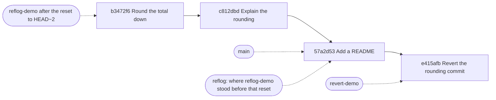

## Before you start

- [[foundation.l2.git-merge-vs-rebase]] — a rebase writes new commits with new ids and moves a branch name onto them, while the originals stay. This lesson puts that fact to use.

## The situation

These Git lessons practise on a throwaway repository, the playground, never on the order code. Each script rebuilds it before it runs: six commits on `main`, and a script `total.sh` that adds up a price list. You run it and the total comes back rounded down to the nearest million: everything under a million disappears, and nothing on the invoice says so. One line does the rounding, and its comment says only that invoices look tidier that way. The change is old, every copy of the repository already has it, and nobody remembers making it. When did that line arrive, why, and how do you take it out of a history other people already hold?

## Core concepts

- `git log -- <path>` — in a straight-line history like the playground's, every commit that changed that path; the `--` marks what follows as paths, which matters when a name could also be read as a branch.
- blame — for each line of a file, the commit that last changed that line, printed beside the line with its author and date.
- reset — moving the current branch name to another commit; `--soft` moves the name alone, `--mixed` also unmarks the changes you had staged — the ones marked to go into the next commit — and `--hard` also overwrites every file Git already keeps a version of with that commit's version, discarding changes you had not committed.
- revert — writing a new commit whose change is the reverse of a named commit, which leaves every commit already in the history alone; a push, sending your new commits to the shared repository, carries it like any other commit.
- reflog — `HEAD` names the commit you are standing on; the reflog is a log, kept only in your own repository, of the recent commits `HEAD` and each branch have pointed at, one entry per move.
- amend and squash — two ways of replacing commits: amend swaps the commit you just made for one with the corrected message or content, squash swaps several commits for one carrying their combined change. Both produce new ids; neither runs in this lesson's scripts.

## How it works


```mermaid
flowchart LR
  A["b3472f6 Round the total down"] --> B["c812dbd Explain the rounding"]
  B --> C["57a2d53 Add a README"]
  C --> V["e415afb Revert the rounding commit"]
  RD(["revert-demo"]) -.-> V
  M(["main"]) -.-> C
  N(["reflog-demo after the reset to HEAD~2"]) -.-> A
  R(["reflog: where reflog-demo stood before that reset"]) -.-> C
```

Unbroken arrows run from a commit to the one after it; dotted arrows are names, and one reflog line, pointing at a commit. Both demos start from `main` at `57a2d53`: the revert is written on `revert-demo`, the reset moves `reflog-demo`.

Reading comes first. `git log --oneline -- total.sh` prints the commits that changed that file, newest first: three lines out of six commits. `git blame total.sh` prints beside each line the commit that last changed it, with author and date, so the rounding line answers with `b3472f64`. `git log -1` on that id prints its message, the nearest thing to a reason.

Undoing comes second, in one of two shapes. `git revert b3472f6` writes `e415afb`, a new commit whose change is the reverse of `b3472f6`; both stay. After a push, every other copy gets it on its next update from the shared repository. `git reset --hard HEAD~2` instead moves your branch name two commits back, to `b3472f6`, and makes your files match: it drops the two commits after the rounding, and only a reset one further, past `b3472f6`, would drop the rounding too.

The two commits left behind are not gone: the reflog recorded where the name stood before the reset, so resetting onto that entry puts the name and the files back. A rebase moves a branch name the same way, so the entry from before it is the way back.

Once a commit is in the shared repository, revert is the safe shape: it adds, while pushing a reset branch would make the shared repository drop commits it already has, so it refuses. The same line governs `git commit --amend` and squashing: both write new commits with new ids, fine before you share them, a problem once others hold the originals.

## In the Đơn Hàng system

The first script reads the history of one file, then undoes one commit the way a shared history allows:

```bash file=scripts/git/blame-and-log.sh tag=stage-0 lines=10-29
echo "every commit that touched one file:"
git log --oneline -- total.sh

echo
echo "who last changed each line, and in which commit:"
git blame total.sh

echo
echo "why that line changed, in the commit's own words:"
git log -1 --format='%h %ad%n%n%s' --date=short \
    "$(git log --format=%H -1 --grep='Round the total')"

echo
echo "revert adds a new commit that undoes an old one:"
export GIT_AUTHOR_DATE='2026-02-10T09:00:00+07:00'
export GIT_COMMITTER_DATE='2026-02-10T09:00:00+07:00'
git switch --quiet -c revert-demo main
git revert --no-edit "$(git log --format=%H -1 --grep='Round the total')" >/dev/null
git log --oneline -3
./test.sh
```

```text output=true
every commit that touched one file:
c812dbd Explain the rounding
b3472f6 Round the total down to millions
d915e63 Add total.sh and a check for it

who last changed each line, and in which commit:
...
b3472f64 (Mai Anh 2026-02-05 12:00:00 +0700 9) echo $(( (total / 1000000) * 1000000 ))

why that line changed, in the commit's own words:
b3472f6 2026-02-05

Round the total down to millions

revert adds a new commit that undoes an old one:
e415afb Revert "Round the total down to millions"
57a2d53 Add a README
c812dbd Explain the rounding
ok
```

The `...` marks the eight earlier blame lines, cut here, not output. The blame line for the rounding carries `b3472f64`, the same commit the log calls `b3472f6` — blame abbreviates ids to a different length — and the `9` before the bracket closes is the line number, the last line of the file. `c812dbd` only added the comment above that line, so blame names `b3472f6` for the line itself.

The third command finds the commit by its message: `--grep` keeps the commits whose message matches, `-1` the newest, `%H` prints its full id, and `$( … )` pastes that id into the outer `git log -1`. There `%h` is the shortened id, `%ad` the author date, `%n` a line break and `%s` the message's first line; `--date=short` drops the time.

The two exported dates only pin the new commit's id, so it matches yours. Then the script reverts on a throwaway branch, where `--no-edit` keeps the message Git writes instead of asking you for one and `>/dev/null` hides the revert's own report, and the log shows `e415afb` added on top, with `c812dbd`, the commit after `b3472f6`, still under it, so `b3472f6` is still there too; `./test.sh`, the check that came with `total.sh`, prints `ok` because the total is a plain sum again.

The second script takes the other shape, and gets out of it:

```bash file=scripts/git/recover-with-reflog.sh tag=stage-0 lines=10-27
git switch --quiet -c reflog-demo main

echo "where the branch points now:"
git log --oneline -1

echo
echo "after git reset --hard HEAD~2:"
git reset --hard --quiet HEAD~2
git log --oneline -1

echo
echo "reflog remembers every place HEAD has been:"
git reflog -4

echo
echo "so the two commits are one command away:"
git reset --hard --quiet "$(git reflog --format=%H -1 reflog-demo@{1})"
git log --oneline -3
```

```text output=true
where the branch points now:
57a2d53 Add a README

after git reset --hard HEAD~2:
b3472f6 Round the total down to millions

reflog remembers every place HEAD has been:
b3472f6 HEAD@{0}: reset: moving to HEAD~2
57a2d53 HEAD@{1}: checkout: moving from main to reflog-demo
57a2d53 HEAD@{2}: checkout: moving from feature/currency to main
2f97b1c HEAD@{3}: commit: Print the total in đồng

so the two commits are one command away:
57a2d53 Add a README
c812dbd Explain the rounding
b3472f6 Round the total down to millions
```

The branch starts where `main` is, at `57a2d53`. `git reset --hard HEAD~2` moves it back two commits to `b3472f6` — `HEAD~2` means two steps back, taking the first parent, the branch you stood on when you merged, whenever a commit has two — and the two commits in between are no longer on `reflog-demo`. `main` still holds them here; on your only branch the reflog alone would reach them.

`git reflog -4` prints the last four positions `HEAD` held, newest first, each labelled with what moved it: the reset at `HEAD@{0}`, and under it, at `HEAD@{1}`, the `57a2d53` the reset came from; `checkout:` is the label for a move made by `git switch`; the two older lines are moves the playground's build script made before this demo. `name@{n}` means where that name stood n moves ago. Switching branches adds a line to `HEAD`'s log but not to a branch's own log. So `reflog-demo@{1}`, one move ago for that branch, is `57a2d53`, and the last command resets onto it. Both logs are local.

## Beginners often think…

- **"git reset --hard deletes my commits forever."** → Actually reset moves a branch name, and the commits it pointed at stay in the repository for weeks to months, still reachable through the reflog. You notice this when `git reflog` prints the id you thought you had destroyed, and one reset onto it brings everything back.
- **"Revert and reset are the same thing."** → Actually revert adds a commit and changes nothing that exists, while reset changes where a name points and adds nothing. You notice this when the revert pushes like any other commit, and the reset leaves your branch behind the shared repository's copy, so the push is refused.
- **"blame tells you who is at fault."** → Actually it names the commit that last touched each line, and an indentation change or a reformatting counts as touching it. You notice this when every line of a file blames one commit that changed no behaviour at all.

## Try it (3 minutes)

1. From the top folder of the example system, run `scripts/up.sh`, which starts the lab, the small Linux machine the scripts run inside, then run `scripts/git/blame-and-log.sh` and `scripts/git/recover-with-reflog.sh`. Each rebuilds the playground with fixed authors and dates, so your ids match the ones below.
2. In the first output, read the id beside the last line of `total.sh` in the blame listing, then find the same commit in the log listing above it.
3. In the second output, compare the id the branch points at before the reset, after the reset, and after the last command, then read the `HEAD@{1}` line of the reflog in between.

Expected result: the blame line for the rounding carries `b3472f64`, and the log lists the same commit as `b3472f6`. The branch goes `57a2d53`, then `b3472f6`, then `57a2d53` again, the id the `HEAD@{1}` line shows.

## Connections

- [[foundation.l2.git-merge-vs-rebase]] — prerequisite: a rebase you regret is undone by resetting onto the id the reflog kept.
- [[foundation.l2.git-bisect]] — the later lesson that ends with one commit in your hand; this lesson is what you do with it.
- [[foundation.l2.good-commits]] — blame and revert work one commit at a time, so a commit holding one change can be read and undone on its own.
- [[foundation.l1.reading-code]] — a file's past is another way to read code nobody can explain.

## Five-line summary

1. Git records where names have been, so a history can be read, undone and recovered without losing the commits you already wrote.
2. `git log -- <path>` and `git blame` answer when a line changed and in which commit; that commit's message is the nearest thing to why.
3. `revert` adds a commit reversing another and is the undo that suits a history others hold; `reset` moves a branch name instead.
4. `--soft`, `--mixed` and `--hard` decide how far a reset reaches: the name alone, the staging marks too, or your files as well.
5. The reflog keeps recent positions of `HEAD` and each branch, so a commit lost to a bad reset or rebase is almost always recoverable.
