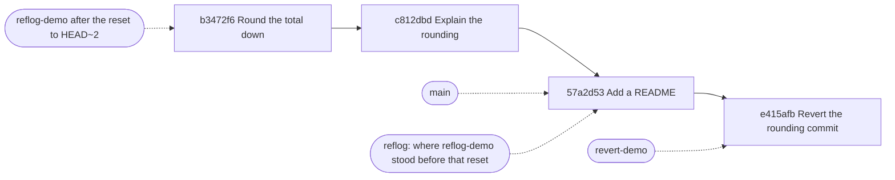

## Bạn cần biết trước

- [[foundation.l2.git-merge-vs-rebase]] — rebase viết ra các commit mới với id mới và dời tên branch sang đó, trong khi các commit gốc vẫn còn. Bài này đem sự thật đó ra dùng.

## Tình huống

Các bài Git thực hành trên một repository dùng xong bỏ, gọi là repository thử nghiệm, không bao giờ trên code đặt hàng. Mỗi script dựng lại nó trước khi chạy: sáu commit trên `main`, và một script `total.sh` cộng dồn một bảng giá. Bạn chạy nó và tổng trả về bị làm tròn xuống tới triệu gần nhất: mọi thứ dưới một triệu biến mất, và hóa đơn không hề ghi điều đó. Một dòng duy nhất làm việc làm tròn, và comment của dòng đó chỉ nói hóa đơn trông gọn hơn như vậy. Thay đổi này đã cũ, mọi bản sao của repository đều đã có nó, và không ai nhớ mình đã viết nó. Dòng đó xuất hiện khi nào, vì sao, và làm sao gỡ nó khỏi một lịch sử mà người khác đã giữ?

## Khái niệm cốt lõi

- `git log -- <path>` — trong một lịch sử thẳng như của repository thử nghiệm, đây là mọi commit đã đổi đường dẫn đó. Dấu `--` đánh dấu phần sau nó là đường dẫn, điều này quan trọng khi một cái tên cũng có thể được hiểu là tên branch.
- blame — với từng dòng của một file, commit gần nhất đã đổi dòng đó, in cạnh dòng kèm tác giả và ngày.
- reset — dời tên branch hiện tại sang một commit khác. `--soft` chỉ dời tên, `--mixed` còn bỏ đánh dấu những thay đổi bạn đã stage — những thay đổi được đánh dấu để vào commit kế tiếp — và `--hard` còn ghi đè mọi file Git đang giữ phiên bản bằng phiên bản ở commit đó, vứt bỏ những thay đổi bạn chưa commit.
- revert — viết một commit mới có thay đổi ngược lại với một commit được chỉ định, để yên mọi commit đã có trong lịch sử. Một lần push, tức gửi các commit mới lên repository dùng chung, mang nó đi như mọi commit khác.
- reflog — `HEAD` là commit bạn đang đứng. Reflog là một nhật ký, chỉ nằm trong repository của riêng bạn, ghi các commit gần đây mà `HEAD` và từng branch đã trỏ tới, mỗi lần dời là một dòng.
- amend và squash — hai cách thay commit: amend đổi commit bạn vừa tạo lấy một commit có thông điệp hoặc nội dung đã sửa, squash đổi nhiều commit lấy một commit mang thay đổi gộp của chúng. Cả hai đều tạo id mới, và không cái nào chạy trong các script của bài này.

## Cơ chế hoạt động



Mũi tên liền đi từ một commit tới commit sau nó. Mũi tên chấm là các tên, và một dòng reflog, trỏ vào một commit. Cả hai demo đều bắt đầu từ `main` ở `57a2d53`: revert được viết trên `revert-demo`, còn reset dời `reflog-demo`.

Đọc trước. `git log --oneline -- total.sh` in các commit đã đổi file đó, mới nhất trước: ba dòng trên tổng sáu commit. `git blame total.sh` in cạnh mỗi dòng commit gần nhất đã đổi nó, kèm tác giả và ngày, nên dòng làm tròn trả lời bằng `b3472f64`. `git log -1` với id đó in thông điệp của commit, thứ gần nhất với một lý do.

Hoàn tác sau, theo một trong hai hình. `git revert b3472f6` viết ra `e415afb`, một commit mới có thay đổi ngược với `b3472f6`, và cả hai cùng ở lại. Sau khi push, mọi bản sao khác nhận được nó ở lần cập nhật kế tiếp từ repository dùng chung. `git reset --hard HEAD~2` thì dời tên branch lùi hai commit, về `b3472f6`, và làm file khớp theo: nó bỏ hai commit sau commit làm tròn, và phải reset lùi thêm một bước nữa, qua khỏi `b3472f6`, thì mới bỏ luôn phần làm tròn.

Hai commit bị bỏ lại chưa mất: reflog đã ghi chỗ tên branch đứng trước lần reset, nên reset về dòng đó sẽ đưa tên và file trở lại. Rebase dời tên branch theo cùng kiểu, nên dòng reflog từ trước lần rebase chính là đường quay về.

Khi một commit đã nằm trên repository dùng chung, revert là hình an toàn: nó chỉ thêm, còn push một branch đã reset sẽ bắt repository dùng chung bỏ những commit nó đã có, nên repository đó từ chối. Cùng ranh giới ấy áp dụng cho `git commit --amend` và squash: cả hai viết commit mới với id mới, ổn khi bạn chưa chia sẻ, thành vấn đề khi người khác đã giữ bản gốc.

## Trong hệ thống Đơn Hàng

Script đầu tiên đọc lịch sử của một file, rồi hoàn tác một commit theo cách mà lịch sử dùng chung cho phép:

```bash file=scripts/git/blame-and-log.sh tag=stage-0 lines=10-29
echo "every commit that touched one file:"
git log --oneline -- total.sh

echo
echo "who last changed each line, and in which commit:"
git blame total.sh

echo
echo "why that line changed, in the commit's own words:"
git log -1 --format='%h %ad%n%n%s' --date=short \
    "$(git log --format=%H -1 --grep='Round the total')"

echo
echo "revert adds a new commit that undoes an old one:"
export GIT_AUTHOR_DATE='2026-02-10T09:00:00+07:00'
export GIT_COMMITTER_DATE='2026-02-10T09:00:00+07:00'
git switch --quiet -c revert-demo main
git revert --no-edit "$(git log --format=%H -1 --grep='Round the total')" >/dev/null
git log --oneline -3
./test.sh
```

```text output=true
every commit that touched one file:
c812dbd Explain the rounding
b3472f6 Round the total down to millions
d915e63 Add total.sh and a check for it

who last changed each line, and in which commit:
...
b3472f64 (Mai Anh 2026-02-05 12:00:00 +0700 9) echo $(( (total / 1000000) * 1000000 ))

why that line changed, in the commit's own words:
b3472f6 2026-02-05

Round the total down to millions

revert adds a new commit that undoes an old one:
e415afb Revert "Round the total down to millions"
57a2d53 Add a README
c812dbd Explain the rounding
ok
```

Dấu `...` đánh dấu tám dòng blame phía trước, bị cắt ở đây, không phải thứ script in ra. Dòng blame của phần làm tròn mang `b3472f64`, cùng commit mà log gọi là `b3472f6` — blame rút gọn id theo độ dài khác — và số `9` trước dấu đóng ngoặc là số dòng, dòng cuối của file. `c812dbd` chỉ thêm comment phía trên dòng đó, nên blame gọi tên `b3472f6` cho chính dòng ấy.

Lệnh thứ ba tìm commit theo thông điệp: `--grep` giữ các commit có thông điệp khớp, `-1` lấy commit mới nhất, `%H` in id đầy đủ, và `$( … )` dán id đó vào lệnh `git log -1` bên ngoài. Ở lệnh ngoài, `%h` là id rút gọn, `%ad` là ngày tác giả, `%n` là xuống dòng và `%s` là dòng đầu của thông điệp. `--date=short` bỏ phần giờ.

Hai ngày được export chỉ để cố định id của commit mới, cho khớp với id trên máy bạn. Sau đó script revert trên một branch dùng xong bỏ, trong đó `--no-edit` giữ thông điệp Git tự viết thay vì hỏi bạn, còn `>/dev/null` giấu phần báo cáo của lệnh revert. Log cho thấy `e415afb` được thêm lên trên, với `c812dbd`, commit ngay sau `b3472f6`, vẫn nằm dưới nó, nên `b3472f6` cũng vẫn còn. `./test.sh`, phần kiểm tra đi kèm `total.sh`, in `ok` vì tổng lại là phép cộng bình thường.

Script thứ hai đi theo hình còn lại, rồi thoát ra khỏi nó:

```bash file=scripts/git/recover-with-reflog.sh tag=stage-0 lines=10-27
git switch --quiet -c reflog-demo main

echo "where the branch points now:"
git log --oneline -1

echo
echo "after git reset --hard HEAD~2:"
git reset --hard --quiet HEAD~2
git log --oneline -1

echo
echo "reflog remembers every place HEAD has been:"
git reflog -4

echo
echo "so the two commits are one command away:"
git reset --hard --quiet "$(git reflog --format=%H -1 reflog-demo@{1})"
git log --oneline -3
```

```text output=true
where the branch points now:
57a2d53 Add a README

after git reset --hard HEAD~2:
b3472f6 Round the total down to millions

reflog remembers every place HEAD has been:
b3472f6 HEAD@{0}: reset: moving to HEAD~2
57a2d53 HEAD@{1}: checkout: moving from main to reflog-demo
57a2d53 HEAD@{2}: checkout: moving from feature/currency to main
2f97b1c HEAD@{3}: commit: Print the total in đồng

so the two commits are one command away:
57a2d53 Add a README
c812dbd Explain the rounding
b3472f6 Round the total down to millions
```

Branch bắt đầu ở chỗ `main` đang đứng, tại `57a2d53`. `git reset --hard HEAD~2` dời nó lùi hai commit về `b3472f6` — `HEAD~2` nghĩa là lùi hai bước, đi theo cha thứ nhất, tức branch bạn đang đứng lúc merge, mỗi khi một commit có hai cha — và hai commit ở giữa không còn trên `reflog-demo`. Ở đây `main` vẫn giữ chúng. Nếu đó là branch duy nhất của bạn, chỉ reflog còn với tới được chúng.

`git reflog -4` in bốn vị trí gần nhất mà `HEAD` đã đứng, mới nhất trước, mỗi dòng ghi thứ đã dời nó: lần reset ở `HEAD@{0}`, và ngay dưới, ở `HEAD@{1}`, là `57a2d53`, chỗ lần reset xuất phát. `checkout:` là nhãn cho một lần dời do `git switch` thực hiện. Hai dòng cũ hơn là các lần dời mà script dựng repository thử nghiệm đã làm trước demo này. `name@{n}` nghĩa là chỗ tên đó đứng cách đây n lần dời. Chuyển branch thêm một dòng vào nhật ký của `HEAD` nhưng không thêm vào nhật ký riêng của branch. Vì vậy `reflog-demo@{1}`, cách một lần dời với branch đó, là `57a2d53`, và lệnh cuối reset về đó. Cả hai nhật ký đều chỉ nằm trên máy bạn.

## Người mới hay nghĩ rằng…

- **"git reset --hard xóa commit của tôi vĩnh viễn."** → Thực ra reset dời một tên branch, còn các commit nó từng trỏ tới vẫn ở trong repository từ vài tuần tới vài tháng, vẫn với tới được qua reflog. Bạn sẽ nhận ra khi `git reflog` in ra đúng id bạn tưởng đã hủy, và một lần reset về đó đưa mọi thứ trở lại.
- **"Revert và reset là một."** → Thực ra revert thêm một commit và không đổi gì đã tồn tại, còn reset đổi chỗ một tên trỏ tới và không thêm gì. Bạn sẽ nhận ra khi revert push được như mọi commit khác, còn reset để branch của bạn tụt lại sau bản trên repository dùng chung, nên lần push bị từ chối.
- **"blame cho biết ai có lỗi."** → Thực ra nó chỉ gọi tên commit gần nhất đã đụng vào mỗi dòng, và một lần đổi thụt lề hay định dạng lại cũng tính là đụng vào. Bạn sẽ nhận ra khi mọi dòng của một file đều trỏ về một commit không đổi chút hành vi nào.

## Thử ngay (3 phút)

1. Từ thư mục gốc của hệ thống ví dụ, chạy `scripts/up.sh`, script khởi động lab, tức máy Linux nhỏ mà các script chạy bên trong, rồi chạy `scripts/git/blame-and-log.sh` và `scripts/git/recover-with-reflog.sh`. Mỗi script dựng lại repository thử nghiệm với tác giả và ngày cố định, nên id trên máy bạn khớp với id bên dưới.
2. Trong kết quả thứ nhất, đọc id cạnh dòng cuối của `total.sh` trong phần blame, rồi tìm cùng commit đó trong phần log phía trên.
3. Trong kết quả thứ hai, so id mà branch trỏ tới trước lần reset, sau lần reset và sau lệnh cuối, rồi đọc dòng `HEAD@{1}` của reflog ở giữa.

Kết quả mong đợi: dòng blame của phần làm tròn mang `b3472f64`, và log liệt kê cùng commit đó là `b3472f6`. Branch đi từ `57a2d53`, sang `b3472f6`, rồi về lại `57a2d53`, đúng id mà dòng `HEAD@{1}` hiển thị.

## Liên hệ

- [[foundation.l2.git-merge-vs-rebase]] — bài cần học trước: một lần rebase bạn hối hận được hoàn tác bằng cách reset về id mà reflog đã giữ.
- [[foundation.l2.git-bisect]] — bài sau, kết thúc với một commit trong tay bạn. Bài này là thứ bạn làm với commit đó.
- [[foundation.l2.good-commits]] — blame và revert làm việc từng commit một, nên một commit chứa đúng một thay đổi có thể được đọc và hoàn tác riêng.
- [[foundation.l1.reading-code]] — quá khứ của một file là thêm một lối để đọc đoạn code không ai giải thích được.

## Tóm tắt 5 dòng

1. Git ghi lại các tên đã từng ở đâu, nên lịch sử có thể được đọc, hoàn tác và cứu lại mà không mất các commit bạn đã viết.
2. `git log -- <path>` và `git blame` trả lời một dòng đổi khi nào và trong commit nào. Thông điệp của commit đó là thứ gần nhất với lý do.
3. `revert` thêm một commit đảo ngược commit khác và là cách hoàn tác hợp với lịch sử người khác đang giữ. `reset` thì dời một tên branch.
4. `--soft`, `--mixed` và `--hard` quyết định reset đi xa tới đâu: chỉ tên, thêm cả dấu stage, hay cả file của bạn.
5. Reflog giữ các vị trí gần đây của `HEAD` và từng branch, nên một commit mất vì reset hay rebase sai gần như luôn cứu lại được.
