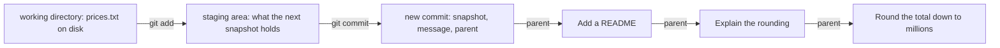

## Before you start

- [[foundation.l1.terminal-basics]] — a shell reads one typed line, runs the program its first word names, and hands the rest over as arguments. Here that program is always `git`.

## The situation

In the example system you run `git-playground/build-history.sh`, which builds a throwaway repository whose main line of history holds six saved states of a tiny project: a price list and a script that totals it. Inside it you add a headset to `prices.txt`, then ask `git status --short`, which answers ` M prices.txt`. You run `git add prices.txt` and ask again: `M  prices.txt` — the same letter, moved one column to the left. Nothing else changed, and nothing was added to the list of saved states. You expected saving to Git to be one step, the way saving a document is. Where is your change now, and what moved it?

## Core concepts

- working directory — the project's files as they sit on disk: the ones your editor opens and a script edits. Git's documentation calls it the working tree.
- staging area — the list Git keeps of what the next snapshot will hold; `git add <file>` copies that file's content, as it stands at that second, into the list.
- repository — the `.git` folder next to your files, where every snapshot Git has been given is kept, on your own machine.
- **commit** — one snapshot of every file Git has been told to keep — here, every file in the playground folder — stored with who made it, when, the message you typed, and a pointer to the commit it was made from.
- parent — that pointer. Following parents backwards from where you stand is how the history is read.
- commit id — the name a commit gets, computed from everything the commit holds: the snapshot, the parent, the author and committer with their times, and the message. Save the same change a minute later, or onto another parent, and the name differs.

## How it works



The first two arrows are steps you run; the last three are parent pointers, so time runs the other way and the commit furthest right is the oldest.

In the situation above, editing `prices.txt` changed the working directory and nothing else, so Git reported the file as modified and nothing was saved. `git add prices.txt` then copied that content into the staging area. The moved letter reports exactly that: `git status --short` prints two columns, the left for the staging area and the right for the working directory, so ` M` means changed on disk only and `M ` means copied into the staging area as well.

`git commit` takes whatever the staging area holds, writes it into the repository as a complete snapshot, and records alongside it the author, the time, the message, and the id of the commit you were standing on — the newest one in the history you are reading, which Git calls `HEAD`. That last field is the parent, and the whole step happens inside the `.git` folder on your machine.

The three commits on the right are the newest on the main line of history the playground builds. Each commit points back; none points forward. To read the history Git starts where you are and follows parents until a commit has none left. Because one commit can name two parents, and two commits can name the same parent, the shape is a graph rather than a line; that happens when two lines of work are joined again, which [[foundation.l2.git-branches]] shows. Every commit in this playground names one parent, so what you see is a line; the graph appears as soon as a commit names two. `git log --oneline --graph` is the command that draws it.

## In the Đơn Hàng system

The playground repository is built by a script whose first job is to make every commit id in these lessons the same on every machine. It sets six environment variables, and the shell hands them to `git`: that is how `git commit` learns the author, the committer and the times. Read those six lines and the two commands inside `save`; the rest only writes files and calls `save`:

```bash file=git-playground/build-history.sh tag=stage-0 lines=13-31
# Fixed author, committer and dates, so that every commit id below is the same
# on every machine and the lessons can quote them.
export GIT_AUTHOR_NAME='Mai Anh'
export GIT_AUTHOR_EMAIL='mai.anh@example.com'
export GIT_COMMITTER_NAME='Mai Anh'
export GIT_COMMITTER_EMAIL='mai.anh@example.com'

save() {  # save <date> <message>
    export GIT_AUTHOR_DATE="$1" GIT_COMMITTER_DATE="$1"
    git add -A
    git commit --quiet --message "$2"
}

git init --quiet --initial-branch=main
git config user.name 'Mai Anh'
git config user.email 'mai.anh@example.com'

printf 'keyboard 1250000\n' > prices.txt
save '2026-02-02T09:00:00+07:00' 'Add the price list'
```

Those four names, and the two dates `save` exports before every pair of commands, are not tidiness: the author and committer lines, times included, are part of the content an id is computed from. The author is who wrote the change, the committer is who wrote it into the repository, usually the same person. Fix those four names and the two dates, and every machine computes the same ids; leave them out and the same six changes give six different ones.

Inside `save` are the two steps of the diagram, one line each: `git add -A` makes the staging area match the whole working directory — files created, changed and deleted alike — and `git commit --message` writes the snapshot. Below it `git init` creates the empty repository, and `git config` records the same two names in the repository itself, for commits made without those variables.

The next script asks the repository what it just built; its `git show --stat` line lists the files the newest commit changed:

```bash file=scripts/git/inspect-commit.sh tag=stage-0 lines=10-27
echo "the two commands to run before anything else:"
git status --short --branch
git log --oneline --graph -6

echo
echo "what changed in the newest commit:"
git show --stat --oneline HEAD

echo
echo "the commit object itself:"
git cat-file -p HEAD

echo
echo "the three places a change passes through:"
printf 'keyboard 1250000\nmouse 450000\nheadset 890000\n' > prices.txt
git status --short
git add prices.txt
git status --short
```

```text output=true
the two commands to run before anything else:
...
* 57a2d53 Add a README
* c812dbd Explain the rounding
...
the commit object itself:
tree e33dfc0fd24dcdf16ead4ac0ad48b630eccd32ed
parent c812dbd1cc33d3b7b673ab3665b9e032375e5f99
author Mai Anh <mai.anh@example.com> 1770447600 +0700
committer Mai Anh <mai.anh@example.com> 1770447600 +0700

Add a README

the three places a change passes through:
 M prices.txt
M  prices.txt
```

`git cat-file -p HEAD` prints one commit exactly as Git stored it — here the newest. That listing is the whole idea of this lesson in six lines: a `tree` line naming the snapshot, a `parent` line naming the commit before it, an author and a committer each with a time, a blank line, then the message. The id on the `parent` line begins `c812dbd`, which is also the second `*` line of the listing above it — the arrow from the diagram, on screen.

Because the id is computed from that content, a commit cannot be edited in place. Commands that look like editing, which you meet in [[foundation.l2.git-history-and-recovery]], write a new commit with a new id; the old one stays until Git clears away what nothing points to.

The script's first line names a habit worth keeping: run `git status` and `git log --oneline --graph` before anything else, every time; between them they answer where you are standing and what is not saved yet. In their output the line beginning `##` is about names and a copy on a server; ignore it and meet it in [[foundation.l2.git-branches]].

## Beginners often think…

- **"Git stores differences, so a commit is a change."** → Actually a commit names a complete snapshot: the `tree` line above is the whole project at that moment, not the lines that differ. Git computes a difference when you ask for one and compresses what it stores, but what a commit *means* is a state. You notice this when you run the script: `git show --stat` names the one file that commit changed, while its `tree` line names the whole project.
- **"Committing sends my code to the server."** → Actually `git commit` writes into the `.git` folder next to your own files; the command that sends your commits to another repository is `git push`, so a laptop with no connection can commit all day. You notice this when your work has been committed for a week and a colleague asks where it is.
- **"`git add` saves my work, so I can keep editing and the save keeps up."** → Actually `git add` copies the content as it stands at that second. Edit the file again and `git status --short` marks both columns: the copy in the staging area and the file on disk no longer agree. You notice this when you commit and the edit you made last is missing from the snapshot.

## Try it (3 minutes)

1. From the top folder of the example system, run `scripts/up.sh` first if you have not started the lab in this session — the commands here run inside it. Then run `scripts/git/inspect-commit.sh`, which builds the playground repository before reading it.
2. In its output, find the block under `the commit object itself:` and compare the first seven characters of the id on its `parent` line with the second `*` line of the listing printed near the top.
3. Read the last two lines, the ones naming `prices.txt`, and say which column belongs to the staging area.

Expected result: the id on the `parent` line begins `c812dbd`, and `* c812dbd Explain the rounding` is the second `*` line of that listing — the newest commit names the one before it. The last two lines are ` M prices.txt`, then `M  prices.txt`: the left column is the staging area, so the first says the change is on disk only and the second says `git add` has copied it there.

## Connections

- [[foundation.l1.terminal-basics]] — prerequisite: every line here is one the shell reads and hands to `git`.
- [[foundation.l2.git-branches]] — the next step, and the lesson that explains the `##` line this one told you to ignore.
- [[foundation.l2.git-history-and-recovery]] — where the parent pointers pay off: because nothing is edited in place, a snapshot you think you lost is usually still there.
- [[foundation.l2.good-commits]] — the same snapshot as a unit of communication: what belongs in one, and what its message owes the next reader.

## Five-line summary

1. A commit is a full snapshot of the files Git keeps, plus its author, time, message and a pointer to its parent.
2. Those pointers run backwards only, so the history is a graph you walk from where you stand, not a list of versions.
3. A change passes three places: the working directory, the staging area `git add` writes to, and the repository `git commit` writes to.
4. A commit id is computed from its own content, so nothing is edited in place and the same change saved twice gives two different commits.
5. A habit worth keeping: run `git status` and `git log --oneline --graph` first; they say where you stand and what is not saved yet.
