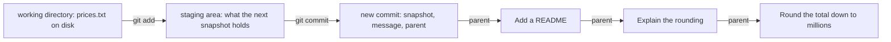

## Before you start

- [[foundation.l1.terminal-basics]] — a shell reads one typed line, runs the program its first word names, and hands the rest over as arguments. Here that program is always `git`.

## The situation

In the example system you run `git-playground/build-history.sh`, which builds a throwaway repository whose main line of history holds six saved states of a tiny project built around a price list: the list, a script that totals it, a check for that script and a README. Inside it you add a headset to `prices.txt`, then ask `git status --short`, which answers ` M prices.txt`. You run `git add prices.txt` and ask again: `M  prices.txt` — the same letter, moved one column to the left. Nothing was added to the list of saved states. You expected saving to Git to be one step, the way saving a document is. Where is your change now, and what moved it?

## Core concepts

- working directory — the project's files as they sit on disk, the ones your editor opens. Git's documentation calls it the working tree.
- staging area — the list Git keeps of what the next snapshot will hold; `git add <file>` copies that file's content, as it stands at that second, into the list.
- repository — the `.git` folder next to your files, where every snapshot Git has been given is kept, on your own machine.
- **commit** — one snapshot of every file Git has been told to keep, stored with who made it, when, the message you typed, and a pointer to the commit it was made from.
- parent — that pointer. Following parents backwards from where you stand is how the history is read.
- commit id — the name a commit gets, computed from everything the commit holds: the snapshot, the parent, the author (who wrote the change) and the committer (who wrote it into the repository, usually the same person) with their times, and the message. Save the same change a minute later, or onto another parent, and the name differs.

## How it works


```mermaid
flowchart LR
  W["working directory: prices.txt on disk"] -->|"git add"| S["staging area: what the next snapshot holds"]
  S -->|"git commit"| C["new commit: snapshot, message, parent"]
  C -->|"parent"| P1["Add a README"]
  P1 -->|"parent"| P2["Explain the rounding"]
  P2 -->|"parent"| P3["Round the total down to millions"]
```

The first two arrows are steps you run; the last three are parent pointers, so time runs right to left: the rightmost commit is the oldest drawn.

In the situation above, editing `prices.txt` changed only the working directory; `git add prices.txt` then copied that content into the staging area. The moved letter reports exactly that: `git status --short` prints two columns, the left for the staging area and the right for the working directory, so ` M` means changed on disk only and `M ` means copied into the staging area as well.

`git commit` takes whatever the staging area holds, writes it into the repository as a complete snapshot, and records alongside it the author, the time, the message, and the id of the commit you are standing on, which Git calls `HEAD` — here the newest one on this line of history. That last field is the parent, and the whole step happens inside the `.git` folder on your machine.

The three commits on the right are the newest on `main`, the line of history the playground leaves you on. Each commit points back; none points forward, so Git reads history by starting where you are and following parents until a commit has none left. A graph is commits joined by parent arrows, where two arrows may leave one commit or arrive at it. Commits form one because a commit can name two parents, when two lines of work are joined again, and two commits can name the same parent — two people starting work from one commit, say; [[foundation.l2.git-branches]] shows how. Here every commit names at most one parent — the oldest, `Add the price list`, names none, where the walk stops — so `git log --oneline --graph` draws a line.

## In the Đơn Hàng system

The playground is built by a script that makes every commit id in these lessons the same on every machine: its six environment variables tell `git commit` the author, the committer and the times. Read the `export` lines, then the two commands inside `save`:

```bash file=git-playground/build-history.sh tag=stage-0 lines=13-31
# Fixed author, committer and dates, so that every commit id below is the same
# on every machine and the lessons can quote them.
export GIT_AUTHOR_NAME='Mai Anh'
export GIT_AUTHOR_EMAIL='mai.anh@example.com'
export GIT_COMMITTER_NAME='Mai Anh'
export GIT_COMMITTER_EMAIL='mai.anh@example.com'

save() {  # save <date> <message>
    export GIT_AUTHOR_DATE="$1" GIT_COMMITTER_DATE="$1"
    git add -A
    git commit --quiet --message "$2"
}

git init --quiet --initial-branch=main
git config user.name 'Mai Anh'
git config user.email 'mai.anh@example.com'

printf 'keyboard 1250000\n' > prices.txt
save '2026-02-02T09:00:00+07:00' 'Add the price list'
```

Those names and dates are not tidiness: the author and committer lines, times included, are part of the content an id is computed from. Fix those two names, two emails and two dates, and the same six changes give the same ids on every machine; without them, other ids.

The files must match too. A snapshot also records, for each file, whether it is marked runnable, so that mark is part of the content: the lab box always records `total.sh` and `test.sh` as runnable, which a laptop may not.

Inside `save` (`$1` and `$2` are the date and message it was given) are the two steps of the diagram: `git add -A` makes the staging area match the whole working directory — files created, changed and deleted alike — and `git commit --message` writes the snapshot. Below it `git init` creates the empty repository (`--initial-branch=main` names the line of history `main`), and `git config` records the same name and email for commits made without those variables.

The next script asks the repository what it just built; `git show --stat` lists the files the newest commit changed. `git log --oneline` prints one commit per line, newest first: its id shortened, here to seven characters, then the message. With `--graph` each `*` is one commit; the second `...` below hides the four older ones.

```bash file=scripts/git/inspect-commit.sh tag=stage-0 lines=10-27
echo "the two commands to run before anything else:"
git status --short --branch
git log --oneline --graph -6

echo
echo "what changed in the newest commit:"
git show --stat --oneline HEAD

echo
echo "the commit object itself:"
git cat-file -p HEAD

echo
echo "the three places a change passes through:"
printf 'keyboard 1250000\nmouse 450000\nheadset 890000\n' > prices.txt
git status --short
git add prices.txt
git status --short
```

```text output=true
the two commands to run before anything else:
...
* 57a2d53 Add a README
* c812dbd Explain the rounding
...
what changed in the newest commit:
57a2d53 Add a README
 README.md | 14 ++++++++++++++
 1 file changed, 14 insertions(+)

the commit object itself:
tree e33dfc0fd24dcdf16ead4ac0ad48b630eccd32ed
parent c812dbd1cc33d3b7b673ab3665b9e032375e5f99
author Mai Anh <mai.anh@example.com> 1770447600 +0700
committer Mai Anh <mai.anh@example.com> 1770447600 +0700

Add a README

the three places a change passes through:
 M prices.txt
M  prices.txt
```

`git cat-file -p HEAD` prints the content of one commit as Git recorded it, here the newest: a `tree` line naming the snapshot, a `parent` line naming the commit before it, an author and a committer each with a time — seconds counted from the start of 1970 plus the time zone, the date the script exported — a blank line, then the message. The id on the `parent` line begins `c812dbd`, the second `*` line of the listing above it: the arrow from the diagram, on screen.

Because the id is computed from that content, a commit cannot be edited in place. Commands that look like editing, which you meet in [[foundation.l2.git-history-and-recovery]], write a new commit with a new id; the old one stays until Git clears away commits that no commit, and no name such as `HEAD`, leads to any more.

The first line the script prints names a habit worth keeping: run `git status` and `git log --oneline --graph` before anything else; between them they show where you stand and what is not saved yet. The `##` line, printed by `--branch` and hidden above by the first `...`, is about names and a copy kept in another repository; ignore it until [[foundation.l2.git-branches]].

## Beginners often think…

- **"Git stores differences, so a commit is a change."** → Actually a commit names a complete snapshot: the `tree` line above is the whole project at that moment, not the lines that differ. Git computes a difference when asked and compresses what it stores, but a commit *means* a state. You notice this in the script's output: `git show --stat` names the one file that commit changed, while its `tree` line names the whole project.
- **"Committing sends my code to the server."** → Actually `git commit` writes into the `.git` folder next to your own files; the command that sends your commits to another repository is `git push`, so a laptop with no connection can commit all day. You notice this when a colleague asks where your week of committed work is.
- **"`git add` saves my work, so I can keep editing and the save keeps up."** → Actually `git add` copies the content as it stands at that second. Edit the file again and `git status --short` marks both columns: the copy in the staging area and the file on disk no longer agree. You notice this when your last edit is missing from the commit.

## Try it (3 minutes)

1. In a terminal on your laptop, at the top folder of the example system, run `scripts/up.sh` if the lab box is not up. Then run `scripts/git/inspect-commit.sh`; it moves itself into the lab box and builds the playground repository before reading it.
2. In its output, find the block under `the commit object itself:` and compare the first seven characters of the id on its `parent` line with the second `*` line of the listing printed near the top.
3. Read the last two lines, the ones naming `prices.txt`, and say which column belongs to the staging area.

Expected result: the id on the `parent` line begins `c812dbd`, and `* c812dbd Explain the rounding` is the second `*` line: the newest commit names the one before it. The last two lines are ` M prices.txt`, then `M  prices.txt`; the left column is the staging area, so `git add` has copied the change there.

## Connections

- [[foundation.l1.terminal-basics]] — prerequisite: the shell hands each line here to `git`.
- [[foundation.l2.git-branches]] — the next step; it explains the `##` line.
- [[foundation.l2.git-history-and-recovery]] — because nothing is edited in place, a snapshot you think you lost is usually still there.
- [[foundation.l2.good-commits]] — what belongs in one commit, and what its message owes the next reader.

## Five-line summary

1. A commit is a full snapshot of the files Git keeps, plus its author, time, message and a pointer to its parent.
2. Pointers run backwards only, so you walk history from where you stand; a commit can name two parents, so it is a graph.
3. A change passes three places: the working directory, the staging area `git add` writes to, and the repository `git commit` writes to.
4. A commit id is computed from its content: nothing is edited in place, and a change saved later or onto another parent gets another id.
5. A habit worth keeping: run `git status` and `git log --oneline --graph` first; they say where you stand and what is not saved yet.
