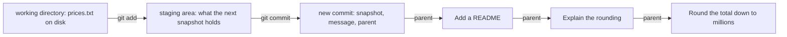

## Bạn cần biết trước

- [[foundation.l1.terminal-basics]] — shell đọc một dòng bạn gõ, chạy chương trình mà từ đầu tiên gọi tên, và chuyển phần còn lại cho chương trình đó làm tham số. Ở bài này, chương trình đó luôn là `git`.

## Tình huống

Trong hệ thống ví dụ, bạn chạy `git-playground/build-history.sh`. Script này dựng một repository dùng xong bỏ, với dòng lịch sử chính giữ sáu trạng thái đã lưu của một project nhỏ xoay quanh một bảng giá: bảng giá, một script cộng tổng, một script kiểm tra script đó và một README. Trong repository ấy, bạn thêm một chiếc tai nghe vào `prices.txt`, rồi hỏi `git status --short`, lệnh này trả lời ` M prices.txt`. Bạn chạy `git add prices.txt` và hỏi lại: `M  prices.txt` — vẫn chữ cái đó, chỉ dịch sang trái một cột. Danh sách trạng thái đã lưu không thêm gì. Bạn tưởng lưu vào Git chỉ là một bước, như lưu một tài liệu. Vậy thay đổi của bạn giờ đang ở đâu, và thứ gì đã chuyển nó đi?

## Khái niệm cốt lõi

- working directory — các file của project đúng như chúng nằm trên đĩa, những file mà editor mở ra. Tài liệu của Git gọi nó là working tree.
- staging area — danh sách Git giữ về những gì ảnh chụp kế tiếp sẽ chứa. `git add <file>` chép nội dung file đó, đúng như nó đang có ở giây đó, vào danh sách này.
- repository — thư mục `.git` nằm cạnh các file của bạn, nơi giữ mọi ảnh chụp đã giao cho Git, ngay trên máy bạn.
- **commit** (một ảnh chụp toàn bộ project tại một thời điểm, có id, tác giả, thông điệp, và cha) — một ảnh chụp của mọi file mà Git được dặn phải giữ, lưu kèm người tạo, thời điểm tạo, thông điệp bạn gõ, và một con trỏ tới commit mà nó được tạo ra từ đó.
- cha (parent) — chính con trỏ đó. Lần theo cha ngược về từ chỗ bạn đang đứng là cách đọc lịch sử.
- id commit — cái tên một commit nhận được, tính từ mọi thứ commit chứa: ảnh chụp, cha, author (người viết thay đổi) và committer (người ghi nó vào repository, thường là cùng một người) kèm thời điểm của họ, và thông điệp. Lưu cùng thay đổi đó một phút sau, hoặc lên một cha khác, là ra tên khác.

## Cơ chế hoạt động



Hai mũi tên đầu là những bước bạn chạy. Ba mũi tên sau là con trỏ tới cha, nên thời gian chạy từ phải sang trái: commit ngoài cùng bên phải là commit cũ nhất trong hình.

Trong tình huống trên, sửa `prices.txt` chỉ đổi working directory. Sau đó `git add prices.txt` chép nội dung ấy vào staging area. Chữ cái dịch cột báo đúng điều đó: `git status --short` in hai cột, cột trái cho staging area và cột phải cho working directory, nên ` M` nghĩa là chỉ đổi trên đĩa, còn `M ` nghĩa là đã chép cả vào staging area.

`git commit` lấy những gì staging area đang giữ, ghi vào repository thành một ảnh chụp đầy đủ, và ghi kèm author, thời điểm, thông điệp, cùng id của commit bạn đang đứng — Git gọi nó là `HEAD`, ở đây là commit mới nhất trên dòng lịch sử này. Trường cuối cùng đó chính là cha, và cả bước này diễn ra bên trong thư mục `.git` trên máy bạn.

Ba commit bên phải là ba commit mới nhất trên `main`, dòng lịch sử mà playground để bạn đứng khi chạy xong. Mỗi commit trỏ ngược về trước, không commit nào trỏ tới sau, nên Git đọc lịch sử bằng cách bắt đầu từ chỗ bạn đứng và lần theo cha cho tới khi gặp commit không còn cha. Đồ thị là các commit nối với nhau bằng mũi tên tới cha, trong đó hai mũi tên có thể cùng đi ra từ một commit hoặc cùng đi vào một commit. Commit tạo thành đồ thị vì một commit có thể ghi tên hai cha, khi hai dòng công việc được nhập lại, và hai commit có thể ghi tên cùng một cha — chẳng hạn hai người cùng bắt đầu làm từ một commit. [[foundation.l2.git-branches]] cho thấy cách làm. Ở đây mỗi commit ghi tên nhiều nhất một cha — commit cũ nhất, `Add the price list`, không ghi tên cha nào, và lần ngược dừng ở đó — nên `git log --oneline --graph` vẽ ra một đường thẳng.

## Trong hệ thống Đơn Hàng

Playground được dựng bởi một script khiến mọi id commit trong các bài này giống nhau trên mọi máy: sáu biến môi trường của nó cho `git commit` biết author, committer và các thời điểm. Đọc các dòng `export`, rồi hai lệnh bên trong `save`:

```bash file=git-playground/build-history.sh tag=stage-0 lines=13-31
# Fixed author, committer and dates, so that every commit id below is the same
# on every machine and the lessons can quote them.
export GIT_AUTHOR_NAME='Mai Anh'
export GIT_AUTHOR_EMAIL='mai.anh@example.com'
export GIT_COMMITTER_NAME='Mai Anh'
export GIT_COMMITTER_EMAIL='mai.anh@example.com'

save() {  # save <date> <message>
    export GIT_AUTHOR_DATE="$1" GIT_COMMITTER_DATE="$1"
    git add -A
    git commit --quiet --message "$2"
}

git init --quiet --initial-branch=main
git config user.name 'Mai Anh'
git config user.email 'mai.anh@example.com'

printf 'keyboard 1250000\n' > prices.txt
save '2026-02-02T09:00:00+07:00' 'Add the price list'
```

Những tên và ngày đó không phải để cho gọn gàng: dòng author và dòng committer, kể cả thời điểm, là một phần nội dung dùng để tính id. Cố định hai tên, hai email và hai ngày đó, thì cùng sáu thay đổi sẽ cho cùng các id trên mọi máy. Không cố định, id sẽ khác.

Các file cũng phải khớp. Ảnh chụp còn ghi lại, với từng file, file đó có được đánh dấu là chạy được hay không, nên dấu đó cũng là một phần nội dung: lab box luôn ghi `total.sh` và `test.sh` là chạy được, điều mà laptop chưa chắc làm.

Bên trong `save` (`$1` và `$2` là ngày và thông điệp được truyền vào) là hai bước của sơ đồ: `git add -A` làm staging area khớp với toàn bộ working directory — file tạo mới, file bị sửa và file bị xóa đều như nhau — và `git commit --message` ghi ảnh chụp. Bên dưới, `git init` tạo repository rỗng (`--initial-branch=main` đặt tên dòng lịch sử là `main`), và `git config` ghi cùng tên và email đó cho những commit tạo ra mà không có các biến kia.

Script tiếp theo hỏi repository xem nó vừa dựng ra gì. `git show --stat` liệt kê các file mà commit mới nhất đã đổi. `git log --oneline` in mỗi commit một dòng, mới nhất trước: id rút gọn, ở đây còn bảy ký tự, rồi tới thông điệp. Với `--graph`, mỗi `*` là một commit. Dấu `...` thứ hai bên dưới giấu bốn commit cũ hơn.

```bash file=scripts/git/inspect-commit.sh tag=stage-0 lines=10-27
echo "the two commands to run before anything else:"
git status --short --branch
git log --oneline --graph -6

echo
echo "what changed in the newest commit:"
git show --stat --oneline HEAD

echo
echo "the commit object itself:"
git cat-file -p HEAD

echo
echo "the three places a change passes through:"
printf 'keyboard 1250000\nmouse 450000\nheadset 890000\n' > prices.txt
git status --short
git add prices.txt
git status --short
```

```text output=true
the two commands to run before anything else:
...
* 57a2d53 Add a README
* c812dbd Explain the rounding
...
what changed in the newest commit:
57a2d53 Add a README
 README.md | 14 ++++++++++++++
 1 file changed, 14 insertions(+)

the commit object itself:
tree e33dfc0fd24dcdf16ead4ac0ad48b630eccd32ed
parent c812dbd1cc33d3b7b673ab3665b9e032375e5f99
author Mai Anh <mai.anh@example.com> 1770447600 +0700
committer Mai Anh <mai.anh@example.com> 1770447600 +0700

Add a README

the three places a change passes through:
 M prices.txt
M  prices.txt
```

`git cat-file -p HEAD` in nội dung của một commit đúng như Git đã ghi, ở đây là commit mới nhất: một dòng `tree` gọi tên ảnh chụp, một dòng `parent` gọi tên commit trước nó, một author và một committer, mỗi người kèm thời điểm — số giây tính từ đầu năm 1970 cộng múi giờ, chính là ngày script đã export — một dòng trống, rồi tới thông điệp. Id trên dòng `parent` bắt đầu bằng `c812dbd`, trùng với dòng `*` thứ hai của danh sách phía trên: mũi tên trong sơ đồ, hiện ngay trên màn hình.

Vì id được tính từ nội dung đó, không thể sửa một commit tại chỗ. Những lệnh trông như đang sửa, mà bạn sẽ gặp ở [[foundation.l2.git-history-and-recovery]], thực ra ghi một commit mới với id mới. Commit cũ vẫn còn đó cho tới khi Git dọn đi những commit mà không còn commit nào, và không còn cái tên nào như `HEAD`, dẫn tới nữa.

Dòng đầu tiên script in ra gọi tên một thói quen nên giữ: chạy `git status` và `git log --oneline --graph` trước mọi thứ khác. Hai lệnh này cùng nhau cho bạn thấy mình đang đứng ở đâu và thứ gì chưa được lưu. Dòng `##`, do `--branch` in ra và bị dấu `...` đầu tiên giấu đi ở trên, nói về các cái tên và một bản sao giữ ở repository khác. Tạm bỏ qua nó cho tới [[foundation.l2.git-branches]].

## Người mới hay nghĩ rằng…

- **"Git lưu phần khác biệt, nên một commit là một thay đổi."** → Thực ra một commit gọi tên một ảnh chụp đầy đủ: dòng `tree` ở trên là toàn bộ project tại thời điểm đó, không phải những dòng khác đi. Git tính phần khác biệt khi được hỏi và nén những gì nó lưu, nhưng một commit *mang nghĩa* là một trạng thái. Bạn sẽ nhận ra điều này trong kết quả của script: `git show --stat` gọi tên đúng một file mà commit đó đã đổi, còn dòng `tree` của nó gọi tên cả project.
- **"Commit là gửi code lên server."** → Thực ra `git commit` ghi vào thư mục `.git` nằm cạnh chính các file của bạn. Lệnh gửi commit sang repository khác là `git push`, nên một laptop không có mạng vẫn commit được cả ngày. Bạn sẽ nhận ra khi đồng nghiệp hỏi cả tuần công việc bạn đã commit đang nằm ở đâu.
- **"`git add` đã lưu công việc, nên cứ sửa tiếp, bản lưu sẽ tự cập nhật theo."** → Thực ra `git add` chép nội dung đúng như nó đang có ở giây đó. Sửa file thêm lần nữa, `git status --short` sẽ đánh dấu cả hai cột: bản chép trong staging area và file trên đĩa không còn khớp nhau. Bạn sẽ nhận ra khi lần sửa cuối cùng không có trong commit.

## Thử ngay (3 phút)

1. Trong terminal trên laptop, ở thư mục gốc của hệ thống ví dụ, chạy `scripts/up.sh` nếu lab box chưa chạy. Sau đó chạy `scripts/git/inspect-commit.sh`. Script này tự chuyển vào lab box và dựng repository playground trước khi đọc nó.
2. Trong kết quả, tìm khối dưới `the commit object itself:` và so bảy ký tự đầu của id trên dòng `parent` với dòng `*` thứ hai của danh sách in gần đầu.
3. Đọc hai dòng cuối, hai dòng có tên `prices.txt`, và nói cột nào thuộc về staging area.

Kết quả mong đợi: id trên dòng `parent` bắt đầu bằng `c812dbd`, và `* c812dbd Explain the rounding` là dòng `*` thứ hai: commit mới nhất gọi tên commit ngay trước nó. Hai dòng cuối là ` M prices.txt`, rồi `M  prices.txt`. Cột trái là staging area, nên `git add` đã chép thay đổi vào đó.

## Liên hệ

- [[foundation.l1.terminal-basics]] — bài cần học trước: shell chuyển từng dòng ở đây cho `git`.
- [[foundation.l2.git-branches]] — bước tiếp theo, bài đó giải thích dòng `##`.
- [[foundation.l2.git-history-and-recovery]] — vì không có gì bị sửa tại chỗ, một ảnh chụp bạn tưởng đã mất thường vẫn còn đó.
- [[foundation.l2.good-commits]] — thứ gì nên nằm trong một commit, và thông điệp của nó cần nói gì với người đọc sau.

## Tóm tắt 5 dòng

1. Một commit là ảnh chụp đầy đủ các file Git giữ, cộng author, thời điểm, thông điệp và một con trỏ tới cha.
2. Con trỏ chỉ đi ngược, nên bạn đi dọc lịch sử từ chỗ mình đứng. Một commit có thể ghi tên hai cha, nên đây là một đồ thị.
3. Một thay đổi đi qua ba nơi: working directory, staging area mà `git add` ghi vào, và repository mà `git commit` ghi vào.
4. Id commit được tính từ nội dung: không gì bị sửa tại chỗ, và thay đổi lưu muộn hơn hoặc lên một cha khác sẽ có id khác.
5. Một thói quen nên giữ: chạy `git status` và `git log --oneline --graph` trước tiên. Chúng cho biết bạn đang đứng ở đâu và thứ gì chưa được lưu.
