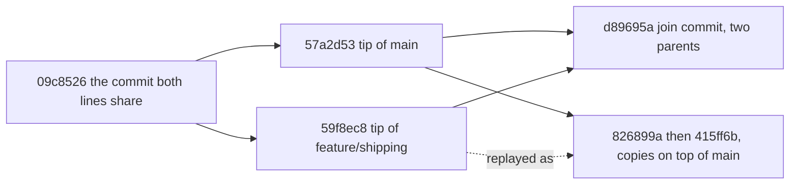

## Before you start

- [[foundation.l2.git-branches]] — a branch is a name pointing at one commit, and HEAD says which name you stand on. This lesson is about the step that lesson left unnamed: bringing one name's commits into another, the second half of `git pull`.

## The situation

You are on the playground the Git lessons use — a throwaway repository the scripts build, with a `main` and a `feature/shipping`. `feature/shipping` has two commits `main` does not, and `main` has three `feature/shipping` does not; you want both. You run `scripts/git/merge-demo.sh`, and the graph it prints forks and joins again at a commit, `d89695a`, whose line reads `parents: 57a2d53 59f8ec8`, two ids where the commits around it have one. You run `scripts/git/rebase-demo.sh` from the same start, and the graph is a straight column with no join commit, and the branch's two commits are printed under ids they did not have before. Same two changes, two different histories. What did each command do to get there?

## Core concepts

- merge base — the newest commit two lines of work both have; a tangled history can have more than one, here there is exactly one, and Git works it out before combining anything. In the playground it is `09c8526`.
- **merge** — joining two lines of work; unless one side has written nothing since the merge base, Git writes one new commit that names both tips — the commit each of the two names points at — as its parents, leaving every commit on both sides exactly as it was.
- merge commit — that new commit; its parent list is the only place where the history says two lines came back together, and here it holds two ids.
- **rebase** — replaying the commits of your branch, one at a time, on top of another commit, which writes new commits with new ids and leaves one straight line.
- fast-forward — the case where your side has written nothing since the merge base, so there is nothing to join and by default Git writes no commit, moves the branch name forward and updates your files to match.

## How it works



Each solid arrow runs from a commit towards commits written after it, the reverse of the parent pointer, and one arrow may stand for several: `main`'s three since the base are drawn as one. The dotted arrow marks the replay, not a parent. The right-hand boxes are the two endings, `d89695a` if you merge and the copies if you rebase; each script produces one, never both.

`git merge` builds the box with two parents: it applies both sides' changes since the base and writes one commit whose parents are `57a2d53` first and `59f8ec8` second, the branch you stood on, then the branch you named. Every other commit keeps its id.

`git rebase main` uses them differently. It replays your branch's commits since the base, in order: the first on top of `main`, each next on top of the commit the previous replay wrote; when the last is written, Git moves your branch name to it. A parent is part of what an id is computed from, so every replay gets a new id: the branch's older commit `1108382` becomes `826899a`, its tip `59f8ec8` becomes `415ff6b`.

One case takes neither shape. If your side has written nothing since the base there is nothing to join: by default `git merge` writes no commit, moves your branch name forward and updates your files to match. That is a fast-forward. Your side means every commit your branch can reach since the base, inherited ones included, not only the ones you typed.

A merge leaves the fork, so a reader sees which commits were one piece of work; a rebase leaves one column. A common team rule is to pick one shape for a whole repository, so a reader learns one shape instead of working out which rule held for each stretch.

## In the Đơn Hàng system

The first script takes the merge route on a throwaway branch, so `main` itself is left alone:

```bash file=scripts/git/merge-demo.sh tag=stage-0 lines=14-27
git switch --quiet -c merge-demo main
git merge --no-edit feature/shipping

echo
echo "the history after the merge:"
git log --oneline --graph -8

echo
echo "the merge commit has two parents:"
git show --no-patch --format='%h %s%nparents: %p' HEAD

echo
echo "the branch itself is untouched by the merge:"
git log --oneline -2 feature/shipping
```

```text output=true
Merge made by the 'ort' strategy.
 shipping.sh | 5 +++++
 1 file changed, 5 insertions(+)
 create mode 100755 shipping.sh

the history after the merge:
*   d89695a Merge branch 'feature/shipping' into merge-demo
|\
| * 59f8ec8 Charge no shipping over two million
| * 1108382 Add shipping.sh
* | 57a2d53 Add a README
* | c812dbd Explain the rounding
* | b3472f6 Round the total down to millions
|/
* 09c8526 Add a second product
* d915e63 Add total.sh and a check for it

the merge commit has two parents:
d89695a Merge branch 'feature/shipping' into merge-demo
parents: 57a2d53 59f8ec8

the branch itself is untouched by the merge:
59f8ec8 Charge no shipping over two million
1108382 Add shipping.sh
```

`git switch -c merge-demo main` creates a name at the commit `main` points at and stands on it; `--no-edit` takes the message Git composes instead of opening an editor. `git show --no-patch` prints one commit's fields, here `HEAD`'s, without the changes it made; `--format` picks which: `%h` (the id, shortened), `%s` (the message) and `%p` (the parent ids, shortened), which is where the `parents:` line comes from. `ort` is the name of the algorithm Git used to combine the two sides; you need it for nothing in this lesson. Read the graph as two columns that split at `09c8526` and are sewn back together by `d89695a`: the `|\` line under it is that commit reaching down to both, `* |` is a commit on the left column with the other column running past it, and `|/` is where the two come back to one. The last two lines are the point of the script: `feature/shipping` still ends at `59f8ec8`, where it was before the merge.

The second script takes the other route from the same starting point:

```bash file=scripts/git/rebase-demo.sh tag=stage-0 lines=14-31
git switch --quiet -c rebase-demo feature/shipping

echo "before rebasing:"
git log --oneline --graph --decorate -8 rebase-demo main

echo
echo "the ids of the two commits on this branch:"
git log --oneline -2 --format='%h %s'

git rebase --quiet main

echo
echo "after rebasing, the same changes have different ids:"
git log --oneline -2 --format='%h %s'

echo
echo "the history is now a straight line:"
git log --oneline --graph -8
```

```text output=true
before rebasing:
* 59f8ec8 (HEAD -> rebase-demo, origin/feature/shipping, feature/shipping) Charge no shipping over two million
* 1108382 Add shipping.sh
| * 57a2d53 (origin/main, origin/HEAD, main) Add a README
...
* 09c8526 Add a second product
...
the ids of the two commits on this branch:
59f8ec8 Charge no shipping over two million
1108382 Add shipping.sh

after rebasing, the same changes have different ids:
415ff6b Charge no shipping over two million
826899a Add shipping.sh

the history is now a straight line:
* 415ff6b Charge no shipping over two million
* 826899a Add shipping.sh
* 57a2d53 Add a README
...
```

Each `...` marks lines cut from this listing, not something the script prints. The messages are identical before and after and both ids changed: the same changes now sit on a different parent, so they are different commits. `origin/feature/shipping` is still printed beside `59f8ec8` in the first listing, and that is the danger: a copy of those commits is already on the server under the old ids, so had the replay been done on `feature/shipping` itself instead of this throwaway name, that branch would now disagree with the server's copy. `--decorate` is what prints the names in parentheses beside a commit; the others here are further pointers at the same commit and do not matter. The last listing has one `*` per line and no `|` column: after the replay there is no fork left to draw.

## Beginners often think…

- **"Rebase is a safer version of merge."** → Actually it is the more dangerous of the two on a branch anyone else has, because it replaces commits instead of adding one. Merge only ever adds; rebase hands back commits your colleague's repository has never seen, under ids it has never seen, while it still holds the originals. You notice this when a rebased branch will not push without a flag that overwrites the server's copy — a flag this lesson does not cover — and a colleague who had already fetched it ends up with both versions of the same work.
- **"Rebase 'moves' my commits, so they are the same commits."** → Actually nothing moves; each commit is rewritten on a new parent and gets a new id, and the old one stays until Git clears away what nothing points to. You notice this when an id you wrote down, or a link a colleague sent you, still resolves after the rebase but is no longer on your branch.
- **"A merge always creates a merge commit."** → Actually when your side has written nothing since the merge base there is nothing to join, so by default Git fast-forwards: it writes no commit, moves your branch name to the other commit and updates your files to match. You notice this when `git log --graph` shows no fork where you expected one.

## Try it (3 minutes)

1. From the top folder of the example system, run `scripts/up.sh` (it prepares the example system; running it twice changes nothing), then run `scripts/git/merge-demo.sh` and `scripts/git/rebase-demo.sh`. Each one rebuilds the playground from scratch, so the order does not matter; the rebuild pins the author, and each script fixes the dates of every commit it writes, so the ids below come out the same on your machine.
2. In the merge output, read the line starting `parents:` and count the ids on it, then compare the last two lines with the two ids the rebase script prints before it starts.
3. In the rebase output, compare the two ids printed before the rebase with the two printed after, and compare the message beside each.

Expected result: the `parents:` line holds two ids, `57a2d53` and `59f8ec8`. The merge left `feature/shipping` at `59f8ec8` and `1108382`, the same pair the rebase script reports before it starts. After the rebase the messages are unchanged but the ids read `415ff6b` and `826899a`.

## Connections

- [[foundation.l2.git-branches]] — prerequisite: the names and pointers both of these commands move, and the lesson that left the second half of `git pull` unnamed.
- [[foundation.l2.git-conflicts]] — what happens when the two sides changed the same region and Git cannot combine them on its own; both commands stop the same way, and rebase can stop once per replayed commit.
- [[foundation.l2.git-history-and-recovery]] — the safety net: a rebase you regret is undone by putting the branch name back on the commits it pointed at before, which are still in the repository.

## Five-line summary

1. Merge joins two lines with one new commit that has two parents; rebase copies your commits onto a new base and leaves a straight line.
2. Merge changes nothing that already exists; rebase replaces your commits with new ones that carry the same changes under new ids.
3. Never rebase a branch someone else already has, because their repository still holds the originals and the two versions will not agree.
4. A merge with nothing to join is a fast-forward: by default Git writes no commit, moves the branch name forward and updates your files.
5. Merge keeps the fork, rebase leaves one column; a common team rule is one shape for a whole repository, so readers learn one shape.
