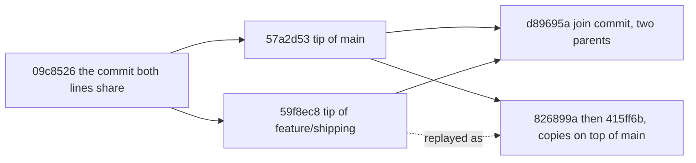

## Bạn cần biết trước

- [[foundation.l2.git-branches]] — branch là một cái tên trỏ tới một commit, và HEAD cho biết bạn đang đứng trên tên nào. Bài này nói về bước mà bài kia chưa gọi tên: đưa các commit của một tên vào một tên khác, tức nửa sau của `git pull`.

## Tình huống

Bạn đang ở repository thử nghiệm mà các bài Git dùng — một repository dùng xong bỏ do script dựng lên, có `main` và `feature/shipping`. `feature/shipping` có hai commit mà `main` không có, còn `main` có ba commit mà `feature/shipping` không có, và bạn muốn cả hai. Bạn chạy `scripts/git/merge-demo.sh`, và đồ thị nó in ra tách nhánh rồi nhập lại ở một commit, `d89695a`, có dòng ghi `parents: 57a2d53 59f8ec8`: hai id, trong khi các commit xung quanh chỉ có một. Bạn chạy `scripts/git/rebase-demo.sh` từ cùng điểm xuất phát, và đồ thị là một cột thẳng, không có commit nhập nào, còn hai commit của branch được in ra với những id trước đó chúng chưa từng có. Cùng hai thay đổi, hai lịch sử khác nhau. Mỗi lệnh đã làm gì để ra được kết quả đó?

## Khái niệm cốt lõi

- merge base — commit mới nhất mà cả hai dòng công việc cùng có. Một lịch sử rối có thể có nhiều hơn một, ở đây có đúng một, và Git tính ra nó trước khi gộp bất cứ thứ gì. Trong repository thử nghiệm, đó là `09c8526`.
- **merge** (gộp lịch sử hai branch bằng một commit có hai cha) — nối hai dòng công việc. Trừ khi một bên chưa viết gì kể từ merge base, Git viết một commit mới nêu tên cả hai đầu mút — commit mà mỗi tên đang trỏ tới — làm cha, và giữ nguyên mọi commit ở cả hai bên.
- merge commit — chính commit mới đó. Danh sách cha của nó là chỗ duy nhất trong lịch sử cho biết hai dòng đã nhập lại với nhau, và ở đây nó chứa hai id.
- **rebase** (chép lại các commit của branch lên trên một commit khác, tạo lịch sử thẳng) — phát lại từng commit của branch bạn, lần lượt từng cái, lên trên một commit khác. Thao tác này viết ra các commit mới với id mới và để lại một đường thẳng.
- fast-forward — trường hợp bên bạn chưa viết gì kể từ merge base, nên không có gì để nối, và mặc định Git không viết commit nào, chỉ dời tên branch lên phía trước và cập nhật file cho khớp.

## Cơ chế hoạt động



Mỗi mũi tên liền đi từ một commit tới các commit viết sau nó, ngược chiều với con trỏ cha, và một mũi tên có thể đại diện cho nhiều commit: ba commit của `main` kể từ base được vẽ thành một. Mũi tên chấm đánh dấu việc phát lại, không phải quan hệ cha. Hai ô bên phải là hai kết cục, `d89695a` nếu bạn merge và các bản chép nếu bạn rebase. Mỗi script tạo ra một kết cục, không bao giờ cả hai.

`git merge` dựng ô có hai cha: nó áp thay đổi của cả hai bên kể từ base và viết một commit có cha thứ nhất là `57a2d53` và cha thứ hai là `59f8ec8`, tức branch bạn đang đứng, rồi tới branch bạn gọi tên. Mọi commit khác giữ nguyên id.

`git rebase main` dùng chúng khác đi. Nó phát lại các commit của branch bạn kể từ base, theo thứ tự: commit đầu lên trên `main`, mỗi commit tiếp theo lên trên commit mà lần phát lại trước vừa viết. Khi viết xong commit cuối, Git dời tên branch của bạn tới đó. Cha là một phần của dữ liệu dùng để tính id, nên mỗi lần phát lại đều có id mới: commit cũ hơn của branch, `1108382`, thành `826899a`, còn đầu mút `59f8ec8` thành `415ff6b`.

Có một trường hợp không theo hình nào trong hai hình trên. Nếu bên bạn chưa viết gì kể từ base thì không có gì để nối: mặc định `git merge` không viết commit nào, chỉ dời tên branch lên phía trước và cập nhật file cho khớp. Đó là fast-forward. "Bên bạn" nghĩa là mọi commit branch của bạn với tới được kể từ base, kể cả các commit thừa hưởng, không chỉ những commit chính tay bạn gõ.

Merge để lại chỗ tách nhánh, nên người đọc thấy những commit nào thuộc cùng một phần việc. Rebase để lại một cột. Nhiều đội có quy tắc chọn một hình cho cả repository, để người đọc chỉ phải học một hình thay vì đoán xem đoạn lịch sử nào theo quy tắc nào.

## Trong hệ thống Đơn Hàng

Script đầu tiên đi đường merge trên một branch dùng xong bỏ, nên bản thân `main` không bị đụng tới:

```bash file=scripts/git/merge-demo.sh tag=stage-0 lines=14-27
git switch --quiet -c merge-demo main
git merge --no-edit feature/shipping

echo
echo "the history after the merge:"
git log --oneline --graph -8

echo
echo "the merge commit has two parents:"
git show --no-patch --format='%h %s%nparents: %p' HEAD

echo
echo "the branch itself is untouched by the merge:"
git log --oneline -2 feature/shipping
```

```text output=true
Merge made by the 'ort' strategy.
 shipping.sh | 5 +++++
 1 file changed, 5 insertions(+)
 create mode 100755 shipping.sh

the history after the merge:
*   d89695a Merge branch 'feature/shipping' into merge-demo
|\
| * 59f8ec8 Charge no shipping over two million
| * 1108382 Add shipping.sh
* | 57a2d53 Add a README
* | c812dbd Explain the rounding
* | b3472f6 Round the total down to millions
|/
* 09c8526 Add a second product
* d915e63 Add total.sh and a check for it

the merge commit has two parents:
d89695a Merge branch 'feature/shipping' into merge-demo
parents: 57a2d53 59f8ec8

the branch itself is untouched by the merge:
59f8ec8 Charge no shipping over two million
1108382 Add shipping.sh
```

`git switch -c merge-demo main` tạo một tên tại commit mà `main` đang trỏ tới và đứng lên đó. `--no-edit` dùng thông điệp Git tự soạn thay vì mở trình soạn thảo. `git show --no-patch` in các trường của một commit, ở đây là của `HEAD`, mà không in các thay đổi nó đã làm. `--format` chọn in trường nào: `%h` (id, rút gọn), `%s` (thông điệp) và `%p` (id các cha, rút gọn), đó là nguồn gốc của dòng `parents:`. `ort` là tên thuật toán Git dùng để gộp hai bên, bài này không cần tới nó. Hãy đọc đồ thị như hai cột tách ra ở `09c8526` và được khâu lại bởi `d89695a`: dòng `|\` bên dưới là commit đó với xuống cả hai cột, `* |` là một commit ở cột trái với cột kia chạy song song bên cạnh, và `|/` là chỗ hai cột nhập lại làm một. Hai dòng cuối là mục đích của script: `feature/shipping` vẫn kết thúc ở `59f8ec8`, đúng chỗ nó ở trước khi merge.

Script thứ hai đi đường còn lại từ cùng điểm xuất phát:

```bash file=scripts/git/rebase-demo.sh tag=stage-0 lines=14-31
git switch --quiet -c rebase-demo feature/shipping

echo "before rebasing:"
git log --oneline --graph --decorate -8 rebase-demo main

echo
echo "the ids of the two commits on this branch:"
git log --oneline -2 --format='%h %s'

git rebase --quiet main

echo
echo "after rebasing, the same changes have different ids:"
git log --oneline -2 --format='%h %s'

echo
echo "the history is now a straight line:"
git log --oneline --graph -8
```

```text output=true
before rebasing:
* 59f8ec8 (HEAD -> rebase-demo, origin/feature/shipping, feature/shipping) Charge no shipping over two million
* 1108382 Add shipping.sh
| * 57a2d53 (origin/main, origin/HEAD, main) Add a README
...
* 09c8526 Add a second product
...
the ids of the two commits on this branch:
59f8ec8 Charge no shipping over two million
1108382 Add shipping.sh

after rebasing, the same changes have different ids:
415ff6b Charge no shipping over two million
826899a Add shipping.sh

the history is now a straight line:
* 415ff6b Charge no shipping over two million
* 826899a Add shipping.sh
* 57a2d53 Add a README
...
```

Mỗi `...` đánh dấu các dòng bị cắt khỏi đoạn trích này, không phải thứ script in ra. Thông điệp trước và sau giống hệt nhau nhưng cả hai id đều đổi: cùng những thay đổi đó giờ nằm trên một cha khác, nên chúng là những commit khác. `origin/feature/shipping` vẫn được in cạnh `59f8ec8` ở đoạn đầu, và đó chính là mối nguy: một bản của các commit ấy đã nằm trên server với id cũ. Nếu phát lại ngay trên `feature/shipping` thay vì trên cái tên dùng xong bỏ này, branch đó giờ sẽ lệch với bản trên server. `--decorate` là thứ in các tên trong ngoặc cạnh một commit, còn những tên khác ở đây là các con trỏ khác cùng trỏ vào commit đó và không quan trọng. Đoạn cuối có mỗi dòng một `*` và không có cột `|` nào: sau khi phát lại, không còn chỗ tách nhánh nào để vẽ.

## Người mới hay nghĩ rằng…

- **"Rebase là phiên bản an toàn hơn của merge."** → Thực ra trên một branch mà người khác cũng có, rebase là thứ nguy hiểm hơn, vì nó thay commit chứ không thêm commit. Merge chỉ thêm. Rebase đưa ra những commit mà repository của đồng nghiệp chưa từng thấy, với những id chưa từng thấy, trong khi repository đó vẫn giữ bản gốc. Bạn sẽ nhận ra khi một branch đã rebase không push được nếu thiếu một cờ ghi đè bản trên server — cờ mà bài này không đề cập — và một đồng nghiệp đã fetch trước đó rốt cuộc có cả hai phiên bản của cùng một phần việc.
- **"Rebase 'dời' commit của tôi, nên chúng vẫn là những commit cũ."** → Thực ra chẳng có gì được dời: mỗi commit được viết lại trên một cha mới và nhận id mới, còn commit cũ vẫn nằm đó cho tới khi Git dọn đi những thứ không còn gì trỏ tới. Bạn sẽ nhận ra khi một id bạn đã ghi lại, hay một link đồng nghiệp gửi, vẫn mở được sau khi rebase nhưng không còn nằm trên branch của bạn.
- **"Merge lúc nào cũng tạo merge commit."** → Thực ra khi bên bạn chưa viết gì kể từ merge base thì không có gì để nối, nên mặc định Git fast-forward: không viết commit nào, dời tên branch tới commit bên kia và cập nhật file cho khớp. Bạn sẽ nhận ra khi `git log --graph` không hiện chỗ tách nhánh nào ở nơi bạn tưởng phải có.

## Thử ngay (3 phút)

1. Từ thư mục gốc của hệ thống ví dụ, chạy `scripts/up.sh` (script này chuẩn bị hệ thống ví dụ, chạy hai lần cũng không thay đổi gì), rồi chạy `scripts/git/merge-demo.sh` và `scripts/git/rebase-demo.sh`. Mỗi script dựng lại repository thử nghiệm từ đầu, nên thứ tự không quan trọng. Bước dựng lại cố định tác giả, và mỗi script cố định ngày của mọi commit nó viết, nên các id dưới đây ra giống hệt trên máy bạn.
2. Trong kết quả của merge, đọc dòng bắt đầu bằng `parents:` và đếm số id trên đó, rồi so hai dòng cuối với hai id mà script rebase in ra trước khi bắt đầu.
3. Trong kết quả của rebase, so hai id in trước khi rebase với hai id in sau đó, và so thông điệp bên cạnh mỗi id.

Kết quả mong đợi: dòng `parents:` chứa hai id, `57a2d53` và `59f8ec8`. Merge để `feature/shipping` ở `59f8ec8` và `1108382`, đúng cặp mà script rebase báo trước khi bắt đầu. Sau rebase, thông điệp không đổi nhưng id thành `415ff6b` và `826899a`.

## Liên hệ

- [[foundation.l2.git-branches]] — bài cần học trước: những cái tên và con trỏ mà cả hai lệnh này dời đi, và là bài đã để nửa sau của `git pull` chưa gọi tên.
- [[foundation.l2.git-conflicts]] — chuyện gì xảy ra khi hai bên sửa cùng một vùng và Git không tự gộp được. Cả hai lệnh đều dừng theo cùng một kiểu, và rebase có thể dừng một lần cho mỗi commit được phát lại.
- [[foundation.l2.git-history-and-recovery]] — tấm lưới an toàn: một lần rebase bạn hối hận được hoàn tác bằng cách đặt tên branch trở lại các commit nó trỏ tới trước đó, vốn vẫn còn trong repository.

## Tóm tắt 5 dòng

1. Merge nối hai dòng bằng một commit mới có hai cha. Rebase chép các commit của bạn lên một base mới và để lại một đường thẳng.
2. Merge không đổi gì đã tồn tại. Rebase thay các commit của bạn bằng commit mới mang cùng thay đổi nhưng có id mới.
3. Đừng bao giờ rebase một branch người khác đã có, vì repository của họ vẫn giữ bản gốc và hai phiên bản sẽ không khớp nhau.
4. Merge mà không có gì để nối là fast-forward: mặc định Git không viết commit nào, dời tên branch lên phía trước và cập nhật file.
5. Merge giữ chỗ tách nhánh, rebase để lại một cột. Nhiều đội có quy tắc dùng một hình cho cả repository, để người đọc chỉ phải học một hình.
