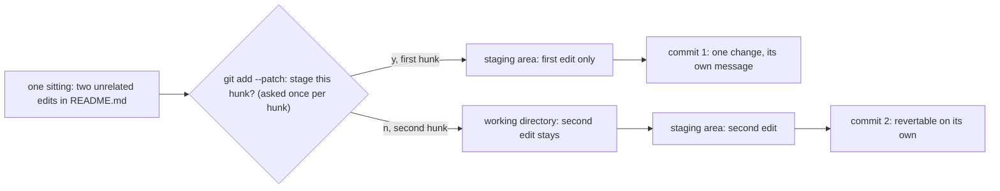

## Before you start

- [[foundation.l2.git-mental-model]] — a commit is a full snapshot with a parent pointer, and `git add` decides what goes into it. That lesson says what a commit is; this one says what belongs in one.

## The situation

In the Git module's playground repository — the throwaway repository its scripts build for you — you open `README.md` and make two edits in one sitting: you mark the price list script work in progress, and you replace the note about prices with a line telling the reader to run `./test.sh`. Both edits sit in the same file, so you type one `git commit --all --message 'fix'` — `--all` stages every change to files Git already keeps, with no `git add`. Weeks later that instruction is wrong and you want it back out. `git log --oneline` offers one line reading `fix`, and taking it back also takes back the other edit. What belongs in one commit, and what should its message have said?

## Core concepts

- logical change — one thing done to the system that stands on its own: a fix, a rename, one new behaviour. It is the unit a commit should hold.
- subject line and body — the first line of a commit message, the one `git log --oneline` prints next to the abbreviated id, and everything after the blank line that follows it, where the reasoning goes.
- diff — the list of lines a change removes and adds: what `git diff` prints and what a reader of your commit sees. Each contiguous block of those lines inside one file is a hunk, marked in the output by a line starting `@@`, and the hunk is the unit `git add --patch` offers you one at a time.
- revert — a new commit that undoes exactly what one earlier commit changed, written by `git revert <commit>`.
- blame — `git blame`, which names, for each line of a file, the commit that last changed it.
- bisect — `git bisect`, which repeatedly halves a range of commits to find the first one where a symptom appears.

## How it works



In the situation above, the two edits are one sitting but two logical changes: marking the script work in progress has nothing to do with how a reader checks the total. `git add --patch README.md` walks the file hunk by hunk and asks about each one, so the two edits reach the staging area separately even though they live in the same file. Answer `y` to the first question and `n` to the second, and the staging area holds one change while the working directory still holds the other. Commit, then stage and commit what is left: two commits out of one sitting.

What that buys you is every tool that works per commit. `git revert` writes one undo commit for one target, so a commit holding one change can be taken back without taking back anything else. `git blame` leads you from a line you distrust to the commit that last changed it, and so to that commit's message. `git bisect` halves the history to find the first commit where a symptom appears; the smaller each commit, the fewer lines you have left to read when it stops. A reviewer, too, reads your change one commit at a time, so the split you choose decides what can be judged in one go.

The message is the half the diff cannot supply. The diff says how the code changed and never which alternative you rejected or what forced the change. That is what the body is for; the subject line is what a reader meets first, alone, in a list.

## In the Đơn Hàng system

The example system keeps the team's rule for messages in a short file under `docs/git/`. Like the other files under `docs/`, it is written in Vietnamese, and it is quoted here as it stands:

```markdown file=docs/git/commit-message-examples.md tag=stage-0 lines=32-37
- Dòng đầu ≤ 50 ký tự, viết ở thể mệnh lệnh, nói **cái gì** thay đổi.
- Dòng thứ hai để trống.
- Phần thân nói **vì sao**, và phương án nào đã bị loại. Phần diff đã nói
  **như thế nào** rồi, đừng chép lại.
- Một commit là một thay đổi có thể revert riêng. Nếu bạn phải viết "và" ở dòng
  đầu, đó là hai commit.
```

Four rules, in order: keep the first line to 50 characters, in the imperative — `Mark the price list script work in progress`, not `Marked…` or `Marking…` — saying what changes; leave the second line blank; put why in the body together with the option you rejected, since the diff already says how; and keep one commit to one change that can be reverted on its own — if the first line needs the word "and", that is two commits. Git's own documentation recommends the same shape — a summary line of no more than 50 characters, a blank line, then a fuller description — and checks none of that shape when you commit.

The rest of that file shows both sides: five one-line messages that nobody, the author included, can interpret three months later, and one whose body names the option the team turned down and why — open `docs/git/commit-message-examples.md` in the example system to read both. Some teams also require a prefix on the subject line, a category word and a colon, under the name Conventional Commits; this repository does not, and the four rules stand without it.

The fourth rule is the one that feels impossible once both edits are already in the same file: one commit, one change that can be reverted on its own. A script in the repository does that split anyway, on the playground repository from the previous lessons:

```bash file=scripts/git/stage-partial.sh tag=stage-0 lines=10-27
git switch --quiet -c staging-demo main
sed -i '3s|.*|A tiny script that adds up a price list. Work in progress.|' README.md
sed -i '14s|.*|Run ./test.sh from this folder to check the total.|' README.md

echo "both edits are in the working tree:"
git diff --stat

echo
echo "answering y to the first hunk and n to the second:"
printf 'y\nn\n' | git add --patch README.md

echo
echo "what is staged:"
git diff --cached

echo
echo "what is still only in the working tree:"
git diff
```

```text output=true
both edits are in the working tree:
 README.md | 4 ++--
 1 file changed, 2 insertions(+), 2 deletions(-)
...
what is staged:
diff --git a/README.md b/README.md
...
@@ -1,6 +1,6 @@
...
-A tiny script that adds up a price list.
+A tiny script that adds up a price list. Work in progress.
...
what is still only in the working tree:
diff --git a/README.md b/README.md
...
@@ -11,4 +11,4 @@ A tiny script that adds up a price list. Work in progress.
...
-Prices are in đồng, written as whole numbers.
+Run ./test.sh from this folder to check the total.
```

The first line makes a new branch `staging-demo` starting from `main`, so the demo edits stay off the main line of history. The two `sed` lines then make the two edits of the situation, on lines 3 and 14 of `README.md` — far enough apart to be two separate blocks of changed lines, which is why `--patch` has two hunks to offer — and `git diff --stat` reports one file with two insertions and two deletions, the two rewritten lines counted once as removed and once as added. The `printf` feeds two answers into `git add --patch README.md`, which offers the two hunks in turn and takes the first only. The last two commands are the proof: `git diff --cached` shows the staged hunk alone, and `git diff` shows the other one still sitting in the working directory — `working tree`, the script's words, is Git's own name for what this lesson calls the working directory. Commit at that moment and the first change is a commit by itself, with the second still there to commit next.

## Beginners often think…

- **"Commit messages do not matter because the code is what counts."** → Actually the code says what the system does now and never says why it was changed, and the commit message is the only reasoning stored inside the commit itself, so it is the only one that travels with the change. You notice this when you find a line that looks wrong, run `git blame` on it, follow the commit it names, and find `fix` — so you change the line back and reopen the bug it was closing.
- **"One commit per day is a reasonable rhythm."** → Actually the rhythm is one logical change, which may be three commits before lunch or one across two days, while a day-sized commit holds whatever you happened to touch. You notice this when reverting yesterday takes back a fix you still want, or `git bisect` stops at a commit of forty files and tells you nothing.
- **"I will tidy the history later, so anything goes now."** → Actually tidying later means reading a diff you no longer remember and inventing the reasoning after the fact; the cheapest moment to write why is while you still know it. You notice this when you sit down to split a week-old commit — undoing it and staging it again piece by piece — and cannot tell which lines belonged together.

## Try it (3 minutes)

1. From the top folder of the example system, run `scripts/up.sh` once in this session to start the lab, then run `scripts/git/stage-partial.sh`, which builds the playground repository there and makes the two edits.
2. In its output, compare the block under `what is staged:` with the block under `what is still only in the working tree:`, and count the `@@` lines in each.
3. Write the subject line you would give the staged change alone, in 50 characters or fewer, without the word "and".

Expected result: each block holds one `@@` line — one hunk staged, one hunk left behind — although both edits are in the same file and were made in the same sitting. A subject line for the staged change is something like `Mark the price list script work in progress`; if yours needed "and", it was describing both edits, which is the fourth rule telling you the split was right.

## Connections

- [[foundation.l2.git-mental-model]] — prerequisite: it says how a commit is stored, this one says what to put in it.
- [[foundation.l2.git-history-and-recovery]] — where commit quality is spent: `git blame` and `git revert` both take one commit as their unit.
- [[foundation.l2.git-bisect]] — the sharpest case of the same argument: halving only helps if each commit is one change.
- [[management.l1.code-review-basics]] — the same commits read from the other seat, by someone going through your change one commit at a time.

## Five-line summary

1. One commit holds one logical change — the unit you could revert on its own without taking back anything you still want.
2. The subject line says what in 50 characters or fewer; the body says why, and which option you rejected.
3. The diff already says how, so repeating it in the message spends the only space the reasoning has.
4. `git add --patch` stages one hunk at a time, so two unrelated edits in one file can still become two commits.
5. A reviewer, `git revert`, `git blame` and `git bisect` all work one commit at a time, so commit quality is the quality of all four.
