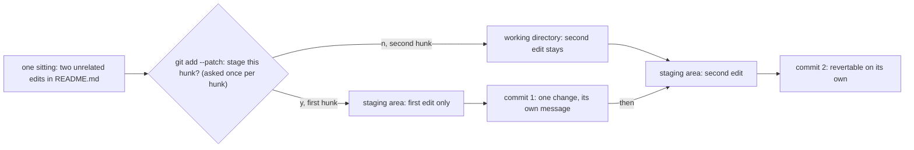

## Bạn cần biết trước

- [[foundation.l2.git-mental-model]] — commit là một ảnh chụp đầy đủ kèm con trỏ tới cha, và `git add` quyết định thứ gì đi vào commit. Bài đó nói commit là gì, bài này nói thứ gì nên nằm trong một commit.

## Tình huống

Trong repository thử nghiệm của module Git — repository dùng xong bỏ mà các script của module dựng sẵn cho bạn — bạn mở `README.md` và sửa hai chỗ trong cùng một lần ngồi: đánh dấu script tính bảng giá là đang làm dở, và thay ghi chú về giá bằng một dòng dặn người đọc chạy `./test.sh`. Hai chỗ sửa nằm trong cùng một file, nên bạn gõ một lệnh `git commit --all --message 'fix'` — `--all` stage mọi thay đổi ở những file Git đang theo dõi, không cần `git add`. Vài tuần sau, dòng dặn đó sai và bạn muốn gỡ nó ra. `git log --oneline` chỉ cho bạn một dòng ghi `fix`, và gỡ nó ra thì cũng gỡ luôn chỗ sửa kia. Thứ gì nên nằm trong một commit, và thông điệp của nó lẽ ra phải nói gì?

## Khái niệm cốt lõi

- thay đổi logic (logical change) — một việc làm cho hệ thống mà tự đứng riêng được: một bản sửa lỗi, một lần đổi tên, một hành vi mới. Đây là đơn vị mà một commit nên chứa.
- dòng tiêu đề (subject line) và phần thân (body) — dòng đầu của thông điệp commit, dòng mà `git log --oneline` in cạnh id rút gọn, và toàn bộ phần sau dòng trống kế tiếp, nơi đặt lý do.
- diff — danh sách các dòng mà một thay đổi xóa đi và thêm vào: thứ `git diff` in ra và thứ người đọc commit của bạn nhìn thấy. Mỗi khối dòng bị đổi, cùng vài dòng không đổi Git in quanh nó (mặc định là ba), là một hunk, đánh dấu bằng một dòng bắt đầu bằng `@@`. Những thay đổi đủ gần để dùng chung các dòng xung quanh đó sẽ rơi vào cùng một hunk. Hunk là đơn vị mà `git add --patch` đưa ra cho bạn, lần lượt từng cái.
- revert — một commit mới hoàn tác đúng những gì một commit trước đó đã đổi, do `git revert <commit>` viết ra.
- blame — `git blame`, lệnh cho biết với mỗi dòng của một file, commit nào đã đổi dòng đó lần cuối.
- bisect — `git bisect`, lệnh chia đôi liên tục một dải commit để tìm commit đầu tiên mà một triệu chứng xuất hiện.

## Cơ chế hoạt động



Trong tình huống trên, hai chỗ sửa thuộc cùng một lần ngồi nhưng là hai thay đổi logic: đánh dấu script đang làm dở chẳng liên quan gì tới chuyện dặn người đọc chạy `./test.sh`. `git add --patch README.md` đi qua file theo từng hunk và hỏi về từng cái, nên hai chỗ sửa vào staging area riêng rẽ dù nằm trong cùng một file. Trả lời `y` cho câu hỏi đầu và `n` cho câu thứ hai, staging area sẽ giữ một thay đổi, còn working directory vẫn giữ thay đổi kia. Commit, rồi stage và commit phần còn lại: hai commit từ một lần ngồi.

Cái bạn được là mọi công cụ làm việc theo từng commit. `git revert` viết một commit hoàn tác cho một mục tiêu, nên commit chỉ chứa một thay đổi thì gỡ ra được mà không kéo theo thứ gì khác. `git blame` dẫn bạn từ một dòng đáng ngờ tới commit đổi nó lần cuối, và từ đó tới thông điệp của commit ấy. `git bisect` chia đôi lịch sử để tìm commit đầu tiên mà triệu chứng xuất hiện. Commit càng nhỏ, khi nó dừng lại bạn càng ít dòng phải đọc. Ở đội mà reviewer đọc theo từng commit, mỗi commit được đánh giá trọn trong một lần.

Thông điệp là nửa mà diff không cung cấp được. Diff cho biết code đổi thế nào, nhưng không bao giờ cho biết bạn đã loại phương án nào hay điều gì buộc phải đổi. Phần thân dành cho chuyện đó. Dòng tiêu đề là thứ người đọc gặp đầu tiên, đứng một mình, trong một danh sách.

## Trong hệ thống Đơn Hàng

Hệ thống ví dụ giữ quy tắc viết thông điệp của đội trong một file ngắn dưới `docs/git/`. Như các file khác dưới `docs/`, file này viết bằng tiếng Việt, và được trích nguyên văn ở đây:

```markdown file=docs/git/commit-message-examples.md tag=stage-0 lines=32-37
- Dòng đầu ≤ 50 ký tự, viết ở thể mệnh lệnh, nói **cái gì** thay đổi.
- Dòng thứ hai để trống.
- Phần thân nói **vì sao**, và phương án nào đã bị loại. Phần diff đã nói
  **như thế nào** rồi, đừng chép lại.
- Một commit là một thay đổi có thể revert riêng. Nếu bạn phải viết "và" ở dòng
  đầu, đó là hai commit.
```

Bốn quy tắc, theo thứ tự: dòng đầu không quá 50 ký tự, ở thể mệnh lệnh — `Mark the price list script work in progress` — nói cái gì thay đổi. Dòng thứ hai để trống. Phần thân nói vì sao, kèm phương án đã bị loại, vì diff đã nói như thế nào. Và mỗi commit chỉ chứa một thay đổi có thể revert riêng — nếu dòng đầu cần chữ "và", đó là hai commit. Tài liệu chính thức của Git cũng khuyên đúng hình dạng này — một dòng tóm tắt không quá 50 ký tự, một dòng trống, rồi phần mô tả đầy đủ hơn — nhưng không kiểm tra điều nào trong số đó khi bạn commit.

Phần còn lại của file cho thấy cả hai phía: năm thông điệp một dòng mà ba tháng sau không ai, kể cả người viết, hiểu nổi, và một thông điệp có phần thân giải thích vì sao giờ đây hủy một đơn đã thanh toán bị chặn — chức năng hoàn tiền chưa được xây — và vì sao phương án đánh dấu các đơn đó là "chờ hoàn tiền" bị loại, vì không ai theo dõi trạng thái ấy. Một số đội còn bắt dòng tiêu đề phải có một tiền tố cố định, theo quy ước tên là Conventional Commits. File quy tắc của repository này không yêu cầu điều đó.

Quy tắc thứ tư nghe như bất khả thi khi cả hai chỗ sửa nằm trong cùng một file. Một script trong repository vẫn tách được, trên một repository thử nghiệm do chính nó dựng lên:

```bash file=scripts/git/stage-partial.sh tag=stage-0 lines=10-27
git switch --quiet -c staging-demo main
sed -i '3s|.*|A tiny script that adds up a price list. Work in progress.|' README.md
sed -i '14s|.*|Run ./test.sh from this folder to check the total.|' README.md

echo "both edits are in the working tree:"
git diff --stat

echo
echo "answering y to the first hunk and n to the second:"
printf 'y\nn\n' | git add --patch README.md

echo
echo "what is staged:"
git diff --cached

echo
echo "what is still only in the working tree:"
git diff
```

```text output=true
both edits are in the working tree:
 README.md | 4 ++--
 1 file changed, 2 insertions(+), 2 deletions(-)
...
what is staged:
diff --git a/README.md b/README.md
...
@@ -1,6 +1,6 @@
...
-A tiny script that adds up a price list.
+A tiny script that adds up a price list. Work in progress.
...
what is still only in the working tree:
diff --git a/README.md b/README.md
...
@@ -11,4 +11,4 @@ A tiny script that adds up a price list. Work in progress.
...
-Prices are in đồng, written as whole numbers.
+Run ./test.sh from this folder to check the total.
```

Dòng đầu tạo một branch mới `staging-demo` xuất phát từ `main`, để các chỗ sửa minh họa không lọt vào dòng lịch sử chính. Hai dòng `sed` tiếp theo thực hiện hai chỗ sửa trong tình huống, ở dòng 3 và dòng 14 của `README.md` — đủ xa nhau để các dòng xung quanh không chạm nhau, nên `--patch` có hai hunk để đưa ra — và `git diff --stat` tính mỗi dòng bị viết lại một lần là xóa, một lần là thêm.

`printf` đưa hai câu trả lời vào `git add --patch README.md`, lệnh này lần lượt đưa ra hai hunk và chỉ nhận hunk đầu. Hai lệnh cuối là bằng chứng: `git diff --cached` chỉ hiện hunk đã stage, còn `git diff` hiện hunk kia vẫn nằm trong working directory — `working tree`, chữ mà script dùng, là tên Git đặt cho thứ bài này gọi là working directory. Phần chữ sau `@@` thứ hai không thuộc hunk đó: đó là một dòng phía trên trong file mà Git lặp lại làm nhãn cho biết hunk nằm ở đâu, còn bản thân hunk chỉ chứa cặp `-Prices…`/`+Run ./test.sh…`.

## Người mới hay nghĩ rằng…

- **"Thông điệp commit không quan trọng, code mới là thứ đáng kể."** → Thực ra code cho biết hệ thống đang làm gì, nhưng không bao giờ cho biết vì sao nó bị đổi, và thông điệp commit là lý do duy nhất được lưu ngay trong commit, nên cũng là lý do duy nhất đi theo thay đổi. Bạn sẽ nhận ra khi gặp một dòng trông có vẻ sai, chạy `git blame` trên nó, lần theo commit được chỉ ra và chỉ thấy `fix` — thế là bạn đổi dòng đó lại và mở lại đúng cái bug nó từng đóng.
- **"Mỗi ngày một commit là nhịp hợp lý."** → Thực ra nhịp đúng là một thay đổi logic, có thể là ba commit trước giờ trưa hoặc một commit kéo dài hai ngày, còn một commit cỡ một ngày chứa bất cứ thứ gì bạn tình cờ đụng vào. Bạn sẽ nhận ra khi revert commit hôm qua kéo theo một bản sửa bạn vẫn muốn giữ, hoặc `git bisect` dừng ở một commit bốn mươi file và chẳng cho bạn biết gì.
- **"Để sau dọn lịch sử, giờ làm sao cũng được."** → Thực ra dọn sau nghĩa là đọc một diff bạn không còn nhớ và bịa ra lý do sau khi mọi chuyện đã xong. Lúc rẻ nhất để viết vì sao là lúc bạn còn biết nó. Bạn sẽ nhận ra khi ngồi tách một commit cũ một tuần và không phân biệt được những dòng nào đi cùng nhau.

## Thử ngay (3 phút)

1. Từ thư mục gốc của hệ thống ví dụ, chạy `scripts/up.sh`, script này khởi động hệ thống ví dụ mà các script Git chạy bên trong, và sẵn sàng khi in ra `The lab is up.`. Sau đó chạy `scripts/git/stage-partial.sh`, script này dựng repository thử nghiệm của nó và thực hiện hai chỗ sửa.
2. Trong kết quả, so khối dưới `what is staged:` với khối dưới `what is still only in the working tree:`, và đếm số dòng `@@` trong mỗi khối.
3. Viết dòng tiêu đề bạn sẽ đặt cho riêng thay đổi đã stage, không quá 50 ký tự, không có chữ "và".

Kết quả mong đợi: mỗi khối có một dòng `@@` — một hunk đã stage, một hunk ở lại — dù cả hai chỗ sửa nằm trong cùng một file và được làm trong cùng một lần ngồi. Dòng tiêu đề cho thay đổi đã stage sẽ tương tự `Mark the price list script work in progress`. Nếu dòng của bạn cần chữ "và", nghĩa là nó đang mô tả cả hai chỗ sửa, và đó chính là quy tắc thứ tư cho bạn biết tách ra là đúng.

## Liên hệ

- [[foundation.l2.git-mental-model]] — bài cần học trước: bài đó nói commit được lưu thế nào, bài này nói nên đặt gì vào nó.
- [[foundation.l2.git-history-and-recovery]] — nơi chất lượng commit được dùng tới: `git blame` và `git revert` đều lấy một commit làm đơn vị.
- [[foundation.l2.git-bisect]] — trường hợp rõ nhất của cùng lập luận: chia đôi chỉ có ích khi mỗi commit là một thay đổi.
- [[management.l1.code-review-basics]] — cũng những commit đó, đọc từ ghế bên kia, bởi người đi qua thay đổi của bạn từng commit một.

## Tóm tắt 5 dòng

1. Một commit chứa một thay đổi logic — đơn vị bạn có thể revert riêng mà không gỡ theo thứ gì bạn vẫn muốn giữ.
2. Dòng tiêu đề nói cái gì, không quá 50 ký tự. Phần thân nói vì sao, và phương án nào đã bị loại.
3. Diff đã nói như thế nào. Thông điệp là chỗ duy nhất trong commit để nói vì sao, nên hãy dùng nó cho lý do và phương án bị loại.
4. `git add --patch` stage từng hunk một, nên hai chỗ sửa không liên quan trong một file vẫn có thể thành hai commit.
5. `git revert`, `git blame`, `git bisect` và reviewer đọc từng commit đều làm việc theo commit, nên chất lượng commit là chất lượng của chúng.
