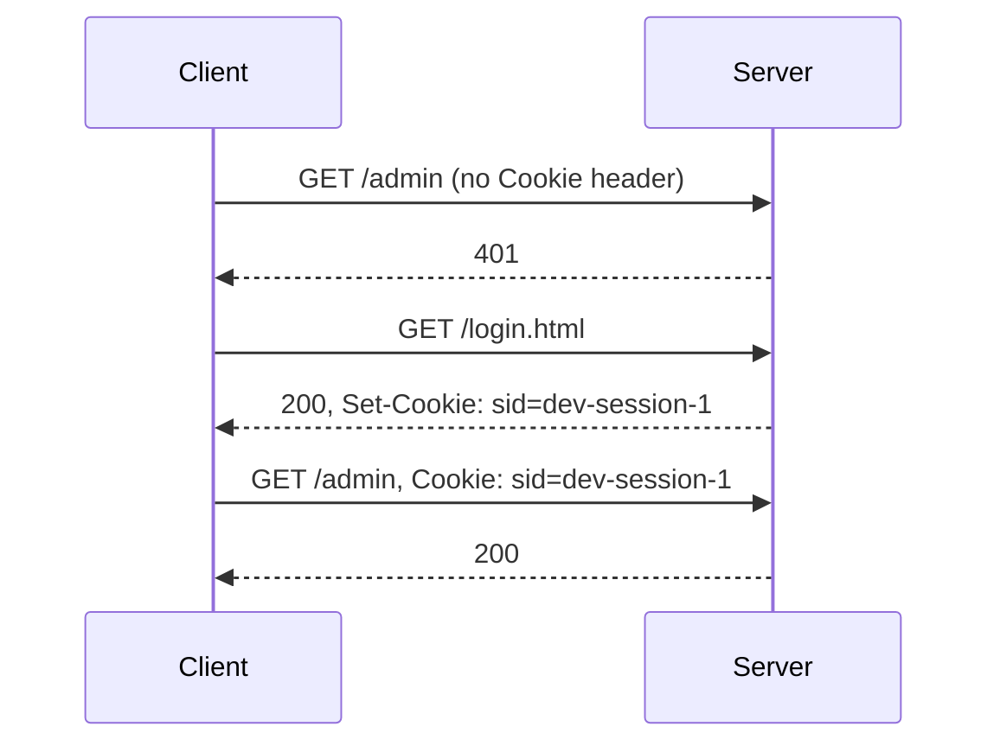

## Before you start

- [[foundation.l1.http-request-response]] — you saw that a request is a start line, then header lines, then a blank line, then an optional body. This lesson is about one header line that changes what the next request means.

## The situation

You start the Đơn Hàng lab, this course's example site, with `scripts/up.sh`, ask for `/admin`, and the answer is `401`: the server refuses because nothing in the request says who is asking. You open `/login.html` in a browser, go back to `/admin`, and the page loads. From the terminal you repeat both steps with `curl`, a terminal program that sends one request and prints the reply, and `/admin` answers `401` again. Nothing tells that last request apart from the first: same address, same method, no body, and no memory on the server of the fetch a second earlier. The browser carried something across the two requests and your terminal did not. What is it carrying?

## Core concepts

- stateless — the property that each request is meant to be understood on its own, so a server may answer two identical requests without relating them to each other.
- **cookie** — a small name and value the server asks the client to keep and to send back on later requests to the same site: the same host name the client asked for, such as `localhost` in the lab.
- `Set-Cookie` — the response header that carries one cookie: its name, its value, and the attributes that constrain it.
- `Cookie` — the request header the client uses to send stored values back, several pairs to a line.
- session identifier — a value that means nothing by itself and only points at state — what the server remembers about this visitor — that the server holds, such as `sid=dev-session-1` in the lab.
- attribute — an instruction written after the value in `Set-Cookie`, such as `HttpOnly`, `Secure` or `SameSite`, deciding who may read the cookie and when it is sent.

## How it works



In the situation above, your first request carries nothing that names you, so the server answers `401`. HTTP is stateless: each request is meant to be understood on its own, and a server is free to answer two identical requests without ever relating them. The connection underneath may be reused for both, but a shared connection is a transport detail, not an identity.

The second exchange changes that. When the server answers `/login.html`, it adds a `Set-Cookie` header to the response, carrying one name, one value and a few attributes. The client stores them. From then on the client attaches a `Cookie` header to later requests to that site, without your code asking for it. The attributes decide which of those requests get it. That automatic resend is the whole mechanism.

The third exchange is the first request again with one extra header line. A server that keeps state finds it under that value and answers `200`; what this lab does with the value is in the next section.

`sid=dev-session-1` is a key: it is not your name, your role or your order. The server keeps the state on its own side and uses the key to find it, so a stolen key is worth as much as the state behind it.

Because the client resends the cookie by itself, the attributes decide the safety of the arrangement: `HttpOnly` keeps scripts — small programs the page itself runs in the browser — from reading the value, `Secure` keeps it off connections that are not protected by TLS, and `SameSite` limits requests started by another site: a page you are reading elsewhere making your client ask this one for something.

## In the Đơn Hàng system

The repository has a script that plays the whole exchange in five steps, with nothing hidden by a browser. The addresses point at `localhost`, the name for the lab running on this machine.

```bash file=scripts/http/cookie-roundtrip.sh tag=stage-0 lines=10-28
echo "1. asking for /admin with nothing to identify us:"
curl -sS -o /dev/null -w '   %{http_code}\n' http://localhost:8080/admin

echo
echo "2. the login page answers with a Set-Cookie header:"
curl -sS -c "$jar" -D - -o /dev/null http://localhost:8080/login.html \
  | grep -i '^set-cookie:'

echo
echo "3. what the client stored (name and value only, no personal data):"
grep sid "$jar" | tr '\t' ' '

echo
echo "4. the same request as step 1, now sending the cookie back:"
curl -sS -b "$jar" -o /dev/null -w '   %{http_code}\n' http://localhost:8080/admin

echo
echo "5. a different cookie value is a different answer:"
curl -sS -o /dev/null -w '   %{http_code}\n' -H 'Cookie: role=guest' http://localhost:8080/admin
```

`curl` keeps nothing between runs unless you tell it to, which is why the script has to name a file (a line above this excerpt puts a temporary file name in `$jar`): `-c "$jar"` writes what the server sets into that file, and `-b "$jar"` sends it back on a later request.

Of the other options, `-sS` hides the progress display, `-o /dev/null` throws the body away so that only what we asked for prints, `-w '%{http_code}'` prints the status code alone, `-D -` prints the response headers, and `-H` writes a request header by hand — which is what step 5 does instead of using the file. Two other programs trim the output: `grep` keeps only the lines matching a pattern, so step 2 keeps the `Set-Cookie` line out of all the headers, and `tr` in step 3 swaps tabs for spaces so the record prints readably. Here is what the five steps print:

```text output=true
1. asking for /admin with nothing to identify us:
   401

2. the login page answers with a Set-Cookie header:
Set-Cookie: sid=dev-session-1; Path=/; HttpOnly; SameSite=Lax

3. what the client stored (name and value only, no personal data):
#HttpOnly_localhost FALSE / FALSE 0 sid dev-session-1

4. the same request as step 1, now sending the cookie back:
   200

5. a different cookie value is a different answer:
   403
```

Steps 1 and 4 send the same request to the same address and get `401` and `200`. The only difference is the header line built from what step 2 set. Read that header: `Path=/` sends the cookie on every path of this site, `HttpOnly` hides it from scripts in the page, and `SameSite=Lax` restricts requests another site starts. There is no `Secure`, because the lab site here is plain HTTP.

Step 3 shows what the client actually filed — read the last two fields, `sid` and `dev-session-1`; the rest is the client's own bookkeeping, and none of it is about you. The lab's server files nothing behind the key — it only looks for the name — so the state on the server side is something you take on trust until stage 1. Step 5 sends the one value the lab is configured to reject. The lab treats `role=guest` as a visitor it has already decided about, so this request is not one with no identity — it is one with an identity the server turns away. The answer is `403`, not `401`, because the server understood the request and refused it rather than asking who is there.

The page that sets the cookie is a plain page with no form and no password:

```html file=www/login.html tag=stage-0 lines=8-11
<h1>Đăng nhập</h1>
<p>Mở trang này một lần, máy chủ đặt cookie <code>sid</code> cho bạn.
Sau đó <a href="/admin">/admin</a> nhận ra bạn.</p>
<p>Cookie chỉ chứa một mã phiên. Dữ liệu nằm ở máy chủ.</p>
```

The Vietnamese text says what the exchange does: open this page once, the server sets the `sid` cookie for you, and `/admin` then recognises you; the cookie holds only a session code and the data stays on the server. Nothing in the page does the work. The server attaches the header, and the client does the rest by itself.

## Beginners often think…

- **"The server remembers me between requests by itself."** → Actually the server answers each request on what that request contains; two requests look like one visitor only because the client attached the same value to both. You notice this when a page works in the browser and the identical `curl` command answers `401`.
- **"The cookie stores my login data."** → Actually the lab's cookie is `sid=dev-session-1`, a key with no meaning outside the server that issued it, and the server holds everything the key stands for. You notice this when deleting one small value makes the site treat you as a stranger, while everything the server holds is still there.
- **"`HttpOnly` makes the value secret."** → Actually `HttpOnly` only keeps scripts in the page from reading it; the value still travels in the request, readable by anything that can see the connection, until `Secure` and TLS are in play. You notice this when a value marked `HttpOnly` shows up plainly in any tool that prints request headers.

## Try it (3 minutes)

1. With the stage-0 lab running (`scripts/up.sh`), run `scripts/http/cookie-roundtrip.sh` and read the three answers for `/admin`, in steps 1, 4 and 5.
2. Open `scripts/http/cookie-roundtrip.sh`, delete `-b "$jar"` from the `curl` in step 4, run the script again, then put it back.

Expected result: the first run answers `401`, `200`, `403` — the same address three times, told apart only by what the client sent about itself. After you remove `-b "$jar"`, step 4 answers `401` like step 1.

## Connections

- [[foundation.l1.http-status-codes]] — the `401` and `403` in this lesson are that lesson's distinction seen from the other side: `401` is the answer when nothing the server accepts as identity arrives; `403` is the answer when the server has understood the request and still refuses it — here, the one value the lab is configured to reject.
- [[foundation.l1.http-request-response]] — the same message shape you took apart there; a cookie adds one header line to the request and one to the response, and nothing else.
- [[backend.l1.sessions-vs-tokens]] — the same problem one layer up: what the server should keep behind the identifier, and what happens when it keeps nothing.

## Five-line summary

1. HTTP forgets everything between requests; a cookie is the value the client carries so two requests can be seen as one visitor.
2. The server sets it with `Set-Cookie` in a response; the client returns it in a `Cookie` header on later requests to that site, automatically.
3. What travels is an identifier, not the data: the state stays on the server and the cookie is the key to it.
4. `HttpOnly`, `Secure` and `SameSite` decide who may read the value and when it is sent.
5. In the lab, `/admin` answers `401` with no cookie, `200` with `sid=dev-session-1`, and `403` with `role=guest`.
