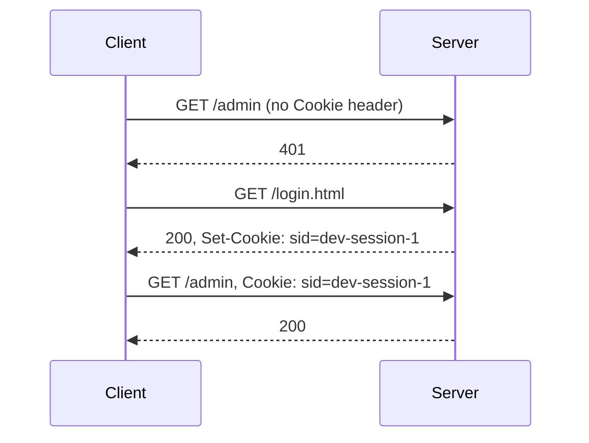

## Bạn cần biết trước

- [[foundation.l1.http-request-response]] — bạn đã thấy một request gồm dòng mở đầu, rồi các dòng header, rồi một dòng trống, rồi phần thân có thể có hoặc không. Bài này nói về một dòng header làm thay đổi ý nghĩa của request kế tiếp.

## Tình huống

Bạn khởi động lab Đơn Hàng, trang ví dụ của khóa học, bằng `scripts/up.sh`, xin `/admin`, và nhận về `401`: server từ chối vì trong request không có gì cho biết ai đang hỏi. Bạn mở `/login.html` trên trình duyệt, quay lại `/admin`, và trang hiện ra. Từ terminal, bạn lặp lại hai bước đó bằng `curl`, một chương trình dòng lệnh gửi đi một request và in ra câu trả lời, và `/admin` lại trả `401`. Không có gì phân biệt request cuối đó với request đầu: cùng địa chỉ, cùng method, không có thân, và server cũng không nhớ gì về lần hỏi một giây trước. Trình duyệt đã mang theo một thứ qua hai request, còn terminal thì không. Thứ đó là gì?

## Khái niệm cốt lõi

- phi trạng thái (stateless) — tính chất mỗi request phải tự hiểu được một mình, nên server có thể trả lời hai request giống hệt nhau mà không cần liên hệ chúng với nhau.
- **cookie** (mẩu dữ liệu server nhờ trình duyệt giữ và gửi lại ở các request sau) — một cặp tên và giá trị nhỏ mà server nhờ client giữ và gửi lại trong các request sau tới cùng trang web. Trong lab, "cùng trang web" nghĩa là đúng tên host client đã hỏi, `localhost`.
- `Set-Cookie` — header của response mang một cookie: tên, giá trị và các thuộc tính ràng buộc nó.
- `Cookie` — header của request mà client dùng để gửi lại các giá trị đã lưu, nhiều cặp trên một dòng.
- mã phiên (session identifier) — một giá trị tự nó không mang nghĩa gì, chỉ trỏ tới trạng thái mà server giữ, tức những gì server nhớ về người đang truy cập. `sid=dev-session-1` của lab có đúng hình dạng đó, còn lab giữ gì phía sau nó thì xem ở phần "Trong hệ thống Đơn Hàng".
- thuộc tính (attribute) — chỉ dẫn viết sau giá trị trong `Set-Cookie`, như `HttpOnly`, `Secure` hay `SameSite`, quyết định ai được đọc cookie và cookie được gửi đi khi nào.

## Cơ chế hoạt động



Trong tình huống trên, request đầu tiên không mang gì cho biết bạn là ai, nên server trả `401`. HTTP là phi trạng thái: mỗi request phải tự hiểu được một mình, và server hoàn toàn có quyền trả lời hai request giống hệt nhau mà không bao giờ liên hệ chúng. Một kết nối TCP có thể chở nhiều request nối tiếp nhau, nhưng nó chỉ chuyển byte, không nói gì về người gửi.

Lượt trao đổi thứ hai thay đổi điều đó. Khi trả lời `/login.html`, server thêm header `Set-Cookie` vào response, mang một tên, một giá trị và vài thuộc tính. Client lưu chúng lại. Từ đó trở đi, client gắn header `Cookie` vào các request sau tới trang đó mà code của bạn không cần yêu cầu. Các thuộc tính quyết định request nào được gắn. Tự động gửi lại như vậy chính là toàn bộ cơ chế.

Lượt thứ ba là request đầu tiên, chỉ thêm một dòng header. Một server có giữ trạng thái sẽ tìm trạng thái theo giá trị đó và trả `200`. Lab này làm gì với giá trị đó thì xem ở phần sau.

`sid=dev-session-1` là một chìa khóa: nó không phải tên, vai trò hay đơn hàng của bạn. Server giữ trạng thái ở phía mình và dùng chìa khóa để tìm, nên chìa khóa bị đánh cắp có giá trị ngang với trạng thái phía sau nó.

Vì client tự gửi lại cookie, các thuộc tính quyết định mức an toàn của cả cơ chế: `HttpOnly` ngăn script, tức những chương trình nhỏ do chính trang web chạy trong trình duyệt, đọc giá trị. `Secure` không cho cookie đi trên kết nối không được TLS bảo vệ. `SameSite` giới hạn các request do trang khác khởi phát: một trang bạn đang đọc ở nơi khác khiến client hỏi trang này một thứ gì đó.

## Trong hệ thống Đơn Hàng

Repo có một script diễn lại toàn bộ lượt trao đổi trong năm bước, không có trình duyệt nào che bớt. Các địa chỉ trỏ tới `localhost`, tên gọi của lab đang chạy trên chính máy này.

```bash file=scripts/http/cookie-roundtrip.sh tag=stage-0 lines=10-28
echo "1. asking for /admin with nothing to identify us:"
curl -sS -o /dev/null -w '   %{http_code}\n' http://localhost:8080/admin

echo
echo "2. the login page answers with a Set-Cookie header:"
curl -sS -c "$jar" -D - -o /dev/null http://localhost:8080/login.html \
  | grep -i '^set-cookie:'

echo
echo "3. what the client stored (name and value only, no personal data):"
grep sid "$jar" | tr '\t' ' '

echo
echo "4. the same request as step 1, now sending the cookie back:"
curl -sS -b "$jar" -o /dev/null -w '   %{http_code}\n' http://localhost:8080/admin

echo
echo "5. a different cookie value is a different answer:"
curl -sS -o /dev/null -w '   %{http_code}\n' -H 'Cookie: role=guest' http://localhost:8080/admin
```

`curl` không giữ gì giữa các lần chạy trừ khi bạn bảo nó giữ, nên script phải chỉ định một file (một dòng phía trên đoạn trích này đặt tên một file tạm vào `$jar`): `-c "$jar"` ghi những gì server đặt vào file đó, còn `-b "$jar"` gửi chúng lại trong một request sau.

Trong các tùy chọn còn lại, `-sS` ẩn phần hiển thị tiến độ, `-o /dev/null` bỏ phần thân để chỉ in ra đúng thứ ta cần, `-w '%{http_code}'` chỉ in status code, `-D -` in các header của response, và `-H` tự tay viết một header cho request. Bước 5 dùng cách này thay vì dùng file.

Hai chương trình khác cắt gọn kết quả: `grep` chỉ giữ những dòng khớp một mẫu, nên bước 2 lọc ra dòng `Set-Cookie` giữa tất cả các header, còn `tr` ở bước 3 đổi tab thành dấu cách cho bản ghi dễ đọc. Đây là những gì năm bước in ra:

```text output=true
1. asking for /admin with nothing to identify us:
   401

2. the login page answers with a Set-Cookie header:
Set-Cookie: sid=dev-session-1; Path=/; HttpOnly; SameSite=Lax

3. what the client stored (name and value only, no personal data):
#HttpOnly_localhost FALSE / FALSE 0 sid dev-session-1

4. the same request as step 1, now sending the cookie back:
   200

5. a different cookie value is a different answer:
   403
```

Bước 1 và bước 4 gửi cùng một request tới cùng một địa chỉ, nhưng nhận về `401` và `200`. Khác biệt duy nhất là dòng header dựng từ thứ bước 2 đã đặt. Đọc header đó: `Path=/` gửi cookie trên mọi đường dẫn của trang này, `HttpOnly` giấu nó khỏi script trong trang, còn `SameSite=Lax` hạn chế các request do trang khác khởi phát (`Lax` là giá trị của thiết lập này, bài không cần các giá trị khác). Không có `Secure`, vì trang lab ở đây chạy HTTP thường.

Bước 3 cho thấy client thực sự đã lưu gì. Hãy đọc hai trường cuối, `sid` và `dev-session-1`. Phần còn lại là sổ sách riêng của client, và không có gì trong đó nói về bạn. Server của lab không lưu gì phía sau chìa khóa, nó chỉ kiểm tra dòng `Cookie`: dòng chứa `role=guest` nhận `403`, nếu không thì dòng chứa `sid=` nhận `200`, còn lại nhận `401`. Trạng thái thật phía server phải chờ một bài sau, khi bạn dựng một server lưu trữ nó. Bước 5 gửi đúng giá trị mà lab được cấu hình để từ chối. Request này không phải request thiếu danh tính. Nó có danh tính, nhưng server không chấp nhận. Câu trả lời là `403` chứ không phải `401`, vì server đã hiểu request và từ chối, chứ không phải hỏi lại ai đang ở đó.

Trang đặt cookie là một trang bình thường, không có form, không có mật khẩu:

```html file=www/login.html tag=stage-0 lines=8-11
<h1>Đăng nhập</h1>
<p>Mở trang này một lần, máy chủ đặt cookie <code>sid</code> cho bạn.
Sau đó <a href="/admin">/admin</a> nhận ra bạn.</p>
<p>Cookie chỉ chứa một mã phiên. Dữ liệu nằm ở máy chủ.</p>
```

Đoạn chữ này nói đúng điều lượt trao đổi làm: mở trang một lần, server đặt cookie `sid` cho bạn, sau đó `/admin` nhận ra bạn. Cookie chỉ chứa một mã phiên, dữ liệu nằm ở server. Server gắn header, phần còn lại do client lo.

## Người mới hay nghĩ rằng…

- **"Server tự nhớ mình giữa các request."** → Thực ra server trả lời mỗi request dựa trên những gì request đó chứa, vì hai request trông như của cùng một người chỉ khi client gắn cùng một giá trị vào cả hai. Bạn sẽ nhận ra khi một trang chạy được trên trình duyệt nhưng lệnh `curl` y hệt lại trả `401`.
- **"Cookie lưu thông tin đăng nhập của mình."** → Thực ra cookie của lab là `sid=dev-session-1`, một chìa khóa không mang nghĩa gì ngoài server đã cấp nó, vì server có giữ trạng thái sẽ giữ mọi thứ chìa khóa đại diện ở phía mình. Bạn sẽ nhận ra khi xóa một giá trị nhỏ mà trang coi bạn như người lạ, đúng như bước 4 khi bỏ `-b "$jar"`.
- **"`HttpOnly` làm giá trị trở thành bí mật."** → Thực ra `HttpOnly` chỉ ngăn script trong trang đọc giá trị, vì giá trị vẫn đi trong request và bất cứ thứ gì nhìn thấy kết nối đều đọc được, cho tới khi có `Secure` và TLS. Bạn sẽ nhận ra khi một giá trị đánh dấu `HttpOnly` hiện rõ trong bất kỳ công cụ nào in header của request.

## Thử ngay (3 phút)

1. Với lab stage-0 đang chạy (`scripts/up.sh`), chạy `scripts/http/cookie-roundtrip.sh` và đọc ba câu trả lời cho `/admin` ở bước 1, 4 và 5.
2. Mở `scripts/http/cookie-roundtrip.sh`, xóa `-b "$jar"` khỏi lệnh `curl` ở bước 4, chạy lại script, rồi trả nó về như cũ.

Kết quả mong đợi: lần chạy đầu trả `401`, `200`, `403`. Cùng một địa chỉ ba lần, chỉ khác nhau ở thứ client gửi về chính nó. Sau khi bỏ `-b "$jar"`, bước 4 trả `401` giống bước 1.

## Liên hệ

- [[foundation.l1.http-status-codes]] — `401` và `403` trong bài này là sự phân biệt của bài đó nhìn từ phía bên kia: `401` là câu trả lời khi không có gì server chấp nhận làm danh tính được gửi tới, `403` là câu trả lời khi server đã hiểu request mà vẫn từ chối. Ở đây là giá trị duy nhất lab được cấu hình để từ chối.
- [[foundation.l1.http-request-response]] — vẫn hình dạng thông điệp bạn đã tháo ra ở bài đó. Cookie thêm một dòng header vào request, một dòng vào response, và không gì khác.
- [[backend.l1.sessions-vs-tokens]] — cùng bài toán ở một lớp cao hơn: server nên giữ gì phía sau mã định danh, và chuyện gì xảy ra khi nó không giữ gì.

## Tóm tắt 5 dòng

1. HTTP quên hết mọi thứ giữa các request, cookie là giá trị client mang theo để hai request được xem là của cùng một người.
2. Server đặt cookie bằng `Set-Cookie` trong response, client tự động gửi lại nó trong header `Cookie` ở các request sau tới trang đó.
3. Thứ đi trên đường là mã định danh chứ không phải dữ liệu: trạng thái nằm ở server, cookie là chìa khóa để tìm nó.
4. `HttpOnly`, `Secure` và `SameSite` quyết định ai được đọc giá trị và giá trị được gửi đi khi nào.
5. Trong lab, `/admin` trả `401` khi không có cookie, `200` với `sid=dev-session-1`, và `403` với `role=guest`.
