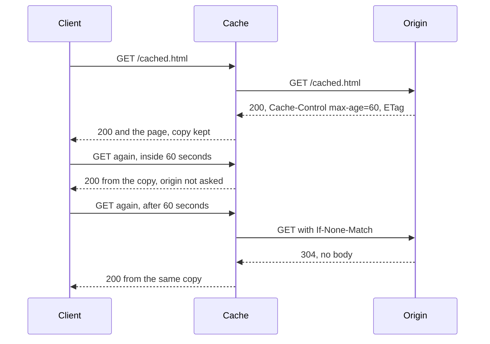

## Before you start

- [[foundation.l1.http-methods]] — you learned that GET changes nothing on the server, and that something in the middle may keep a copy of a GET answer for the next client. This lesson is about that copy.
- [[foundation.l1.http-status-codes]] — you read `304` in the table of codes as "nothing has changed". This lesson is what has to be true before that answer is useful.

## The situation

You are on the Đơn Hàng lab site the example repository starts for you (tag `stage-0`, the state a fresh clone is already in). You ask for `/cached.html` and get `200`, the page, and two header lines you have not met before. You ask again, quoting one of those values back to the server, and this time you get `304` and an empty body — no page at all. A browser holding the copy would show it to you; here, asking by hand, you see only the code. Then you ask for `/index.html`, which answers `200` and says nothing about reuse. Who is allowed to keep a copy of an answer, and for how long?

## Core concepts

- **cache** — any store that keeps a copy of a response so that a later identical GET can be answered without asking the server that produced it.
- origin — the server that produced the response and holds the real state; every stored copy came from it.
- freshness lifetime — the span during which a stored copy may be reused with no questions asked.
- validator — a value the origin attaches to a response so a client can later ask whether that exact version is still current.
- revalidation — asking the origin whether a stored copy is still usable by quoting its validator, instead of asking for the whole response again.
- stale — describes a stored copy whose freshness lifetime has passed and that has not been revalidated since.

## How it works



The situation had no separate cache: you played that part by hand, which is why you saw the `304`. The site is the origin; the diagram shows what a real cache in between does.

The first GET finds nothing stored, so it reaches the origin, which answers `200` with the page and two instructions: `Cache-Control: max-age=60` sets a freshness lifetime of sixty seconds, and `ETag` supplies a validator. The cache keeps the copy with both.

The second GET arrives while the copy is still fresh, so the cache answers from it and the origin is never asked. That is the whole benefit: no trip to the origin, and no network trip at all when the copy is in your own browser. It is also the whole cost: the origin may have changed the page meanwhile, and nobody behind the cache knows.

The third GET arrives when the copy is stale. Stale does not mean wrong or deleted; the cache normally asks first. So it revalidates: it repeats the GET with an `If-None-Match` header carrying that validator. If the origin's version still matches, it answers `304` with no body, and the cache answers the client `200` from the stored copy: here the `304` travels only between cache and origin, because the cache is the one that asked conditionally. If it does not match, the origin sends `200` and the new page, which replaces the copy.

There is rarely one cache. The browser keeps one; a proxy, a machine many people's requests pass through, keeps one for everybody behind it; and a site may keep one in front of whatever builds the page. All read the same instructions, and a cache normally stores GET answers only: reusing a POST answer would report an action nobody performed.

## In the Đơn Hàng system

The lab site has no application behind it at this tag; Caddy, the lab's web server, answers a fixed set of paths, one written for this lesson.

```caddyfile file=Caddyfile tag=stage-0 lines=70-74
		# lesson: foundation.l1.http-caching
		handle /cached.html {
			header Cache-Control "max-age=60"
			file_server
		}
```

`handle /cached.html` says the two lines inside its braces apply to that one path, and they do different jobs. `header` puts `Cache-Control: max-age=60` on every answer for the path: the freshness lifetime, chosen by the server. `file_server` reads the file from disk and, on its own, attaches an `ETag` — the validator. No other path sets `Cache-Control`, though other routes do use `header` for other fields, which is why the other pages answer differently.

```bash file=scripts/http/cache-headers.sh tag=stage-0 lines=4-24
# Everything below runs inside the lab box; this line puts it there.
[ -f /.dockerenv ] || exec "$(dirname "$0")/../lab-run.sh" "$0" "$@"

echo "1. the response says how long a cache may reuse it:"
curl -sS -D - -o /dev/null http://localhost:8080/cached.html \
  | grep -Ei '^(HTTP/|Cache-Control:|Etag:)'

echo
echo "2. asking again, quoting the ETag we already have:"
etag=$(curl -sS -D - -o /dev/null http://localhost:8080/cached.html \
       | grep -i '^etag:' | tr -d '\r' | cut -d' ' -f2)
curl -sS -o /dev/null -w '   %{http_code}\n' \
     -H "If-None-Match: $etag" http://localhost:8080/cached.html

echo
echo "3. a page the server says nothing about:"
if curl -sS -D - -o /dev/null http://localhost:8080/index.html | grep -qi '^cache-control:'; then
  echo "   it has a Cache-Control header too"
else
  echo "   no Cache-Control header, so every cache decides for itself"
fi
```

```text output=true
1. the response says how long a cache may reuse it:
HTTP/1.1 200 OK
Cache-Control: max-age=60
Etag: ...

2. asking again, quoting the ETag we already have:
   304

3. a page the server says nothing about:
   no Cache-Control header, so every cache decides for itself
```

The script plays all three parts by hand, inside the lab: `scripts/up.sh` starts the site and a box to run commands in, and the script's first line moves itself into that box, so there is nothing extra to install. `curl` sends one request and prints what comes back; its options decide how much of the answer it prints, which is why step 1 shows header lines and step 2 only a code. Step 1 asks once and prints the status line (`HTTP/1.1 200 OK`) and the two instructions the origin sent. Step 2 does what a cache does at revalidation time: its first command asks, picks the `Etag` line out of the answer's headers with `grep` and keeps just the value with `cut`, and its second sends that value back in an `If-None-Match` header.

The `304` is the origin saying "the version you hold is the version I have". Each step here is a separate command that keeps nothing from the one before, so there is no stored copy for `max-age=60` to govern: step 2 asks the origin seconds after step 1 and is answered, and you may revalidate at any moment. Step 3 asks for a page with no `Cache-Control` line at all; the server has said nothing, so each cache falls back to its own rules and they may disagree about the same page.

The `Etag: ...` line in that run is masked: it is the header the prose calls `ETag`, and its value can differ from run to run, so the repository replaces it before storing the output. Yours will be a real value, so read the run above as three answers, not three values.

## Beginners often think…

- **"Refreshing the page always fetches fresh data from the server."** → Actually opening the address again is an ordinary request, and any store holding a fresh copy (your browser, a proxy on the way) may answer it before the site hears anything. A deliberate refresh is not ordinary: that request can carry a directive forbidding reuse without checking with the origin, which is why a refresh sometimes helps where re-opening the page does not. You notice this when a colleague sees your change and you do not, on the same address, from the machine where you changed the page.
- **"Caching is something only the server does."** → Actually most of the copies are not on the server at all: the browser holds one, and a proxy between you and the origin may hold one for everybody behind it. You notice this when clearing the browser's stored files fixes a problem you spent an hour looking for on the server.
- **"A `304` means my request failed."** → Actually `304` is not a failure, and it is cheap: it sends you to the copy you already hold, as if that copy were the content of a `200`, so the origin deliberately sends no body. You notice this when a page renders completely from a response that carried nothing.

## Try it (3 minutes)

1. With the lab running (`scripts/up.sh`), run `scripts/http/cache-headers.sh` from the repository. Note the `Etag` value printed in step 1 and write down the code printed in step 2.
2. Run the script a second time and compare the two runs.

Expected result: the same `304` both times, because nothing between the two runs touched the file. The `304` is proof that the origin read your `If-None-Match` and decided your copy was still good; it sent no page, so anything you display has to come from the copy you were already holding. Note what the script does *not* prove: it reads the current `Etag` immediately before quoting it back, so it can never hold an old one. A browser that stored an answer an hour ago can, and that is when the origin answers `200` with the new page.

## Connections

- [[foundation.l1.http-methods]] — the prerequisite this lesson pays off: "GET changes nothing" is exactly what makes a GET answer safe to keep and hand to somebody else.
- [[foundation.l1.http-status-codes]] — the code table read the other way round: `304` only makes sense to a client that is already holding something.
- [[foundation.l1.cookies-and-state]] — the mirror image: a cookie is state the client is asked to send up on every request, while a stored response is state the client is allowed to keep and not ask about.
- [[backend.l2.cache-aside]] — the same trade one layer in: the application keeps its own copies of what the database said, and pays for it in the same currency.

## Five-line summary

1. A cache keeps a copy of a response so the next identical GET can be answered without asking the origin, buying speed with staleness.
2. `Cache-Control` carries the origin's instruction; `max-age` sets how long a copy may be reused before it goes stale.
3. Stale means "ask before reusing", not "delete": the cache revalidates with `If-None-Match`, and `304` with no body means the copy is still current.
4. Caches sit in the browser, in proxies and in front of the origin, so a change can be visible in one place and not another.
5. A cache normally stores GET answers only, which is one more reason the method you choose is not a matter of style.
