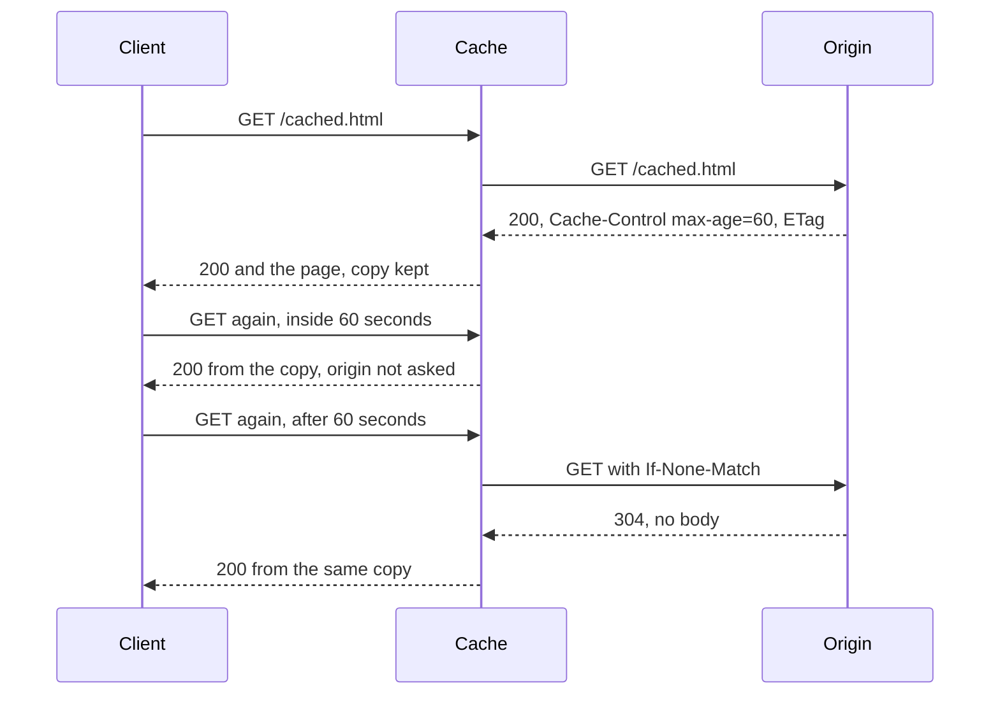

## Bạn cần biết trước

- [[foundation.l1.http-methods]] — bạn đã biết GET không thay đổi gì trên server, và một thứ đứng ở giữa có thể giữ lại bản sao câu trả lời của GET cho client sau. Bài này nói về bản sao đó.
- [[foundation.l1.http-status-codes]] — trong bảng mã, bạn đã đọc `304` là "không có gì thay đổi". Bài này nói điều gì phải đúng trước thì câu trả lời đó mới có ích.

## Tình huống

Bạn đang ở trang lab Đơn Hàng mà repo ví dụ khởi động sẵn cho bạn (tag `stage-0`). Bạn xin `/cached.html` và nhận `200`, nội dung trang, kèm hai dòng header bạn chưa gặp bao giờ. Bạn hỏi lại, gửi kèm một trong hai giá trị đó, và nhận `304` với phần thân rỗng, không có trang nào cả. Nếu là trình duyệt đang giữ bản sao, nó sẽ hiện bản sao đó cho bạn. Còn ở đây bạn hỏi bằng tay, nên chỉ thấy mã trạng thái. Rồi bạn xin `/index.html`, trang này trả `200` và không hề nói nó được dùng lại trong bao lâu. Ai được phép giữ bản sao của một câu trả lời, và giữ trong bao lâu?

## Khái niệm cốt lõi

- **cache** (bản sao dữ liệu giữ gần nơi dùng để lần sau lấy nhanh hơn, đổi lại có thể cũ) — bất kỳ nơi nào giữ bản sao của một response để một GET giống hệt về sau được trả lời mà không cần hỏi server đã tạo ra nó.
- origin — server đã tạo ra response và nắm trạng thái thật. Mọi bản sao đang được giữ đều đến từ nó.
- thời gian còn tươi (freshness lifetime) — khoảng thời gian một bản sao được dùng lại mà không phải hỏi gì.
- validator — một giá trị origin gắn vào response để về sau client hỏi được rằng đúng phiên bản đó còn là bản hiện hành không.
- xác thực lại (revalidation) — hỏi origin xem bản sao đang giữ còn dùng được không bằng cách gửi kèm validator của nó, thay vì xin lại toàn bộ response.
- stale (cũ) — chỉ một bản sao đã hết thời gian còn tươi và chưa được xác thực lại kể từ đó.

## Cơ chế hoạt động



Trong tình huống trên không có cache nào đứng riêng: chính bạn đóng vai đó bằng tay, nên bạn mới thấy `304`. Trang lab là origin. Sơ đồ cho thấy một cache thật đứng ở giữa sẽ làm gì.

GET đầu tiên không thấy bản sao nào, nên đi thẳng tới origin. Origin trả `200` cùng nội dung trang và hai chỉ dẫn: `Cache-Control: max-age=60` đặt thời gian còn tươi là sáu mươi giây, còn `ETag` cung cấp validator. Cache giữ bản sao cùng cả hai.

GET thứ hai tới khi bản sao vẫn còn tươi, nên cache trả lời từ bản sao và origin không hề bị hỏi. Đó là toàn bộ lợi ích: không phải đi tới origin, và không tốn chuyến mạng nào nếu bản sao nằm ngay trong trình duyệt của bạn. Đó cũng là toàn bộ cái giá: trong lúc đó origin có thể đã đổi trang, và không ai đứng sau cache biết điều đó.

GET thứ ba tới khi bản sao đã stale. Stale không có nghĩa là bị xóa. Trừ vài ngoại lệ, cache phải hỏi trước, tức là nó xác thực lại: gửi lại GET kèm header `If-None-Match` mang validator đó. Nếu phiên bản của origin vẫn khớp, origin trả `304` không có thân, và cache trả cho client `200` từ bản sao đang giữ. `304` chỉ đi giữa cache và origin, vì cache là bên đã gửi `If-None-Match`. Nếu không khớp, origin gửi `200` kèm trang mới, cache chuyển nó cho client và có thể lưu nó thay cho bản sao cũ.

Hiếm khi chỉ có một cache. Trình duyệt giữ một cái. Một proxy, tức một máy mà request của nhiều người cùng đi qua, giữ một cái cho mọi người phía sau nó. Và một trang web có thể giữ một cái đặt trước phần dựng nên trang. Tất cả đều đọc cùng các chỉ dẫn, và thông thường cache chỉ lưu câu trả lời của GET: dùng lại câu trả lời của POST sẽ báo về một hành động không ai thực hiện.

## Trong hệ thống Đơn Hàng

Ở tag này trang lab chưa có ứng dụng nào phía sau. Caddy, web server của lab, phục vụ nguyên trạng các file trên đĩa và vài đường dẫn cố định, trong đó có một đường dẫn viết riêng cho bài này.

```caddyfile file=Caddyfile tag=stage-0 lines=70-74
		# lesson: foundation.l1.http-caching
		handle /cached.html {
			header Cache-Control "max-age=60"
			file_server
		}
```

`handle /cached.html` nói rằng hai dòng trong cặp ngoặc nhọn chỉ áp dụng cho đường dẫn đó, và hai dòng này làm hai việc khác nhau. `header` gắn `Cache-Control: max-age=60` vào mọi câu trả lời cho đường dẫn này: đó là thời gian còn tươi, do server chọn. `file_server` đọc file từ đĩa và tự gắn thêm `ETag`, tức validator. Không đường dẫn nào khác đặt `Cache-Control`, nên các trang khác trả lời khác đi. Các đường dẫn khác cũng dùng `header`, nhưng cho những trường khác.

```bash file=scripts/http/cache-headers.sh tag=stage-0 lines=4-24
# Everything below runs inside the lab box; this line puts it there.
[ -f /.dockerenv ] || exec "$(dirname "$0")/../lab-run.sh" "$0" "$@"

echo "1. the response says how long a cache may reuse it:"
curl -sS -D - -o /dev/null http://localhost:8080/cached.html \
  | grep -Ei '^(HTTP/|Cache-Control:|Etag:)'

echo
echo "2. asking again, quoting the ETag we already have:"
etag=$(curl -sS -D - -o /dev/null http://localhost:8080/cached.html \
       | grep -i '^etag:' | tr -d '\r' | cut -d' ' -f2)
curl -sS -o /dev/null -w '   %{http_code}\n' \
     -H "If-None-Match: $etag" http://localhost:8080/cached.html

echo
echo "3. a page the server says nothing about:"
if curl -sS -D - -o /dev/null http://localhost:8080/index.html | grep -qi '^cache-control:'; then
  echo "   it has a Cache-Control header too"
else
  echo "   no Cache-Control header, so every cache decides for itself"
fi
```

```text output=true
1. the response says how long a cache may reuse it:
HTTP/1.1 200 OK
Cache-Control: max-age=60
Etag: ...

2. asking again, quoting the ETag we already have:
   304

3. a page the server says nothing about:
   no Cache-Control header, so every cache decides for itself
```

Script này tự đóng cả ba vai bằng tay, bên trong lab: `scripts/up.sh` khởi động trang web và một box để chạy lệnh, còn dòng `exec` ở đầu khối trên chuyển script vào box đó, nên bạn không phải cài thêm gì. `curl` gửi một request và in ra những gì nhận về. Các tùy chọn của nó quyết định in bao nhiêu phần câu trả lời, nên bước 1 hiện các dòng header còn bước 2 chỉ hiện một mã. Bước 1 hỏi một lần, in dòng trạng thái (`HTTP/1.1 200 OK`) và hai chỉ dẫn origin gửi. Bước 2 làm đúng điều cache làm khi xác thực lại: lệnh đầu hỏi, dùng `grep` nhặt dòng `Etag` ra khỏi header của câu trả lời, dùng `tr` bỏ ký tự cuối dòng vô hình, dùng `cut` giữ lại đúng giá trị. Lệnh thứ hai gửi giá trị đó ngược lại trong header `If-None-Match`.

`304` là origin nói "phiên bản bạn đang giữ chính là phiên bản tôi có". `curl` không lưu gì, nên ở đây không có cache nào để `max-age=60` chi phối. Hỏi origin thì lúc nào cũng được. `max-age` chỉ nói khi nào cache được phép bỏ qua bước hỏi. Bước 3 xin một trang không có dòng `Cache-Control` nào. Server không hề nói trang được dùng lại bao lâu, nên mỗi cache tự dùng quy tắc riêng, và các cache có thể bất đồng với nhau về cùng một trang.

Dòng `Etag: ...` trong lần chạy trên đã bị che: đó là header mà phần giải thích gọi là `ETag`, giá trị của nó có thể khác nhau giữa các lần chạy, nên repo thay nó đi trước khi lưu kết quả. Của bạn sẽ là một giá trị thật, vì vậy hãy so kết quả theo các dòng trạng thái và tên header, đừng so giá trị `Etag`.

## Người mới hay nghĩ rằng…

- **"Mở lại một trang thì lúc nào cũng lấy dữ liệu mới từ server."** → Thực ra gõ lại địa chỉ hay bấm vào một liên kết chỉ là một request bình thường, và bất kỳ nơi nào đang giữ bản sao còn tươi (trình duyệt, một proxy trên đường đi) đều có thể trả lời trước khi trang web nghe thấy gì. Bấm nút tải lại thì có thể khác: request đó có thể mang trong header một chỉ dẫn yêu cầu cache hỏi origin trước khi dùng lại bản sao, nên tải lại đôi khi có tác dụng. Bạn sẽ nhận ra khi đã sửa trang mà máy mình vẫn thấy bản cũ, trong khi đồng nghiệp mở cùng địa chỉ đã thấy bản mới.
- **"Cache là việc chỉ server làm."** → Thực ra phần lớn bản sao không hề nằm trên server: trình duyệt giữ một bản, và một proxy giữa bạn với origin có thể giữ một bản cho mọi người phía sau nó. Bạn sẽ nhận ra khi xóa file lưu tạm của trình duyệt là hết một lỗi mà bạn đã mất cả tiếng đi tìm trên server.
- **"`304` nghĩa là request của mình bị lỗi."** → Thực ra `304` không phải lỗi, và nó rất rẻ: nó chỉ bạn về bản sao đang giữ, coi bản sao đó như nội dung của một `200`, nên origin cố ý không gửi thân. Bạn sẽ nhận ra khi một trang hiện đầy đủ từ một response không mang gì cả.

## Thử ngay (3 phút)

1. Với lab đang chạy (`scripts/up.sh`), chạy `scripts/http/cache-headers.sh` từ repo. Ghi lại mã mà script in ra ở bước 2.
2. Chạy script lần thứ hai và so hai lần chạy.

Kết quả mong đợi: cả hai lần đều là `304`, vì bước 2 gửi ngược lại đúng `Etag` nó vừa đọc, nên origin luôn thấy khớp. `304` là bằng chứng origin đã đọc `If-None-Match` của bạn và thấy bản sao vẫn dùng tốt, nên không gửi trang. Để ý điều script *không* chứng minh: nó đọc `Etag` hiện hành ngay trước khi gửi lại, nên không bao giờ giữ một `Etag` cũ. Một trình duyệt đã lưu câu trả lời từ một tiếng trước thì có thể, và khi đó origin trả `200` kèm trang mới.

## Liên hệ

- [[foundation.l1.http-methods]] — "GET không thay đổi gì" chính là điều khiến câu trả lời của GET an toàn để giữ lại và đưa cho người khác.
- [[foundation.l1.http-status-codes]] — bảng mã đọc theo chiều ngược lại: `304` chỉ có nghĩa với một client đang giữ sẵn thứ gì đó.
- [[foundation.l1.cookies-and-state]] — hình ảnh phản chiếu: cookie là trạng thái client được yêu cầu gửi lên trong mọi request, còn response đã lưu là trạng thái client được phép giữ và không cần hỏi.
- [[backend.l2.cache-aside]] — cùng sự đánh đổi đó ở một lớp sâu hơn: ứng dụng tự giữ bản sao của những câu trả lời tốn thời gian tạo ra, và trả giá bằng đúng loại tiền ấy.

## Tóm tắt 5 dòng

1. Cache giữ bản sao của một response để GET giống hệt lần sau được trả lời mà không cần hỏi origin, đổi tốc độ lấy nguy cơ dữ liệu cũ.
2. `Cache-Control` mang chỉ dẫn của origin, `max-age` đặt thời gian một bản sao được dùng lại trước khi thành stale.
3. Stale nghĩa là "hỏi trước khi dùng lại", không phải "xóa": cache xác thực lại bằng `If-None-Match`, và `304` không có thân nghĩa là bản sao vẫn là bản hiện hành.
4. Cache nằm trong trình duyệt, trong proxy và trước origin, nên một thay đổi có thể thấy ở chỗ này mà chưa thấy ở chỗ khác.
5. Thông thường cache chỉ lưu câu trả lời của GET, thêm một lý do để chọn method không phải chuyện phong cách.
