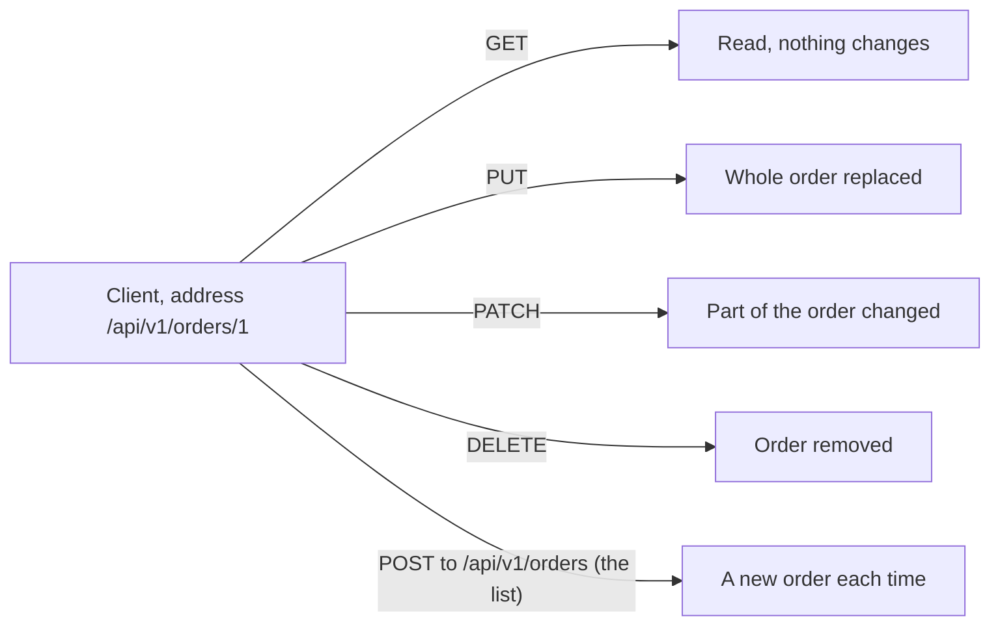

## Before you start

- [[foundation.l1.http-request-response]] — you took a request apart into a start line, headers, a blank line and a body. This lesson is about the first word of that start line.

## The situation

You are checking the Đơn Hàng order paths on the lab site the example repository starts for you (tag `stage-0`). You send a request to `/api/v1/orders/1` and get back `200` with the order's data. You keep the address, change only the first word of the start line, send it again, and get `204` with an empty body. A third try, same address again, answers `200` and reports that the order was changed. A teammate asks which of the three would have deleted the order on a real server, and you cannot tell from the address, because the address never said it. So what does that first word promise, and who keeps the promise?

## Core concepts

- **HTTP method** — the first word of a request's start line, naming the kind of action the client intends to perform on the address that follows.
- **idempotent** — describes a method whose repetition has the same intended effect on the server — the same stored orders — as sending it once.
- intermediary — a program between the client and the server that passes messages on.
- client library — the code inside your own program that sends the request for you and waits for the answer.
- retry — sending the same request a second time after a failure or a timeout, either by hand or automatically.

## How it works



Read the diagram from the client outward. GET asks to read the order and to change nothing. PUT sends a whole order and asks for that to become the new state. PATCH sends only the part that changes. DELETE asks for the order to be removed. POST asks the server to process what you sent, usually by creating something new; in Đơn Hàng it goes to the list address, `/api/v1/orders`, because the new order has no address yet.

The word you kept changing in the situation is the HTTP method. HTTP, the protocol, defines what each one means; the server is what implements it. A server may answer a GET by removing the order — the protocol forbids that but cannot prevent it — and every client and intermediary that trusts the meaning is wrong.

The right-hand column holds the second idea: of the boxes there, only POST says "each time". Ten GETs leave the order exactly as one does. Ten identical PUTs end in the state one PUT would have left. Ten DELETEs: the first removes the order, the rest find nothing.

Those three are idempotent, while POST is not: ten POSTs to the list ask for ten new orders. PATCH is not on the list either: whether repeating it is harmless depends on the patch. That is why a browser usually asks before sending a form again when you reload.

An intermediary may keep a copy of a GET answer for the next client, but never of a DELETE answer. A client library may retry a GET, PUT or DELETE by itself after a timeout, and will not retry a POST unless the person who wrote the call said that this one request is safe to send twice, because it cannot know whether the first arrived.

## In the Đơn Hàng system

There is no application behind the lab site at this stage of the example repository (the `stage-0` tag); the lab's web server, Caddy, answers a fixed set of order paths, so the exchange is real even though nothing is stored. One script sends requests to the same two addresses and changes only the method.

```bash file=scripts/http/methods.sh tag=stage-0 lines=4-25
# Everything below runs inside the lab box; this line puts it there.
[ -f /.dockerenv ] || exec "$(dirname "$0")/../lab-run.sh" "$0" "$@"

base=http://localhost:8080/api/v1/orders

curl -sS -o /dev/null -w 'GET    /api/v1/orders/1  -> %{http_code}\n' "$base/1"
curl -sS -o /dev/null -w 'POST   /api/v1/orders    -> %{http_code}\n' \
     -H 'Content-Type: application/json' -d '{"customer_id":1}' "$base"
curl -sS -o /dev/null -w 'PUT    /api/v1/orders/1  -> %{http_code}\n' -X PUT "$base/1"
curl -sS -o /dev/null -w 'PATCH  /api/v1/orders/1  -> %{http_code}\n' -X PATCH "$base/1"
curl -sS -o /dev/null -w 'DELETE /api/v1/orders/1  -> %{http_code}\n' -X DELETE "$base/1"

echo
echo "POST creates, so it also says where the new thing lives:"
curl -sS -D - -o /dev/null -X POST \
     -H 'Content-Type: application/json' -d '{"customer_id":1}' "$base" \
  | grep -Ei '^(HTTP/|Location:)'

echo
echo "GET changes nothing, so asking twice gives the same thing twice:"
curl -sS "$base/1"; echo
curl -sS "$base/1"; echo
```

The second line puts the whole run inside the lab box — the prepared machine the example repository starts for you — so these answers are the same on every machine. Each `curl` line sends one request; `curl` is the command-line program that sends a request and prints the answer. What it prints here is nothing but the label typed into `-w` plus `%{http_code}`, the status code that came back. The other switches are plumbing: they hide progress output, throw the body away, set the `Content-Type` header, and print the response headers.

Among the four requests to `base/1` only the method differs; the POST line changes the address as well. The GET line carries no `-X` because `curl` sends GET unless told otherwise, and the POST line carries none either — the `-d` body is what makes `curl` switch to POST; the last three name the method with `-X`. The POST line is also the only one addressed to the list in `base` rather than to `base/1`, and the only one carrying a body. The last part of the script prints the status line and the `Location` header of one POST answer, then sends the same GET twice.

```text output=true
GET    /api/v1/orders/1  -> 200
POST   /api/v1/orders    -> 201
PUT    /api/v1/orders/1  -> 200
PATCH  /api/v1/orders/1  -> 200
DELETE /api/v1/orders/1  -> 204

POST creates, so it also says where the new thing lives:
HTTP/1.1 201 Created
Location: /api/v1/orders/13

GET changes nothing, so asking twice gives the same thing twice:
{"id":1,"customer_id":1,"status":"paid"}
{"id":1,"customer_id":1,"status":"paid"}
```

Every line here is one of the meanings above, made visible. GET returns the order; PUT and PATCH report that a change was accepted; DELETE answers `204`, which carries no body, because there is nothing left to send back. POST answers `201` and a `Location` header naming where the created order lives, which is what a server that has created something is expected to send, so the client knows where the new order is.

The DELETE further up removed nothing — there is nothing stored here to remove — so order 1 is still there to read. The last two lines show the promise from the outside: the first GET left the order untouched, so the second one finds the same order. What makes GET idempotent is that neither request changed anything on the server, not that the two bodies match. Because this tag stores nothing, a second POST also repeats; behind a real application each POST would name a different order.

## Beginners often think…

- **"GET and POST are interchangeable; POST is just for 'sending data'."** → Actually the two make opposite promises: GET says nothing on the server changes, POST says something may. You notice this when a page that loads an order with POST cannot be shared as a link — a link carries only an address, and a POST also needs its body — and every reload asks the reader to confirm.
- **"Idempotent means the response is the same every time."** → Actually it is about the state left on the server, not the answer sent back. The first DELETE of an order can answer `204` and the second `404`, yet both leave the order gone, so DELETE is still idempotent. You notice this when a retry reports a failure for work that already succeeded.
- **"Which method you use is a matter of style."** → Actually machines you never see read the method and act on it: an intermediary decides whether it may hand a stored copy to the next client, and a client library decides whether it may retry after a timeout. You notice this when a list "does not refresh" because an old GET answer is being served, or when one click produces two orders.

## Try it (3 minutes)

1. With the stage-0 lab site running (start it with `scripts/up.sh`), run `scripts/http/methods.sh` and write down the five status codes.
2. Run it a second time and compare the two outputs line by line.

Expected result: both runs print the same five codes in the same order, `200`, `201`, `200`, `200`, `204`, and the two order bodies at the end are identical. Nothing is stored at this tag, so even the POST answer repeats; behind a real application the POST line would be the one that produced a second order, while the other four would leave the same single order behind.

## Connections

- [[foundation.l1.http-request-response]] — the previous lesson; the method is the first word of the start line it took apart.
- [[foundation.l1.http-status-codes]] — the other half of the exchange: each method has a small set of answers it is expected to give.
- [[foundation.l1.http-caching]] — takes the same starting point, that GET changes nothing, and explains when a stored copy of a GET answer may be handed to the next client.
- [[backend.l2.idempotent-endpoints]] — the same idea one layer up: how a server makes a POST safe to send twice when the network gives the client no choice.

## Five-line summary

1. The method is the first word of a request: it names the client's intent, the protocol defines it, the server implements or breaks it.
2. GET reads and changes nothing; POST creates or triggers; PUT replaces the whole thing; PATCH changes part; DELETE removes.
3. GET, PUT and DELETE are idempotent: repeating them has the same intended effect as one call.
4. POST is not idempotent, which is why a browser usually asks before re-sending a form and why a library should not retry it.
5. Method choice is not style: a wrong verb misleads intermediaries that may reuse a GET answer and libraries that may retry an idempotent request.
