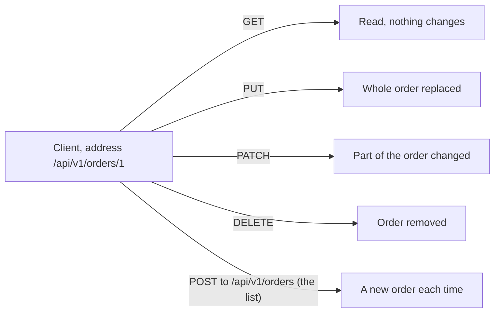

## Before you start

- [[foundation.l1.http-request-response]] — you took a request apart into a start line, headers, a blank line and a body. This lesson is about the first word of that start line.

## The situation

You are checking the Đơn Hàng order paths on the stage-0 version of the lab site the example repository starts for you. You send a request to `/api/v1/orders/1` and get back `200` with the order's data. You keep the address (the path after the method), change only the first word of the start line, send it again, and get `204` with an empty body. A third try, same address again, answers `200`, which says the change was carried out. A teammate asks which of the three would have deleted the order on a real server, and you cannot tell from the address, which never said it. So what does that first word promise, and who keeps the promise?

## Core concepts

- **HTTP method** — the first word of a request's start line, naming the kind of action the client intends to perform on the address that follows.
- **idempotent** — describes a method whose repetition has the same intended effect on the server — the same stored orders — as sending it once.
- intermediary — a program between the client and the server that passes messages on.
- client library — the code inside your own program that sends the request for you and waits for the answer.
- retry — sending the same request a second time after a failure or after waiting too long for an answer that never came (a timeout), either by hand or automatically.

## How it works


```mermaid
flowchart LR
  C["Client, address /api/v1/orders/1"] -->|GET| R["Read, nothing changes"]
  C -->|PUT| W["Whole order replaced"]
  C -->|PATCH| M["Part of the order changed"]
  C -->|DELETE| D["Order removed"]
  C -->|"POST to /api/v1/orders (the list)"| N["A new order each time"]
```

GET asks to read the order and to change nothing. PUT sends a whole order to become the new state. PATCH sends only the part that changes. DELETE asks for the order to be removed. POST asks the server to process what you sent, usually creating something new; in Đơn Hàng it goes to the list address, `/api/v1/orders`, because the new order has no address yet.

The word you kept changing is the HTTP method. The protocol defines what each means; the server implements it. A server may answer a GET by removing the order — the protocol forbids that but cannot prevent it — and every client and intermediary that trusts what GET means is misled.

Only POST's box says "each time". Ten GETs leave the order as one does. Ten identical PUTs leave what one would. Ten DELETEs: the first removes the order, the rest find nothing.

Those three are idempotent; POST is not: ten POSTs to the list ask for ten new orders. So after a form (the fields on a page whose button sends them) was sent with POST, a browser usually asks before re-sending it on reload. Nothing promises a second PATCH is harmless either: "add one item to the order", sent twice, adds two.

An intermediary may hand the next client a stored copy of a GET answer, but never of a DELETE answer. A served copy means the request never reaches the server: harmless for a GET, which promises no change; for a DELETE, the order would stay. A client library may retry a GET, PUT or DELETE by itself after a timeout. It should not retry a POST unless whoever wrote the call marked it safe to send twice, since it cannot know whether the first arrived; some libraries retry anyway.

## In the Đơn Hàng system

There is no application behind the lab site in the stage-0 version of the example repository. The lab runs Caddy, a program that answers HTTP requests; here it gives fixed answers for a few order paths, so the exchange is real even though nothing behind it saves what you send. One script sends requests to the same two addresses and changes only the method.

```bash file=scripts/http/methods.sh tag=stage-0 lines=4-25
# Everything below runs inside the lab box; this line puts it there.
[ -f /.dockerenv ] || exec "$(dirname "$0")/../lab-run.sh" "$0" "$@"

base=http://localhost:8080/api/v1/orders

curl -sS -o /dev/null -w 'GET    /api/v1/orders/1  -> %{http_code}\n' "$base/1"
curl -sS -o /dev/null -w 'POST   /api/v1/orders    -> %{http_code}\n' \
     -H 'Content-Type: application/json' -d '{"customer_id":1}' "$base"
curl -sS -o /dev/null -w 'PUT    /api/v1/orders/1  -> %{http_code}\n' -X PUT "$base/1"
curl -sS -o /dev/null -w 'PATCH  /api/v1/orders/1  -> %{http_code}\n' -X PATCH "$base/1"
curl -sS -o /dev/null -w 'DELETE /api/v1/orders/1  -> %{http_code}\n' -X DELETE "$base/1"

echo
echo "POST creates, so it also says where the new thing lives:"
curl -sS -D - -o /dev/null -X POST \
     -H 'Content-Type: application/json' -d '{"customer_id":1}' "$base" \
  | grep -Ei '^(HTTP/|Location:)'

echo
echo "GET changes nothing, so asking twice gives the same thing twice:"
curl -sS "$base/1"; echo
curl -sS "$base/1"; echo
```

The second line puts the whole run inside the lab box — the prepared machine the example repository starts for you — so these answers are the same on every machine. `localhost:8080` is port 8080 on that box. `curl`, the command-line program on each of these lines, sends one request and prints the answer.

Each of the first five lines prints only its `-w` label, with `%{http_code}` replaced by the status code that came back. The other switches are plumbing: they hide progress output (`-sS`), throw the body away (`-o /dev/null`), set the `Content-Type` header, which names the body's format (`-H`), and print the response headers (`-D -`); `grep` keeps only the lines starting with `HTTP/` or `Location:`.

Among the four requests to `$base/1` (that is, /api/v1/orders/1) only the method differs; the POST line changes the address as well. The GET line carries no `-X` because `curl` sends GET unless told otherwise, and the POST line carries none either — its `-d` body, a small order, makes `curl` switch to POST; the last three name the method with `-X`. Of those five, the POST line is the only one addressed to `$base` itself, the list address, and the only one carrying a body. A real PUT or PATCH would carry the order or the changed part as a body; the lab answers without reading one, so the script leaves it out. The last part of the script prints the first line and the `Location` header of one POST answer, then sends the same GET twice.

```text output=true
GET    /api/v1/orders/1  -> 200
POST   /api/v1/orders    -> 201
PUT    /api/v1/orders/1  -> 200
PATCH  /api/v1/orders/1  -> 200
DELETE /api/v1/orders/1  -> 204

POST creates, so it also says where the new thing lives:
HTTP/1.1 201 Created
Location: /api/v1/orders/13

GET changes nothing, so asking twice gives the same thing twice:
{"id":1,"customer_id":1,"status":"paid"}
{"id":1,"customer_id":1,"status":"paid"}
```

GET returns the order; PUT and PATCH report that the change was carried out; DELETE answers `204`, which carries no body, because there is nothing left to send back. POST answers `201` and a `Location` header naming where the created order lives, which is what a server that has created something is expected to send.

The DELETE further up removed nothing, since Caddy's answer is fixed, so order 1 is still there to read. The last two lines show the promise from the outside: the first GET left the order untouched, so the second one finds the same order. What makes GET idempotent is that neither request changed anything on the server, not that the two bodies match. Caddy's answers here are fixed and nothing behind them saves what you send, so a second POST also repeats; behind a real application each POST would name a different order.

## Beginners often think…

- **"GET and POST are interchangeable; POST is just for 'sending data'."** → Actually the two make opposite promises: GET says nothing on the server changes, POST says something may. You notice this when a page that loads an order with POST cannot be shared as a link — a link carries only an address, and a POST also needs its body — and a reload usually asks the reader to confirm.
- **"Idempotent means the response is the same every time."** → Actually it is about the state left on the server, not the answer sent back. The first DELETE of an order can answer `204` and the second `404`, the code for "nothing at this address", yet both leave the order gone, so DELETE is still idempotent. You notice this when a retry reports a failure for work that already succeeded.
- **"Which method you use is a matter of style."** → Actually machines you never see read the method and act on it: an intermediary decides whether it may hand a stored copy to the next client, and a client library decides whether it may retry after a timeout. You notice this when a list "does not refresh" because an old GET answer is being served, or when one click produces two orders.

## Try it (3 minutes)

1. With the stage-0 lab site running (start it with `scripts/up.sh`), run `scripts/http/methods.sh` and write down the five status codes in the first block of output.
2. Run it a second time and compare the two outputs line by line.

Expected result: both runs print the same five codes in the same order, `200`, `201`, `200`, `200`, `204`, and the two order bodies at the end are identical. Since Caddy's answers are fixed, even the POST answer repeats; behind a real application only the POST line would produce a second order.

## Connections

- [[foundation.l1.http-request-response]] — the previous lesson; the method is the first word of the start line it took apart.
- [[foundation.l1.http-status-codes]] — the other half of the exchange: each method has a small set of answers it is expected to give.
- [[foundation.l1.http-caching]] — takes the same starting point, that GET changes nothing, and explains when a stored copy of a GET answer may be handed to the next client.
- [[backend.l1.rest-resources]] — the same verbs across all of Đơn Hàng's addresses: how it names its order addresses and which method each one takes.
- [[backend.l2.idempotent-endpoints]] — the same idea on the server side: how a server makes a POST safe to send twice when the network gives the client no choice.

## Five-line summary

1. The method is the first word of a request: it names the client's intent, the protocol defines it, the server implements or breaks it.
2. GET reads and changes nothing; POST has the server process what you send, usually creating something; PUT replaces the whole; PATCH changes part; DELETE removes.
3. GET, PUT and DELETE are idempotent: repeating them has the same intended effect as one call.
4. POST is not idempotent: a browser usually asks before re-sending a POST form; a library should not retry it unless told it may.
5. Method choice is not style: a wrong verb misleads intermediaries that may reuse a GET answer and libraries that may retry an idempotent request.
