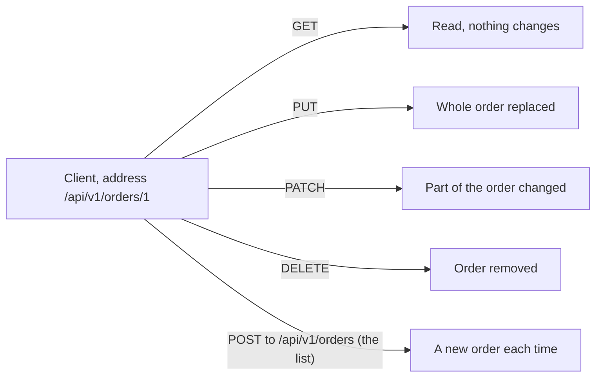

## Bạn cần biết trước

- [[foundation.l1.http-request-response]] — bạn đã tách một request thành dòng đầu, các header, một dòng trống và phần thân. Bài này nói về từ đầu tiên của dòng đầu đó.

## Tình huống

Bạn đang kiểm tra các đường dẫn đơn hàng của Đơn Hàng trên trang lab bản stage-0 mà repo ví dụ khởi động sẵn cho bạn. Bạn gửi request tới `/api/v1/orders/1` và nhận về `200` kèm dữ liệu của đơn hàng. Bạn giữ nguyên địa chỉ (đường dẫn đứng sau method), chỉ đổi từ đầu tiên của dòng đầu, gửi lại và nhận `204` với phần thân rỗng. Lần thử thứ ba, vẫn địa chỉ đó, server trả `200`, nghĩa là thay đổi đã thực hiện xong. Một đồng nghiệp hỏi trong ba lần đó, lần nào sẽ xóa đơn hàng trên một server thật, và bạn không trả lời được nhờ địa chỉ, vì địa chỉ chưa bao giờ nói điều đó. Vậy từ đầu tiên ấy hứa hẹn điều gì, và ai là người giữ lời hứa?

## Khái niệm cốt lõi

- **HTTP method** (Động từ của request: GET lấy, POST tạo, PUT/PATCH sửa, DELETE xóa) — từ đầu tiên trên dòng đầu của request, cho biết client định làm loại hành động nào với địa chỉ đứng sau.
- **idempotent** (Gọi nhiều lần cho kết quả như gọi một lần (GET, PUT, DELETE là idempotent; POST thì không)) — tính chất của một method mà gửi lặp lại nhiều lần để lại trên server đúng tác động dự định như gửi một lần, tức là cùng một tập đơn hàng đã lưu.
- trung gian — một chương trình nằm giữa client và server, chuyển tiếp thông điệp qua lại.
- thư viện client — phần code bên trong chính chương trình của bạn, gửi request thay bạn và chờ câu trả lời.
- gửi lại (retry) — gửi cùng một request lần thứ hai sau khi thất bại, hoặc sau khi chờ quá lâu mà câu trả lời không đến (hết thời gian chờ, timeout), bằng tay hoặc tự động.

## Cơ chế hoạt động



GET xin đọc đơn hàng và không đổi gì cả. PUT gửi nguyên một đơn hàng để thành trạng thái mới. PATCH chỉ gửi phần cần đổi. DELETE xin xóa đơn hàng. POST nhờ server xử lý thứ bạn gửi, thường là tạo ra cái gì đó mới. Trong Đơn Hàng, POST đi tới địa chỉ danh sách, `/api/v1/orders`, vì đơn hàng mới chưa có địa chỉ.

Từ bạn cứ đổi qua đổi lại chính là HTTP method. Giao thức định nghĩa mỗi method nghĩa là gì, còn server là bên hiện thực nó. Server vẫn có thể trả lời một GET bằng cách xóa đơn hàng — giao thức cấm điều đó nhưng không ngăn được — và mọi client, mọi trung gian tin vào ý nghĩa của GET đều bị đánh lừa.

Chỉ ô của POST có chữ "each time" (mỗi lần). Mười lần GET để lại đơn hàng y như một lần. Mười lần PUT giống hệt nhau để lại đúng thứ mà một lần PUT để lại. Mười lần DELETE: lần đầu xóa đơn hàng, các lần sau không còn gì để xóa.

Ba method đó là idempotent, còn POST thì không: mười lần POST tới danh sách là xin mười đơn hàng mới. Vì thế, sau khi một form (các ô nhập trên trang, có nút bấm để gửi chúng đi) đã được gửi bằng POST, trình duyệt thường hỏi lại trước khi gửi lần nữa lúc bạn tải lại trang. PATCH cũng không có gì bảo đảm lần gửi thứ hai là vô hại: "thêm một món vào đơn hàng", gửi hai lần, sẽ thêm hai món.

Một trung gian có thể đưa cho client kế tiếp bản lưu sẵn của câu trả lời cho GET, nhưng không bao giờ làm vậy với câu trả lời cho DELETE. Khi trung gian trả bản lưu sẵn, request không hề tới server: với GET thì vô hại, vì GET hứa không đổi gì, còn với DELETE thì đơn hàng vẫn nằm nguyên đó. Thư viện client có thể tự gửi lại GET, PUT hay DELETE sau khi hết thời gian chờ. Nó không nên gửi lại POST, trừ khi người viết lời gọi đã đánh dấu là gửi hai lần cũng an toàn, vì thư viện không biết lần đầu đã tới nơi hay chưa. Dù vậy, vẫn có thư viện cứ gửi lại.

## Trong hệ thống Đơn Hàng

Ở bản stage-0 của repo ví dụ, phía sau trang lab chưa có ứng dụng nào. Lab chạy Caddy, một chương trình trả lời HTTP request. Ở đây Caddy trả lời cố định cho vài đường dẫn đơn hàng, nên cuộc trao đổi là thật dù phía sau không có gì lưu lại thứ bạn gửi. Một script gửi request tới cùng hai địa chỉ và chỉ đổi method.

```bash file=scripts/http/methods.sh tag=stage-0 lines=4-25
# Everything below runs inside the lab box; this line puts it there.
[ -f /.dockerenv ] || exec "$(dirname "$0")/../lab-run.sh" "$0" "$@"

base=http://localhost:8080/api/v1/orders

curl -sS -o /dev/null -w 'GET    /api/v1/orders/1  -> %{http_code}\n' "$base/1"
curl -sS -o /dev/null -w 'POST   /api/v1/orders    -> %{http_code}\n' \
     -H 'Content-Type: application/json' -d '{"customer_id":1}' "$base"
curl -sS -o /dev/null -w 'PUT    /api/v1/orders/1  -> %{http_code}\n' -X PUT "$base/1"
curl -sS -o /dev/null -w 'PATCH  /api/v1/orders/1  -> %{http_code}\n' -X PATCH "$base/1"
curl -sS -o /dev/null -w 'DELETE /api/v1/orders/1  -> %{http_code}\n' -X DELETE "$base/1"

echo
echo "POST creates, so it also says where the new thing lives:"
curl -sS -D - -o /dev/null -X POST \
     -H 'Content-Type: application/json' -d '{"customer_id":1}' "$base" \
  | grep -Ei '^(HTTP/|Location:)'

echo
echo "GET changes nothing, so asking twice gives the same thing twice:"
curl -sS "$base/1"; echo
curl -sS "$base/1"; echo
```

Dòng thứ hai đưa toàn bộ lần chạy vào trong hộp lab — cỗ máy dựng sẵn mà repo ví dụ khởi động cho bạn — nên máy nào chạy cũng nhận cùng những câu trả lời này. `localhost:8080` là port 8080 trên hộp đó. `curl`, chương trình dòng lệnh có mặt ở mỗi dòng này, gửi một request và in ra câu trả lời.

Mỗi dòng trong năm dòng đầu chỉ in nhãn `-w` của nó, với `%{http_code}` được thay bằng status code nhận về. Các tham số còn lại chỉ là phần phụ trợ: ẩn thông báo tiến độ (`-sS`), bỏ phần thân đi (`-o /dev/null`), đặt header `Content-Type`, cho biết định dạng của phần thân (`-H`), và in các header của response (`-D -`). `grep` chỉ giữ những dòng bắt đầu bằng `HTTP/` hoặc `Location:`.

Trong bốn request tới `$base/1` (tức /api/v1/orders/1), chỉ method là khác nhau. Dòng POST thì đổi cả địa chỉ. Dòng GET không có `-X` vì `curl` mặc định gửi GET nếu không được bảo khác. Dòng POST cũng không có — phần thân `-d` của nó, một đơn hàng nhỏ, khiến `curl` chuyển sang POST. Ba dòng cuối nêu method bằng `-X`. Trong năm dòng đó, dòng POST là dòng duy nhất gửi tới chính `$base`, địa chỉ danh sách, và cũng là dòng duy nhất có phần thân. Một PUT hay PATCH thật sẽ mang theo đơn hàng hoặc phần cần đổi trong phần thân. Lab trả lời mà không đọc phần thân, nên script bỏ nó đi. Phần cuối script in dòng đầu và header `Location` của một câu trả lời cho POST, rồi gửi cùng một GET hai lần.

```text output=true
GET    /api/v1/orders/1  -> 200
POST   /api/v1/orders    -> 201
PUT    /api/v1/orders/1  -> 200
PATCH  /api/v1/orders/1  -> 200
DELETE /api/v1/orders/1  -> 204

POST creates, so it also says where the new thing lives:
HTTP/1.1 201 Created
Location: /api/v1/orders/13

GET changes nothing, so asking twice gives the same thing twice:
{"id":1,"customer_id":1,"status":"paid"}
{"id":1,"customer_id":1,"status":"paid"}
```

GET trả về đơn hàng. PUT và PATCH báo thay đổi đã thực hiện xong. DELETE trả `204`, loại câu trả lời không có phần thân, vì không còn gì để gửi lại. POST trả `201` kèm header `Location` cho biết đơn hàng vừa tạo nằm ở đâu — đó là thứ người ta chờ một server gửi về khi nó đã tạo ra cái gì đó.

Lệnh DELETE phía trên không xóa gì cả, vì câu trả lời của Caddy là cố định, nên đơn hàng 1 vẫn còn để đọc. Hai dòng cuối cho thấy lời hứa nhìn từ bên ngoài: GET đầu tiên để nguyên đơn hàng, nên GET thứ hai thấy đúng đơn hàng đó. Điều làm GET là idempotent là cả hai request đều không đổi gì trên server, chứ không phải hai phần thân giống nhau. Câu trả lời của Caddy ở đây là cố định và phía sau không có gì lưu lại thứ bạn gửi, nên POST lần hai cũng lặp lại y hệt. Phía sau một ứng dụng thật, mỗi lần POST sẽ trả về một đơn hàng khác.

## Người mới hay nghĩ rằng…

- **"GET và POST dùng thay nhau được, POST chỉ để 'gửi dữ liệu'."** → Thực ra hai method hứa hai điều ngược nhau: GET nói không có gì trên server thay đổi, POST nói có thể có. Bạn sẽ nhận ra khi một trang tải đơn hàng bằng POST không chia sẻ được dưới dạng link — link chỉ mang được địa chỉ, còn POST cần thêm phần thân — và khi tải lại trang thì trình duyệt thường bắt người đọc xác nhận.
- **"Idempotent nghĩa là lần nào response cũng giống nhau."** → Thực ra idempotent nói về trạng thái để lại trên server, không phải câu trả lời gửi về. DELETE đầu tiên với một đơn hàng có thể trả `204` và lần thứ hai trả `404`, mã nghĩa là "địa chỉ này không có gì", nhưng cả hai đều để lại kết quả là đơn hàng đã mất, nên DELETE vẫn là idempotent. Bạn sẽ nhận ra khi một lần gửi lại báo thất bại cho việc thật ra đã xong.
- **"Dùng method nào là chuyện sở thích."** → Thực ra những cỗ máy bạn không bao giờ thấy đọc method và hành động theo nó: trung gian quyết định có được đưa bản lưu sẵn cho client kế tiếp hay không, thư viện client quyết định có được gửi lại sau khi hết thời gian chờ hay không. Bạn sẽ nhận ra khi một danh sách "không chịu cập nhật" vì đang được trả bằng một câu trả lời GET cũ, hoặc khi một cú bấm tạo ra hai đơn hàng.

## Thử ngay (3 phút)

1. Với trang lab stage-0 đang chạy (khởi động bằng `scripts/up.sh`), chạy `scripts/http/methods.sh` và ghi lại năm status code trong khối kết quả đầu tiên.
2. Chạy lần thứ hai rồi so hai kết quả với nhau từng dòng.

Kết quả mong đợi: cả hai lần đều in ra cùng năm mã theo cùng thứ tự, `200`, `201`, `200`, `200`, `204`, và hai phần thân đơn hàng ở cuối giống hệt nhau. Vì câu trả lời của Caddy là cố định, ngay cả câu trả lời cho POST cũng lặp lại. Phía sau một ứng dụng thật, chỉ dòng POST mới tạo ra đơn hàng thứ hai.

## Liên hệ

- [[foundation.l1.http-request-response]] — bài trước. Method là từ đầu tiên của dòng đầu mà bài đó đã tách ra.
- [[foundation.l1.http-status-codes]] — nửa còn lại của cuộc trao đổi: mỗi method có một nhóm nhỏ câu trả lời mà nó được chờ đợi sẽ nhận.
- [[foundation.l1.http-caching]] — xuất phát từ cùng điểm, rằng GET không đổi gì, và giải thích khi nào bản lưu sẵn của câu trả lời cho GET được phép đưa cho client kế tiếp.
- [[backend.l1.rest-resources]] — cùng những động từ này trên mọi địa chỉ của Đơn Hàng: cách hệ thống đặt tên địa chỉ đơn hàng và mỗi địa chỉ nhận method nào.
- [[backend.l2.idempotent-endpoints]] — cùng ý tưởng nhìn từ phía server: cách server làm cho POST gửi hai lần vẫn an toàn khi mạng không cho client lựa chọn nào khác.

## Tóm tắt 5 dòng

1. Method là từ đầu tiên của request: nó nêu ý định của client, giao thức định nghĩa nó, server hiện thực hoặc phá vỡ nó.
2. GET đọc và không đổi gì. POST nhờ server xử lý thứ bạn gửi, thường là tạo mới. PUT thay toàn bộ, PATCH đổi một phần, DELETE xóa.
3. GET, PUT và DELETE là idempotent: lặp lại chúng có cùng tác động dự định như gọi một lần.
4. POST không idempotent: trình duyệt thường hỏi trước khi gửi lại một form POST, thư viện không nên gửi lại POST trừ khi được cho phép.
5. Chọn method không phải chuyện sở thích: dùng sai động từ sẽ đánh lừa trung gian có thể dùng lại câu trả lời GET và thư viện có thể gửi lại request idempotent.
