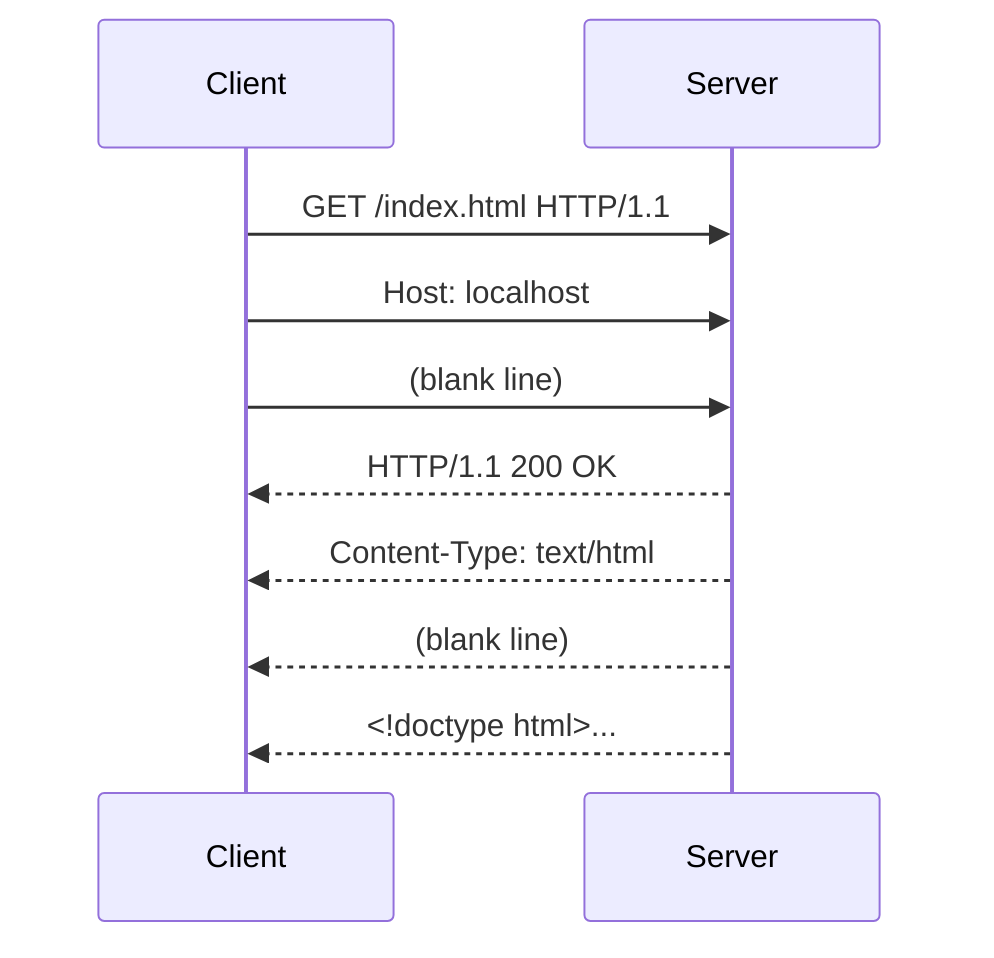

## Before you start

- [[foundation.l1.url-to-page]] — you saw that loading a page is a chain of steps, and that one of them is "send a request, receive a response". This lesson opens that step up.

## The situation

You are testing the Đơn Hàng static site on your laptop. The page loads in the browser, but a teammate says their script gets "nothing useful back" from the same address. You open the browser's network tab and see a row for `index.html` with a green 200. Your teammate shows you their terminal: a wall of text starting with `HTTP/1.1 200 OK`, then a dozen lines that look like `Name: value`, a blank line, and then the HTML. You realise you have never actually looked at what travels over the wire. What exactly is inside that text, and why is it shaped like that?

## Core concepts

- request — the text the client sends to the server: a start line naming the action and the path, then metadata lines, then a blank line, then an optional body.
- response — the text the server sends back: a status line, then metadata lines, then a blank line, then an optional body.
- **header** — one metadata line of the form `Name: value`, in either a request or a response; headers describe the message, they are not the data.
- **status code** — the three-digit number on the first line of a response that says how the request went, before you read anything else.

## How it works



In the situation above, the "wall of text" your teammate saw is a complete HTTP response, and the browser sent an equally plain request to get it. Both travel over the TCP connection you learned about, as bytes that happen to be readable text.

A request begins with a start line: the method, the path, and the protocol version, separated by spaces — for example `GET /index.html HTTP/1.1`. Each line ends with a carriage return and a line feed, written `\r\n`. After the start line come the headers, one per line, each a name, a colon, and a value. HTTP/1.1 requires exactly one `Host` header so that one server can serve several sites. An empty line marks the end of the headers. Whatever follows is the body; a `GET` normally has none.

A response mirrors this shape. Its first line is the status line: the protocol version, the status code, and a short reason phrase — `HTTP/1.1 200 OK`. Then come headers that describe the body: `Content-Type` says what kind of data it is, `Content-Length` says how many bytes follow the blank line. Then the blank line, then the body — here, the HTML of the page.

The blank line is the only separator between "about the message" and "the message". A client reads the status line, then reads headers until it meets the empty line, then uses `Content-Length` to know how many bytes of body to read. A wrong `Content-Length` therefore hangs the client or cuts the page short.

Because everything is text, you can type a request by hand, send it through the connection, and read the reply. That is the fastest way to find out whether a problem is in the client, in the server, or in the network between them.

## In the Đơn Hàng system

The repository has a script that sends a raw request to the static site started by `scripts/up.sh` and prints whatever comes back, byte for byte.

```bash file=scripts/http/raw-request.sh tag=stage-0 lines=1-6
#!/usr/bin/env bash
# Send one raw HTTP/1.1 request to the local static site and print the raw response.
set -euo pipefail

printf 'GET /index.html HTTP/1.1\r\nHost: localhost\r\nConnection: close\r\n\r\n' \
  | nc localhost 8080
```

Look at the `printf` string: three lines and an empty fourth, each ending in `\r\n`. That is the whole request. `nc` opens a TCP connection to port 8080 and pipes the text in, exactly as a browser would. Now the reply:

```text output=true
HTTP/1.1 200 OK
Accept-Ranges: bytes
Content-Length: 412
Content-Type: text/html; charset=utf-8
Date: ...
Etag: ...
Last-Modified: ...
Server: Caddy

<!doctype html>
<html lang="vi">
...
```

Read it top to bottom: status line, seven headers, one blank line, then the body. `Content-Length: 412` tells the client to read exactly 412 bytes after the blank line. Your teammate's script was fine; it simply printed the whole response instead of only the body, which is what a browser hides from you.

## Beginners often think…

- **"The request body is where the URL parameters go."** → Actually the path and query string (`/products?page=2`) live on the start line; the body is a separate part after the blank line, and a `GET` usually has no body at all. You notice this when a server ignores the "parameters" you put in a `GET` body.
- **"A response always has a body."** → Actually many do not: a `204 No Content` has none by definition, and a `304 Not Modified` tells the client to reuse what it already has. You notice this when your code crashes trying to parse an empty body as data.
- **"Headers are technical noise I can skip."** → Actually headers decide how the body is interpreted, whether it may be cached, and whether you are authenticated. You notice this when a correct-looking body comes back as garbage because `Content-Type` said the wrong thing.

## Try it (3 minutes)

1. With the stage-0 stack running (start it with `scripts/up.sh`), run `scripts/http/raw-request.sh`.
2. Count the header lines and find the blank line. Then change the path in the script from `/index.html` to `/does-not-exist.html` and run it again.

Expected result: the first run starts with `HTTP/1.1 200 OK` and ends with the page's HTML; the second starts with `HTTP/1.1 404 Not Found`, has a different `Content-Length`, and still has the same shape — status line, headers, blank line, body.

## Connections

- [[foundation.l1.http-methods]] — the first word of the start line; the next lesson explains what each method promises.
- [[foundation.l1.http-status-codes]] — the number on the status line; the lesson after that explains what each range means.
- [[backend.l1.request-lifecycle]] — the same request, seen from inside the server that receives it: how ASP.NET Core turns these lines into objects.
- [[frontend.l1.calling-an-api]] — the same request, seen from the client code that builds it.

## Five-line summary

1. A request and a response are plain text with the same shape: a first line, headers, a blank line, an optional body.
2. The request's first line carries the method, the path and the version; the response's first line carries the version, the status code and a reason.
3. Headers are `Name: value` lines that describe the message; the blank line ends them.
4. `Content-Length` tells the reader how many bytes of body follow, so it decides where the message ends.
5. Because it is text, you can send a request by hand and read the raw reply — the fastest way to locate a problem.
