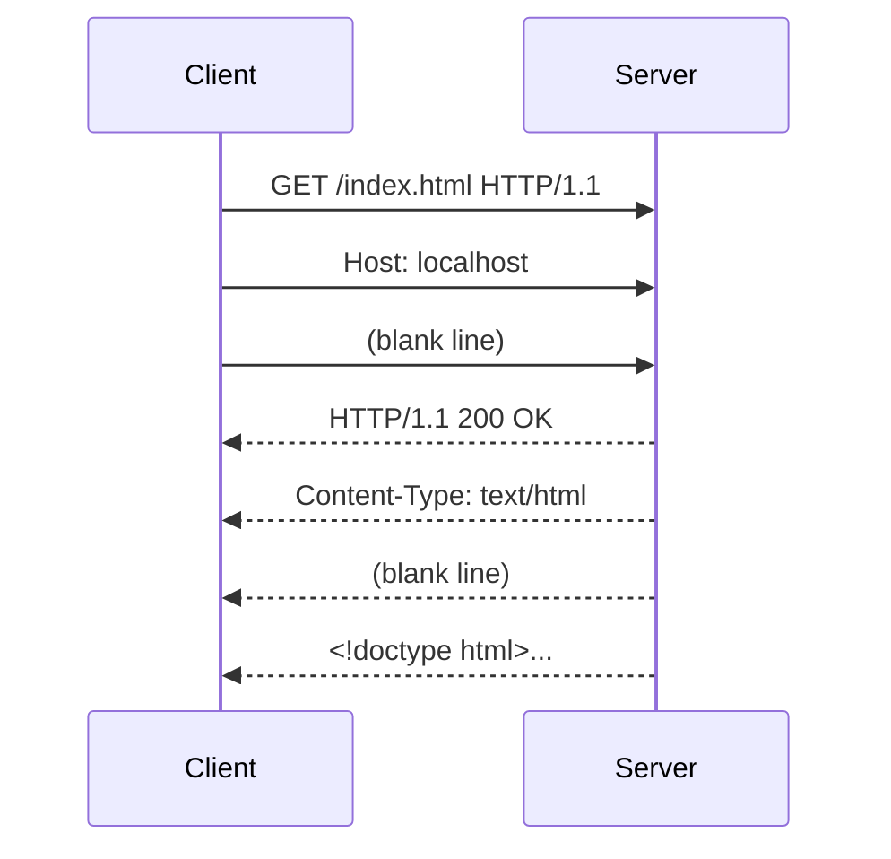

## Bạn cần biết trước

- [[foundation.l1.url-to-page]] — bạn đã thấy tải một trang là một chuỗi bước, và một trong số đó là "gửi HTTP request, nhận response". Bài này mở bước đó ra xem bên trong.

## Tình huống

Bạn đang thử trang tĩnh của Đơn Hàng trên máy mình. Trang hiện bình thường trong trình duyệt, nhưng một đồng nghiệp bảo script của anh ấy gọi cùng địa chỉ mà "chẳng nhận được gì ra hồn". Bạn mở tab Network của trình duyệt: một dòng `index.html` với số 200 màu xanh. Đồng nghiệp đưa terminal cho bạn xem: một mảng chữ bắt đầu bằng `HTTP/1.1 200 OK`, rồi hơn chục dòng dạng `Tên: giá trị`, một dòng trống, rồi đến HTML. Bạn nhận ra mình chưa từng thật sự nhìn vào thứ chạy trên dây. Trong đoạn chữ đó có gì, và vì sao nó có hình dạng như vậy?

## Khái niệm cốt lõi

- request — đoạn văn bản client gửi đi: một dòng đầu nêu hành động và đường dẫn, rồi các dòng mô tả, rồi một dòng trống, rồi phần thân (có thể không có).
- response — đoạn văn bản server gửi lại: một dòng trạng thái, rồi các dòng mô tả, rồi một dòng trống, rồi phần thân (có thể không có).
- **header** (dòng mô tả đi kèm request/response) — một dòng dạng `Tên: giá trị`, có trong cả request lẫn response; header mô tả thông điệp, không phải là dữ liệu.
- **status code** (mã trạng thái, số 3 chữ số trong response cho biết kết quả) — số ba chữ số trên dòng đầu của response, cho biết request đã đi đến đâu, trước khi bạn đọc bất kỳ thứ gì khác.

## Cơ chế hoạt động



Trong tình huống trên, "mảng chữ" đồng nghiệp bạn thấy chính là một HTTP response hoàn chỉnh, và trình duyệt đã gửi một request cũng trần trụi như thế để lấy nó. Cả hai đi qua kết nối TCP bạn đã học, dưới dạng những byte bình thường mà tình cờ đọc được như chữ.

Một request mở đầu bằng dòng đầu: method, đường dẫn và phiên bản giao thức, cách nhau bằng dấu cách — ví dụ `GET /index.html HTTP/1.1`. Mỗi dòng kết thúc bằng ký tự xuống dòng kiểu `\r\n`. Sau dòng đầu là các header, mỗi header một dòng, gồm tên, dấu hai chấm và giá trị. HTTP/1.1 bắt buộc có đúng một header `Host` để một server có thể phục vụ nhiều trang web. Một dòng trống đánh dấu hết phần header. Những gì còn lại là phần thân; một `GET` thường không có thân.

Response có hình dạng y hệt. Dòng đầu của nó là dòng trạng thái: phiên bản giao thức, status code và một cụm từ ngắn giải thích — `HTTP/1.1 200 OK`. Tiếp theo là các header mô tả phần thân: `Content-Type` nói dữ liệu thuộc loại gì, `Content-Length` nói có bao nhiêu byte đi sau dòng trống. Rồi dòng trống, rồi phần thân — ở đây là HTML của trang.

Dòng trống là ranh giới duy nhất giữa "mô tả về thông điệp" và "chính thông điệp". Client đọc dòng trạng thái, đọc header cho tới khi gặp dòng trống, rồi dựa vào `Content-Length` để biết phải đọc bao nhiêu byte thân. Vì thế một `Content-Length` sai làm client treo hoặc cắt cụt trang.

Vì tất cả đều là văn bản, bạn có thể tự gõ một request, đẩy nó qua kết nối và đọc câu trả lời. Đó là cách nhanh nhất để biết vấn đề nằm ở client, ở server, hay ở đoạn mạng giữa hai bên.

## Trong hệ thống Đơn Hàng

Repo có một script gửi request thô tới trang tĩnh do `scripts/up.sh` khởi động và in ra nguyên vẹn những gì nhận được.

```bash file=scripts/http/raw-request.sh tag=stage-0 lines=1-6
#!/usr/bin/env bash
# Send one raw HTTP/1.1 request to the local static site and print the raw response.
set -euo pipefail

printf 'GET /index.html HTTP/1.1\r\nHost: localhost\r\nConnection: close\r\n\r\n' \
  | nc localhost 8080
```

Nhìn vào chuỗi trong `printf`: ba dòng và một dòng thứ tư rỗng, dòng nào cũng kết thúc bằng `\r\n`. Đó là toàn bộ request. `nc` mở một kết nối TCP tới port 8080 và đẩy đoạn chữ vào, đúng như trình duyệt làm. Giờ là câu trả lời:

```text output=true
HTTP/1.1 200 OK
Accept-Ranges: bytes
Content-Length: 350
Content-Type: text/html; charset=utf-8
Etag: ...
Last-Modified: ...
Server: Caddy
Vary: Accept-Encoding
Date: ...
Connection: close

<!doctype html>
<html lang="vi">
...
```

Đọc từ trên xuống: dòng trạng thái, chín header, một dòng trống, rồi phần thân. `Content-Length: 350` bảo client đọc đúng 350 byte sau dòng trống. Script của đồng nghiệp bạn không sai gì cả; nó chỉ in nguyên cả response thay vì riêng phần thân — thứ mà trình duyệt vẫn giấu đi.

## Người mới hay nghĩ rằng…

- **"Tham số trên URL nằm trong phần thân của request."** → Thực ra đường dẫn và chuỗi truy vấn (`/products?page=2`) nằm trên dòng đầu; phần thân là một phần riêng sau dòng trống, và `GET` thường không có thân. Bạn sẽ nhận ra khi server phớt lờ "tham số" bạn nhét vào thân của một `GET`.
- **"Response nào cũng có phần thân."** → Thực ra nhiều response không có: `204 No Content` theo định nghĩa là không có thân, còn `304 Not Modified` bảo client dùng lại thứ đã có. Bạn sẽ nhận ra khi code của bạn sập vì cố phân tích một thân rỗng thành dữ liệu.
- **"Header là mấy dòng kỹ thuật, bỏ qua cũng được."** → Thực ra header quyết định phần thân được hiểu thế nào, có được cache hay không, và bạn đã đăng nhập hay chưa. Bạn sẽ nhận ra khi một phần thân trông đúng lại hiện thành ký tự lạ vì `Content-Type` khai sai.

## Thử ngay (3 phút)

1. Với stack stage-0 đang chạy (khởi động bằng `scripts/up.sh`), chạy `scripts/http/raw-request.sh`.
2. Đếm số dòng header và tìm dòng trống. Rồi đổi đường dẫn trong script từ `/index.html` thành `/does-not-exist.html` và chạy lại.

Kết quả mong đợi: lần đầu bắt đầu bằng `HTTP/1.1 200 OK` và kết thúc bằng HTML của trang; lần hai bắt đầu bằng `HTTP/1.1 404 Not Found`, có `Content-Length` khác, và vẫn giữ nguyên hình dạng — dòng trạng thái, header, dòng trống, thân.

## Liên hệ

- [[foundation.l1.http-methods]] — từ đầu tiên trên dòng đầu; bài tiếp theo giải thích mỗi method hứa điều gì.
- [[foundation.l1.http-status-codes]] — con số trên dòng trạng thái; bài sau nữa giải thích mỗi nhóm số nghĩa là gì.
- [[backend.l1.request-lifecycle]] — cùng request này nhìn từ bên trong server nhận nó: ASP.NET Core biến những dòng này thành đối tượng như thế nào.
- [[frontend.l1.calling-an-api]] — cùng request này nhìn từ phía code client dựng nên nó.

## Tóm tắt 5 dòng

1. Request và response là văn bản thuần có cùng hình dạng: một dòng đầu, các header, một dòng trống, phần thân tùy chọn.
2. Dòng đầu của request mang method, đường dẫn và phiên bản; dòng đầu của response mang phiên bản, status code và một cụm giải thích.
3. Header là các dòng `Tên: giá trị` mô tả thông điệp; dòng trống kết thúc chúng.
4. `Content-Length` cho bên đọc biết có bao nhiêu byte thân theo sau, nên nó quyết định thông điệp kết thúc ở đâu.
5. Vì là văn bản, bạn có thể tự gửi một request và đọc câu trả lời thô — cách nhanh nhất để khoanh vùng vấn đề.
