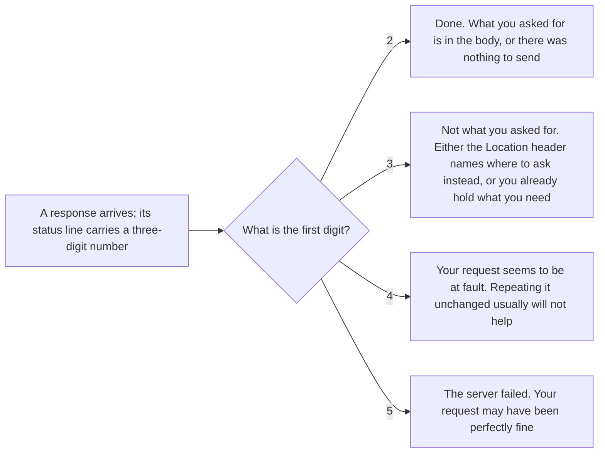

## Before you start

- [[foundation.l1.http-request-response]] — you read a response as plain text and saw the three-digit number on its first line. This lesson is about what that number promises, and what it does not.

## The situation

You are checking the Đơn Hàng lab site the example repository starts for you (tag `stage-0`, the label that marks this version of the repository). You ask for seven addresses — paths like `/index.html` — one after another, and every one of them answers. `/index.html` answers `200`, `/redirect` answers `302`, and `/admin` answers `401`, then `403` when you send one extra header line. `/api/v1/orders/999` answers `404`, and so does `/no-such-page`, although only the first is an address the site was configured for. Nothing crashed and nothing timed out, yet no two of those answers mean the same thing. What is that number telling you?

## Core concepts

- status class — the first digit of a status code, which decides who has to do something about the answer.
- reason phrase — the short text after the number on the response's first line, its status line, written for a person reading the raw message.
- redirection — an answer that does not carry what you asked for: usually it names, in a `Location` header, the address to ask instead.
- proxy — a program standing between the client and the real server, taking the request and passing it on.

## How it works



All seven answers above differed only in three digits. The first digit is the status class, the part every client must understand: `2xx` the request succeeded, `3xx` the answer is not here as sent — usually somewhere else, `4xx` the request itself seems to be at fault and repeating it unchanged usually will not help, `5xx` the server failed. A fifth class, `1xx`, carries interim answers sent before the final one and is not covered here. A client that meets a number it has never seen must fall back to the first digit and treat it like the `x00` of that class — `200`, `300`, `400` or `500`. The digit, not the exact number, is the contract.

Within `2xx`: `200` means the request succeeded, and for a GET what you asked for is in the body; `201` means something was created; `204` means there is deliberately no body.

Within `3xx`: `301` says the address has moved for good and `302` says only for now, both expected to name the new address in `Location`; `304` says nothing has changed, so reuse the copy you already hold and read no body.

Within `4xx`: `400` the server cannot or will not process the request because of something it sees as the caller's mistake, `401` the request carries no identity the server accepts, `403` the server understood the request and refuses it, `404` it has nothing at this address, `409` your request clashes with the current state of what is at that address.

Within `5xx`: `500` the server that answered met an unexpected condition, `502` a proxy — a server acting as a gateway — got an unusable answer from the server behind it, `503` the server is not taking work at the moment.

## In the Đơn Hàng system

There is no application behind the lab site at `stage-0`; the lab's web server, Caddy, a program that answers requests, is configured to answer a fixed set of addresses with real status codes. One script walks that set.

```bash file=scripts/http/status-codes.sh tag=stage-0 lines=1-23
#!/usr/bin/env bash
# The first digit says who has to do something about it.
set -euo pipefail
# Everything below runs inside the lab box; this line puts it there.
[ -f /.dockerenv ] || exec "$(dirname "$0")/../lab-run.sh" "$0" "$@"

for path in /index.html /redirect /api/v1/orders/999 /admin /conflict /slow /no-such-page; do
  curl -sS -o /dev/null -w "%{http_code}  $path\n" "http://localhost:8080$path"
done

echo
echo "a 3xx names where to go instead:"
curl -sS -D - -o /dev/null http://localhost:8080/redirect | grep -Ei '^(HTTP/|Location:)'

echo
echo "401 asks who you are; 403 has already decided:"
curl -sS -o /dev/null -w '  no cookie          %{http_code}\n' http://localhost:8080/admin
curl -sS -o /dev/null -w '  cookie role=guest  %{http_code}\n' \
     -H 'Cookie: role=guest' http://localhost:8080/admin

echo
echo "a 5xx says the server failed, not that you asked wrongly:"
curl -sS -D - -o /dev/null http://localhost:8080/slow | grep -E '^HTTP/'
```

The fifth line puts the whole run inside the lab box, the prepared machine the example repository starts for you, so the answers are the same everywhere. The loop asks for seven addresses and prints only the code and the path — `%{http_code}` is the numeric code of the answer `curl`, the program that sends the request, received; the body is thrown away. The three parts after the loop ask again for three of those addresses and print more: the status line and the `Location` header of `/redirect`, the two answers `/admin` gives without and with one extra header line, and the status line of `/slow`. There `-D -` makes `curl` print the header lines, and `grep` keeps only the ones named in the quotes.

```text output=true
200  /index.html
302  /redirect
404  /api/v1/orders/999
401  /admin
409  /conflict
503  /slow
404  /no-such-page

a 3xx names where to go instead:
HTTP/1.1 302 Found
Location: /index.html

401 asks who you are; 403 has already decided:
  no cookie          401
  cookie role=guest  403

a 5xx says the server failed, not that you asked wrongly:
HTTP/1.1 503 Service Unavailable
```

Read the seven numbers as classes first: one `2xx`, one `3xx`, four `4xx`, one `5xx`; the `409` is `/conflict`, an address the site was configured to answer that way. The short words printed after the numbers in `HTTP/1.1 302 Found` and `HTTP/1.1 503 Service Unavailable` are the reason phrase of each answer; a client acts on the number and may ignore them. `/api/v1/orders/999` and `/no-such-page` both answer `404`, although the site is configured for the first address and not for the second — `404` says the server has nothing to give here, not why. The `/admin` pair is the `401`/`403` distinction made visible: with no header the site does not know who is asking, and with `Cookie: role=guest` — one extra header line carrying who the caller claims to be — it knows who is asking and refuses that identity, so sending the same line again changes nothing. A server is also allowed to answer `404` where `403` would be true, so that a stranger cannot learn which addresses exist; that is a deliberate choice, not a mistake.

The last two answers are the ones people misread most. `/redirect` is a `302` whose `Location` header names `/index.html`; that header is the point of the answer, and a client that ignores it gets nothing. `/slow` answers `503`, and nothing about the request was wrong. The `502` you will meet at work is different: it comes from a server acting as a gateway, saying that the answer it got from the server behind it was unusable. When a proxy answers `502`, the program behind it is the first thing to look at; a `503` may come from the proxy itself, so it says less about what is behind.

## Beginners often think…

- **"A 404 means the server is down."** → Actually a `404` is a completed exchange: something answered you, on time, and said it has nothing at that address. A server that is down produces no status code at all, only a failure to connect. You notice this when every address answers `404` although something is plainly answering you — the site is running, but the pages it should answer with are not on it.
- **"A 200 means the operation succeeded, whatever the body says."** → Actually the server picks the number itself; nothing in HTTP derives it from the body. A server that catches its own failure and still answers `200`, with the words "order not created" in the body, contradicts what `200` means, and nothing in the protocol prevents it; every client that only reads the number believes the work was done. You notice this when nothing ever retries and the orders quietly go missing.
- **"401 and 403 are the same thing with two numbers."** → Actually `401` says the request carries no identity the server accepts, so sending one it does accept may help; `403` says it has already decided and the answer is still no, so sending the same thing again changes nothing. You notice this when a sign-in loop repeats forever because the client keeps signing in again against a `403`.

## Try it (3 minutes)

1. With the stage-0 lab site running (start it with `scripts/up.sh`), run `scripts/http/status-codes.sh`.
2. Look at the two lines answering `404` and at the two `/admin` lines, then decide which of those four answers you would still get with the lab site switched off.

Expected result: the seven codes come back as `200`, `302`, `404`, `401`, `409`, `503`, `404`.

<details><summary>Suggested answer</summary>

None of the four answers survives the site being switched off. Each of those numbers is proof that something answered you. With the site switched off there is no status line to read at all: `curl` never gets an answer, reports the failed connection, and `set -euo pipefail` on the third line, which stops the script at the first command that fails outside a test like the `||` on line 5, ends the run at the first address. "Nothing is there" and "nothing answered" are different outcomes, and only the first one has a number.

</details>

## Connections

- [[foundation.l1.http-request-response]] — the prerequisite; this lesson reads one field of the status line it took apart.
- [[foundation.l1.http-methods]] — the other half of the exchange: each method has a small set of codes it is expected to answer with, such as `201` for a POST.
- [[foundation.l1.http-caching]] — the lesson that puts `304` to work: what a client must already hold before "nothing has changed" is a useful answer.
- [[backend.l1.errors-and-problem-details]] — the same idea one layer up: how a server says *why* a `4xx` happened, in a shape client code can read.

## Five-line summary

1. A status code's first digit says who has to act: `2xx` done, `3xx` elsewhere, `4xx` your request, `5xx` the server.
2. The remaining two digits refine the class, and a client that does not know a code must treat it as its class's `x00`.
3. `401` asks who you are and `403` has already decided; a server may answer `404` instead of `403` to hide what exists.
4. `502` comes from a server acting as a gateway and points at the server behind it; a `503` can come from any server.
5. The server picks the number, so a `200` carrying an error message is possible; read the code first, then check the body.
