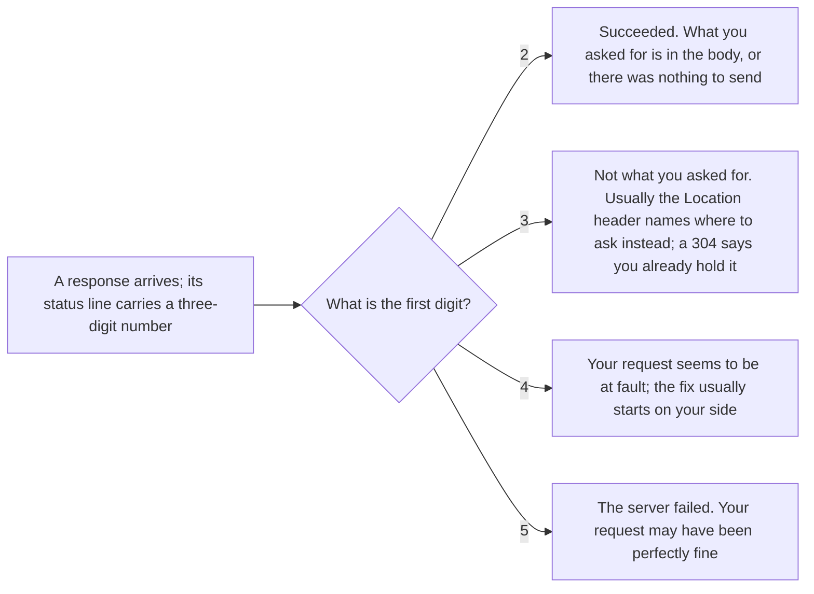

## Bạn cần biết trước

- [[foundation.l1.http-request-response]] — bạn đã đọc một response dưới dạng văn bản thô và thấy con số ba chữ số trên dòng đầu của nó. Bài này nói về điều con số đó hứa hẹn, và điều nó không hứa.

## Tình huống

Bạn đang kiểm tra trang lab của Đơn Hàng mà repo ví dụ khởi động sẵn cho bạn (tag `stage-0`, nhãn đánh dấu phiên bản này của repo). Bạn lần lượt hỏi bảy địa chỉ — những đường dẫn như `/index.html` — và địa chỉ nào cũng trả lời. `/index.html` trả `200`, `/redirect` trả `302`, còn `/admin` trả `401`, rồi `403` khi bạn gửi thêm một dòng header. `/api/v1/orders/999` trả `404`, `/no-such-page` cũng vậy, dù chỉ địa chỉ đầu là địa chỉ mà trang được cấu hình để trả lời. Không có gì sập, không có gì hết thời gian chờ, vậy mà không có hai câu trả lời nào mang cùng một ý nghĩa. Con số đó đang nói gì với bạn?

## Khái niệm cốt lõi

- nhóm mã (status class) — chữ số đầu tiên của status code, quyết định ai phải xử lý câu trả lời.
- cụm lý do (reason phrase) — đoạn chữ ngắn đứng sau con số trên dòng đầu của một response HTTP/1.1, tức dòng trạng thái, viết cho người đọc thông điệp thô.
- chuyển hướng (redirection) — câu trả lời không mang thứ bạn xin: thường nó nêu, trong header `Location`, địa chỉ bạn nên hỏi thay.
- **proxy** (Server đứng giữa client và app thật, nhận request rồi chuyển tiếp đi và gửi câu trả lời về) — một server nằm giữa client và app thật, chuyển tiếp request và gửi câu trả lời về.

## Cơ chế hoạt động



Chữ số đầu tiên là nhóm mã, phần mà client nào cũng phải hiểu: `2xx` request thành công, `3xx` thứ bạn xin không nằm ở đây — thường là ở chỗ khác, `4xx` chính request có vẻ có lỗi, nên thường phải sửa từ phía client, `5xx` server gặp sự cố. Nhóm thứ năm, `1xx`, mang những câu trả lời tạm thời và không nằm trong bài này. Client gặp một con số chưa từng thấy phải lùi về chữ số đầu tiên và coi nó như mã `x00` của nhóm đó — `200`, `300`, `400` hoặc `500`. Chữ số đầu, chứ không phải con số chính xác, mới là điều được cam kết.

Trong `2xx`: `200` nghĩa là request thành công, và với GET thì thứ bạn xin nằm trong phần thân. `201` nghĩa là có thứ vừa được tạo ra. `204` nghĩa là cố ý không có phần thân.

Trong `3xx`: `301` nói địa chỉ đã chuyển hẳn, `302` nói chỉ chuyển tạm thời, cả hai đều được chờ đợi sẽ nêu địa chỉ mới trong `Location`. Client có thể giữ một câu trả lời nhận trước đó và hỏi xem nó còn đúng không, và `304` nói không có gì thay đổi, cứ dùng lại bản đó và đừng đọc phần thân nào.

Trong `4xx`: `400` server không thể hoặc không chịu xử lý request vì một điều nó coi là lỗi của bên gọi, `401` request không mang danh tính nào mà server chấp nhận, `403` server hiểu request và từ chối nó, `404` server không có gì ở địa chỉ này, `409` request của bạn xung đột với trạng thái hiện tại của thứ nằm ở địa chỉ đó, chẳng hạn hủy một đơn hàng đã bị hủy.

Trong `5xx`: `500` server trả lời đã gặp một tình huống không lường trước, `502` một proxy nhận được câu trả lời không dùng được từ server phía sau nó, `503` server lúc này không nhận thêm việc.

## Trong hệ thống Đơn Hàng

Ở bản `stage-0`, phía sau trang lab chưa có ứng dụng nào. Web server của lab là Caddy, một chương trình trả lời request, được cấu hình để trả lời một tập địa chỉ cố định bằng status code thật. Một script đi lần lượt qua tập địa chỉ đó.

```bash file=scripts/http/status-codes.sh tag=stage-0 lines=1-23
#!/usr/bin/env bash
# The first digit says who has to do something about it.
set -euo pipefail
# Everything below runs inside the lab box; this line puts it there.
[ -f /.dockerenv ] || exec "$(dirname "$0")/../lab-run.sh" "$0" "$@"

for path in /index.html /redirect /api/v1/orders/999 /admin /conflict /slow /no-such-page; do
  curl -sS -o /dev/null -w "%{http_code}  $path\n" "http://localhost:8080$path"
done

echo
echo "a 3xx names where to go instead:"
curl -sS -D - -o /dev/null http://localhost:8080/redirect | grep -Ei '^(HTTP/|Location:)'

echo
echo "401 asks who you are; 403 has already decided:"
curl -sS -o /dev/null -w '  no cookie          %{http_code}\n' http://localhost:8080/admin
curl -sS -o /dev/null -w '  cookie role=guest  %{http_code}\n' \
     -H 'Cookie: role=guest' http://localhost:8080/admin

echo
echo "a 5xx says the server failed, not that you asked wrongly:"
curl -sS -D - -o /dev/null http://localhost:8080/slow | grep -E '^HTTP/'
```

Dòng thứ năm đưa toàn bộ lần chạy vào trong hộp lab, cỗ máy dựng sẵn mà repo ví dụ khởi động cho bạn, nên máy nào chạy cũng nhận cùng những câu trả lời. Vòng lặp hỏi bảy địa chỉ và chỉ in mã cùng đường dẫn: `-w` đặt thứ `curl` in ra sau mỗi request, `-sS` ẩn thông báo tiến độ nhưng giữ thông báo lỗi, còn `%{http_code}` là mã dạng số của câu trả lời mà `curl`, chương trình gửi request, nhận được. Phần thân bị bỏ đi. Ba phần sau vòng lặp in thêm thông tin về `/redirect`, `/admin` và `/slow`. Ở đó `-D -` bảo `curl` in các dòng header, và `grep` chỉ giữ những dòng bắt đầu bằng `HTTP/` hoặc `Location:`, không phân biệt chữ hoa chữ thường.

```text output=true
200  /index.html
302  /redirect
404  /api/v1/orders/999
401  /admin
409  /conflict
503  /slow
404  /no-such-page

a 3xx names where to go instead:
HTTP/1.1 302 Found
Location: /index.html

401 asks who you are; 403 has already decided:
  no cookie          401
  cookie role=guest  403

a 5xx says the server failed, not that you asked wrongly:
HTTP/1.1 503 Service Unavailable
```

Hãy đọc bảy con số theo nhóm trước: một `2xx`, một `3xx`, bốn `4xx`, một `5xx`. Những chữ ngắn in sau con số trong `HTTP/1.1 302 Found` và `HTTP/1.1 503 Service Unavailable` là cụm lý do của từng câu trả lời. Client hành động theo con số và có thể bỏ qua chúng. `/api/v1/orders/999` và `/no-such-page` đều trả `404` dù chỉ địa chỉ đầu được cấu hình: `404` nói server không có gì để đưa ở đây, chứ không nói vì sao.

Cặp `/admin` cho thấy tận mắt khác biệt giữa `401` và `403`. Không có header, trang không biết ai đang hỏi. Với `Cookie: role=guest` — thêm một dòng header mang danh tính mà bên gọi tự nhận — trang biết ai đang hỏi và từ chối danh tính đó. Một `401` đúng chuẩn còn nêu, trong header `WWW-Authenticate`, cách chứng minh bạn là ai. Lab này bỏ qua phần đó. Server cũng được phép trả `404` ở chỗ mà `403` mới đúng, để người lạ không biết được địa chỉ nào tồn tại. Đó là lựa chọn có chủ ý, không phải sai sót.

`/redirect` là một `302` có header `Location` nêu `/index.html`. Header đó là mục đích của câu trả lời, và client nào bỏ qua nó thì chẳng nhận được gì. `/slow` trả `503` giống như một server đang quá tải, và request không hề sai chỗ nào. `502` mà bạn sẽ gặp khi đi làm thì khác: nó đến từ một proxy, báo rằng câu trả lời proxy nhận từ chương trình phía sau là không dùng được. Khi proxy trả `502`, chương trình phía sau là chỗ đầu tiên cần xem. Còn `503` có thể đến từ chính proxy, khi nó quá bận hoặc được dặn từ chối request, nên nó nói ít hơn về những gì ở phía sau.

## Người mới hay nghĩ rằng…

- **"404 nghĩa là server đang sập."** → Thực ra `404` là một cuộc trao đổi đã hoàn tất: có thứ đã trả lời bạn, đúng hạn, và nói nó không có gì ở địa chỉ đó. Server đang sập không tạo ra status code nào cả, chỉ có kết nối thất bại. Bạn sẽ nhận ra khi mọi địa chỉ đều trả `404` dù rõ ràng có thứ đang trả lời bạn — trang vẫn chạy, nhưng những trang lẽ ra nó phải trả thì không có trên đó.
- **"200 nghĩa là thao tác đã thành công, phần thân nói gì cũng mặc."** → Thực ra server tự chọn con số, HTTP không suy nó ra từ phần thân. Server bắt được lỗi của chính mình mà vẫn trả `200`, với dòng chữ "đơn hàng chưa được tạo" trong phần thân, là đi ngược ý nghĩa của `200`. Mọi client chỉ đọc con số đều tin là đã làm xong. Bạn sẽ nhận ra khi client thấy `200` nên không bao giờ gửi lại đơn hàng, và đơn hàng lặng lẽ biến mất. Vì vậy hãy đọc mã trước, rồi kiểm tra phần thân xem có gì mâu thuẫn không.
- **"401 và 403 là một thứ mang hai con số."** → Thực ra `401` nói request không mang danh tính nào server chấp nhận, nên gửi kèm một danh tính được chấp nhận có thể giải quyết được. `403` nói server hiểu request và từ chối nó, gửi lại với cùng danh tính thì đừng mong câu trả lời thay đổi. Bạn sẽ nhận ra khi một vòng đăng nhập lặp mãi vì client cứ đăng nhập lại trước một `403`.

## Thử ngay (3 phút)

1. Với trang lab stage-0 đang chạy (khởi động bằng `scripts/up.sh`), chạy `scripts/http/status-codes.sh`.
2. Nhìn hai dòng trả `404` và hai dòng `/admin`, rồi quyết định trong bốn câu trả lời đó, câu nào bạn vẫn nhận được khi trang lab đã tắt.

Kết quả mong đợi: bảy mã trả về là `200`, `302`, `404`, `401`, `409`, `503`, `404`.

<details><summary>Gợi ý đáp án</summary>

Không câu nào trong bốn câu trả lời còn lại khi trang tắt. Mỗi con số đó là bằng chứng có thứ đã trả lời bạn. Khi chỉ web server dừng mà hộp lab vẫn chạy, `curl` không kết nối được: nó báo kết nối thất bại, và vòng lặp in `000  /index.html` — giá trị giữ chỗ của `curl` khi không có dòng trạng thái nào tới, không phải status code. Script dừng ở đó, vì dòng 3, `set -euo pipefail`, kết thúc nó ở lệnh đầu tiên thất bại. Khi cả lab tắt, script thất bại trước khi `curl` kịp chạy. "Ở đó không có gì" và "không có gì trả lời" là hai kết cục khác nhau, và chỉ kết cục đầu có con số.

</details>

## Liên hệ

- [[foundation.l1.http-request-response]] — bài trước. Bài này đọc một trường của dòng trạng thái mà bài đó đã tách ra.
- [[foundation.l1.http-methods]] — nửa còn lại của cuộc trao đổi: method bạn gửi quyết định mã nào là hợp lý, chẳng hạn `201` sau một POST đã tạo ra thứ gì đó.
- [[foundation.l1.http-caching]] — bài đưa `304` vào dùng: client phải giữ sẵn thứ gì thì "không có gì thay đổi" mới là câu trả lời hữu ích.
- [[backend.l1.errors-and-problem-details]] — cùng ý tưởng, tiến thêm một bước: server nói *vì sao* một `4xx` xảy ra, theo một khuôn mà code phía client đọc được.

## Tóm tắt 5 dòng

1. Chữ số đầu của status code cho biết ai phải hành động: `2xx` xong, `3xx` ở chỗ khác, `4xx` do request của bạn, `5xx` do server.
2. Hai chữ số còn lại làm rõ thêm trong nhóm, và client không biết một mã thì phải coi nó như `x00` của nhóm đó.
3. `401` hỏi bạn là ai, `403` đã quyết định rồi. Server có thể trả `404` thay cho `403` để giấu những gì đang tồn tại.
4. `502` đến từ một proxy và chỉ vào chương trình phía sau nó. `503` thì server nào cũng có thể trả.
5. Server tự chọn con số, nên một `200` mang thông báo lỗi là chuyện có thể xảy ra. Hãy đọc mã trước, rồi kiểm tra phần thân.
