## Before you start

- [[foundation.l1.http-request-response]] — you saw that a message ends its headers with a blank line and that `Content-Length` says how many bytes of body follow. This lesson is about what those bytes mean.

## The situation

You run the JSON sample in the Đơn Hàng repository. It plays both sides, sender and receiver: it turns one order line, product 3 and quantity 2, into text and back, and the values survive. Then it reads a second text that looks just as good: the same two numbers, under names that start with a capital letter. This time it prints `OrderLineDto { ProductId = 0, Quantity = 0 }`, with no error.

The last line says that a short text holding the city `Đà Nẵng` is 18 characters long but 22 bytes. Nothing in either text looked wrong. What else has to match before the program on the other side reads the values you meant?

## Core concepts

- **JSON** — a text format for data that knows only objects of named values in `{ }`, arrays in `[ ]`, strings in double quotes, numbers, `true` and `false`, and `null`.
- **encoding** — the rule that turns each character of a text into bytes and back again; the one JSON uses between separate systems is UTF-8.
- `Content-Type` — the header that names the format of the body, such as `application/json`, so the receiver knows how to read it.
- serialization — turning an object in a running program into JSON text; deserialization is the way back, from text to object.
- naming convention — how names are spelled on each side, such as camelCase (`productId`) or PascalCase (`ProductId`).

## How it works

```mermaid
flowchart LR
  A["Order line object in the sender"] -->|"serialize, with camelCase names from the sample's settings"| B["JSON text"]
  B -->|"encode as UTF-8"| C["Bytes in the body"]
  C -->|"sent with Content-Type: application/json"| D["Bytes at the receiver"]
  D -->|"decode as UTF-8"| E["JSON text again"]
  E -->|"deserialize, same names expected"| F["Order line object in the receiver"]
```



In the situation above, the order line starts as a C# object inside the sample. To leave the program as JSON it is turned into JSON text: that step is serialization. The sample's settings spell its names in camelCase.

JSON has only the kinds of value listed above. It has no date type, so a date usually travels as a string both sides agree to read as a date. It has no comments. It has one kind of number: `3` does not say whether it is an integer or a decimal, and the receiving property's type decides.

Text is still not what travels. The connection carries bytes, and the encoding decides which bytes stand for each character. JSON sent between separate systems must use UTF-8. There, a space or a plain English letter such as `N` takes one byte, while `Đ` takes two and `ẵ` takes three. That is why `Đà Nẵng` counts differently in characters and in bytes, and why `Content-Length` counts bytes.

The `Content-Type` header tells the receiver what the bytes are: `application/json` says the body is JSON. A server that does not accept the format named there can refuse with `415 Unsupported Media Type`. A body labelled JSON that breaks JSON's rules is a client error; a server can answer it with `400 Bad Request`.

On the far side the steps run backwards. Decoding with an encoding that reads one byte as one character, such as ISO-8859-1, turns each letter that took several bytes into two or three wrong characters, one per byte, some of them invisible: garbled Vietnamese. Plain English letters stay the same. Deserializing matches JSON names to the object's properties, so, with settings like the sample's, both sides must agree on how they spell them.

## In the Đơn Hàng system

The first script sends an order to the lab as JSON, then counts one Vietnamese city name two ways. The lab is what `scripts/up.sh` starts on your computer: a small machine, the lab box, where the scripts run, the lab's web server, Caddy, and a database this lesson does not use. `up.sh` prints `The lab is up.` and gives your terminal back once they are running.

```bash file=scripts/http/post-json.sh tag=stage-0 lines=4-21
# Everything below runs inside the lab box; this line puts it there.
[ -f /.dockerenv ] || exec "$(dirname "$0")/../lab-run.sh" "$0" "$@"

echo "the request and the answer:"
curl -sS -D - \
     -H 'Content-Type: application/json; charset=utf-8' \
     -d '{"customer_id":1,"items":[{"product_id":3,"quantity":1}]}' \
     http://localhost:8080/api/v1/orders
echo

echo
echo "text becomes bytes through an encoding, and the two counts differ:"
printf '%s' 'Đà Nẵng' | wc -m
printf '%s' 'Đà Nẵng' | wc -c

echo
echo "the bytes UTF-8 uses for those seven characters:"
printf '%s' 'Đà Nẵng' | od -An -tx1
```

As the comment at the top of the block says, the line under it starts the whole script again inside the lab box, so everything below runs there. `localhost` means the machine the command runs on, and Caddy shares the lab box's network, so `localhost:8080` reaches Caddy. `curl` sends one request and prints the reply. The `-H` line holds the `Content-Type` this script sends, and the `-d` line holds the body. The output shows the answer's headers before its body, and Caddy answers `201` only to a `POST` on this path.

The body is an object whose `items` value is an array holding one more object. Its names use a third convention, words joined by `_`; what matters is that the receiver expects the same one.

Lower down, `printf '%s'` prints the city with no line break added. `wc -m` counts characters, `wc -c` counts bytes, and `od -An -tx1` prints each byte as a two-digit hexadecimal number.

```text output=true
the request and the answer:
HTTP/1.1 201 Created
Content-Type: application/json; charset=utf-8
Location: /api/v1/orders/13
Server: Caddy
Date: ...
Content-Length: 40

{"id":13,"customer_id":1,"status":"new"}

text becomes bytes through an encoding, and the two counts differ:
7
11

the bytes UTF-8 uses for those seven characters:
 c4 90 c3 a0 20 4e e1 ba b5 6e 67
```

The answer is labelled the same way, and its body mixes numbers (`13`, `1`) with a string (`"new"`); the `Location` and `Server` lines are not needed for this lesson. Every character in that body takes one byte, so `Content-Length: 40` is also its length in characters. The `charset=utf-8` part names the encoding; for JSON it only repeats what the format already requires.

The lab sends this fixed answer whatever you send and never reads the body, so it cannot show you a `400` or `415`. When a server that does read the body refuses one that looks right to you, compare the body with its `Content-Type` first.

The last lines make the encoding visible. `Đà Nẵng` is 7 characters but 11 bytes: `c4 90` is `Đ`, `c3 a0` is `à`, `20` is the space, `4e` is `N`, `e1 ba b5` is `ẵ`, and `6e 67` is `ng`. Four characters cost one byte each; the three with marks cost seven between them. Decoded with ISO-8859-1, `e1 ba b5` becomes `ẵ`, while `4e` is still `N`.

The console sample does the round trip from the situation:

```csharp file=samples/DonHang.Samples/Samples/Http/JsonRoundTrip.cs tag=stage-0 lines=6-30
public sealed record OrderLineDto(int ProductId, int Quantity);

// lesson: foundation.l1.json-and-encoding
public static class JsonRoundTrip
{
    private static readonly JsonSerializerOptions Options =
        new() { PropertyNamingPolicy = JsonNamingPolicy.CamelCase };

    public static void Run()
    {
        var line = new OrderLineDto(ProductId: 3, Quantity: 2);

        var json = JsonSerializer.Serialize(line, Options);
        Console.WriteLine(json);

        var backAgain = JsonSerializer.Deserialize<OrderLineDto>(json, Options);
        Console.WriteLine($"the same values came back: {backAgain == line}");

        // The names must agree on both sides, or a field silently stays empty.
        var pascalCase = """{"ProductId":3,"Quantity":2}""";
        var strict = JsonSerializer.Deserialize<OrderLineDto>(pascalCase, Options);
        Console.WriteLine($"PascalCase read with a camelCase policy: {strict}");

        var text = """{"city":"Đà Nẵng"}""";
        Console.WriteLine($"characters: {text.Length}, bytes in UTF-8: {Encoding.UTF8.GetByteCount(text)}");
```

The record declares two properties in PascalCase, `ProductId` and `Quantity`. `Options` tells the serializer to write and expect camelCase names, so the first line printed is `{"productId":3,"quantity":2}`. Reading that text back prints `True`, because `==` on a record compares the values inside it.

The `pascalCase` text uses the other convention; its `"""` quotes only let it contain `"` as it is. Reading it prints `OrderLineDto { ProductId = 0, Quantity = 0 }` and throws nothing. By default the serializer matches names exactly, capital letters included, and skips JSON names that match no property, so both keep the default `0`. The last line counts `char` values with `Length`, one per character in this text, and bytes with `Encoding.UTF8.GetByteCount`, which prints the situation's 18 and 22.

## Beginners often think…

- **"JSON has a date type."** → Actually JSON has only objects, arrays, strings, numbers, `true`, `false` and `null`, so a date usually travels as a string that both programs must agree to read the same way. You notice this when a date one program wrote is refused, or read differently, by another that expected another string format.
- **"If the text looks right in my editor, it is UTF-8."** → Actually an editor shows the bytes decoded with the encoding it guessed or was told to use, so correct-looking text proves only that this choice matched the file. You notice this when a file that reads well in your editor prints garbled Vietnamese in the terminal or on a server.
- **"If the names do not match, deserialization fails loudly."** → Actually the sample reads `{"ProductId":3,"Quantity":2}` without an error and ends up with two zeros, because with its settings JSON names that match no property are skipped. You notice this when an order arrives with quantity `0` and no error message explains why.

## Try it (3 minutes)

1. From the root of the Đơn Hàng repository, start the lab with `scripts/up.sh` and wait for `The lab is up.`, then run `scripts/http/post-json.sh` and note the two counts for `Đà Nẵng`.
2. From the same folder, run `dotnet run --project samples/DonHang.Samples -- json-round-trip` and read the last line.

Expected result: the script prints `7` and `11`; the sample prints `characters: 18, bytes in UTF-8: 22`. Both gaps are 4: the 11 characters of `{"city":""}` take one byte each, and the four extra bytes come from `Đ`, `à` and `ẵ`.

## Connections

- [[foundation.l1.http-request-response]] — the body after the blank line and the `Content-Length` that measures it; this lesson says what those bytes mean and why the count is in bytes.
- [[foundation.l1.http-status-codes]] — `400` and `415` sit in the range where the client's request is wrong; a body the server cannot read is one way to land there.
- [[foundation.l1.time-and-timezones]] — the answer to the missing date type: how to write a moment in time as a string both sides read the same way.
- [[backend.l1.dtos-and-serialization]] — the same round trip one layer up, in the classes an API reads and writes.

## Five-line summary

1. Two programs exchange bytes; to read the values meant, they must agree on format and encoding, and a server checks `Content-Type` and field names.
2. JSON is text holding objects, arrays, strings, numbers, `true`, `false` and `null`; it has no dates, no comments and one kind of number.
3. An encoding turns characters into bytes; JSON between separate systems uses UTF-8, where `Đà Nẵng` is 7 characters but 11 bytes.
4. `Content-Type` tells the receiver how to read the body; a refused format can earn `415`, a body that breaks JSON's rules `400`.
5. Serialization turns objects into JSON, deserialization turns it back; with the sample's settings, names spelled differently leave properties at their defaults without failing.
