## Bạn cần biết trước

- [[foundation.l1.http-request-response]] — bạn đã thấy một thông điệp kết thúc phần header bằng một dòng trống, và `Content-Length` cho biết có bao nhiêu byte thân đi sau. Bài này nói về ý nghĩa của những byte đó.

## Tình huống

Bạn chạy sample JSON trong repo Đơn Hàng. Sample đóng cả hai vai, bên gửi lẫn bên nhận: nó biến một dòng đơn hàng, sản phẩm 3 với số lượng 2, thành văn bản rồi đọc ngược lại, và các giá trị vẫn nguyên. Sau đó nó đọc một đoạn văn bản thứ hai trông cũng ổn không kém: vẫn hai con số đó, nhưng dưới những cái tên bắt đầu bằng chữ hoa. Lần này nó in ra `OrderLineDto { ProductId = 0, Quantity = 0 }`, không báo lỗi gì.

Dòng cuối cho biết một đoạn văn bản ngắn chứa tên thành phố `Đà Nẵng` dài 18 ký tự nhưng chiếm 22 byte. Không đoạn nào trông sai cả. Vậy còn điều gì phải khớp nữa thì chương trình bên kia mới đọc ra đúng giá trị bạn muốn gửi?

## Khái niệm cốt lõi

- **JSON** (định dạng văn bản biểu diễn đối tượng, mảng, chuỗi, số, boolean, null) — một định dạng văn bản cho dữ liệu, chỉ biết đến đối tượng gồm các giá trị có tên trong `{ }`, mảng trong `[ ]`, chuỗi trong dấu nháy kép, số, `true` và `false`, và `null`.
- **encoding** (cách chuyển ký tự thành byte và ngược lại; UTF-8 là chuẩn mặc định) — quy tắc biến từng ký tự của văn bản thành byte và biến ngược lại. Encoding mà JSON dùng giữa các hệ thống tách biệt là UTF-8.
- `Content-Type` — header nêu định dạng của phần thân, chẳng hạn `application/json`, để bên nhận biết phải đọc nó thế nào.
- serialization — biến một đối tượng trong chương trình đang chạy thành văn bản JSON, còn deserialization là chiều ngược lại, từ văn bản thành đối tượng.
- quy ước đặt tên (naming convention) — cách mỗi bên viết tên, chẳng hạn camelCase (`productId`) hay PascalCase (`ProductId`).

## Cơ chế hoạt động

```mermaid
flowchart LR
  A["Order line object in the sender"] -->|"serialize, with camelCase names from the sample's settings"| B["JSON text"]
  B -->|"encode as UTF-8"| C["Bytes in the body"]
  C -->|"sent with Content-Type: application/json"| D["Bytes at the receiver"]
  D -->|"decode as UTF-8"| E["JSON text again"]
  E -->|"deserialize, same names expected"| F["Order line object in the receiver"]
```



Trong tình huống trên, dòng đơn hàng bắt đầu là một đối tượng C# bên trong sample. Muốn rời chương trình dưới dạng JSON, nó phải được biến thành văn bản JSON: bước đó là serialization. Cấu hình của sample viết tên theo camelCase.

JSON chỉ có những loại giá trị kể trên. JSON không có kiểu ngày tháng, nên ngày tháng thường đi dưới dạng một chuỗi mà hai bên thống nhất sẽ đọc là ngày. JSON không có chú thích. JSON chỉ có một loại số: `3` không nói nó là số nguyên hay số thập phân, kiểu của property bên nhận mới quyết định.

Văn bản vẫn chưa phải thứ thật sự đi trên dây. Kết nối chở byte, và encoding quyết định byte nào đại diện cho từng ký tự. JSON gửi giữa các hệ thống tách biệt phải dùng UTF-8. Trong UTF-8, một dấu cách hay một chữ cái tiếng Anh thường như `N` chiếm một byte, còn `Đ` chiếm hai và `ẵ` chiếm ba. Vì thế `Đà Nẵng` đếm theo ký tự và theo byte ra hai số khác nhau, và cũng vì thế `Content-Length` đếm byte.

Header `Content-Type` cho bên nhận biết các byte đó là gì: `application/json` nói phần thân là JSON. Server không nhận định dạng ghi ở đó có thể từ chối bằng `415 Unsupported Media Type`. Một phần thân được dán nhãn JSON mà phá luật của JSON là lỗi phía client, và server có thể trả lời bằng `400 Bad Request`.

Ở đầu bên kia, các bước chạy theo chiều ngược lại. Nếu giải mã bằng một encoding coi mỗi byte là một ký tự, chẳng hạn ISO-8859-1, thì mỗi chữ chiếm nhiều byte sẽ thành hai hoặc ba ký tự sai, mỗi byte một ký tự: tiếng Việt bị vỡ chữ. Chữ cái tiếng Anh thường thì vẫn giữ nguyên. Deserialization ghép tên trong JSON với property của đối tượng, nên với cấu hình như của sample, hai bên phải thống nhất cách viết tên.

## Trong hệ thống Đơn Hàng

Script đầu tiên gửi một đơn hàng tới lab dưới dạng JSON, rồi đếm tên một thành phố Việt Nam theo hai cách. Lab là thứ `scripts/up.sh` khởi động trên máy bạn: một máy nhỏ gọi là lab box, nơi các script chạy, web server của lab là Caddy, và một cơ sở dữ liệu mà bài này không dùng tới. `up.sh` in ra `The lab is up.` và trả terminal lại cho bạn khi mọi thứ đã chạy.

```bash file=scripts/http/post-json.sh tag=stage-0 lines=4-21
# Everything below runs inside the lab box; this line puts it there.
[ -f /.dockerenv ] || exec "$(dirname "$0")/../lab-run.sh" "$0" "$@"

echo "the request and the answer:"
curl -sS -D - \
     -H 'Content-Type: application/json; charset=utf-8' \
     -d '{"customer_id":1,"items":[{"product_id":3,"quantity":1}]}' \
     http://localhost:8080/api/v1/orders
echo

echo
echo "text becomes bytes through an encoding, and the two counts differ:"
printf '%s' 'Đà Nẵng' | wc -m
printf '%s' 'Đà Nẵng' | wc -c

echo
echo "the bytes UTF-8 uses for those seven characters:"
printf '%s' 'Đà Nẵng' | od -An -tx1
```

Như chú thích ở đầu khối đã nói, dòng ngay dưới nó chạy lại toàn bộ script bên trong lab box, nên mọi thứ phía dưới đều chạy ở đó. `localhost` là chính máy đang chạy lệnh, và Caddy chạy với IP address của lab box, lắng nghe ở port 8080, nên `localhost:8080` tới được Caddy. `curl` gửi một request và in ra câu trả lời. Dòng `-H` chứa `Content-Type` mà script gửi, dòng `-d` chứa phần thân. Output hiện header của câu trả lời trước phần thân, và Caddy chỉ trả `201` cho một `POST` vào đường dẫn này.

Phần thân là một đối tượng có giá trị `items` là một mảng chứa thêm một đối tượng nữa. Tên trong đó dùng quy ước thứ ba, các từ nối nhau bằng `_`. Điều quan trọng là bên nhận chờ đúng quy ước đó.

Phía dưới, `printf '%s'` in tên thành phố mà không thêm dấu xuống dòng. `wc -m` đếm ký tự, `wc -c` đếm byte, còn `od -An -tx1` in mỗi byte thành một số thập lục phân hai chữ số (cơ số 16: chữ số 0-9 rồi a-f, nên hai chữ số là đủ cho mọi giá trị một byte có thể chứa).

```text output=true
the request and the answer:
HTTP/1.1 201 Created
Content-Type: application/json; charset=utf-8
Location: /api/v1/orders/13
Server: Caddy
Date: ...
Content-Length: 40

{"id":13,"customer_id":1,"status":"new"}

text becomes bytes through an encoding, and the two counts differ:
7
11

the bytes UTF-8 uses for those seven characters:
 c4 90 c3 a0 20 4e e1 ba b5 6e 67
```

Câu trả lời cũng được dán nhãn y như vậy, và phần thân của nó trộn số (`13`, `1`) với chuỗi (`"new"`). Hai dòng `Location` và `Server` không cần cho bài này. Mọi ký tự trong phần thân đó đều chiếm một byte, nên `Content-Length: 40` cũng chính là độ dài tính theo ký tự. Phần `charset=utf-8` nêu tên encoding. Với JSON, nó chỉ nhắc lại điều định dạng đã bắt buộc sẵn.

Lab gửi câu trả lời cố định này bất kể bạn gửi gì và không bao giờ đọc phần thân, nên nó không thể cho bạn thấy `400` hay `415`. Khi một server có đọc phần thân từ chối một phần thân mà bạn thấy là đúng, hãy so phần thân với `Content-Type` của nó trước tiên.

Mấy dòng cuối làm encoding hiện ra trước mắt. `Đà Nẵng` có 7 ký tự nhưng 11 byte: `c4 90` là `Đ`, `c3 a0` là `à`, `20` là dấu cách, `4e` là `N`, `e1 ba b5` là `ẵ`, và `6e 67` là `ng`. Bốn ký tự tốn mỗi ký tự một byte. Ba ký tự có dấu tốn tổng cộng bảy byte. Nếu giải mã bằng ISO-8859-1, `e1 ba b5` thành `ẵ`, còn `4e` vẫn là `N`.

Sample console thực hiện vòng đi rồi về trong tình huống:

```csharp file=samples/DonHang.Samples/Samples/Http/JsonRoundTrip.cs tag=stage-0 lines=6-30
public sealed record OrderLineDto(int ProductId, int Quantity);

// lesson: foundation.l1.json-and-encoding
public static class JsonRoundTrip
{
    private static readonly JsonSerializerOptions Options =
        new() { PropertyNamingPolicy = JsonNamingPolicy.CamelCase };

    public static void Run()
    {
        var line = new OrderLineDto(ProductId: 3, Quantity: 2);

        var json = JsonSerializer.Serialize(line, Options);
        Console.WriteLine(json);

        var backAgain = JsonSerializer.Deserialize<OrderLineDto>(json, Options);
        Console.WriteLine($"the same values came back: {backAgain == line}");

        // The names must agree on both sides, or a field silently stays empty.
        var pascalCase = """{"ProductId":3,"Quantity":2}""";
        var strict = JsonSerializer.Deserialize<OrderLineDto>(pascalCase, Options);
        Console.WriteLine($"PascalCase read with a camelCase policy: {strict}");

        var text = """{"city":"Đà Nẵng"}""";
        Console.WriteLine($"characters: {text.Length}, bytes in UTF-8: {Encoding.UTF8.GetByteCount(text)}");
```

Record này khai báo hai property theo PascalCase, `ProductId` và `Quantity`. `Options` bảo serializer viết và chờ tên theo camelCase, nên dòng đầu tiên in ra là `{"productId":3,"quantity":2}`. Đọc ngược đoạn văn bản đó in ra `True`, vì `==` trên một record so sánh các giá trị bên trong.

Đoạn văn bản `pascalCase` dùng quy ước còn lại. Cặp `"""` chỉ để nó chứa được `"` nguyên dạng. Đọc đoạn này in ra `OrderLineDto { ProductId = 0, Quantity = 0 }` và không ném lỗi nào. Mặc định serializer so tên chính xác, tính cả chữ hoa, và bỏ qua tên JSON không khớp property nào, nên cả hai property giữ giá trị mặc định `0`. Dòng cuối đếm số giá trị `char` bằng `Length`, mỗi ký tự trong đoạn này là một giá trị, và đếm byte bằng `Encoding.UTF8.GetByteCount`, in ra đúng 18 và 22 trong tình huống.

## Người mới hay nghĩ rằng…

- **"JSON có kiểu ngày tháng."** → Thực ra JSON chỉ có đối tượng, mảng, chuỗi, số, `true`, `false` và `null`, vì thế ngày tháng thường đi dưới dạng một chuỗi mà cả hai chương trình phải thống nhất cách đọc. Bạn sẽ nhận ra khi một ngày do chương trình này viết bị một chương trình khác từ chối, hoặc đọc ra khác đi, vì chương trình kia chờ một định dạng chuỗi khác.
- **"Văn bản trông đúng trong editor thì là UTF-8."** → Thực ra editor hiển thị byte đã giải mã bằng encoding mà nó đoán hoặc được chỉ định, vì thế chữ trông đúng chỉ chứng tỏ lựa chọn đó khớp với file. Bạn sẽ nhận ra khi một file đọc ổn trong editor lại in ra tiếng Việt vỡ chữ trong terminal hoặc trên server.
- **"Tên không khớp thì deserialization sẽ báo lỗi rõ ràng."** → Thực ra sample đọc `{"ProductId":3,"Quantity":2}` mà không lỗi gì và nhận về hai số 0, vì với cấu hình của nó, tên JSON không khớp property nào sẽ bị bỏ qua. Bạn sẽ nhận ra khi một đơn hàng tới nơi với số lượng `0` mà không có thông báo lỗi nào giải thích tại sao.

## Thử ngay (3 phút)

1. Từ thư mục gốc của repo Đơn Hàng, khởi động lab bằng `scripts/up.sh` và chờ `The lab is up.`, rồi chạy `scripts/http/post-json.sh` và ghi lại hai con số đếm được cho `Đà Nẵng`.
2. Cũng từ thư mục đó, chạy `dotnet run --project samples/DonHang.Samples -- json-round-trip` và đọc dòng cuối (bước này cần .NET 10 SDK trên máy bạn, lab box không có sẵn).

Kết quả mong đợi: script in ra `7` và `11`, sample in ra `characters: 18, bytes in UTF-8: 22`. Cả hai khoảng chênh đều là 4: 11 ký tự của `{"city":""}` mỗi ký tự chiếm một byte, còn bốn byte dư đến từ `Đ`, `à` và `ẵ`.

## Liên hệ

- [[foundation.l1.http-request-response]] — phần thân sau dòng trống và `Content-Length` đo nó. Bài này nói những byte đó nghĩa là gì và vì sao số đếm tính theo byte.
- [[foundation.l1.http-status-codes]] — `400` và `415` nằm trong nhóm mã báo request của client sai. Một phần thân server không đọc được cũng có thể dẫn tới nhóm đó.
- [[foundation.l1.time-and-timezones]] — lời giải cho chuyện thiếu kiểu ngày tháng: cách viết một thời điểm thành chuỗi mà hai bên đọc giống nhau.
- [[backend.l1.dtos-and-serialization]] — cùng vòng đi rồi về đó, trong các class mà một chương trình server đọc và ghi.

## Tóm tắt 5 dòng

1. Hai chương trình trao đổi byte. Muốn đọc ra đúng giá trị, chúng phải thống nhất định dạng, encoding và tên field, và `Content-Type` nêu định dạng.
2. JSON là văn bản chứa đối tượng, mảng, chuỗi, số, `true`, `false` và `null`, không có ngày tháng, không có chú thích và chỉ có một loại số.
3. Encoding biến ký tự thành byte. JSON giữa các hệ thống tách biệt dùng UTF-8, trong đó `Đà Nẵng` là 7 ký tự nhưng 11 byte.
4. `Content-Type` cho bên nhận biết cách đọc phần thân. Định dạng bị từ chối có thể nhận `415`, phần thân phá luật JSON có thể nhận `400`.
5. Serialization biến đối tượng thành JSON, deserialization biến ngược lại. Với cấu hình của sample, tên viết khác nhau khiến property giữ giá trị mặc định mà không báo lỗi.
