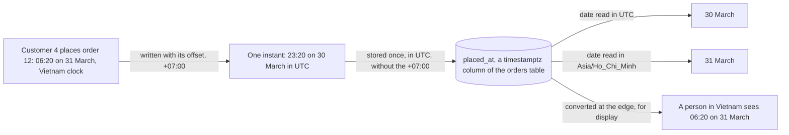

> Skip this if: you already keep every moment in UTC and know why a count of orders per day depends on a time zone.

## Before you start

- [[foundation.l1.json-and-encoding]] — JSON has no date type, so a moment travels as a string that both sides must read the same way. This lesson says which string, and why.

## The situation

Customer 4 placed order 12 at 06:20 on 31 March, by Vietnam's clocks. In the lab's database, the program that keeps Đơn Hàng's data, the `orders` table has one row per order and one column per fact; that moment sits in the `placed_at` column. You count orders per day for March, taking each order's date on the world's reference clock, UTC: order 12 lands on 30 March, and 31 March shows no orders at all. Count by the date on a Vietnam clock instead, and order 12 lands on 31 March, as the customer would say. Nothing in the table changed between the two counts. If `placed_at` holds one exact moment, how can one order fall on two different days?

## Core concepts

- instant — one point in time, the same moment for everyone, whatever their clocks show.
- local time — a date and a clock reading, such as 06:20 on 31 March; it names an instant only once you know where the clock was.
- time zone — the rule a region uses to turn instants into local time; Vietnam's is named `Asia/Ho_Chi_Minh` and is UTC plus 7 hours all year.
- UTC — the reference clock that every time zone is measured from.
- offset — how far a local time is from UTC, written after the time; `+07:00` means the clock is 7 hours ahead of UTC, so you subtract 7 hours to reach UTC.
- ISO 8601 — a standard way to write a date and time as text: the date, a `T`, the time and, to name one instant, the offset, as in `2026-03-31T06:20:00+07:00`. Without the offset, the same text is only a local time.

## How it works



The customer saw 06:20 on 31 March. That local time alone does not say which instant it was, because 06:20 on a clock in another zone is a different instant. Written with its offset, `+07:00`, it names one instant: 23:20 on 30 March in UTC.

In PostgreSQL, the lab's database, `placed_at` is a column of kind `timestamptz`: it turns a time written with an offset into UTC, then stores that instant without the `+07:00`. Every row is then on the same clock, so the instant survives. A column of kind `timestamp`, without `tz`, keeps the digits alone, and nothing says which clock they came from. So `placed_at` holds a moment, not a date.

A date appears only when you ask for one, and asking needs a zone. Read in UTC, the instant falls on 30 March; read in `Asia/Ho_Chi_Minh`, on 31 March. Every order placed before 07:00 in Vietnam falls on the previous day in UTC. When two reports on the same orders disagree about early-morning orders, check first which zone each used to define the day.

The last arrow is the edge: the place where the value meets a person, such as a page or a printed report. When a moment is read by more than one program or machine, keep it in UTC everywhere before that edge, in the table and in JSON between programs, and convert to Vietnam time only there. A time with its offset, such as `+07:00`, names the instant too; UTC is the form to choose, for the reason the next section gives. If you convert earlier and keep only the local digits, as text or in a `timestamp` column, no later program can tell which instant they meant.

## In the Đơn Hàng system

The console sample builds the moment of order 12 in C# and prints it four ways.

```csharp file=samples/DonHang.Samples/Samples/Http/TimeDemo.cs tag=stage-0 lines=8-18
        // Order 12 of the lab data: early morning in Vietnam, yesterday in UTC.
        var placedAt = new DateTimeOffset(2026, 3, 31, 6, 20, 0, TimeSpan.FromHours(7));

        Console.WriteLine($"as stored and transmitted: {placedAt:o}");
        Console.WriteLine($"the same instant in UTC:   {placedAt.ToUniversalTime():o}");

        var vietnam = TimeZoneInfo.FindSystemTimeZoneById("Asia/Ho_Chi_Minh");
        var inVietnam = TimeZoneInfo.ConvertTime(placedAt, vietnam);

        Console.WriteLine($"the day this order belongs to in Vietnam: {inVietnam:yyyy-MM-dd}");
        Console.WriteLine($"the day the same order belongs to in UTC: {placedAt.UtcDateTime:yyyy-MM-dd}");
```

`DateTimeOffset` is a C# value that keeps a date and time together with its offset; `TimeSpan.FromHours(7)` is the `+07:00`. `:o` asks for ISO 8601 text with its offset. So the first line printed is `2026-03-31T06:20:00.0000000+07:00`, and the second, after `ToUniversalTime()`, is `2026-03-30T23:20:00.0000000+00:00`. The seven zeros are fractions of a second; the text is still ISO 8601.

Those are one instant in two spellings, and PostgreSQL stores the same instant from both. The sample's label calls the `+07:00` form stored because that is the value the program hands to PostgreSQL; the `timestamptz` column still keeps only the UTC instant. When you choose one form for your own data, choose UTC: with every stored time on the same clock, comparing two of them is easy, even for a person reading the digits. Take `2026-03-31T06:20:00+07:00` and `2026-03-31T00:10:00+00:00`: by the digits, 06:20 looks later, but the first is 23:20 on 30 March in UTC, so it is earlier. Written in UTC, the digits compare the right way.

The next two lines are the edge. On .NET 10, as the sample is set up, `FindSystemTimeZoneById` finds Vietnam's zone by the same name the database uses, and `ConvertTime` gives the instant's local time there. The last two lines print only the date: `2026-03-31` in Vietnam, and `2026-03-30` in UTC, which `UtcDateTime` gives like `ToUniversalTime()` above.

One query asks the database the situation's question. A query is a question written in SQL, the language PostgreSQL reads.

```sql file=db/queries/orders-by-day.sql tag=stage-0 lines=1-9
-- "Orders per day" is not one question. It is one question per time zone.

-- lesson: foundation.l1.time-and-timezones
SELECT date(placed_at AT TIME ZONE 'UTC')              AS day_utc,
       date(placed_at AT TIME ZONE 'Asia/Ho_Chi_Minh') AS day_vietnam,
       count(*) AS orders
FROM orders
GROUP BY day_utc, day_vietnam
ORDER BY day_utc;
```

`SELECT` lists what each result row shows, and `AS` names those result columns: `day_utc`, `day_vietnam`, `orders`. `placed_at AT TIME ZONE 'UTC'` turns the stored instant into its local time in UTC, and `date(...)` keeps only the date; the next line does the same with Vietnam's zone. `FROM orders` reads the `orders` table, `GROUP BY` puts the orders with the same pair of dates together, `count(*)` counts each group, and `ORDER BY day_utc` sorts the result.

Of the result's 11 rows, two pair different dates: `2026-03-12` with `2026-03-13`, and `2026-03-30` with `2026-03-31`. They are orders 6 and 12, placed at 05:30 and 06:20 in Vietnam. Order 5, placed at 10:00 in Vietnam, has `2026-03-12` in both columns. Read only the first column and 12 March has two orders; read only the second and it has one. The query names the zone each time. Without `AT TIME ZONE`, the date would come from the zone PostgreSQL applies to each connection, a setting whoever connects can change, so two people running the same query can see different dates.

## Beginners often think…

- **"DateTime.Now is fine to store in the database."** → Actually `DateTime.Now` reads the clock of the machine the code runs on, in that machine's time zone, so one instant gives different digits on a laptop set to Vietnam and on a server set to UTC. Stored in a `timestamp` column, those digits lose their zone for good. `DateTime.UtcNow` reads the same clock in UTC; store its value in a `timestamptz` column like `placed_at`. You notice this when two orders saved at the same moment by two machines show times seven hours apart.
- **"Vietnam has no time zone problems because it has no daylight saving."** → Actually order 12 moved to another day with no daylight saving involved: the seven hours between Vietnam and UTC were enough. A zone with daylight saving moves its clocks on set dates: forward, and some local times never happen; back, and some happen twice. Daylight saving still reaches you through a server set to such a zone, a library that converts with the machine's own zone, or a customer who lives in one. You notice this when a report counted on a server abroad disagrees with one counted in Vietnam by a gap that changes on certain dates.

## Try it (3 minutes)

1. From the root of the Đơn Hàng repository, run `scripts/up.sh` and wait until it prints `The lab is up.` Then run `scripts/sql/run-query.sh orders-by-day`; it sends the whole file to the lab's database and prints each query followed by its result.
2. In the first result, find the rows whose two dates differ. The second result comes from a query not shown above: orders 6 and 12, each with its time in UTC and in Vietnam. Those times carry no offset, because `AT TIME ZONE` gives a local time, and PostgreSQL writes a space where ISO 8601 puts the `T`.

Expected result: two rows of the first result pair different dates, `2026-03-12` with `2026-03-13` and `2026-03-30` with `2026-03-31`. The second result lists orders `6` and `12`; order 12 shows `2026-03-30 23:20:00` in UTC and `2026-03-31 06:20:00` in Vietnam.

## Connections

- [[foundation.l1.json-and-encoding]] — the answer to that lesson's missing date type: an ISO 8601 string with an offset, which both sides read as the same instant.
- [[foundation.l1.sql-select]] — comes later in the path; it teaches `SELECT`, `FROM` and `ORDER BY` in full, and how `run-query.sh` runs a file.
- [[foundation.l1.sql-group-by]] — the same grouping one step further; whenever you group by a date, the question of which zone defines the day comes back.

## Five-line summary

1. An instant is the same everywhere; a local time names one only with its zone or offset, so a day depends on the zone.
2. When several programs read a moment, keep it in UTC: store it in a `timestamptz` column, send it as ISO 8601 text with an offset.
3. Convert to Vietnam time only at the edge; a local time kept without its offset in a zone-less column has lost its instant.
4. Counting orders per day asks which zone defines the day; order 12 falls on 30 March in UTC and 31 March in Vietnam.
5. Vietnam has no daylight saving, but servers, libraries and customers elsewhere may, so name the zone whenever you turn an instant into a date.
