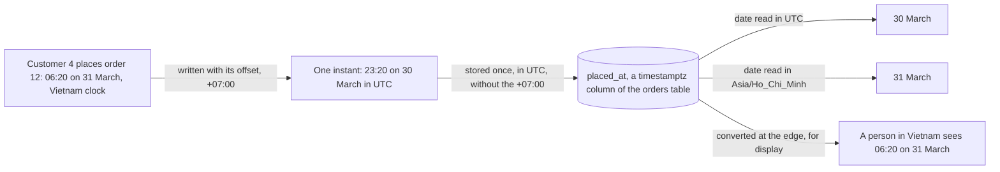

> Bỏ qua được nếu: bạn vẫn luôn lưu mọi thời điểm theo UTC và biết vì sao số đơn hàng mỗi ngày phụ thuộc vào múi giờ.

## Bạn cần biết trước

- [[foundation.l1.json-and-encoding]] — JSON không có kiểu ngày tháng, nên một thời điểm đi dưới dạng chuỗi mà cả hai bên phải đọc giống nhau.

## Tình huống

Khách hàng 4 đặt đơn hàng 12 lúc 06:20 ngày 31 tháng 3, theo đồng hồ Việt Nam. Lab là bộ chương trình Đơn Hàng mà `scripts/up.sh` khởi động trên máy bạn, kể cả cơ sở dữ liệu. Trong cơ sở dữ liệu đó, bảng `orders` có mỗi đơn hàng một dòng, mỗi thông tin một cột, và thời điểm đặt hàng nằm ở `placed_at`. Bạn đếm số đơn mỗi ngày trong tháng 3 theo ngày UTC của từng đơn, UTC là đồng hồ chuẩn của cả thế giới: đơn 12 rơi vào ngày 30 tháng 3, còn ngày 31 tháng 3 không có đơn nào. Đếm theo ngày Việt Nam thì đơn đó rơi vào ngày 31 tháng 3, đúng như khách hàng sẽ nói. Trong bảng không có gì thay đổi. Nếu `placed_at` giữ đúng một thời điểm, sao một đơn hàng lại rơi vào hai ngày khác nhau?

## Khái niệm cốt lõi

- thời điểm (instant) — một điểm trên dòng thời gian, là cùng một khoảnh khắc với mọi người, bất kể đồng hồ của họ chỉ mấy giờ.
- giờ địa phương (local time) — một ngày cộng một số giờ trên đồng hồ, chẳng hạn 06:20 ngày 31 tháng 3. Nó chỉ trỏ tới một thời điểm khi bạn biết offset của nó, hoặc biết múi giờ nếu múi giờ đó không bao giờ chỉnh đồng hồ.
- múi giờ (time zone) — quy tắc một vùng dùng để đổi thời điểm thành giờ địa phương. Múi giờ của Việt Nam tên là `Asia/Ho_Chi_Minh`, luôn bằng UTC cộng 7 giờ quanh năm. Có những múi giờ vặn đồng hồ tới rồi lùi lại vào các ngày cố định mỗi năm, đó là giờ mùa hè (daylight saving). Múi giờ Việt Nam thì không.
- UTC — đồng hồ chuẩn mà mọi múi giờ đều tính từ đó.
- offset — khoảng cách giữa giờ địa phương và UTC, viết ngay sau giờ. `+07:00` nghĩa là đồng hồ đi trước UTC 7 giờ, nên muốn ra UTC bạn trừ đi 7 giờ.
- ISO 8601 — một chuẩn viết ngày giờ thành văn bản: ngày, chữ `T`, giờ, và muốn chỉ đúng một thời điểm thì thêm offset, như `2026-03-31T06:20:00+07:00`. Thiếu offset, cùng đoạn văn bản đó chỉ còn là giờ địa phương.

## Cơ chế hoạt động



Khách hàng thấy 06:20 ngày 31 tháng 3. Riêng giờ địa phương đó chưa nói được là thời điểm nào, vì 06:20 trên đồng hồ ở múi giờ khác là một thời điểm khác. Viết kèm offset `+07:00`, nó chỉ đúng một thời điểm: 23:20 ngày 30 tháng 3 theo UTC.

Trong PostgreSQL, cơ sở dữ liệu của lab, `placed_at` là cột loại `timestamptz`: nó đổi giờ viết kèm offset sang UTC, rồi lưu thời điểm đó mà không giữ `+07:00`. Nhờ vậy mọi dòng đều cùng một đồng hồ, và thời điểm được giữ nguyên. Cột loại `timestamp`, không có `tz`, chỉ giữ các chữ số, và không có gì cho biết chúng đến từ đồng hồ nào. Vậy `placed_at` giữ một thời điểm, không phải một ngày.

Ngày chỉ xuất hiện khi bạn hỏi tới, và muốn hỏi thì phải có múi giờ. Đọc theo UTC, thời điểm đó rơi vào ngày 30 tháng 3. Đọc theo `Asia/Ho_Chi_Minh`, nó rơi vào ngày 31 tháng 3. Mọi đơn đặt trước 07:00 giờ Việt Nam đều rơi vào ngày hôm trước theo UTC. Khi hai báo cáo trên cùng tập đơn hàng lệch nhau ở các đơn sáng sớm, hãy kiểm tra trước tiên xem mỗi báo cáo dùng múi giờ nào để định nghĩa ngày.

Mũi tên cuối cùng là rìa: nơi giá trị gặp con người, chẳng hạn một trang web hay một báo cáo in ra. Khi một thời điểm được nhiều chương trình hoặc nhiều máy đọc, hãy giữ nó theo UTC ở mọi chỗ trước rìa đó, trong bảng và trong JSON giữa các chương trình, và chỉ đổi sang giờ Việt Nam ở rìa. Giờ kèm offset, như `+07:00`, cũng chỉ đúng thời điểm. UTC là dạng nên chọn, vì lý do mà phần sau sẽ nói. Nếu bạn đổi sớm hơn và chỉ giữ các chữ số địa phương, dưới dạng văn bản hay trong cột `timestamp`, thì không chương trình nào về sau biết được chúng chỉ thời điểm nào.

## Trong hệ thống Đơn Hàng

Sample console tạo thời điểm của đơn 12 bằng C# rồi in ra theo bốn cách.

```csharp file=samples/DonHang.Samples/Samples/Http/TimeDemo.cs tag=stage-0 lines=8-18
        // Order 12 of the lab data: early morning in Vietnam, yesterday in UTC.
        var placedAt = new DateTimeOffset(2026, 3, 31, 6, 20, 0, TimeSpan.FromHours(7));

        Console.WriteLine($"as stored and transmitted: {placedAt:o}");
        Console.WriteLine($"the same instant in UTC:   {placedAt.ToUniversalTime():o}");

        var vietnam = TimeZoneInfo.FindSystemTimeZoneById("Asia/Ho_Chi_Minh");
        var inVietnam = TimeZoneInfo.ConvertTime(placedAt, vietnam);

        Console.WriteLine($"the day this order belongs to in Vietnam: {inVietnam:yyyy-MM-dd}");
        Console.WriteLine($"the day the same order belongs to in UTC: {placedAt.UtcDateTime:yyyy-MM-dd}");
```

`DateTimeOffset` là một giá trị C# giữ ngày giờ cùng với offset của nó. `TimeSpan.FromHours(7)` chính là `+07:00`. `:o` yêu cầu văn bản ISO 8601 kèm offset. Vì thế dòng in ra đầu tiên kết thúc bằng `2026-03-31T06:20:00.0000000+07:00`, còn dòng thứ hai, sau `ToUniversalTime()`, kết thúc bằng `2026-03-30T23:20:00.0000000+00:00`.

Đó là cùng một thời điểm viết theo hai cách. Dù nhãn đầu tiên nói vậy, sample chỉ in ra chứ không gửi gì tới PostgreSQL. PostgreSQL nhận cả hai dạng, và cột `timestamptz` chỉ giữ thời điểm theo UTC. Khi chọn một dạng cho dữ liệu của mình, hãy chọn UTC: mọi thời điểm đã lưu cùng một đồng hồ thì so sánh hai thời điểm rất dễ, kể cả với người đọc bằng mắt. Lấy `2026-03-31T06:20:00+07:00` và `2026-03-31T00:10:00+00:00`: nhìn chữ số thì 06:20 có vẻ muộn hơn, nhưng thời điểm đầu là 23:20 ngày 30 tháng 3 theo UTC, nên nó sớm hơn. Viết theo UTC thì so chữ số là ra đúng thứ tự.

Hai dòng tiếp theo là rìa. Trên .NET 10, khi chạy sample đúng như nó có sẵn, `FindSystemTimeZoneById` tìm ra múi giờ Việt Nam bằng đúng cái tên mà cơ sở dữ liệu dùng, và `ConvertTime` cho ra giờ địa phương của thời điểm đó ở Việt Nam. Hai dòng cuối chỉ in ngày: `2026-03-31` ở Việt Nam, và `2026-03-30` theo UTC, lấy từ `UtcDateTime` giống như `ToUniversalTime()` ở trên.

Một truy vấn đặt câu hỏi của tình huống cho cơ sở dữ liệu. Truy vấn là một câu hỏi viết bằng SQL, ngôn ngữ mà PostgreSQL đọc được.

```sql file=db/queries/orders-by-day.sql tag=stage-0 lines=1-9
-- "Orders per day" is not one question. It is one question per time zone.

-- lesson: foundation.l1.time-and-timezones
SELECT date(placed_at AT TIME ZONE 'UTC')              AS day_utc,
       date(placed_at AT TIME ZONE 'Asia/Ho_Chi_Minh') AS day_vietnam,
       count(*) AS orders
FROM orders
GROUP BY day_utc, day_vietnam
ORDER BY day_utc;
```

`SELECT` liệt kê những gì mỗi dòng kết quả hiện ra, và `AS` đặt tên cho các cột đó. `placed_at AT TIME ZONE 'UTC'` đổi thời điểm đã lưu thành giờ địa phương theo UTC, và `date(...)` chỉ giữ lại ngày. Dòng kế tiếp làm y như vậy với múi giờ Việt Nam. `FROM orders` đọc bảng `orders`, `GROUP BY` gom các đơn có cùng cặp ngày vào một nhóm, `count(*)` đếm từng nhóm, và `ORDER BY day_utc` sắp xếp kết quả.

Trong 11 dòng kết quả, có hai dòng ghép hai ngày khác nhau: `2026-03-12` với `2026-03-13`, và `2026-03-30` với `2026-03-31`. Đó là đơn 6 và đơn 12, đặt ở Việt Nam lúc 05:30 ngày 13 tháng 3 và 06:20 ngày 31 tháng 3. Đơn 5, đặt lúc 10:00 ngày 12 tháng 3, có `2026-03-12` ở cả hai cột. Ngoài ra không đơn nào rơi vào ngày 12 hay 13 tháng 3. Vậy theo UTC, ngày 12 tháng 3 có hai đơn, còn theo Việt Nam chỉ có một. Truy vấn nêu rõ múi giờ ở mỗi lần. Không có `AT TIME ZONE`, ngày sẽ lấy theo múi giờ mà PostgreSQL áp cho từng kết nối, một thiết lập mà ai kết nối cũng đổi được, nên hai người chạy cùng một truy vấn có thể thấy ngày khác nhau.

## Người mới hay nghĩ rằng…

- **"Lưu DateTime.Now vào cơ sở dữ liệu là ổn."** → Thực ra `DateTime.Now` đọc đồng hồ của máy đang chạy code, theo múi giờ của máy đó, nên cùng một thời điểm cho ra chữ số khác nhau trên một laptop đặt giờ Việt Nam và trên một server đặt giờ UTC, server là máy chạy các chương trình của Đơn Hàng cho mọi người. Lưu vào cột `timestamp`, các chữ số đó mất múi giờ vĩnh viễn. `DateTime.UtcNow` đọc cùng đồng hồ đó nhưng theo UTC, hãy lưu giá trị của nó vào một cột `timestamptz` như `placed_at`. Bạn sẽ nhận ra khi hai đơn được hai máy lưu cùng một lúc lại hiện giờ lệch nhau bảy tiếng.
- **"Việt Nam không có chuyện múi giờ vì không có giờ mùa hè."** → Thực ra đơn 12 đã nhảy sang ngày khác mà chẳng dính gì tới giờ mùa hè: bảy tiếng chênh giữa Việt Nam và UTC là đủ. Khi giờ mùa hè vặn đồng hồ tới, có những giờ địa phương không bao giờ xảy ra. Khi nó lùi đồng hồ lại, có những giờ xảy ra hai lần. Chuyện đó vẫn tới được chỗ bạn qua một server đặt theo múi giờ như vậy, qua code người khác viết mà đổi giờ theo múi giờ của máy, hoặc qua một khách hàng sống ở vùng đó. Bạn sẽ nhận ra khi một báo cáo đếm trên server ở nước ngoài lệch với báo cáo đếm ở Việt Nam một khoảng thay đổi vào những ngày nhất định.

## Thử ngay (3 phút)

1. Từ thư mục gốc của code Đơn Hàng, chạy `scripts/up.sh` và chờ tới khi nó in ra `The lab is up.` Sau đó chạy `scripts/sql/run-query.sh orders-by-day`. Script này gửi cả file tới cơ sở dữ liệu của lab và in từng truy vấn kèm kết quả của nó.
2. Trong kết quả đầu tiên, tìm những dòng có hai ngày khác nhau. Kết quả thứ hai đến từ một truy vấn không có ở trên: đơn 6 và đơn 12, mỗi đơn kèm giờ theo UTC và theo Việt Nam. Các giờ đó không có offset, vì `AT TIME ZONE` cho ra giờ địa phương, và PostgreSQL viết một dấu cách ở chỗ ISO 8601 đặt chữ `T`.

Kết quả mong đợi: hai dòng trong kết quả đầu tiên ghép hai ngày khác nhau, `2026-03-12` với `2026-03-13` và `2026-03-30` với `2026-03-31`. Kết quả thứ hai liệt kê đơn `6` và `12`. Đơn 12 hiện `2026-03-30 23:20:00` theo UTC và `2026-03-31 06:20:00` theo Việt Nam.

## Liên hệ

- [[foundation.l1.json-and-encoding]] — chuyện thiếu kiểu ngày tháng ở bài đó có lời giải ở đây: văn bản ISO 8601 kèm offset.
- [[foundation.l1.sql-select]] — ở phía sau lộ trình, dạy đầy đủ `SELECT`, `FROM` và `ORDER BY`.
- [[foundation.l1.sql-group-by]] — gom nhóm đầy đủ. Gom nhóm theo ngày thì luôn quay lại câu hỏi múi giờ nào định nghĩa ngày.

## Tóm tắt 5 dòng

1. Thời điểm là như nhau ở mọi nơi. Giờ địa phương chỉ trỏ tới một thời điểm khi có offset (hoặc có múi giờ, nếu múi giờ đó không có giờ mùa hè).
2. Khi nhiều chương trình cùng đọc một thời điểm, hãy giữ nó theo UTC: lưu trong cột `timestamptz`, gửi đi dưới dạng văn bản ISO 8601 kèm offset.
3. Chỉ đổi sang giờ Việt Nam ở rìa. Giờ địa phương lưu không kèm offset trong cột không có múi giờ đã mất thời điểm của nó.
4. Đếm đơn theo ngày là hỏi múi giờ nào định nghĩa ngày. Đơn 12 rơi vào ngày 30 tháng 3 theo UTC và ngày 31 tháng 3 theo Việt Nam.
5. Việt Nam không có giờ mùa hè, nhưng server, code của người khác và khách hàng ở nơi khác thì có thể có, nên hãy nêu rõ múi giờ mỗi khi một thời điểm được đổi thành ngày.
