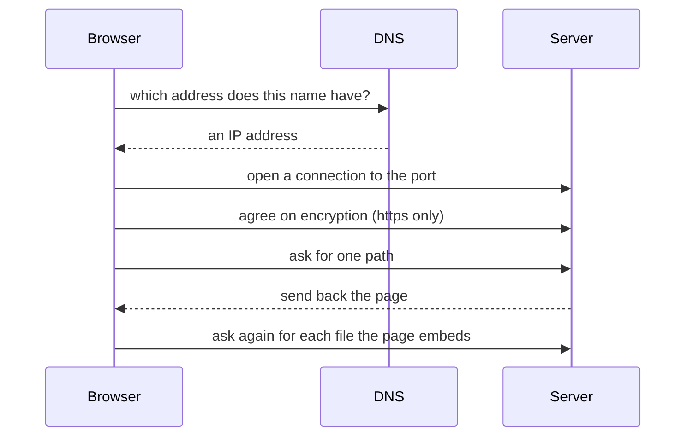

## Before you start

- [[foundation.l1.dns]] — you know a name has to become an IP address first; here that lookup is step one of a longer chain.
- [[foundation.l1.tcp-vs-udp]] — you know a TCP connection is set up before any bytes flow, and that refused and timed out are different failures; that connection carries everything in this lesson.
- [[foundation.l1.tls-and-https]] — you know TLS is agreed on top of that connection; here it is the step between connecting and asking.

## The situation

You start the lab — the programs `scripts/up.sh` runs on your machine, with names and addresses of its own — and open `http://localhost:8080/index.html` in your browser. The Đơn Hàng page appears at once. You then type `https://donhang.local:8443` and the browser stops with a message about the name, not about the page. A day later a colleague says the site is slow, and you cannot say which part is slow: the machine, the connection, or Caddy, the program serving the page. Pressing Enter feels like one action, so a failure feels like one failure. What actually happens between pressing Enter and the page appearing?

## Core concepts

- the chain — the fixed order of steps a browser runs for one address, and the backbone the rest of this lesson follows: find the address, open the connection, agree on encryption, ask, receive, draw.
- **request** — the message your browser sends to a server — the program listening on that port, Caddy in this lab — naming exactly one thing it wants.
- **response** — the message the server sends back, carrying that thing or the reason it is not coming.
- the network tab — the panel in the browser's developer tools that lists the exchanges a page makes while the panel is open, one row each.

## How it works



Your address carries three things the browser needs: a scheme (`http` or `https`, before `://`), a host name and a port. The scheme decides whether encryption is used; with no port written the browser uses 80 for `http` and 443 for `https`, but the lab writes `8080` and `8443`.

Step one turns the host name into an IP address: the browser asks DNS, because a connection is opened to a number, not a name. Step two opens a TCP connection to that address and port. Step three runs only for `https`: both sides agree on encryption before anything readable crosses it. Only then does the browser send its request, naming one path: the part of the address after the host and port, such as `/index.html`. The server sends back one response, whose first line — `HTTP/1.1 200 OK` below — names the rules both sides follow and says how it went. Its body here is the page's HTML, which also names the other files it needs.

The browser reads that HTML, finds every file the page embeds — styles, images, scripts — and any data it later needs, and asks for each. Each is another request and response. Drawing what arrived is the last step.

Each step fails on its own. A name with no address fails before any connection exists. A connection to a port with nothing listening is refused; one whose bytes never come back times out. A certificate the browser does not trust — the server's proof of identity — stops things after connecting, before any request: the browser warns you and sends nothing unless you continue past it. The wording differs between browsers, but the failure falls into one of a few categories — name, connection, certificate, server — and the category usually tells you which step to look at first.

## In the Đơn Hàng system

The repository has one script that walks the chain, one command per step, against the lab started by `scripts/up.sh`. The script re-runs itself inside the lab before doing anything, so `lab` — a name only the lab itself can look up — works for it even though it does not work for you.

```bash file=scripts/http/trace-request.sh tag=stage-0 lines=7-25
echo "1. turn the name into an address"
nslookup lab | grep -A1 '^Name:'

echo
echo "2. open a TCP connection to the port"
nc -z -w 3 localhost 8080 2>/dev/null && echo "   connected to port 8080"

echo
echo "3. agree on encryption (only on the HTTPS port)"
echo | openssl s_client -connect donhang.local:8443 2>/dev/null | grep -E '^ +Protocol +:'

echo
echo "4. send the request, read the response"
curl -sS -D - -o /dev/null http://localhost:8080/index.html

echo "5. one page, several requests"
for page in index.html login.html cached.html; do
  curl -sS -o /dev/null -w "   %{http_code} %{url_effective}\n" "http://localhost:8080/$page"
done
```

Each numbered `echo` names a step, and the command under it is chosen so that step is the one you can see: `nslookup` for the name, `nc` for the connection, `openssl s_client` for the encryption, `curl` for the exchange. The `grep` after a command keeps only the line that shows the step, and `2>/dev/null` hides what the command says about its own workings, so an empty block means that step produced nothing. Each later command still resolves the name and opens its own connection before doing its own step; only the HTTPS port runs the encryption step, which is why step 3 uses a different address. In step 4, `-D -` prints what came back instead of the page, and `-o /dev/null` throws the page away. In step 5, `-w` prints two facts per exchange: how it went and which address was asked for.

```text output=true
1. turn the name into an address
Name:	lab
Address: 172.28.0.12

2. open a TCP connection to the port
   connected to port 8080

3. agree on encryption (only on the HTTPS port)
    Protocol  : TLSv1.3

4. send the request, read the response
HTTP/1.1 200 OK
...
5. one page, several requests
   200 http://localhost:8080/index.html
   200 http://localhost:8080/login.html
   200 http://localhost:8080/cached.html
```

Read it top to bottom and you are reading the chain. The name `lab` becomes an address, the port answers, the encrypted port reports `TLSv1.3`, and only then does an exchange happen. Each step is shown on whichever address makes that step visible: `lab` is a name only the lab can look up, `localhost` is the machine the command runs on, and `donhang.local:8443` is the only port that agrees on encryption. `200` is how that first line says it went well, so step 5's three lines are three successful exchanges. Step 5 asks for three pages by hand, one at a time, to show that each ask is its own exchange; the browser would not have asked for the other two.

```html file=www/index.html tag=stage-0 lines=1-16
<!doctype html>
<html lang="vi">
<head>
<meta charset="utf-8">
<title>Đơn Hàng</title>
</head>
<body>
<h1>Đơn Hàng</h1>
<p>Trang tĩnh của phòng lab stage-0.</p>
<ul>
<li><a href="/login.html">Đăng nhập</a></li>
<li><a href="/cached.html">Trang có cache</a></li>
<li><a href="/redirect">Chuyển hướng</a></li>
</ul>
</body>
</html>
```

Look at what this page names and what is missing. Three `<a href=…>` lines point at other pages, but there is no `` for an image, no `<link>` for a style file and no `<script>`, so this HTML asks the browser to fetch nothing else: a link is followed only when you click it, while an embedded file is fetched without asking. A page in a real product embeds many files, and each one costs another exchange, one row each in the network tab — which is how you see how many there are and which one is slow, and why that panel fills with rows there and stays almost empty here.

## Beginners often think…

- **"Loading a page is one request."** → Actually the first exchange brings only the HTML; the browser then asks again for every file that HTML embeds, and again for any data the page fetches afterwards. You notice this when a page shows up unstyled for a moment and then jumps into shape as the rest arrives.
- **"If the page is slow, the server is slow."** → Actually the slow part can be the name lookup, the connection, the encryption agreement, or one late file among many, and the first three happen before the server starts producing the page. You notice this when the network tab shows one row still waiting while every other row finished in milliseconds.
- **"The site not opening means the server is down."** → Actually a step earlier in the chain can stop you first: at stage-0 the browser cannot find `donhang.local` until you add `127.0.0.1 donhang.local` to your machine's hosts file, a local list of name-to-address lines your machine reads before asking DNS. You notice this when step 3 of the script reaches that same port from inside the lab while your browser insists the site does not exist.

## Try it (3 minutes)

1. With the lab running, run `scripts/http/trace-request.sh` from the repository and read the five numbered steps in order; the script re-runs itself inside the lab, so the names it uses do not have to work on your own machine.
2. Open `http://localhost:8080/index.html` in your browser with the developer tools' network tab open, reload the page, and compare what you see there with step 5 of the script.

Expected result: the script prints one block per step and ends with three lines for three addresses. The network tab shows a row for `index.html`, possibly a second row the browser asks for on its own, and no row for `login.html` or `cached.html`, because the browser fetches a linked page only when you click it.

## Connections

- [[foundation.l1.http-request-response]] — the next lesson opens up step four of this chain: what a request and a response are made of.
- [[foundation.l1.dns]] — step one of this chain in full, including why an address you changed can survive for a while.
- [[backend.l1.request-lifecycle]] — the same chain from the other end: what the server does between receiving the request and writing the response.
- [[frontend.l1.browser-rendering]] — what happens after the responses arrive: how the browser turns those files into pixels.

## Five-line summary

1. Typing an address starts a fixed chain: resolve the name, connect, agree on encryption, send a request, receive a response, fetch the rest.
2. A request names one thing and a response answers it; both travel over the connection the earlier steps set up.
3. Each step fails in its own way, so the error you are shown usually points at the step to look at first.
4. One page is many exchanges: the HTML first, then every file it embeds, then any data it asks for.
5. The network tab lists those exchanges row by row, which is how you find the slow one.
