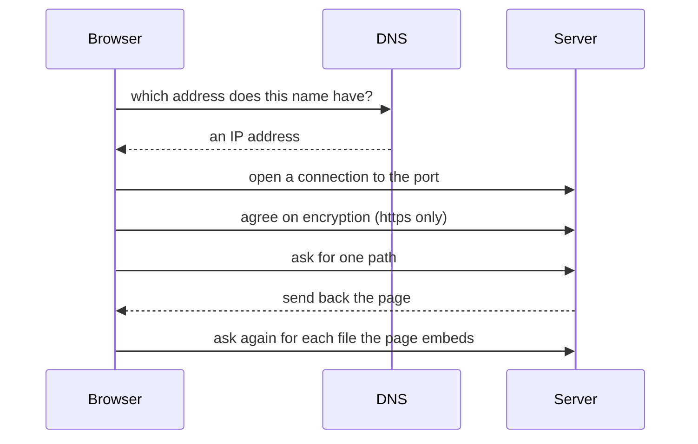

## Bạn cần biết trước

- [[foundation.l1.dns]] — bạn biết một cái tên phải được đổi thành địa chỉ IP trước đã. Ở bài này, lần tra cứu đó là bước đầu tiên của một chuỗi dài hơn.
- [[foundation.l1.tcp-vs-udp]] — bạn biết kết nối TCP phải được lập xong trước khi có byte nào đi qua, và bị từ chối với hết thời gian chờ là hai kiểu lỗi khác nhau. Mọi thứ trong bài này đều đi trên kết nối đó.
- [[foundation.l1.tls-and-https]] — bạn biết TLS được thỏa thuận ngay trên kết nối đó. Ở đây nó là bước nằm giữa lúc kết nối và lúc hỏi.

## Tình huống

Bạn khởi động lab, tức các chương trình mà `scripts/up.sh` chạy trên máy bạn, có tên và địa chỉ riêng nên hoạt động như một máy tách biệt. Bạn mở `http://localhost:8080/index.html` trên trình duyệt. `localhost` là cái tên luôn chỉ chính máy bạn đang dùng, địa chỉ `127.0.0.1`. Trang hiện ra ngay. Sau đó bạn gõ `https://donhang.local:8443` và trình duyệt dừng lại với một thông báo về cái tên. Một hôm sau, đồng nghiệp bảo trang chạy chậm, còn bạn không nói được phần nào chậm: máy, kết nối, hay Caddy, chương trình phục vụ trang. Nhấn Enter có cảm giác là một thao tác, nên hỏng ở đâu cũng có cảm giác là một kiểu hỏng. Thật ra điều gì xảy ra giữa lúc nhấn Enter và lúc trang hiện ra?

## Khái niệm cốt lõi

- chuỗi bước — thứ tự cố định mà trình duyệt đi qua cho một địa chỉ: tìm địa chỉ, mở kết nối, thỏa thuận mã hóa, hỏi, nhận, vẽ.
- **request** (thông điệp client gửi tới server) — thông điệp trình duyệt gửi tới server, tức chương trình đang lắng nghe ở port đó, trong lab này là Caddy. Mỗi request nêu đúng một thứ nó muốn.
- **response** (thông điệp server trả về) — thông điệp server gửi lại, mang theo thứ được hỏi hoặc lý do thứ đó không tới. Một request cùng response của nó tạo thành một lượt trao đổi.
- HTML của trang — file văn bản server gửi về cho một trang. Nó gồm các thẻ (những đoạn viết giữa `<` và `>`) mô tả trang và nêu tên các file trang cần, như style (file quy định trang trông ra sao), ảnh và script (chương trình nhỏ trình duyệt chạy bên trong trang, có thể tự gửi request riêng).
- tab network — một bảng trong developer tools của trình duyệt (các bảng kiểm tra có sẵn trong trình duyệt, mở từ menu của nó). Bảng này liệt kê các lượt trao đổi của một trang, mỗi lượt một dòng, kèm thời gian từng lượt. Hãy mở nó trước khi tải lại trang để các dòng hiện ra.

## Cơ chế hoạt động



Địa chỉ bạn gõ mang ba thứ: scheme (`http` hoặc `https`, đứng trước `://`), tên host và port. Scheme quyết định có mã hóa hay không. Khi không ghi port, trình duyệt dùng 80 cho `http` và 443 cho `https`, nhưng lab ghi rõ `8080` và `8443`.

Bước một đổi tên host thành địa chỉ IP, thường bằng cách hỏi DNS, vì kết nối được mở tới một con số chứ không tới một cái tên. Trong lab này, bước hai mở kết nối TCP tới địa chỉ và port đó. Bước ba, chỉ với `https`, thỏa thuận mã hóa. Chỉ sau đó trình duyệt mới gửi request, nêu một path: phần của địa chỉ nằm sau host và port, như `/index.html`. Server gửi lại một response. Dòng đầu tiên của nó, là `HTTP/1.1 200 OK` ở ví dụ bên dưới, cho biết kết quả ra sao. Sau dòng đó là thứ được hỏi, ở đây là HTML của trang.

Trình duyệt đọc HTML đó, hỏi tiếp từng file mà nó nhúng vào, rồi vẽ trang từ những gì đã tới. Mỗi file là thêm một request và một response, và script trên trang còn có thể gửi thêm request sau khi trang đã vẽ xong.

Mỗi bước hỏng theo kiểu riêng. Một cái tên không có địa chỉ sẽ hỏng trước khi có kết nối nào. Kết nối tới một port không có gì lắng nghe sẽ bị từ chối, còn kết nối mà byte gửi đi không bao giờ quay về sẽ hết thời gian chờ. Một chứng chỉ không được tin cậy, tức bằng chứng danh tính của server, chặn mọi thứ sau khi đã kết nối: trình duyệt cảnh báo bạn và không gửi request nào trừ khi bạn chấp nhận đi tiếp. Lỗi phía server đến sau cùng: response vẫn tới, nhưng nó nói request không suôn sẻ. Cách diễn đạt khác nhau giữa các trình duyệt, nhưng nhóm lỗi (tên, kết nối, chứng chỉ, server) thường cho bạn biết nên xem bước nào trước.

## Trong hệ thống Đơn Hàng

Repo có một script đi hết chuỗi bước, mỗi bước một lệnh. Script tự chạy lại chính nó bên trong lab trước khi làm gì khác, nên `lab`, cái tên chỉ lab mới tra được, dùng được với script dù không dùng được với bạn.

```bash file=scripts/http/trace-request.sh tag=stage-0 lines=7-25
echo "1. turn the name into an address"
nslookup lab | grep -A1 '^Name:'

echo
echo "2. open a TCP connection to the port"
nc -z -w 3 localhost 8080 2>/dev/null && echo "   connected to port 8080"

echo
echo "3. agree on encryption (only on the HTTPS port)"
echo | openssl s_client -connect donhang.local:8443 2>/dev/null | grep -E '^ +Protocol +:'

echo
echo "4. send the request, read the response"
curl -sS -D - -o /dev/null http://localhost:8080/index.html

echo "5. one page, several requests"
for page in index.html login.html cached.html; do
  curl -sS -o /dev/null -w "   %{http_code} %{url_effective}\n" "http://localhost:8080/$page"
done
```

Mỗi dòng `echo` có đánh số nêu tên một bước, và lệnh bên dưới làm bước đó hiện ra. Một dòng phía trên, không có trong đoạn trích, dừng script ở lệnh đầu tiên bị lỗi, nên nếu bước 1, 3 hoặc 4 không hoàn tất được thì dòng đánh số in ra cuối cùng chính là bước đó. Lab chuyển port 8080 của máy bạn vào port 8080 của nó, nên `localhost:8080` tới cùng một Caddy dù hỏi từ script hay từ trình duyệt.

- Bước 1: `nslookup` tra `lab` chỉ để cho thấy một lần tra cứu đang diễn ra. `grep -A1` giữ lại dòng `Name:` và dòng ngay sau nó.
- Bước 2: `nc -z -w 3` chỉ kết nối, bỏ cuộc sau 3 giây, và `2>/dev/null` giấu thông báo riêng của nó. `&& echo` chỉ in khi kết nối được, nên nếu hỏng thì khối này để trống và script chạy tiếp sang bước 3.
- Bước 3: `echo |` khiến `openssl s_client` đóng ngay sau khi thỏa thuận xong. Chỉ port HTTPS mới chạy mã hóa, vì thế dùng `donhang.local:8443` thay cho `localhost:8080`.
- Bước 4: `-D -` in ra những gì nhận về thay cho trang, còn `-o /dev/null` bỏ trang đi. Một response báo lỗi, như `503`, không làm script dừng.
- Bước 5: `-w` in kết quả từng lượt trao đổi và địa chỉ đã được hỏi.

Mỗi lệnh tự tra tên và tự kết nối, nên không bước nào dùng lại địa chỉ mà bước 1 đã in ra.

```text output=true
1. turn the name into an address
Name:	lab
Address: 172.28.0.12

2. open a TCP connection to the port
   connected to port 8080

3. agree on encryption (only on the HTTPS port)
    Protocol  : TLSv1.3

4. send the request, read the response
HTTP/1.1 200 OK
...

5. one page, several requests
   200 http://localhost:8080/index.html
   200 http://localhost:8080/login.html
   200 http://localhost:8080/cached.html
```

`...` thay cho những dòng khác được gửi trước trang, bài sau sẽ mở chúng ra. Tên `lab` thành một địa chỉ, port trả lời, port mã hóa báo `TLSv1.3`, và chỉ sau đó mới có lượt trao đổi. `200` là cách dòng đầu tiên đó báo kết quả tốt, nên ba dòng ở bước 5 là ba lượt trao đổi thành công. Bước 5 tự tay hỏi ba trang để cho thấy mỗi lần hỏi là một lượt trao đổi riêng. Trình duyệt sẽ không tự hỏi hai trang còn lại.

```html file=www/index.html tag=stage-0 lines=1-16
<!doctype html>
<html lang="vi">
<head>
<meta charset="utf-8">
<title>Đơn Hàng</title>
</head>
<body>
<h1>Đơn Hàng</h1>
<p>Trang tĩnh của phòng lab stage-0.</p>
<ul>
<li><a href="/login.html">Đăng nhập</a></li>
<li><a href="/cached.html">Trang có cache</a></li>
<li><a href="/redirect">Chuyển hướng</a></li>
</ul>
</body>
</html>
```

Ba dòng `<a href=…>` trỏ tới các trang khác, nhưng không có `` cho ảnh, không có `<link>` cho file style, cũng không có `<script>`, nên trang này không đưa cho trình duyệt thứ gì để tự tải thêm. Các trang được trỏ tới chỉ tải khi bạn bấm vào. Một trang trong sản phẩm thật nhúng rất nhiều file, mỗi file là thêm một lượt trao đổi và thêm một dòng trong tab network, và đó là cách bạn tìm ra file chậm.

## Người mới hay nghĩ rằng…

- **"Tải một trang là một request."** → Thực ra lượt trao đổi đầu tiên chỉ mang về HTML, vì sau đó trình duyệt còn hỏi tiếp từng file mà HTML đó nhúng vào, rồi hỏi thêm dữ liệu trang lấy về sau. Bạn sẽ nhận ra khi tab network hiện nhiều dòng cho một trang bạn chỉ mở một lần.
- **"Trang chậm nghĩa là server chậm."** → Thực ra phần chậm có thể là lần tra tên, lúc kết nối, lúc thỏa thuận mã hóa, hoặc một file tới muộn giữa rất nhiều file, vì ba bước đầu diễn ra trước khi server bắt đầu tạo trang. Bạn sẽ nhận ra khi tab network có một dòng vẫn đang chờ trong khi mọi dòng khác đã xong trong vài mili giây.
- **"Trang không mở được nghĩa là server sập."** → Thực ra một bước sớm hơn trong chuỗi có thể chặn bạn trước, vì trong lab này trình duyệt không tìm được `donhang.local` cho tới khi bạn thêm `127.0.0.1 donhang.local` vào file hosts của máy, một danh sách cục bộ gồm các dòng tên và địa chỉ mà máy thường xem trước khi hỏi DNS. Bạn sẽ nhận ra khi bước 3 của script tới được port đó trong khi trình duyệt khăng khăng trang không tồn tại. Lab có ghi `donhang.local` trong file hosts riêng của nó.

## Thử ngay (3 phút)

1. Khi lab đang chạy, chạy `scripts/http/trace-request.sh` từ repo và đọc lần lượt năm bước có đánh số.
2. Mở `http://localhost:8080/index.html` trên trình duyệt với tab network của developer tools đang mở, tải lại trang, rồi so những gì bạn thấy ở đó với bước 5 của script.

Kết quả mong đợi: script in một khối cho mỗi bước và kết thúc bằng ba dòng cho ba địa chỉ. Tab network có một dòng cho `index.html`, có thể thêm một dòng cho biểu tượng nhỏ của trang mà trình duyệt tự hỏi, và không có dòng nào cho `login.html` hay `cached.html`, vì trình duyệt chỉ tải trang được trỏ tới khi bạn bấm vào.

## Liên hệ

- [[foundation.l1.http-request-response]] — bài tiếp theo mở bước bốn của chuỗi này ra: một request và một response gồm những gì.
- [[foundation.l1.dns]] — bước một của chuỗi này đầy đủ, kể cả lý do một địa chỉ bạn đã đổi vẫn có thể tồn tại thêm một thời gian.
- [[backend.l1.request-lifecycle]] — cùng chuỗi đó nhìn từ đầu bên kia: server làm gì từ lúc nhận request tới lúc viết response.
- [[frontend.l1.browser-rendering]] — điều xảy ra sau khi các response tới: trình duyệt biến những file đó thành điểm ảnh ra sao.

## Tóm tắt 5 dòng

1. Gõ một địa chỉ là khởi động một chuỗi cố định: tra tên, kết nối, thỏa thuận mã hóa (chỉ với https), gửi request, nhận response, tải phần còn lại.
2. Request nêu một thứ và response trả lời nó, cả hai đi trên kết nối mà các bước trước đã lập.
3. Mỗi bước hỏng theo kiểu riêng, nên lỗi bạn thấy thường chỉ ra bước cần xem trước.
4. Một trang là nhiều lượt trao đổi: HTML trước, rồi từng file nó nhúng vào, rồi dữ liệu nó hỏi thêm.
5. Tab network liệt kê từng lượt trao đổi theo dòng, và đó là cách bạn tìm ra lượt chậm.
