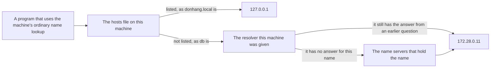

## Before you start

- [[foundation.l1.ip-and-ports]] — you learned that a machine is named by a number and a port picks one program on it. That lesson reached the database by writing `db:5432` without ever telling you the database's number; this lesson is where the number comes from.

## The situation

The script from the previous lesson knocked on five doors: five name-and-port pairs it tried to open. Four of them named the machine with `localhost`, a word you were told stands for a number. The fifth was `db:5432`, and it answered, although nobody gave you the database's address. On the other side, the setup file `STAGE.md` asks you to add one line to a file on your own machine before `donhang.local` opens in a browser; a colleague who skips that step types the same name and gets nothing. One name works without you doing anything, another works only after you edit a file, and the same name behaves differently on two machines. Who decides what a name means?

## Core concepts

- **DNS** — the naming system that turns a name such as `db` into an IP address, by asking machines whose job is to hold the answer.
- resolver — a machine, or a program on one, that answers the question "what address does this name have"; each machine is configured with a list of resolvers to ask, usually handed to it by the network it connects to. The machines that hold the true answer for a name, rather than fetch it, are called name servers.
- record — one stored line of an answer; the kind this lesson uses says: this name has this address. One name may have several; one address may be reached by several names.
- time-to-live — the length of time, stated together with a record, for which whoever receives that record may keep using it before asking again.
- hosts file — a file of fixed name-and-address lines kept on one machine, which the machine's ordinary name lookup reads before any resolver is asked; some tools, `nslookup` among them, skip it and ask a resolver directly.

## How it works



In the situation above, `db` is a name and `172.28.0.11` is the address behind it. The name carries no address inside it, so something has to look it up: that is DNS.

An ordinary name lookup starts at home: the machine reads its own hosts file first, and a name listed there is answered from it, with nobody asked. On the lab box that file holds one such line, pairing `donhang.local` with `127.0.0.1`. The lab's own configuration puts that line there; `STAGE.md` asks you to add the identical one on your own machine. On a machine that has it the name means that machine itself; on one without it the name means nothing, which is why your colleague saw nothing.

A name the file does not list goes to the resolver the network gave the machine when it connected. That resolver is run by the lab itself and holds the names of the machines on its network, so it answers `db` with `172.28.0.11`, `lab` with `172.28.0.12`, and `no-such-host.donhang` by saying no such name exists.

For every name there are name servers whose job is to hold the true answer for it, normally more than one, so the answer survives a machine going down. That is also where it changes when a name is pointed at another machine. A resolver that does not hold a name asks them on your behalf, working down the chain towards the ones that hold it, and passes the answer back. Every resolver that handles an answer may keep it for the time-to-live it came with, and hand it on without asking again. So a name is not a machine, and the answer you get is not always fresh: it is the last one written down, good until its time runs out.

## In the Đơn Hàng system

The lab has a script that asks for three names and then prints the machine's own file of fixed answers. The `exec` line re-runs the script inside the lab box, and each `grep` only trims `nslookup`'s output down to the lines shown below; you do not need to read how either is written.

```bash file=scripts/network/resolve.sh tag=stage-0 lines=4-20
# Everything below runs inside the lab box; this line puts it there.
[ -f /.dockerenv ] || exec "$(dirname "$0")/../lab-run.sh" "$0" "$@"

echo "the database's name:"
nslookup db | grep -A1 '^Name:'

echo
echo "this box's own name on the lab network:"
nslookup lab | grep -A1 '^Name:'

echo
echo "a name nobody knows:"
nslookup no-such-host.donhang 2>&1 | grep -F -m1 "can't find" || true

echo
echo "the file the machine reads before it asks any resolver:"
cat /etc/hosts
```

```text output=true
the database's name:
Name:	db
Address: 172.28.0.11

this box's own name on the lab network:
Name:	lab
Address: 172.28.0.12

a name nobody knows:
** server can't find no-such-host.donhang: NXDOMAIN

the file the machine reads before it asks any resolver:
127.0.0.1	localhost
::1	localhost ip6-localhost ip6-loopback
fe00::	ip6-localnet
ff00::	ip6-mcastprefix
ff02::1	ip6-allnodes
ff02::2	ip6-allrouters
127.0.0.1	donhang.local
172.28.0.12	donhang-lab
```

`nslookup` is the tool that asks a resolver and prints what comes back. The first two questions get one address each: `db` is `172.28.0.11`, the database machine, and `lab` is `172.28.0.12`, the box the script itself runs on. Both answers came from the resolver the lab gave the box, because `nslookup` always asks one, and neither name is in the file at the bottom either. The third name comes back as `NXDOMAIN`, which is how a resolver says that no such name exists — a different outcome from the closed port of the previous lesson, where the machine was found and nothing was listening.

Then read the file. Five of its lines give addresses written a second way, which this lesson does not use and you can skip. `172.28.0.12` is in it too, under a second name, `donhang-lab`: one machine, one address, two names that reach it. The line `127.0.0.1 donhang.local` is the identical one `STAGE.md` asks you to add on your own machine, and it is why that name opens the local site while the resolver the lab box uses has no answer for it.

That `nslookup` skips the file cuts both ways: the file is shown here only because the script's last line prints it, and a program that does read the file would not have found `db` or `lab` there in any case.

## Beginners often think…

- **"Changing a DNS record takes effect everywhere immediately."** → Actually every resolver that already handed out the old answer may keep giving it until the time-to-live it stated runs out, and that clock started when it received the answer, not when you made the change. You notice this when you point a name at a new machine, reach the new one from a machine that never asked before, and keep landing on the old one from your own laptop.
- **"One name equals one machine."** → Actually a name is a label on an address rather than the machine itself, so one address can carry several names, as `172.28.0.12` carries both `lab` and `donhang-lab`, and one name can be answered with several addresses. You notice this when two names you took for two systems fail together, because they were always one machine.
- **"If a name works on my machine, it works on yours."** → Actually the first place a lookup goes is your own hosts file, which nobody else has a copy of. You notice this when `donhang.local` opens on your laptop and gives your colleague nothing, because the line is in your file and only yours.

## Try it (3 minutes)

1. With the lab running (start it with `scripts/up.sh`), run `scripts/network/resolve.sh` and read the three answers against the file it prints last.
2. Search that file for the two names the script asked about first, `db` and `lab`.

Expected result: `db` answers `172.28.0.11`, `lab` answers `172.28.0.12`, and `no-such-host.donhang` comes back as `NXDOMAIN`. Neither `db` nor `lab` is anywhere in the file, so both addresses came from a resolver and not from the machine's own list. The names the file does hold are `localhost`, with `ip6-localhost` and `ip6-loopback` as its other spellings, four further fixed names the system puts there, `donhang.local` at `127.0.0.1`, and `donhang-lab` at the same address the resolver just gave for `lab`.

## Connections

- [[foundation.l1.ip-and-ports]] — the step before this one: `db:5432` worked there because the name half of it was answered by what this lesson describes.
- [[foundation.l1.tls-and-https]] — where the name matters for a second reason: what a machine proves it is gets checked against the name you asked for, not the address you reached.
- [[k8s.l1.service-and-dns]] — the same idea one layer up: there too a name is turned into an address, by a resolver that a group of machines runs for itself.

## Five-line summary

1. DNS turns a name into an IP address by asking resolvers; a record in the answer carries a time-to-live limiting how long it is kept.
2. A machine reads its own hosts file before asking any resolver, so a name can mean one thing here and nothing elsewhere.
3. A resolver that does not hold a name asks others down the chain, until it reaches the ones that hold it.
4. Because answers are kept for their time-to-live, a change to a name is seen at different moments on different machines.
5. The name is not the machine: one address can carry several names, and one name can be answered with several addresses.
