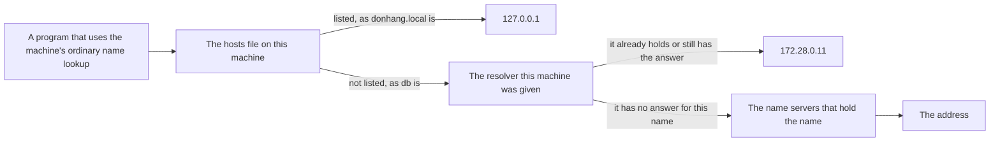

## Bạn cần biết trước

- [[foundation.l1.ip-and-ports]] — bạn đã biết một máy được gọi bằng một con số, và port chọn ra một chương trình trên máy đó. Bài đó tới được database bằng cách viết `db:5432`, mà chưa hề cho bạn biết số của database là gì. Bài này nói con số đó từ đâu ra.

## Tình huống

Script ở bài trước gõ năm cánh cửa: năm cặp tên và port mà nó thử mở. Bốn cặp gọi máy bằng `localhost`, một từ mà bạn được biết là đại diện cho một con số. Cặp thứ năm là `db:5432`, và nó có trả lời, dù chưa ai cho bạn địa chỉ của database. Ở chiều ngược lại, file hướng dẫn cài đặt `STAGE.md` bảo bạn thêm một dòng vào một file trên máy mình thì `donhang.local` mới mở được trong trình duyệt. Một đồng nghiệp bỏ qua bước đó gõ đúng cái tên ấy và chẳng nhận được gì. Một cái tên chạy mà bạn không phải làm gì, một cái tên khác chỉ chạy sau khi bạn sửa một file, và cùng một cái tên lại cư xử khác nhau trên hai máy. Vậy ai quyết định một cái tên nghĩa là gì?

## Khái niệm cốt lõi

- **DNS** (hệ thống dịch tên miền, ví dụ donhang.vn, thành địa chỉ IP) — hệ thống đặt tên biến một cái tên như `db` thành một địa chỉ IP, bằng cách hỏi những máy có nhiệm vụ giữ câu trả lời.
- resolver — một máy, hoặc một chương trình trên máy, trả lời câu hỏi "tên này có địa chỉ gì". Mỗi máy được cấu hình sẵn một danh sách resolver để hỏi, thường do mạng mà nó kết nối vào cấp cho. Những máy giữ câu trả lời gốc cho một cái tên, thay vì đi hỏi nơi khác, được gọi là name server.
- record — một dòng được lưu lại trong câu trả lời. Loại record bài này dùng nói rằng: tên này có địa chỉ này. Một tên có thể có nhiều record, và một địa chỉ có thể được nhiều tên trỏ tới.
- time-to-live — khoảng thời gian, được ghi kèm theo record, mà bên nhận record đó được phép dùng tiếp nó trước khi phải hỏi lại.
- hosts file — một file gồm các dòng tên và địa chỉ cố định, nằm trên từng máy. Cách tra tên thông thường của máy đọc file này trước khi hỏi bất kỳ resolver nào. Một số công cụ, như `nslookup` (lệnh hỏi một resolver rồi in câu trả lời), bỏ qua file này và hỏi thẳng resolver.

## Cơ chế hoạt động



Tên `db` không mang sẵn địa chỉ nào bên trong, nên phải có thứ gì đó tra ra địa chỉ của nó: thứ đó là DNS.

Một lần tra tên thông thường bắt đầu ngay tại chỗ: máy đọc hosts file của chính nó trước, và tên nào có trong đó thì được trả lời luôn, không phải hỏi ai. Trên máy lab, cấu hình của lab ghép `donhang.local` với `127.0.0.1` trong file đó. `STAGE.md` bảo bạn thêm đúng dòng ấy trên máy của mình. Lab còn cho các trang của nó mở được ở chính địa chỉ của laptop, nên trên laptop `127.0.0.1` cũng dẫn tới đó. Làm cách nào thì không phải chuyện của bài này. Thiếu dòng đó, cái tên chẳng có nghĩa gì, và đó là lý do đồng nghiệp của bạn không thấy gì.

Tên nào file không liệt kê thì được gửi tới resolver mà mạng đã cấp cho máy lúc kết nối. Resolver đó do lab chạy và giữ câu trả lời gốc cho các máy trong mạng của nó, nên với những tên này nó cũng chính là name server. Nó trả lời `db` là `172.28.0.11` và `lab` là `172.28.0.12`. Với `no-such-host.donhang`, tên mà nó không giữ, nó gửi lại câu trả lời rằng không có tên nào như vậy.

Với mỗi tên đều có những name server giữ câu trả lời gốc cho nó, thường là nhiều hơn một để tên vẫn sống khi một máy sập. Đó cũng là nơi câu trả lời thay đổi khi tên được trỏ sang chỗ khác. Resolver nào không giữ một tên thì đi hỏi các name server. Name server nào không giữ tên đó sẽ không trả về địa chỉ, mà trả về danh sách name server cần hỏi tiếp. Resolver hỏi tiếp những máy đó rồi chuyển câu trả lời về. Resolver đã lấy được câu trả lời có thể giữ nó trong khoảng time-to-live đi kèm, và đưa lại cho người hỏi sau mà không cần hỏi lại. Vì vậy câu trả lời bạn nhận được là câu trả lời được ghi lại gần nhất, còn dùng được cho tới khi hết thời gian của nó.

## Trong hệ thống Đơn Hàng

Lab có một script hỏi ba cái tên rồi in ra file chứa các câu trả lời cố định của chính máy đó. Ngoài hai lệnh `nslookup` và `cat`, bạn không cần đọc gì khác trong khối code này.

```bash file=scripts/network/resolve.sh tag=stage-0 lines=4-20
# Everything below runs inside the lab box; this line puts it there.
[ -f /.dockerenv ] || exec "$(dirname "$0")/../lab-run.sh" "$0" "$@"

echo "the database's name:"
nslookup db | grep -A1 '^Name:'

echo
echo "this box's own name on the lab network:"
nslookup lab | grep -A1 '^Name:'

echo
echo "a name nobody knows:"
nslookup no-such-host.donhang 2>&1 | grep -F -m1 "can't find" || true

echo
echo "the file the machine reads before it asks any resolver:"
cat /etc/hosts
```

```text output=true
the database's name:
Name:	db
Address: 172.28.0.11

this box's own name on the lab network:
Name:	lab
Address: 172.28.0.12

a name nobody knows:
** server can't find no-such-host.donhang: NXDOMAIN

the file the machine reads before it asks any resolver:
127.0.0.1	localhost
::1	localhost ip6-localhost ip6-loopback
fe00::	ip6-localnet
ff00::	ip6-mcastprefix
ff02::1	ip6-allnodes
ff02::2	ip6-allrouters
127.0.0.1	donhang.local
172.28.0.12	donhang-lab
```

`nslookup` là công cụ hỏi một resolver rồi in ra câu trả lời nhận được. Hai câu hỏi đầu mỗi câu nhận về một địa chỉ: `db` là `172.28.0.11`, máy chứa database, còn `lab` là `172.28.0.12`, chính cái máy mà script đang chạy trên đó. Cả hai câu trả lời đều đến từ resolver mà lab cấp cho máy, vì `nslookup` luôn hỏi một resolver, và cả hai tên cũng không có trong file ở cuối. Tên thứ ba trả về `NXDOMAIN`, cách một resolver nói rằng không có tên nào như vậy. Kết cục này khác với port đóng ở bài trước, nơi máy vẫn được tìm thấy nhưng không có gì đang lắng nghe.

Giờ đọc tới file. Dòng đầu tiên là nơi `localhost` lấy con số của nó, trước khi hỏi bất kỳ resolver nào. Năm dòng trong đó ghi địa chỉ theo một dạng thứ hai, bài này không dùng tới nên bạn có thể bỏ qua. `172.28.0.12` cũng có trong file, dưới một cái tên thứ hai là `donhang-lab`: một máy, một địa chỉ, hai cái tên cùng dẫn tới nó. Dòng `127.0.0.1 donhang.local` giống hệt dòng mà `STAGE.md` bảo bạn thêm trên máy của mình. Nhờ dòng này mà trên máy lab, tên đó chỉ chính máy lab, không cần hỏi resolver nào.

File được in ra chỉ để bạn đọc, `nslookup` không hề dùng tới nó. Một chương trình có đọc file này thì cũng không tìm thấy `db` hay `lab` trong đó.

## Người mới hay nghĩ rằng…

- **"Đổi một record DNS là có hiệu lực ở mọi nơi ngay lập tức."** → Thực ra mọi resolver đã trả ra câu trả lời cũ đều có thể tiếp tục trả nó cho tới khi hết time-to-live ghi kèm, và đồng hồ đó bắt đầu chạy từ lúc resolver nhận câu trả lời, không phải lúc bạn sửa. Bạn sẽ nhận ra khi trỏ một tên sang máy mới, từ một máy ở mạng khác thì tới được máy mới vì resolver ở đó chưa từng giữ câu trả lời cũ, còn từ laptop của mình thì cứ rơi vào máy cũ.
- **"Một cái tên là một cái máy."** → Thực ra tên là nhãn dán lên một địa chỉ chứ không phải bản thân cái máy, nên một địa chỉ có thể mang nhiều tên, như `172.28.0.12` mang cả `lab` lẫn `donhang-lab`, và một tên có thể được trả lời bằng nhiều địa chỉ. Bạn sẽ nhận ra khi hai cái tên bạn tưởng là hai hệ thống cùng hỏng một lúc, vì từ đầu chúng vẫn là một máy.
- **"Tên nào chạy trên máy mình thì cũng chạy trên máy bạn."** → Thực ra nơi đầu tiên một lần tra tên ghé tới là hosts file của chính máy bạn, và không ai khác có bản sao của nó. Bạn sẽ nhận ra khi `donhang.local` mở được trên laptop của bạn nhưng không ra gì trên máy đồng nghiệp, vì dòng đó chỉ nằm trong file của bạn.

## Thử ngay (3 phút)

1. Với lab đang chạy (khởi động bằng `scripts/up.sh`), chạy `scripts/network/resolve.sh` và đối chiếu ba câu trả lời với file được in ra cuối cùng.
2. Tìm trong file đó hai cái tên mà script hỏi trước tiên, `db` và `lab`.

Kết quả mong đợi: `db` trả về `172.28.0.11`, `lab` trả về `172.28.0.12`, còn `no-such-host.donhang` trả về `NXDOMAIN`. Cả `db` lẫn `lab` đều không có ở đâu trong file, nên cả hai địa chỉ đến từ resolver chứ không phải từ danh sách riêng của máy. Trong số các tên file có giữ là `localhost`, `donhang.local` ở `127.0.0.1`, và `donhang-lab` ở đúng địa chỉ mà resolver vừa trả cho `lab`.

## Liên hệ

- [[foundation.l1.ip-and-ports]] — bước ngay trước bài này: `db:5432` chạy được ở đó vì nửa phần tên của nó đã được trả lời bởi cơ chế mà bài này mô tả.
- [[foundation.l1.tls-and-https]] — nơi cái tên bạn hỏi còn quan trọng vì một lý do thứ hai, khi kết nối đã được bảo mật.
- [[k8s.l1.service-and-dns]] — cùng ý tưởng ở quy mô lớn hơn: ở đó cũng có một cái tên được biến thành địa chỉ, bởi một resolver mà một nhóm máy tự chạy cho mình.

## Tóm tắt 5 dòng

1. DNS biến một cái tên thành địa chỉ IP bằng cách hỏi resolver. Record trong câu trả lời mang theo time-to-live, giới hạn thời gian nó được giữ.
2. Máy đọc hosts file của chính nó trước khi hỏi resolver nào, nên một cái tên có thể có nghĩa ở máy này và vô nghĩa ở máy khác.
3. Resolver không giữ một tên thì đi hỏi các name server, mỗi câu trả lời chỉ ra nơi cần hỏi tiếp, cho tới khi gặp nơi giữ tên đó.
4. Vì câu trả lời được giữ trong khoảng time-to-live, một thay đổi của tên sẽ được thấy vào những thời điểm khác nhau trên các máy khác nhau.
5. Tên không phải là máy: một địa chỉ có thể mang nhiều tên, và một tên có thể được trả lời bằng nhiều địa chỉ.
