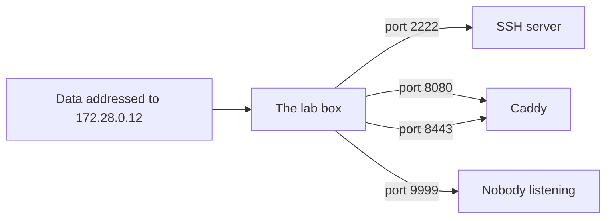

## Before you start

- [[foundation.l1.program-to-process]] — you saw that a running program is a process the operating system keeps track of, and gives a number of its own. This lesson gives that process a second number, the one anything outside the machine has to know to reach it.

## The situation

You start the Đơn Hàng lab with `scripts/up.sh` and open `localhost:8080` in your browser. The site is there. You paste the same address into a chat so a colleague can look at the page, and they see nothing at all. Later you start a small program of your own that wants to sit on 8080 as well, and it refuses to start, saying the address is in use. The same short address works for you, means nothing to your colleague, and cannot be shared by two programs on one machine. What is `localhost:8080` actually naming?

## Core concepts

- **IP address** — the number that names a machine's place on a network; one machine can have more than one. The older and still common form writes four numbers from 0 to 255 separated by dots, as in `172.28.0.12`.
- **port** — a second number, from 0 to 65535, that names which process on that machine the arriving data is for.
- listening — what a process does when it asks the operating system to hand it everything that arrives on one port of that machine.
- loopback — an address every machine has for itself, which data never leaves; the name `localhost` stands for it, and in the four-number form it is `127.0.0.1`.
- private address — an address from one of the ranges set aside for use inside one network, those starting `10.`, `192.168.`, and `172.16` through `172.31`, which machines out on the internet have no way to reach.

## How it works



In the situation above, `localhost:8080` is two things joined by a colon. Everything left of the colon says which machine; everything right says which process on it.

The left half names a machine, and machines are named by number. Inside the lab, the box that runs the site is `172.28.0.12` and the database machine is `172.28.0.11`. Inside the lab network, data addressed to `172.28.0.12` reaches that box and no other.

The box then decides which of its running programs the data belongs to, and the port is the whole of that decision. A process claims a port by asking the operating system for it and then listening on it. The SSH server, the program that lets you sign in to the box from another machine, holds 2222; Caddy, the program that serves the Đơn Hàng site, holds 8080 and 8443, because one process can hold several. Data marked 9999 arrives at a box where nothing holds that number, so no program answers: the box turns it away at once.

The operating system gives a port to the first process that asks and refuses every later program asking for that same number on that same address, for as long as the first still holds it. That is why your own program could not have 8080: Caddy already had it. The number is not owned, only held, and it can be claimed again once the process holding it is gone.

Two kinds of address in this lesson never reach the world outside. `localhost` means the machine running the command, whichever machine that is, and it stands for the loopback address. The lab's own numbers come from a private range, so your colleague's machine has no way to reach them.

## In the Đơn Hàng system

The lab has a script that knocks on five doors, then asks its own box which ports it is listening on. It asks with `netstat -tln`, which prints one line per listening port, ending in `LISTEN`, with the number after the colon in the address it shows. The `grep` after it narrows that answer to three numbers.

```bash file=scripts/network/who-listens.sh tag=stage-0 lines=7-19
for target in localhost:8080 localhost:8443 localhost:2222 db:5432 localhost:9999; do
  host="${target%:*}"
  port="${target##*:}"
  if nc -z -w 3 "$host" "$port" 2>/dev/null; then
    echo "$target is open"
  else
    echo "$target is closed"
  fi
done

echo
echo "the listening sockets of this box:"
netstat -tln | grep -E ':(2222|8080|8443) ' | sort
```

```text output=true
localhost:8080 is open
localhost:8443 is open
localhost:2222 is open
db:5432 is open
localhost:9999 is closed

the listening sockets of this box:
tcp        0      0 0.0.0.0:2222            0.0.0.0:*               LISTEN
tcp        0      0 :::2222                 :::*                    LISTEN
tcp        0      0 :::8080                 :::*                    LISTEN
tcp        0      0 :::8443                 :::*                    LISTEN
```

The loop tries five machine-and-number pairs; the two `${…}` lines split each pair at the colon into the machine part and the number part, and `nc -z` says only whether something is there. Four are open. `localhost:9999` is closed because no process on that box holds 9999, and the answer comes back at once rather than after the three seconds `nc` was willing to wait — the box turns it away instead of leaving it unanswered.

`db:5432` answered too, and `db` is not this box: the database runs on another machine of the lab network, which the box reached by naming it. `db` is a name the lab gives that machine, and it stands for that machine's number the way `localhost` stands for the loopback address.

The list under the blank line says nothing about 5432 either way, because `grep` narrowed it to the three numbers this box holds and 5432 could not have appeared. Read what is there instead. The `0.0.0.0` in front of a number means every IPv4 address this box has; the entries written with colons belong to IPv6, a second family of addresses that this lesson leaves alone.

A second script shows both rules of a port from the inside.

```bash file=scripts/network/two-servers.sh tag=stage-0 lines=7-18
nc -4 -l 9001 >/dev/null 2>&1 &
first=$!
nc -4 -l 9002 >/dev/null 2>&1 &
second=$!
sleep 1

echo "two programs, two ports, both listening:"
netstat -tln | grep -E ':900[12] ' | sort

echo
echo "one more program asking for port 2222, where the SSH server already is:"
nc -l 2222 || echo "   nc gave up with exit code $?"
```

```text output=true
two programs, two ports, both listening:
tcp        0      0 0.0.0.0:9001            0.0.0.0:*               LISTEN
tcp        0      0 0.0.0.0:9002            0.0.0.0:*               LISTEN

one more program asking for port 2222, where the SSH server already is:
nc: Address in use
   nc gave up with exit code 1
```

The first two runs each ask for a number of their own, 9001 and 9002, and both get it: one box, two processes, two ports, no argument between them. They are started in the background with their output thrown away, so only the `netstat` lines show; the two `$!` lines just remember their process ids. The third asks for 2222, where the SSH server has been listening since the lab started, and the operating system refuses it — `nc: Address in use`, and `nc` gives up with exit code 1. The wording is chosen by the program, not by the operating system, so another program refusing for the same reason may write `address already in use` instead. Nothing about the number 2222 belongs to SSH: it holds it while it runs, and no longer.

## Beginners often think…

- **"localhost is the same machine everywhere, whichever machine runs the command."** → Actually it names a different machine every time it is typed somewhere else, because it always means the machine running the command. You notice this when a program on the lab box asks for `localhost:5432` and finds nothing, while `db:5432` answers — the database is on another machine, not on this one.
- **"A port belongs to a program permanently."** → Actually a process holds a number only while it runs, and any program may claim it once that process is gone. You notice this when your own program starts on 8080 one minute and refuses the next, because a run you forgot to stop is still holding it.
- **"If it works on localhost, other people can reach it."** → Actually the lab's addresses are private ones, which work inside that network and nowhere else. You notice this when you send a colleague `localhost:8080`, or even `172.28.0.12:8080`, and they get nothing back.

## Try it (3 minutes)

1. With the lab running (start it with `scripts/up.sh`), run `scripts/network/who-listens.sh` and read the two halves of what it prints against each other.
2. Then run `scripts/network/two-servers.sh` and compare the numbers it lists with the ones from step 1.

Expected result: step 1 reports `localhost:8080`, `localhost:8443`, `localhost:2222` and `db:5432` open and `localhost:9999` closed, then lists 2222, 8080 and 8443 — the only three numbers it asks `netstat` about, and all three held by this box, while `db` is another machine. Step 2 lists 9001 and 9002 while its two programs are alive, then fails on 2222 with `nc: Address in use` and exit code 1.

## Connections

- [[foundation.l1.program-to-process]] — the same running program seen from outside: a port is the number that picks one process out of the many a machine is running.
- [[foundation.l1.dns]] — the step before this one in practice: where a name such as `db` comes from, and how it turns into the numbers this lesson uses.
- [[foundation.l1.tcp-vs-udp]] — one layer down: what happens between two addressed ends once the data has found the right port.

## Five-line summary

1. An IP address names a machine on a network; a port names which process on that machine the arriving data is for.
2. A process claims a port by asking the operating system for it, which then refuses every later program asking for that number.
3. That refusal is what `Address in use` means; the number can be claimed again once the process holding it is gone.
4. `localhost` stands for the loopback address and always means the machine running the command, so it names a different machine on the lab box.
5. Private addresses such as the lab's `172.28.0.12` work inside one network only, which is why your colleague could not open your address.
