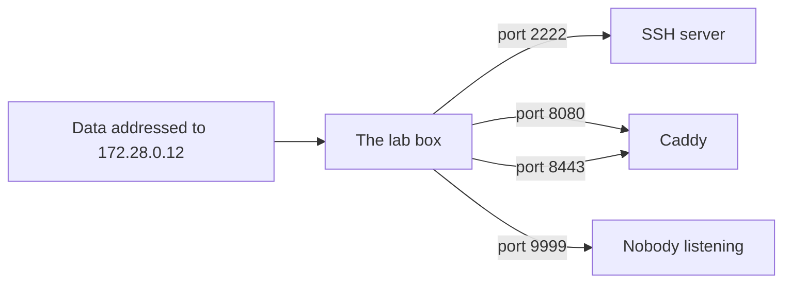

## Bạn cần biết trước

- [[foundation.l1.program-to-process]] — bạn đã thấy một chương trình đang chạy là một process mà hệ điều hành theo dõi và gán cho một con số riêng. Bài này cho process đó thêm một con số thứ hai, con số mà bất cứ thứ gì ở ngoài máy phải biết thì mới tới được nó.

## Tình huống

Bạn khởi động lab Đơn Hàng bằng `scripts/up.sh` rồi mở `localhost:8080` trên trình duyệt. Trang web hiện ra. Bạn dán đúng địa chỉ đó vào khung chat để đồng nghiệp xem thử, và họ chẳng thấy gì cả. Sau đó, trên máy lab, tức cái máy mà `scripts/up.sh` khởi động để chạy trang web, bạn chạy một chương trình nhỏ của riêng mình cũng muốn ngồi ở 8080, và nó không chịu khởi động, báo rằng địa chỉ đang bị dùng. Cùng một địa chỉ ngắn chạy được với bạn, vô nghĩa với đồng nghiệp, và hai chương trình trên một máy không dùng chung được. Vậy thật ra `localhost:8080` đang gọi tên cái gì?

## Khái niệm cốt lõi

- **địa chỉ IP** (IP address) — con số gọi tên vị trí của một máy trên mạng. Một máy có thể có nhiều hơn một địa chỉ. Dạng cũ hơn nhưng vẫn phổ biến viết bốn số từ 0 đến 255, cách nhau bằng dấu chấm, như `172.28.0.12`.
- **port** (số từ 0 đến 65535 phân biệt các process đang lắng nghe trên cùng một máy) — con số thứ hai, từ 0 đến 65.535, cho biết dữ liệu tới máy đó là dành cho process nào.
- lắng nghe (listening) — điều một process làm khi nhờ hệ điều hành chuyển cho nó mọi thứ tới một port của máy đó.
- loopback — địa chỉ mà máy nào cũng có để chỉ chính nó, dữ liệu gửi tới đó không bao giờ rời khỏi máy. Tên `localhost` đại diện cho địa chỉ này, và ở dạng bốn số thì nó thường là `127.0.0.1`.
- địa chỉ private (private address) — địa chỉ thuộc một trong các dải được dành riêng để dùng bên trong một mạng, gồm các địa chỉ bắt đầu bằng `10.`, `192.168.`, và từ `172.16` tới `172.31`. Các máy ngoài internet không có cách nào tới được chúng.

## Cơ chế hoạt động



`localhost:8080` là hai thứ nối với nhau bằng dấu hai chấm. Nửa bên trái gọi tên máy, nửa bên phải gọi tên một process trên máy đó.

Bên trong lab, máy chạy trang web là `172.28.0.12`, còn máy database là `172.28.0.11`. Dữ liệu gửi tới `172.28.0.12` tới đúng máy đó và không tới máy nào khác. Máy của bạn là máy thứ ba: `scripts/up.sh` cấu hình để mọi thứ tới port 8080 của máy bạn được chuyển tiếp sang port 8080 của máy lab, và đó là cách trình duyệt của bạn tới được Caddy.

Sau đó port chọn ra chương trình nào trên máy lab nhận dữ liệu. Một process giành một port bằng cách xin hệ điều hành, rồi lắng nghe trên port đó. SSH server, chương trình để đăng nhập vào máy lab từ máy khác, giữ 2222. Caddy, chương trình phục vụ trang Đơn Hàng, giữ cả 8080 lẫn 8443, vì một process có thể giữ nhiều port. (Caddy không có trong danh sách process của máy lab nhưng dùng địa chỉ và port của máy lab, nên cứ coi nó là một chương trình của máy lab.) Dữ liệu ghi số 9999 không tìm được ai giữ, nên máy lab từ chối nó ngay.

Thông thường hệ điều hành trao port cho process xin trước, và từ chối chương trình đến sau xin cùng số đó trên cùng địa chỉ đó, chừng nào process đầu còn giữ. Chương trình có thể xin dùng chung một số, nhưng phần lớn, như SSH server, không làm vậy. Đó là lý do chương trình của bạn, vốn không xin dùng chung, không lấy được 8080: Caddy đã giữ nó rồi. Con số chỉ được giữ chứ không bị sở hữu, và có thể được giành lại khi process đang giữ nó không còn nữa.

Có hai loại địa chỉ không bao giờ ra tới thế giới bên ngoài. Một là `localhost`, đại diện cho địa chỉ loopback, nên luôn có nghĩa là máy đang chạy lệnh. Hai là các con số riêng của lab, thuộc một dải private mà máy đồng nghiệp của bạn không tới được.

## Trong hệ thống Đơn Hàng

Lab có một script gõ năm cánh cửa, rồi hỏi chính máy lab xem nó đang lắng nghe trên những port nào. Script tự chạy lại chính nó trên máy lab trước, nên bạn có thể khởi động nó từ terminal trên máy mình. Nó hỏi bằng `netstat -tln`, lệnh in ra mỗi dòng cho một cặp địa chỉ và port đang có thứ gì đó lắng nghe, kết thúc bằng `LISTEN`, với con số nằm sau dấu hai chấm cuối cùng. Script gọi mỗi cặp như vậy là một socket, nên một số được giữ trên hai địa chỉ sẽ hiện trên hai dòng. Lệnh `grep` phía sau thu hẹp câu trả lời đó lại còn ba con số.

```bash file=scripts/network/who-listens.sh tag=stage-0 lines=7-19
for target in localhost:8080 localhost:8443 localhost:2222 db:5432 localhost:9999; do
  host="${target%:*}"
  port="${target##*:}"
  if nc -z -w 3 "$host" "$port" 2>/dev/null; then
    echo "$target is open"
  else
    echo "$target is closed"
  fi
done

echo
echo "the listening sockets of this box:"
netstat -tln | grep -E ':(2222|8080|8443) ' | sort
```

```text output=true
localhost:8080 is open
localhost:8443 is open
localhost:2222 is open
db:5432 is open
localhost:9999 is closed

the listening sockets of this box:
tcp        0      0 0.0.0.0:2222            0.0.0.0:*               LISTEN
tcp        0      0 :::2222                 :::*                    LISTEN
tcp        0      0 :::8080                 :::*                    LISTEN
tcp        0      0 :::8443                 :::*                    LISTEN
```

Vòng lặp thử năm cặp máy và số. Hai dòng `${…}` tách mỗi cặp tại dấu hai chấm thành phần máy và phần số. `nc` là một chương trình nhỏ, vừa gõ cửa được một cặp máy và số, vừa tự lắng nghe được trên một port, và với `-z` nó chỉ cho biết có thứ gì ở đó hay không. Bốn cặp mở. `localhost:9999` đóng vì không process nào trên máy lab giữ 9999, và câu trả lời về ngay chứ không phải sau ba giây mà `nc` sẵn lòng chờ: máy lab từ chối nó thay vì để nó không ai trả lời.

`db:5432` cũng trả lời, mà `db` không phải máy lab. Database chạy trên một máy khác trong mạng lab, và máy lab tới được nó bằng cách gọi tên. `db` là cái tên mà lab đặt cho máy đó, và nó đại diện cho con số của máy đó giống như `localhost` đại diện cho địa chỉ loopback.

Danh sách dưới dòng trống không nói gì về 5432, dù có hay không, vì `grep` đã thu hẹp nó lại còn ba con số mà máy lab giữ, nên 5432 không thể xuất hiện. Ở đây chỉ địa chỉ đầu tiên trên mỗi dòng là đáng quan tâm, phần còn lại để dành cho một bài sau. `0.0.0.0` đứng trước một con số nghĩa là mọi địa chỉ dạng bốn số mà máy lab có. Các dòng viết bằng dấu hai chấm thuộc về IPv6, một họ địa chỉ thứ hai mà bài này không đụng tới.

Script thứ hai cho thấy cả hai quy tắc của port từ bên trong.

```bash file=scripts/network/two-servers.sh tag=stage-0 lines=7-18
nc -4 -l 9001 >/dev/null 2>&1 &
first=$!
nc -4 -l 9002 >/dev/null 2>&1 &
second=$!
sleep 1

echo "two programs, two ports, both listening:"
netstat -tln | grep -E ':900[12] ' | sort

echo
echo "one more program asking for port 2222, where the SSH server already is:"
nc -l 2222 || echo "   nc gave up with exit code $?"
```

```text output=true
two programs, two ports, both listening:
tcp        0      0 0.0.0.0:9001            0.0.0.0:*               LISTEN
tcp        0      0 0.0.0.0:9002            0.0.0.0:*               LISTEN

one more program asking for port 2222, where the SSH server already is:
nc: Address in use
   nc gave up with exit code 1
```

Hai lần chạy đầu mỗi lần xin một số riêng, 9001 và 9002, và cả hai đều được: một máy, hai process, hai port, không tranh chấp gì. `-l` bảo `nc` lắng nghe, `-4` giữ nó ở dạng bốn số, còn `sleep 1` cho cả hai một giây trước khi `netstat` nhìn vào. Chúng được khởi động bằng `&`, để script chạy tiếp trong khi chúng vẫn chạy, và output của chúng bị bỏ đi. Hai dòng `$!` chỉ ghi lại process id của chúng.

Lần thứ ba xin 2222, nơi SSH server đã lắng nghe từ lúc lab khởi động, và hệ điều hành từ chối: `nc: Address in use`, rồi `nc` bỏ cuộc với exit code 1. Hệ điều hành chỉ báo lỗi nào đã xảy ra. Dòng chữ in ra cho lỗi đó là do chương trình in nó quyết định, nên trên máy khác cùng lần từ chối ấy có thể hiện là `address already in use`.

Con số 2222 không thuộc về SSH: SSH giữ nó trong lúc chạy, và không lâu hơn.

## Người mới hay nghĩ rằng…

- **"localhost là một máy cố định, ai gõ vào cũng như nhau."** → Thực ra nó luôn có nghĩa là máy đang chạy lệnh. Bạn sẽ nhận ra khi một chương trình trên máy lab hỏi `localhost:5432` và không thấy gì, trong khi `db:5432` trả lời, vì database nằm trên một máy khác chứ không phải máy này.
- **"Một port thuộc về một chương trình mãi mãi."** → Thực ra một process chỉ giữ một con số khi nó còn chạy, và chương trình nào cũng có thể giành số đó khi process kia không còn. Bạn sẽ nhận ra khi chương trình của mình khởi động được trên 8080 phút trước rồi phút sau lại từ chối, vì một lần chạy bạn quên tắt vẫn đang giữ nó.
- **"Chạy được trên localhost thì người khác cũng vào được."** → Thực ra với người khác, `localhost` là máy của chính họ, còn các địa chỉ của lab là địa chỉ private, chỉ dùng được bên trong mạng đó và không ở đâu khác. Bạn sẽ nhận ra khi gửi đồng nghiệp `localhost:8080`, hay thậm chí `172.28.0.12:8080`, và họ không nhận lại được gì.

## Thử ngay (3 phút)

1. Với lab đang chạy (khởi động bằng `scripts/up.sh`), chạy `scripts/network/who-listens.sh` từ terminal trên máy mình. Nó tự chuyển vào máy lab trước. Đọc đối chiếu hai nửa của những gì nó in ra.
2. Sau đó chạy `scripts/network/two-servers.sh` và so các con số nó liệt kê với các con số ở bước 1.

Kết quả mong đợi: bước 1 báo `localhost:8080`, `localhost:8443`, `localhost:2222` và `db:5432` mở, `localhost:9999` đóng, rồi liệt kê 2222, 8080 và 8443. Đó là ba con số duy nhất nó hỏi `netstat`, và cả ba đều do máy lab giữ, còn `db` là một máy khác. Bước 2 liệt kê 9001 và 9002 khi hai chương trình của nó còn sống, rồi thất bại ở 2222 với `nc: Address in use` và exit code 1. 9001 và 9002 không có trong danh sách của bước 1, còn 2222 thì có, và đó là lý do lần chạy thứ ba thất bại.

## Liên hệ

- [[foundation.l1.program-to-process]] — cùng một chương trình đang chạy, nhìn từ bên ngoài: port là con số chọn ra một process trong rất nhiều process mà một máy đang chạy.
- [[foundation.l1.dns]] — bước ngay trước bài này trong thực tế: một cái tên như `db` từ đâu ra, và nó biến thành những con số mà bài này dùng như thế nào.
- [[foundation.l1.tcp-vs-udp]] — xuống một tầng: chuyện gì xảy ra giữa hai đầu đã có địa chỉ, khi dữ liệu đã tìm đúng port.

## Tóm tắt 5 dòng

1. Địa chỉ IP gọi tên một máy trên mạng, còn port cho biết dữ liệu tới máy đó là dành cho process nào.
2. Process giành một port bằng cách xin hệ điều hành, và thông thường hệ điều hành sẽ từ chối chương trình đến sau xin cùng số đó.
3. Lần từ chối đó chính là ý nghĩa của `Address in use`. Con số có thể được giành lại khi process đang giữ nó không còn.
4. `localhost` luôn có nghĩa là máy đang chạy lệnh, nên trên máy lab nó chỉ máy lab, không phải laptop của bạn.
5. Địa chỉ private như `172.28.0.12` của lab chỉ dùng được bên trong một mạng, nên gửi con số đó cho đồng nghiệp cũng không giúp gì cho họ.
