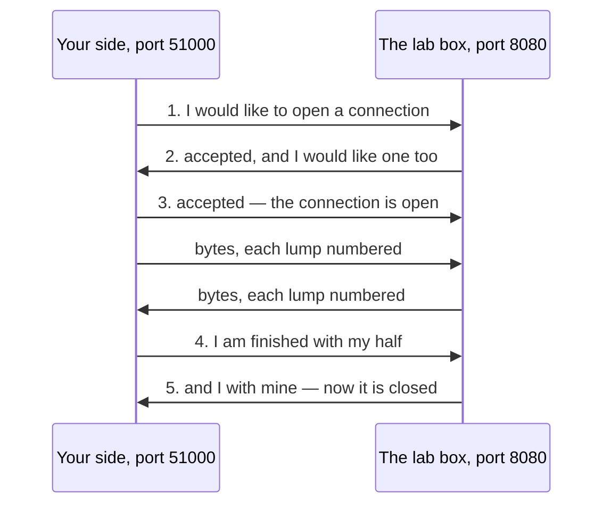

## Before you start

- [[foundation.l1.ip-and-ports]] — you saw that an address names a machine and a port names which process on that machine the arriving data is for. This lesson is about what happens between two such pairs once the data has found them.

## The situation

You start the Đơn Hàng lab with `scripts/up.sh` and reach the site on `localhost:8080` from a second tab while the first one is still open. Both answer, although an earlier lesson said one process holds one port. Then you mistype the number and ask for `localhost:9999`: the failure comes back before your finger leaves the key. From inside the lab box you try `203.0.113.1` on port 80, and nothing happens at all — the terminal sits still and then gives up. Three attempts, three endings. What happens between the two ends that makes them differ so much?

## Core concepts

- connection — the agreed link between one address-and-port pair on each side; it exists as remembered state at both ends and lasts until each side has said it is finished.
- handshake — the three short messages that set a connection up: one side offers, the other accepts and offers back, the first accepts in turn.
- **TCP** — a way of moving bytes between two ports in which both ends set up a connection first, and while that connection lasts every byte arrives, once, in the order it was sent.
- packet — one lump of data the network carries on its own, with the addresses and ports written on it; the network may lose it, copy it or deliver it out of turn.
- UDP — the other common way of moving bytes: each packet goes on its own, with no connection set up and no promise that it arrives, arrives once, or arrives in turn.

## How it works



In the situation above, the tab that reached the site had a connection; the two failures never got one. Nothing in the network holds one open: a connection is an agreement remembered at both ends.

Before any of your data moves, the two sides exchange the three short messages drawn above. Your side asks to open one; the lab box accepts and asks back; your side accepts. Your data waits only for the box's answer, message 2: message 3 can travel out together with your first data, so the wait is one trip out and back. When one side is finished it says so, and the connection is closed once the other side has said the same.

Each side then remembers four numbers: its own address and port, and the other side's. You do not have to pick your own side's number: unless a program asks for a particular one, the operating system hands it a free one, 51000 here. Your two tabs each took a different number of their own, so the two sets of four differ and the box keeps them apart. That is how one listening port serves many connections at once.

From there on, TCP numbers every lump of bytes it sends. The receiving side puts the lumps back in order and says which ones it has; the sending side keeps each lump until that word comes back, and sends it again if it does not. So your program reads the bytes in order, however the network shuffled them.

UDP leaves all of that out. Each packet carries the addresses and ports and goes alone: nothing is set up first, numbered, or sent again. A packet may be lost, arrive twice or out of turn, and the sender is never told.

## In the Đơn Hàng system

The lab has a script that asks for five connections in four checks, each ending differently. `nc -z` asks for a connection without sending data of its own and closes it again; it prints a line when it gets one, and when it does not, only its exit code says so. Every command ends with a number, 0 when it worked and something else when it did not, and `$?` prints that number. A command joined to the next with `||` runs that next one only when it failed, which is how each failure below gets a line of its own. Every attempt also carries `-w 3`, which stops it waiting for ever. The second line of the block re-runs the script inside the lab box for you; nothing in it needs reading to follow the rest.

```bash file=scripts/network/tcp-connect.sh tag=stage-0 lines=4-20
# Everything below runs inside the lab box; this line puts it there.
[ -f /.dockerenv ] || exec "$(dirname "$0")/../lab-run.sh" "$0" "$@"

echo "1. a port with a listener behind it:"
nc -z -w 3 localhost 8080 && echo "   connected"

echo
echo "2. a port on a machine that is up, with nothing listening:"
nc -z -w 3 localhost 9999 || echo "   refused straight away (exit code $?)"

echo
echo "3. an address that never answers at all:"
nc -z -w 3 203.0.113.1 80 || echo "   gave up after 3 seconds (exit code $?)"

echo
echo "one server port, several connections at the same time:"
nc -z -w 3 localhost 8080 && nc -z -w 3 localhost 8080 && echo "   both connections were accepted"
```

```text output=true
1. a port with a listener behind it:
Connection to localhost (::1) 8080 port [tcp/http-alt] succeeded!
   connected

2. a port on a machine that is up, with nothing listening:
   refused straight away (exit code 1)

3. an address that never answers at all:
   gave up after 3 seconds (exit code 1)

one server port, several connections at the same time:
Connection to localhost (::1) 8080 port [tcp/http-alt] succeeded!
Connection to localhost (::1) 8080 port [tcp/http-alt] succeeded!
   both connections were accepted
```

The first attempt reaches Caddy, the handshake finishes, and `nc` names the port it reached. The second goes to a machine that is up but holds nothing on 9999, and that machine answers by refusing: an answer, not silence, so the attempt ends without waiting for any limit.

The third goes to `203.0.113.1`, an address set aside for writing examples, which nothing on the lab's network answers for; no reply of any kind arrives, so the attempt ends only when its own limit runs out. Both failures end with exit code 1, and only the clock tells them apart — the two labels are written into the script, not worked out by it.

The last two lines chain two runs with `&&`, so they happen one after the other rather than together — the script's own heading names the point being made, not what these two chained runs do — and what they show directly is that the port is free again for the next connection. Several connections still live at once on 8080 for the reason given above: each asking side brings a port number of its own.

The `(::1)` printed on the first line is how a machine names itself in the newer, longer form of address, so this is still the lab box talking to itself; `[tcp/http-alt]` beside it is only `nc`'s own name for port 8080.

The page you opened at `localhost:8080` needed these three messages first. HTTP, the way a browser asks for a page, is the next module's subject and travels over exactly this kind of connection. The next lesson adds one more step on top of the same handshake.

## Beginners often think…

- **"Connection refused and timed out are the same problem."** → Actually they are opposite kinds of outcome: a refusal is an answer saying nothing holds that port, while a timeout is the absence of any answer at all. You notice this when the second attempt in the script fails the instant its heading appears and the third makes you wait — a refusal tells you the machine is up and nothing is holding that port, a wrong number or the right one with nothing started behind it, while silence tells you the address may be wrong or something in between is dropping packets.
- **"Only one asking side can connect to a port at a time."** → Actually one listening port carries many connections at once, because a connection is named by four numbers and only one of them is that port. You notice this when the single Caddy on 8080 answers your two tabs, and a colleague on the same network, without any of them waiting for the others.
- **"UDP is a broken TCP that nobody would choose."** → Actually leaving out the handshake and the sending-again is worth it when setting up a connection costs more than the question is worth and the asker can simply ask again. Name lookups work exactly this way: the question goes out over UDP and is simply asked again when no answer comes back, instead of paying for a connection to carry one short question.

## Try it (3 minutes)

1. With the lab running (start it with `scripts/up.sh`), run `scripts/network/tcp-connect.sh` and watch the clock while it prints, rather than reading the text afterwards.
2. Notice where the pause is: between which two printed lines does the script visibly stop, and where does a failure appear with no pause at all. Time that pause yourself.

Expected result: attempt 1 prints the port it reached and `connected`. Attempt 2 prints `refused straight away (exit code 1)` the moment its heading appears. Attempt 3 leaves the terminal still — this is the pause you time — before printing `gave up after 3 seconds (exit code 1)`, the same exit code as attempt 2 reached a completely different way. The last check then accepts two connections to 8080.

## Connections

- [[foundation.l1.ip-and-ports]] — the layer underneath this one: an address and a port name one end of a connection, and this lesson puts two of those ends together.
- [[foundation.l1.dns]] — the lookup this lesson points at: it asks one short question over UDP and simply asks again if nothing comes back.
- [[foundation.l1.tls-and-https]] — the next step up: the step it adds sits on top of the very handshake drawn here, before anything else travels.
- [[foundation.l1.url-to-page]] — where this shows up in daily work: opening the connection is one of the named steps between typing an address and seeing a page.

## Five-line summary

1. TCP moves bytes over a connection both sides set up first, and while it lasts the bytes arrive complete and in the order sent.
2. The handshake is three messages; a connection is the four numbers each side then remembers, which is why one port serves many connections.
3. UDP sends each packet on its own with no connection and no promise that it arrives, arrives once, or arrives in turn.
4. Refused is an answer — nothing holds that port; a timeout is no answer at all, usually a wrong address or something dropping packets.
5. HTTP, the way a browser asks for a page, travels over a TCP connection here, and the next lesson builds on the same handshake.
