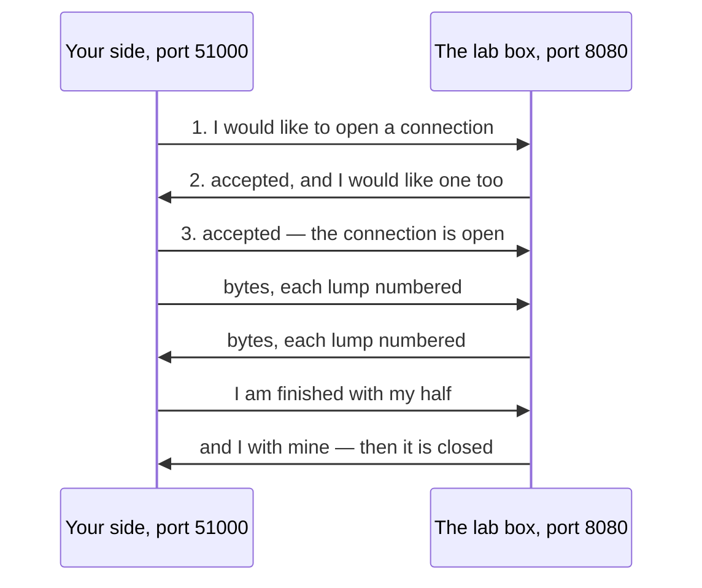

## Bạn cần biết trước

- [[foundation.l1.ip-and-ports]] — bạn đã thấy địa chỉ gọi tên một máy, còn port cho biết dữ liệu tới máy đó là dành cho process nào. Bài này nói về chuyện xảy ra giữa hai cặp địa chỉ và port như thế, sau khi dữ liệu đã tìm tới đúng chỗ.

## Tình huống

Bạn khởi động lab Đơn Hàng bằng `scripts/up.sh` rồi mở trang ở `localhost:8080` trong một tab thứ hai, trong khi tab đầu vẫn đang mở. Cả hai đều trả lời, dù bài trước nói mỗi port chỉ do một process giữ. Sau đó, từ bên trong máy lab, bạn gõ nhầm số và gọi `localhost:9999`: lời từ chối về ngay lập tức. Cũng từ chỗ đó, bạn thử `203.0.113.1` ở port 80, và chẳng có gì xảy ra — terminal đứng im một lúc rồi bỏ cuộc. Ba lần thử, ba kết cục. Giữa hai đầu đã có chuyện gì khiến chúng khác nhau đến vậy?

## Khái niệm cốt lõi

- kết nối (connection) — mối liên kết đã được hai bên thống nhất giữa một cặp địa chỉ và port ở mỗi bên. Nó tồn tại dưới dạng trạng thái mà cả hai đầu cùng ghi nhớ, và thường kéo dài cho tới khi mỗi bên đều báo mình đã xong.
- handshake — ba thông điệp ngắn dùng để thiết lập một kết nối: một bên đề nghị, bên kia chấp nhận và đề nghị lại, rồi bên đầu tiên chấp nhận theo.
- **TCP** (giao thức vận chuyển đảm bảo dữ liệu đến đủ, đúng thứ tự, qua một kết nối) — cách chuyển byte giữa hai port trong đó hai đầu thiết lập kết nối trước, và trong suốt thời gian kết nối còn đó, mọi byte đều đến nơi, đến đúng một lần, theo đúng thứ tự đã gửi.
- packet (gói tin) — một cục dữ liệu mà mạng chuyển đi riêng lẻ, có ghi sẵn địa chỉ và port trên đó. Mạng có thể làm mất nó, nhân đôi nó hoặc giao nó sai lượt.
- UDP — cách chuyển byte phổ biến còn lại: mỗi packet tự đi một mình, không thiết lập kết nối, không hứa rằng packet sẽ đến, đến đúng một lần hay đến đúng lượt.

## Cơ chế hoạt động



Trong tình huống trên, tab mở được trang đã có một kết nối, còn hai lần thất bại thì chưa bao giờ có. Không có gì trong mạng giữ kết nối mở cả: kết nối là một thỏa thuận được ghi nhớ ở hai đầu.

Đầu tiên, hai bên trao đổi ba thông điệp ngắn như trong sơ đồ. Dữ liệu của bạn chỉ phải chờ thông điệp 2, tức câu trả lời của máy lab. Thông điệp 3 không cần câu trả lời riêng, nên dữ liệu của bạn đi ngay sau nó: thời gian chờ chỉ là một chuyến đi và về.

Sau đó mỗi bên ghi nhớ bốn con số: địa chỉ và port của mình, địa chỉ và port của bên kia. Trừ khi chương trình yêu cầu một số cụ thể, hệ điều hành cấp cho phía bạn một số còn trống, ở đây là 51000. Hai kết nối từ cùng một máy tới 8080 ít nhất cũng khác nhau ở port của bên hỏi, nên máy lab tách được chúng ra. Một process giữ một port và chờ kết nối ở đó thì gọi là đang lắng nghe trên port đó, và port ấy là port lắng nghe. Nhờ vậy một port lắng nghe phục vụ được nhiều kết nối cùng lúc.

Từ đó trở đi, TCP đánh số mọi cục byte nó gửi, mỗi cục đi dưới dạng một packet. Bên nhận xếp các cục lại đúng thứ tự và báo lại mình đã có những cục nào. Bên gửi giữ từng cục cho tới khi nhận được lời báo đó, và gửi lại nếu không nhận được. Vì thế chương trình đọc byte theo đúng thứ tự, dù mạng có xáo trộn chúng thế nào. Khi một bên xong việc, bên đó báo ra, và kết nối đóng lại khi bên kia cũng đã báo như vậy.

UDP bỏ qua tất cả những bước đó. Mỗi packet mang theo địa chỉ và port rồi đi một mình: không có gì được thiết lập trước, được đánh số hay được gửi lại. Một packet có thể mất, đến hai lần hoặc đến sai lượt, và bản thân UDP không bao giờ cho bên gửi biết packet đã đến hay chưa.

## Trong hệ thống Đơn Hàng

Lab có một script đòi năm kết nối qua bốn lần kiểm tra, và ba lần đầu mỗi lần kết thúc một kiểu. `nc -z` đòi một kết nối mà không tự gửi dữ liệu gì. Khi có kết nối, nó in ra một dòng, còn khi không có thì chỉ exit code của nó cho biết điều đó.

Lệnh nào cũng kết thúc bằng một con số, 0 khi thành công và số khác khi thất bại, và `$?` in ra con số đó. Một lệnh nối với lệnh sau bằng `||` chỉ chạy lệnh sau khi nó thất bại, nhờ vậy mỗi lần thất bại bên dưới có một dòng riêng. Nối bằng `&&` thì chỉ chạy khi nó thành công. Mỗi lần thử còn có `-w 3`, giới hạn mỗi lần chờ ở 3 giây. Dòng thứ hai của khối code tự chạy lại script bên trong máy lab cho bạn.

```bash file=scripts/network/tcp-connect.sh tag=stage-0 lines=4-20
# Everything below runs inside the lab box; this line puts it there.
[ -f /.dockerenv ] || exec "$(dirname "$0")/../lab-run.sh" "$0" "$@"

echo "1. a port with a listener behind it:"
nc -z -w 3 localhost 8080 && echo "   connected"

echo
echo "2. a port on a machine that is up, with nothing listening:"
nc -z -w 3 localhost 9999 || echo "   refused straight away (exit code $?)"

echo
echo "3. an address that never answers at all:"
nc -z -w 3 203.0.113.1 80 || echo "   gave up after 3 seconds (exit code $?)"

echo
echo "one server port, several connections at the same time:"
nc -z -w 3 localhost 8080 && nc -z -w 3 localhost 8080 && echo "   both connections were accepted"
```

```text output=true
1. a port with a listener behind it:
Connection to localhost (::1) 8080 port [tcp/http-alt] succeeded!
   connected

2. a port on a machine that is up, with nothing listening:
   refused straight away (exit code 1)

3. an address that never answers at all:
   gave up after 3 seconds (exit code 1)

one server port, several connections at the same time:
Connection to localhost (::1) 8080 port [tcp/http-alt] succeeded!
Connection to localhost (::1) 8080 port [tcp/http-alt] succeeded!
   both connections were accepted
```

Lần thử đầu tiên tới được Caddy, chương trình đang giữ port 8080 trong lab, và `nc` in ra tên port nó đã tới. Khi bạn mở `localhost:8080` trong một tab trên máy mình, yêu cầu cũng được chuyển tới đúng Caddy này. Lần thứ hai tới một máy đang chạy nhưng không có gì giữ port 9999. Lời từ chối của máy đó là câu đáp cho thông điệp 1, gửi về thay cho thông điệp 2: đó là một câu trả lời, không phải im lặng, nên lần thử kết thúc ngay.

Lần thứ ba tới `203.0.113.1`, một địa chỉ được dành riêng để viết ví dụ, và không có gì trên mạng của lab trả lời cho nó. Thông điệp 1 không nhận được phản hồi nào, nên lần thử chỉ kết thúc khi hết giới hạn thời gian của chính nó. Trường hợp này gọi là timeout. Cả hai lần thất bại đều kết thúc với exit code 1, và chỉ có đồng hồ phân biệt được chúng — hai nhãn kia được viết sẵn trong script, không phải do script tự suy ra.

Hai dòng cuối nối hai lần chạy bằng `&&`. Tiêu đề ghi "at the same time", nhưng hai lần chạy này diễn ra lần lượt: bên lắng nghe nhận kết nối thứ hai dễ dàng y như kết nối đầu. Nhiều kết nối vẫn cùng tồn tại trên 8080 cùng lúc vì lý do đã nói ở trên: mỗi bên hỏi mang theo một số port của riêng mình.

`(::1)` in ở dòng đầu là cách một máy tự gọi tên mình theo dạng địa chỉ mới hơn, dài hơn, nên đây vẫn là máy lab nói chuyện với chính nó. `[tcp/http-alt]` bên cạnh chỉ là cái tên mà danh sách port quen thuộc của máy lab đặt cho 8080, và kết nối không phụ thuộc gì vào nó.

Trang bạn mở ở `localhost:8080` cũng cần ba thông điệp này trước tiên. HTTP, cách trình duyệt xin một trang, là chủ đề của module sau, và ở dạng bạn gặp tại đây, nó đi qua đúng loại kết nối này. Bài tiếp theo thêm một bước nữa lên trên chính handshake đó.

## Người mới hay nghĩ rằng…

- **"Bị từ chối kết nối và hết thời gian chờ là cùng một vấn đề."** → Thực ra chúng là hai kiểu kết cục ngược nhau: bị từ chối là một câu trả lời nói rằng không có gì giữ port đó, còn timeout là không có câu trả lời nào cả. Bạn sẽ nhận ra khi lần thử thứ hai trong script thất bại ngay lúc tiêu đề của nó hiện ra, còn lần thứ ba bắt bạn chờ. Bị từ chối thường do sai số port hoặc chưa khởi động gì, còn im lặng nghĩa là địa chỉ có thể sai hoặc có thứ gì đó ở giữa đang vứt bỏ packet.
- **"Mỗi lúc chỉ một bên hỏi kết nối được tới một port."** → Thực ra một port lắng nghe mang được nhiều kết nối cùng lúc, vì một kết nối được xác định bằng bốn con số và chỉ một trong số đó là port ấy. Bạn sẽ nhận ra khi tab thứ hai vẫn tới được `localhost:8080` trong lúc tab đầu còn mở, như trong tình huống.
- **"UDP là một TCP hỏng mà chẳng ai chọn."** → Thực ra bỏ qua handshake và bước gửi lại là đáng khi chi phí thiết lập kết nối còn lớn hơn giá trị của câu hỏi, và bên hỏi chỉ cần hỏi lại là xong. Tra cứu tên hoạt động theo cách này: câu hỏi đi qua UDP và được hỏi lại khi không có câu trả lời, thay vì tốn công dựng một kết nối chỉ để chở một câu hỏi ngắn.

## Thử ngay (3 phút)

1. Với lab đang chạy (khởi động bằng `scripts/up.sh`), chạy `scripts/network/tcp-connect.sh` và để ý đồng hồ trong lúc nó in ra.
2. Xem script dừng lại giữa hai dòng in nào, và chỗ nào thất bại hiện ra mà không có khoảng dừng. Tự bấm giờ khoảng dừng đó.

Kết quả mong đợi: lần thử 1 in ra port nó đã tới và `connected`. Lần thử 2 in `refused straight away (exit code 1)` ngay khi tiêu đề của nó hiện ra. Lần thử 3 để terminal đứng im — đây là khoảng dừng bạn bấm giờ — rồi mới in `gave up after 3 seconds (exit code 1)`, cùng exit code với lần thử 2 dù đến đó bằng một con đường hoàn toàn khác. Khoảng dừng kéo dài chừng 3 giây, đúng giới hạn đặt bởi `-w 3`. Lần kiểm tra cuối sau đó nhận hai kết nối tới 8080.

## Liên hệ

- [[foundation.l1.ip-and-ports]] — tầng nằm ngay dưới bài này: một địa chỉ và một port xác định một đầu của kết nối, và bài này ghép hai đầu như vậy lại với nhau.
- [[foundation.l1.dns]] — việc tra cứu mà bài này nhắc tới: nó hỏi một câu ngắn qua UDP và chỉ đơn giản hỏi lại nếu không có gì trả về.
- [[foundation.l1.tls-and-https]] — bước tiếp theo ở tầng trên: nó thêm một bước lên trên handshake vẽ ở đây, trước khi bất cứ thứ gì khác được gửi đi.
- [[foundation.l1.url-to-page]] — nơi điều này hiện ra trong công việc hằng ngày: mở kết nối là một trong những bước có tên giữa lúc gõ địa chỉ và lúc thấy trang.

## Tóm tắt 5 dòng

1. TCP chuyển byte qua một kết nối mà hai bên thiết lập trước, và khi kết nối còn đó, byte đến đủ và đúng thứ tự đã gửi.
2. Handshake gồm ba thông điệp. Kết nối là bốn con số mà mỗi bên ghi nhớ sau đó, vì vậy một port phục vụ được nhiều kết nối.
3. UDP gửi từng packet riêng lẻ, không có kết nối, không hứa rằng packet sẽ đến, đến đúng một lần hay đến đúng lượt.
4. Bị từ chối là một câu trả lời — không có gì giữ port đó. Timeout là không có câu trả lời nào, thường do sai địa chỉ hoặc có thứ vứt bỏ packet.
5. HTTP, cách trình duyệt xin một trang, ở đây đi qua một kết nối TCP, và bài tiếp theo xây tiếp trên chính handshake đó.
