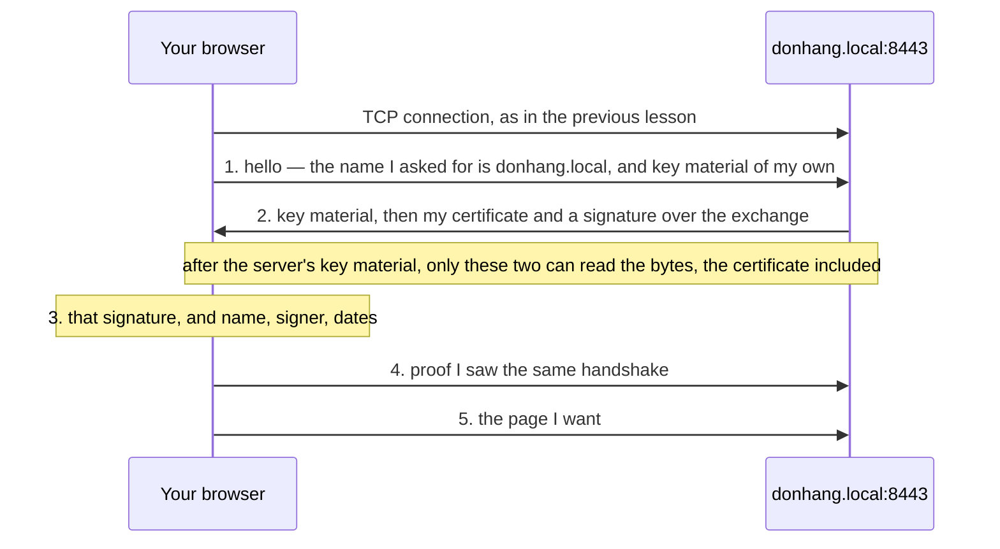

## Before you start

- [[foundation.l1.tcp-vs-udp]] — you saw a connection set up with three short messages; this lesson adds a second exchange on top.
- [[foundation.l1.dns]] — you saw a name turned into an address, and your hosts file overriding that lookup; here you check the machine at that address is entitled to the name.

## The situation

The Đơn Hàng lab serves the same pages at two addresses. One is `localhost:8080`, the name for your own machine, which opens without a word. The other is `donhang.local:8443`, in the `https` form of the address, which you reach after adding `127.0.0.1 donhang.local` to your hosts file: that line points the name at your own machine too. That one does not open: the browser stops the connection or asks you to confirm before going on. Nothing is broken: both reach the same Caddy, the program serving the lab's pages. What is the browser checking on the second address that it never checked on the first?

## Core concepts

- **TLS** — the layer added on top of an open TCP connection that checks the server is the one the name stands for before any page is asked for and, once the two sides have set up their keys (values used to encrypt bytes and read them back), encrypts what they send: turns it into bytes only they can read.
- certificate — a small file the server hands over during that check: it lists the names the server stands for, states two dates between which it may be used, and carries a public key, half of a pair whose private half only the server holds.
- certificate authority — whoever signed that certificate. A signature is a mark only the holder of a private key can make and anyone with the matching public key can check. Your operating system and browser carry a list of the authorities they accept; a signature that does not lead back to that list counts for nothing. An authority on that list is expected to sign for a name only after checking that whoever asks controls it, which is what ties the name to the certificate's key.
- HTTPS — asking for a page over a TLS connection rather than a bare one, which is what the `https` form of an address means; the port is 443 unless the address names another, as the lab does with 8443.
- padlock — the name for the browser's report that its checks on this connection passed: a statement about the connection, not about the site behind it.

## How it works



Your browser first opens a TCP connection, as in the previous lesson; every message below travels on it. It begins by naming the site it wants and sending key material: values made up for this connection, not the certificate's pair, that its keys will be built from. One machine on one port can hold certificates for several names, so it must be told which. In the usual setup, which the lab uses, that name travels before anything is encrypted: setting up the encryption is what this exchange, the TLS handshake, is for.

The server answers with key material of its own, then its certificate. The two sets become the keys both ends use; how is a later lesson, but seeing both sets on the way is not enough to build those keys. In TLS 1.3 everything after the server's key material is encrypted. The certificate is still no secret: anyone who connects is handed it.

The server also signs the whole exchange with its private key, which is never sent. At step 3 the browser checks the server's signature over the exchange with the public key in the certificate; a machine holding only a copy of the certificate cannot make one that passes. The browser also checks three things it reads off the certificate: whether it lists the name you asked for, whether the authority's signature on it leads back to your machine's list, and whether now falls between its two dates. A failure in any one stops the page; some browsers let you confirm and go on anyway.

At step 4 the browser sends back proof it saw the same messages, so nothing in between changed them. Only then, at step 5, does the browser ask for the page, inside the same protection.

## In the Đơn Hàng system

The HTTPS site is the last part of the `Caddyfile`, the file that tells Caddy what to serve.

```caddyfile file=Caddyfile tag=stage-0 lines=93-99
# The same site over HTTPS, with a certificate Caddy signs itself.
# lesson: foundation.l1.tls-and-https
donhang.local:8443 {
	tls internal
	root * /srv/www
	file_server
}
```

The line `donhang.local:8443 {` is an address: everything up to the closing brace answers for `donhang.local` on port 8443. `root * /srv/www` and `file_server` serve the same folder as the plain `:8080` site. The line that matters is `tls internal`: it tells Caddy to create an authority of its own and sign a certificate for `donhang.local` with it. Nothing in the lab puts that authority on your browser's list, and that is the whole difference.

A script reads the certificate back off the connection. It runs on the lab box, the lab's small Linux machine for scripts, whose list lacks Caddy's authority too. Caddy runs on a second small machine the lab starts, which shares the lab box's addresses and ports: on the lab box, `127.0.0.1` port 8443 is Caddy listening, and the lab box's hosts file already points `donhang.local` there.

```bash file=scripts/network/inspect-cert.sh tag=stage-0 lines=7-19
echo "the certificate the site presents:"
echo | openssl s_client -connect donhang.local:8443 -servername donhang.local 2>/dev/null \
  | openssl x509 -noout -subject -issuer -dates

echo
echo "the names this certificate is valid for:"
echo | openssl s_client -connect donhang.local:8443 -servername donhang.local 2>/dev/null \
  | openssl x509 -noout -ext subjectAltName

echo
echo "what the two sides agreed to use:"
echo | openssl s_client -connect donhang.local:8443 -servername donhang.local 2>/dev/null \
  | grep -E '^ +(Protocol|Cipher) +:'
```

```text output=true
the certificate the site presents:
subject=
issuer=CN=Caddy Local Authority - ECC Intermediate
notBefore=...
notAfter=...

the names this certificate is valid for:
X509v3 Subject Alternative Name: critical
    DNS:donhang.local

what the two sides agreed to use:
    Protocol  : TLSv1.3
    Cipher    : TLS_AES_128_GCM_SHA256
```

`openssl s_client` opens a TLS connection to `donhang.local:8443` and prints what came back; `openssl x509 -noout` then prints only the fields named after it, and `grep -E` keeps only the `Protocol` and `Cipher` lines. You can pass over `echo |` and `2>/dev/null`.

The first part names the signer but no site: `subject=` is empty, so the site's name lives in the second part, under `X509v3 Subject Alternative Name` (the trailing `critical` you can pass over). That field, not the subject, is what a browser matches the name against. The issuer is the authority `tls internal` created; the rest of its name is a later lesson. The dates print as `...` because this printed copy masks values that can change between runs; your own run shows two real dates. The third part prints the version, `TLSv1.3`, and one more line a later lesson explains; both are agreed during the handshake, not assumed.

Notice what the script never does: nothing in it stops on a signer it does not accept, so it prints the certificate of the site the browser refuses. The check that failed is about who signed, not about encryption. The browser, which does refuse, ran the checks and knows which failed; TLS also has separate error codes for an expired certificate and for a signer it does not accept.

## Beginners often think…

- **"HTTPS means the website is trustworthy."** → Actually the checks say only that the bytes are hidden on the way and that the server holds the private key for the name you typed. None of them looks at who is behind that name or what the site does with what you send. You notice this when a fake shop, at a name one letter off the real one, shows the same padlock, with a genuine certificate for its own name.
- **"Encryption hides everything, including which site I visit."** → Actually the address, the port and, normally, the name in the first message travel before any encryption starts. What is hidden is which page you asked for and what you sent with it. You notice this when a network you do not control can list the sites a laptop opened, but not one page from any of them.
- **"An expired certificate still encrypts, so nothing is really wrong."** → Actually the date check fails on the date alone, however well the encryption works. If nobody is responsible for replacing the certificate before its later date, this is not bad luck but a date that was always coming. You notice this when a site that worked yesterday fails for everyone at once, on a day nobody changed anything.

## Try it (3 minutes)

1. Start the lab with `scripts/up.sh`, then run `scripts/network/inspect-cert.sh`. Read the `issuer=` line and the name under the second heading, and check the `notBefore` and `notAfter` dates against today.
2. Add `127.0.0.1 donhang.local` to your machine's hosts file, then open `donhang.local` on port 8443 in a browser, using the `https` form of the address. Read what the browser says about the connection.

Expected result: the script prints an issuer containing `Caddy Local Authority`, one valid name `DNS:donhang.local`, and `Protocol  : TLSv1.3`. The browser stops or asks you to confirm, as in the situation. Two of its three checks pass, name and dates, so the one that failed is who signed.

## Connections

- [[foundation.l1.tcp-vs-udp]] — the layer underneath: this exchange starts once that handshake has finished.
- [[foundation.l1.dns]] — where the checked name comes from: the certificate must list the name resolved there.
- [[devops.l1.reverse-proxy-and-tls]] — the same idea from the server's side: who obtains and renews the certificate.
- [[backend.l4.pki-and-signing]] — the same idea several layers down: how a signature proves who signed.

## Five-line summary

1. TLS sits on an open TCP connection, checks the server is the one the name stands for, and encrypts what the two sides send.
2. A certificate binds names to a public key; failing the name, signer or date check stops the page or asks you to confirm.
3. The padlock reports those checks and nothing else: not who is behind the name, not what they do with what you send.
4. The address and the port stay visible to the network, and normally the name asked for too; which page you asked for does not.
5. A certificate can stop a working site with no code change, and the browser that ran the checks knows which one failed.
